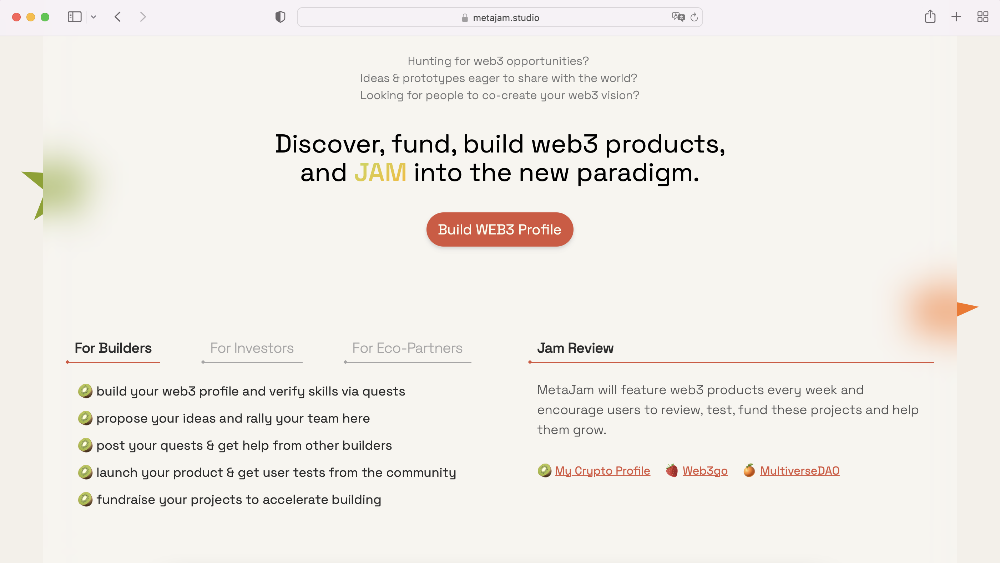
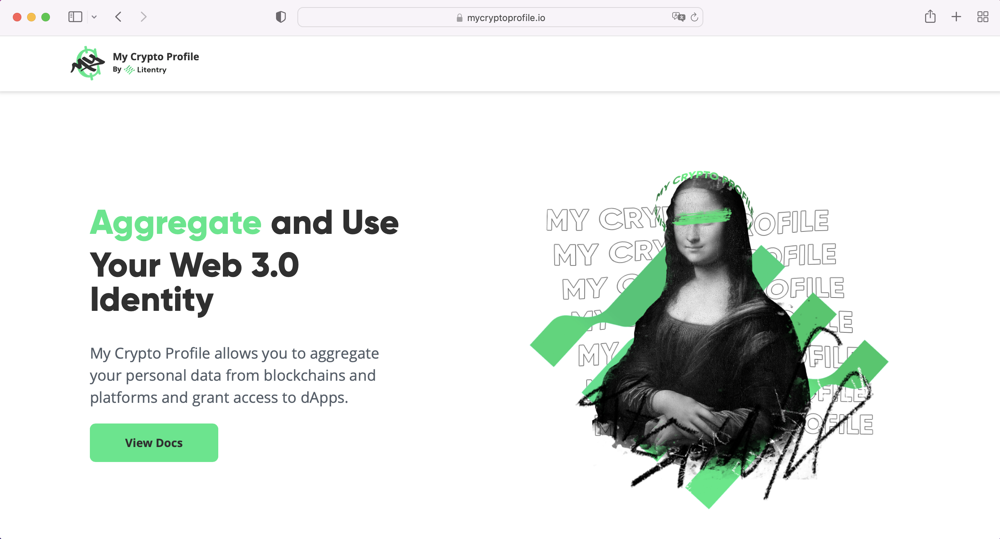
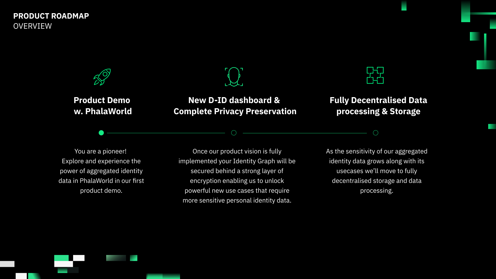

# My Crypto Profile：聚合管理你的 Web2 和 Web3 的个人身份数据 ｜ Jam Review

> 自 MetaJam 3 月 28 日公测上线以来，相当数量的 Web3 产品和项目入驻平台，创建自己项目的档案。
>
> 从今天起，MetaJam 推出 Jam Review，每周精选推荐 Web3 产品，鼓励所有有志于 Web3 BUIDL 的朋友一起来测试评论这些产品，参与帮助这些项目从产品、社区到融资等各方面的成长。
>
> 目前，MetaJam 的 Project Dashboard 仍在开发，计划于月底月初上线。因此，欢迎大家点击 MetaJam 首页的 Notion 链接留言评论。

## My Crypto Profile

> 类别：身份
>
> 推荐：M7e
>
> 官网：https://mycryptoprofile.io/
>
> 推特：https://twitter.com/web3mcp
>
> 群组：https://discord.gg/6YxdNwyECG
>
> 文档：https://docs.litentry.com/products/my-crypto-profile

### 你的产品是做什么的？

[My Crypto Profile (MCP)](https://docs.litentry.com/products/my-crypto-profile)，是由[Litentry](https://www.litentry.com/)团队开发的聚合身份的 PoC（概念证明）应用，它是一个去中心化的 Web3 个人数据管理工具，旨在让用户聚合和管理他们在 Web2 服务和 Web3 区块链以及去中心化存储系统中的个人数据。通过 MCP，用户可以向第三方去中心化应用（dApp）提供数据访问，在不影响隐私和匿名的情况下，最大化个人身份价值。

### 你们的产品功能带来什么独特的价值？

- 去中心化身份（DID）图谱：我们帮助用户证明他在不同区块链上的账户和数据的所有权，并创建一个身份集群或图谱。
- 跨链身份凭证：我们的身份标签库使跨链身份数据具体化，并凸显凭证和用户行为。
- 聚合身份仪表板：我们提供广泛的身份洞察，与用户身份相关的趋势，并提供使用其聚合身份的新机会
- 保护隐私的 dApp 访问：我们允许 dApp 在用户授权下获得身份数据，以保护用户隐私，让用户保持匿名状态。

(video)

### 你的产品满足或解决了什么需求或问题？

- 伴随着 Web3 世界的发展，用户有爆炸性增长的数据需要组织和管理
- 从用户的角度来看，身份价值得以最大化
- 解决用户授权第三方 dAPP 访问其数据的安全问题

### 你的产品如何在竞争中脱颖而出？

- MCP 支持用户的 Web2、多链 web3 数据，以及去中心化存储系统的聚合
- MCP 提供一个闭环的聚合身份生态系统，包括身份聚合服务、去中心化身份（DID）仪表盘、数据访问，以及通过 MCP 向其他 Web3 应用授权。
- MCP 由 Litentry 区块链支持，为用户提供高安全性和数据隐私保护。

### 你们短中长期的增长路径是什么？

我们目前的路线图集中在未来 3-6 个月，涵盖了从中心化的概念证明向免信任的去中心化服务转变，为跨链身份所有者提供可验证的凭证。MCP 框架需要在 Litentry 区块链上运行，这是一个支持隐私计算的去中心化身份聚合协议。核心组件是[MCP 客户端](https://www.notion.so/My-Crypto-Profile-d1097b1332924e78927ddd6025871738)和[Litentry 区块链](https://www.notion.so/My-Crypto-Profile-d1097b1332924e78927ddd6025871738)。

