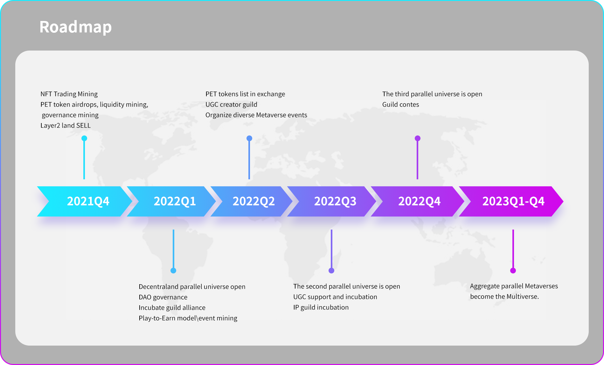

# MultiverseDAO：让人人在元宇宙拥有自己的一片土地 ｜ Jam Review

> 从昨天起，上月底公测上线的 MetaJam 正式推出 Jam Review，定期精选推荐入驻平台创建档案的 Web3 产品，以鼓励所有 Web3 BUIDL 的朋友一起来测试评论这些产品，参与帮助这些项目从产品、招聘、社区到融资等各方面的成长。
>
> 目前，MetaJam 的 Project Dashboard 仍在开发，计划于月底月初上线。因此，欢迎大家点击 MetaJam 首页 Jam Review 推荐的产品 Notion 链接留言评论。

## MultiverseDAO

(video)

> **类别：** 元宇宙
>
> **推荐：** M7e
>
> **官网：** https://www.multiversedao.org/
>
> **推特：** https://twitter.com/MultiverseDAO
>
> **群组：** discord.gg/hqanVpaDmC
>
> **博客：** https://multiversedao.medium.com/

### 你们的产品是做什么的？

MultiverseDAO 是世界上第一个 Decentraland 扩展平台。它建立了一个人人可拥有土地的 UGC 元宇宙，并共同建立了一个元宇宙加密经济。该平台的土地供应是由人口基数决定的。在未来，一块土地可以支持 N 个平行世界的建设。

MultiverseDAO 发表了世界上第一份《元宇宙土地宣言》，其愿景为：「所有人都应该在元宇宙拥有自己的一片土地」。

该平台支持 X to EARN 模式，用户和内容创作者通过游戏和创作，获得奖励。

MultiverseDAO 的主要员工以前曾在 Decentraland 基金会工作。

### 你的产品功能带来什么独特的价值？

1. MultiverseDAO 是 EVM 兼容（Decentraland 引擎虚拟机兼容）的。它还支持标准的 glTF 格式，实现了元宇宙场景和可穿戴设备的互操作性
2. MultiverseDAO 改变了土地的供应机制，激发了用户的创造力。土地性质有两类：编辑权或所有权。编辑权土地没有总量供应，全部来自空投。所有权土地目前有 20 万块出售，可以满足建设和投资的双重需求
3. 与 Decentraland 的单体面积和三角面相比，MultiverseDAO 高出 4 倍，每块土地为 1024 平方米，面积更大
4. MultiverseDAO 将建立一个建筑 NFT 交易市场，发布 UGC 创作，增加创作者的收入。

### 你的产品满足或解决了什么需求或问题？

目前元宇宙土地存在一些痛点：

1. 3 亿加密货币用户对元宇宙土地产生了大量的需求，而持有率还不到万分之一
2. 限制总量与 UGC 的定位相矛盾，阻碍了元宇宙的参与和价值创造。

MultiverseDAO 提供的解决方案是，通过与 BrightID 的合作，空投具有编辑权的土地，以支持「所有人都应该在元宇宙拥有一块土地」的愿景。这就提高了土地所有权在元宇宙中的比例，刺激了整个社会对元宇宙建设和价值创造的参与。

### 你的产品如何在竞争中脱颖而出？

1. MultiverseDAO 扩大了 Decentraland 的规模，解决了 Decentraland 目前遇到的问题，空间匮乏，以及价格可承受的入门。这共同创造了一个全球加密元宇宙标准
2. MultiverseDAO 改变了土地供应机制，增加了元宇宙土地的持有比例，满足了加密用户对元宇宙土地的需求。同时，这也刺激了民众参与到元宇宙的建设和价值创造中来
3. MultiverseDAO 有一个快速迭代的概念，构建了一个元宇宙生态联盟，将内容建设作为平台的核心，丰富了元宇宙场景
4. MultiverseDAO 允许技术升级，不断突破现有硬件网络对元宇宙的限制，提高元宇宙的访问速度，提高元宇宙的图像质量

### 你们短中长期的增长路径是什么？

1. 通过 X to EARN 玩法，创作者得到奖励，吸引更多玩家。这将导致产生更多的场景和体验，从而进一步增加使用和规模。X to Earn 提供的不仅仅是玩法，而是 X 等于多种盈利模式
2. MultiverseDAO 计划与多个社区合作，介绍 MultiverseDAO 并增加用户群
3. 在不久的将来，MultiverseDAO 将赞助各种元宇宙竞赛，以培养元宇宙建设人才
