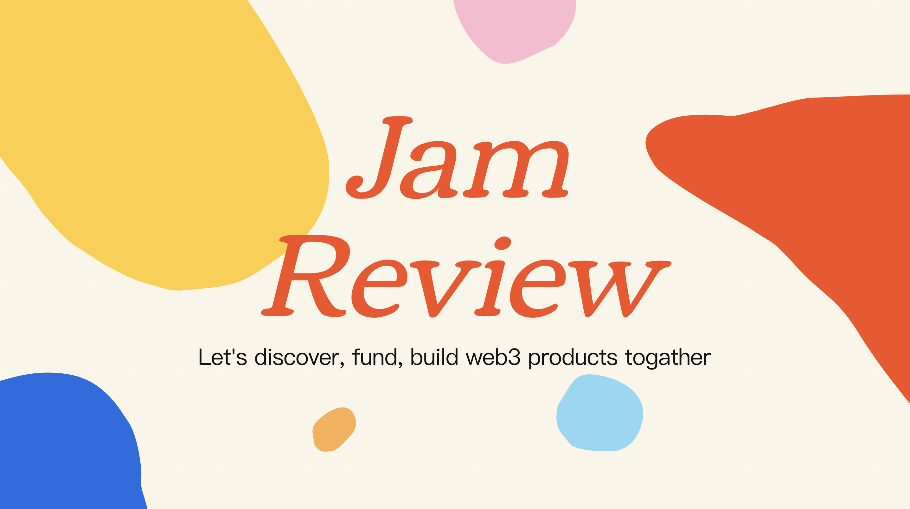

# Web3go：支持多链的数据分析协作平台 ｜ Jam Review No.4

> 今天 Jam Review 第四期精选推荐支持多链的数据分析协作平台 Web3go，欢迎所有致力于 Web3 BUIDL 的朋友一起来测试评论，参与帮助这些项目从产品、招聘、社区到融资等各方面的成长。
>
> 目前，MetaJam 的 Project Dashboard 仍在开发，计划于月底月初上线。因此，欢迎大家点击 MetaJam 首页 Jam Review 推荐的产品 Notion 链接https://daox.notion.site/Web3go-b1adf0b7a22b40148f0939595618d03e 留言评论。

## Web3go

> **类别：** 基础设施
>
> **推荐：** My Crypto Profile
>
> **官网：** https://web3go.xyz/
>
> **推特：** https://twitter.com/Web3Go
>
> **群组：** https://t.me/web3go
>
> **博客：** https://web3go.medium.com/

### 你的产品是做什么的？

(video)

Web3Go 是一个开放的数据平台，专注于链上数据的格式化、可视化、共享和协作分析。目前，它支持基于 EVM、Polkadot、Near、章鱼网络和 Solana 生态系统。

### 你的产品功能带来什么独特价值？

- Web3Go 增强的 API：为企业和开发者定制的 API，以获取交易、账户余额、NFT 的持有量等数据
- Web3Go 的跨链通知功能，让用户能够跟踪地址活动，以及特殊交易在链上活动后以非常有限的时间延迟获得通知
- Web3Go 仪表板：
  - 提供直接的洞察，而不是难以理解的数据
  - 仪表板的用户界面像艺术品一样精致，显示 DeFi、通证和 NFT 数据
  - 强大的工具，让用户只需简单几步就能创建自己的可视化图表
  - 可以轻松整合，为项目提供动力，促进整个生态系统的发展

### 你的产品满足或解决了什么需求或问题？

- 不断增长的数据需求与有限的基于 Rust 的链的分析
- Web3 dApp 对稳定 API 和复杂数据模型的强烈需求
- 用户和实时链上数据之间的信息延迟和异步现象

### 你的产品如何在竞争中脱颖而出？

- 跨链：目前 Web3Go 支持基于 EVM、Polkadot、Near、章鱼网络和 Solana 生态系统中的数据，并在技术上能够进一步扩展
- Web3Go 同时提供链上数据服务和用户友好界面的分析

### 你们短中长期的增长路径是什么？

更多交流讨论，欢迎加入 MetaJam Discord 的 Jam Review 频道：https://discord.gg/F3bkBDk5mK
