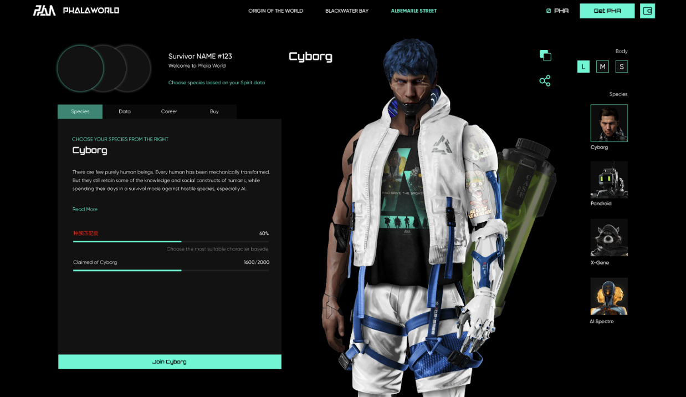

# Phala World：用元宇宙小游戏对社区贡献进行价值化｜ Jam Review No.6

> 今天 Jam Review 第六期精选推荐元宇宙游戏化拓展类产品 Phala World，欢迎所有致力于 Web3 BUIDL 的朋友一起来测试评论，参与帮助这些项目从产品、招聘、社区到融资等各方面的成长。
>
> 另外，大家可以通过 Phala World 项目来查看体验 MetaJam 的 Project Dashboard 功能，欢迎点击 https://www.metajam.studio/project/phala-world 。

## Phala World

(video)

> **类别：** 游戏化拓展
>
> **推荐：** My Crypto Profile
>
> **官网：** https://phala.world/
>
> **推特：** https://twitter.com/PhalaWorld
>
> **群组：** https://discord.gg/phalaworld
>
> **博客：** https://medium.com/phala-world

### 你的产品是做什么的？

Phala World 是 Phala 生态主推的元宇宙游戏化拓展类产品，通过科幻故事的叙事和背景设定，将晦涩难懂的经济白皮书用小游戏（mini-game）的形式做展现，通过与 Phala Network 的链上和链下的行为进行结合，打造属于社区的文化，提升社区共识和凝聚力，即 Play to Build (P2B)模式。

Phala World 是根据 Phala 社区的角色贡献形态将游戏中的角色分为 4 个种族和 5 种职业，并结合 soulbond 模式，拆分了可交易的 Shell NFT （8888 个）和 Spirit NFT （Free），通过策略、RPG 等游戏模式的引入，丰富社区的参与模式和娱乐性。

同时 PW 也是 Phala 的去中心化云基建和 Fat contract 的最佳试验田，因此是团队力推的生态项目之一。

_可参阅下方文章了解更多_

[Play to Build— Create Your Own Story in Phala World Metaverse Game](https://medium.com/phala-world/play-to-build-create-your-own-story-in-phala-world-metaverse-f81ced499d09)

### 你的产品功能带来什么独特价值？

- **两种 NFT 的结合构成完整的 PhalaWorld NFT，真正实现 Soulbound 理念**

**1）Sprit NFT**

Spirit NFT 是 Soulbound NFT ，可以看作是现实生活中玩家灵魂的化身。这是在 PW 里关键道具之一。Spirit NFT 是基于加密世界中特定于玩家的链上和链外行为数据。

在 Vitalik Buterin 发表过的文章 《[Soulbound](https://vitalik.ca/general/2022/01/26/soulbound.html)》中，强调了源自魔兽世界的「出勤证明」概念。玩家需要通过一定的行为才能获得最强的灵魂绑定物品，而不是花钱购买。在 PW 里，我们认同灵魂绑定的概念，相信用户行为是一种非常有价值的资产，甚至可以在虚拟世界中代表用户。因此，在 PW 中，Spirit NFT 的设计更多是代表玩家身份，而不仅仅是用户可支付的能力。

Spirit NFT 可以免费获取，但级别取决于玩家的行为，玩家可通过持续的贡献进行升级。

**2）Shell NFT**

Shell NFT 是用户的 NFT 外观，包括种族和职业，可售卖和转移，限量 8888 个，分为三种稀有度。想成为 PW 的玩家需同时获得 Shell 和 Spirit NFT。

- **创造 Play to Build 模式，强社区互动属性**
- 通过使用 My Crypto Profile（MCP）的用户身份系统，关联玩家的链上和链下行为数据（如在 PW 中为推特活跃度、Phala/Khala 网络贡献度等等）。用户对 Phala 网络的贡献值与 Spirit 数值正相关，即对 NFT 属性的不断的上升螺旋需求可增强 Phala 社区互动性，夯实社区文化增强凝聚性。

- NFT 外观和属性系养成类模式。不同于其他 NFT 盲盒，PW 的 NFT 种族和职业由用户自主选择，但对应的 NFT 的终极形态（如花纹、颜色等外观、性能的部分属性）和孵化时间取决于用户的对初始 NFT 的喂养频次。
- PW 拥有完整的科幻故事背景和种族诞生和文化。根据 Phala 网络的贡献者角色，PW 的 NFT 分为了不同种族和职业，因此 PW 内也结合了 RPG 和策略类游戏等丰富玩法，社区可通过参与故事设定和内容撰写，为 PW 叙事，同时官方也会将优秀的作品融入 PW 世界，共同 Play to Build。

- **可拓展的元宇宙玩法**

PW 作为元宇宙的游戏化拓展类 (Gamification Extension) 项目，自身不受限于链项目本身的功能和玩法。区别于传统或其他游戏类项目，项目本身可定义为 mini-game 类，轻便可移植，不受限于元宇宙的空间。同时，具备将区块链和 Dapp 引入元宇宙中的能力，拓展元宇宙项目的玩法边界。

- **精美的 NFT 外观**

PW 的 NFT 具有超高精度，具备直接 3D 化的能力。

### 你的产品满足或解决了什么需求或问题？

- 解决目前大部分的元宇宙项目缺少社区链上和链下的互动性的问题，将社区贡献价值化
- 为元宇宙和区块链类项目搭建完整的故事背景和叙事逻辑，增强 Web3 社区文化建设，提高活跃度
- 解决底层类项目的经济模型晦涩难懂，通过游戏化可以更好的帮助社区进行理解，模式可以复制
- Fat Contract 的最佳应用案例之一，可拓展其他同类项目合作
- 可拓展的区块链和元宇宙玩法，作为插件（Extension）可植入其他元宇宙项目或引入 Dapp 进入元宇宙

### 你的产品如何在竞争中脱颖而出？

- 非元宇宙的 PFP 类项目或者 GameFi 类项目，属于新创造类玩法，为用户提供可叙事并可参与互动的游戏方式
- 实现了 Soulbound 的模式
- 创造 Play to Build 模式在可让用户参与实现 P2E 基础上，参与网络建设
- 作为游戏化拓展项目模式可移植到任何有需要的区块链项目

### 你们短中长期的增长路径是什么？

- **现阶段进展**

PW 通过 MCP 为社区的童鞋打造 PW 的专属 Web3 身份，行为贡献提升可提高在游戏中的等级。目前已经已经在最终测试中。同时 PW 正联合其他项目开展各种白名单活动，预计 4 月底前上线新网站，开放 NFT mint。

更多交流讨论，欢迎加入 MetaJam Discord 的 Jam Review 频道：https://discord.gg/F3bkBDk5mK
