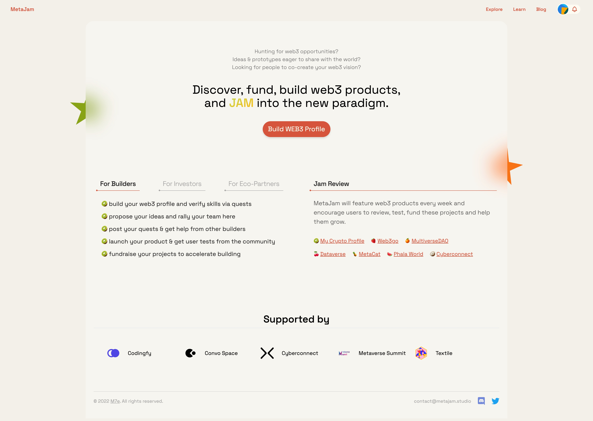
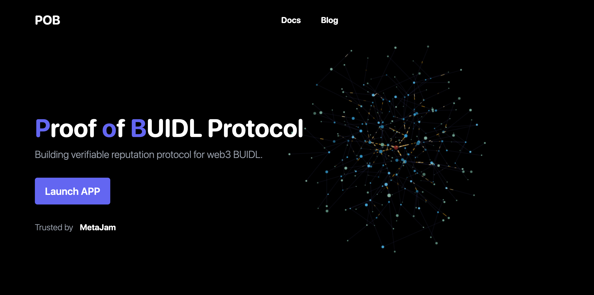
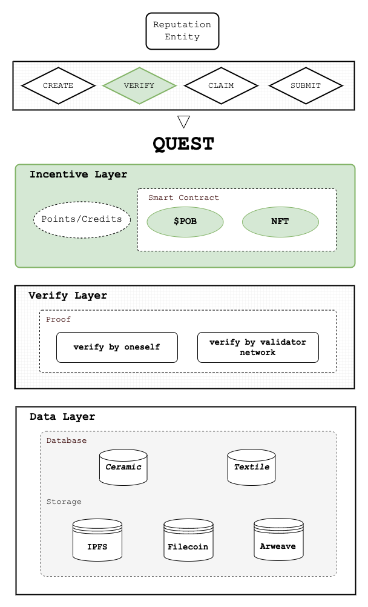

# POB 协议：建设可验证声誉系统，帮助建设者融入 Web3 新范式

> 如我们一个月前在 MetaJam 亮相新闻稿中所承诺的，MetaJam Project Profile（项目简介）功能今天发布。
>
> 与此同时，让我们揭开 POB 协议的面纱，一个支持 MetaJam 建立 Web3 建设者网络的，专注于 Web3 BUIDL 的可验证声誉系统的去中心化协议。

## MetaJam Project Profile

Profile 处于 MetaJam 的中心，在 POB 协议的支持下，每一个 Web3 用户和项目的简历和互动都可以编织和积累。在 MetaJam Project Profile 页面上，Web3 建设者能够开发他们的产品，为他们的产品融资，投资者能够发现和投资产品，而所有的生态伙伴都很容易找到用例和招聘人才。

现在，您作为 MetaJam 用户，能够点击 Jam Review 标签下的名称来查看那些 Web3 产品的项目简介。

_https://www.metajam.studio/project/my-crypto-profile_

以上面显示的 My Crypro Profile 的 Project Profile 为例，用户可以有如下的各种操作：

- 作为建设者，创建和编辑一个项目
- 作为拥有者，邀请成员加入你的项目
- 作为星探（Scout），邀请其他建设者来创建项目
- 作为拥护者，对你喜欢的项目进行点赞和关注
- 作为用户，对项目进行评论
- 作为用户，查看项目的时间线和 Jam Review（如果有的话）。

以上并不是项目简介的所有功能，POB 协议支持的 Quest（任务）等多项功能也即将推出，能让建设者通过向他人寻求帮助来开发他们的产品。

## POB 协议

现在是时候揭晓我们用 POB（Proof of BUIDL，BUIDL 证明）协议构建 MetaJam 的这一事实了。POB 协议是一个去中心化的协议，用于构建 Web3 BUIDL 的可验证声誉系统。

### 声誉系统：Web3 BUIDL 的基石

一个实体（例如人、社会团体、组织或地方）的声誉通常是根据一系列的标准，如共同的行为、表现等，从同行、第三方那里获得评估，并汇总以估计其价值。因此，声誉及其评价系统是 Web3 BUIDL 的基石，有助于认可和激励参与者的贡献，这对任何 Web3 项目的发展和可持续性至关重要。我们可以看到积分、等级、头衔、徽章、证书和社交通证等声誉系统的例子。

然而，目前的声誉系统还是存在一些问题：

- **记录：** 主观随意不准确，数据孤立的且分散
- **证明：** 难以核实和鉴定，导致可信度低
- **成就：** 容易伪造，以及被第三方修改和删除
- **通证化：** 难以目前解决声誉通证的悖论

POB 协议是上述问题的解决方案。这是一个完全去中心化的 Web3 BUIDL 的可验证声誉系统协议，它创建了一个公开可验证等声明标准和以 Quest 为中心的数据验证基础设施 —— 一个供去中心化应用（Dapp）插入基于 BUIDL 行为的声誉系统的通用层。

### POB 协议是如何工作的？

由于声誉是对方对某实体一系列行为或表现的社会评价的结果，POB 协议创建了以 Quest 为中心的数据验证基础设施：

- 所有的 Quest 都是以公开可验证的声明标准来编码的，所有的 Quest 数据都在 Ceramic 和 Textile 这样的去中心化的数据库中处理，并存储在 IPFS、Filecoin 和 Arweave 等去中心化存储系统中。
- 由建设者来创建和验证 Quest，也由建设者来认领和提交 Quest。
- 所有的 Quest 都可以由自己或验证者网络进行验证。

利用通证激励，POB 协议为可验证声誉系统建立了一个双边市场，这对认可和激励参与者对 Web3 BUIDL 的重要贡献至关重要：

- 发起者用 NFT 或 POB 通证创建 Quest，以激励接受者认领并提交 Quest。
- 发起者也可以用积分来创建 Quest，以便接受者出于对通证激励以外的考虑来申领。
- 用户可以质押 POB 通证加入验证者网络，并通过验证 Quest 获得 POB 奖励。

以去中心化身份、去中心化数据和去中心化存储为技术基础，POB 协议具有以下特点：

- **数据自主：** 我们将可验证声誉的数据所有权和用途还给用户。只有用户对他们的数据如何使用，在哪里使用，以及用于什么目的享有自主权。
- **底层区块链不可知：** 我们的协议被设计为开放的，不受任何单一区块链的绑定，且这一协议为多链生态系统所创建。
- **数据可迁移：** 互操作性是真正开放网络的关键。我们让每个人都能以自己的可验证声誉作为其 Web3 身份的一部分在应用之间旅行。
- **可组合性：** 只需一次点击就能获取可验证声誉数据。以它为基础，快速启动和迭代。建设体验，而不是墙。

### MetaJam：第一个使用 POB 协议的去中心化应用

POB 协议支持的用例广泛，包括社区和 DAO、内容和教育、合作和外包、DeFi、筹款和投资、NFT、招聘等。

目前，MetaJam 是我们正在开发的第一个实现 POB 协议用例的去中心化应用（Dapp，Decentralized Application），来帮助 POB 协议通过聚合越来越多的 Web3 建设者和产品来扩大其用例。而 POB 协议则支持 MetaJam 创建一个让人们发现和构建 Web3 产品的网络和市场。

Web3 建设者们，让我们用 POB 协议在 MetaJam 上尽情发挥，一起融入 Web3 新范式吧!

- **MetaJam：** https://www.metajam.studio/
- **POB Protocol：** https://www.pob.work/
- **推特：** https://twitter.com/MetaJamStudio
- **群组：** https://discord.gg/wXtj2UuedP
