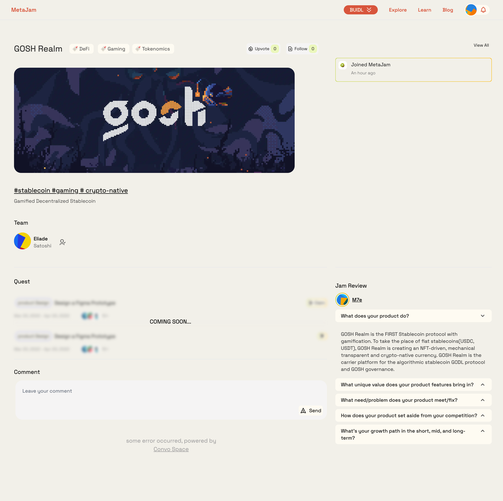
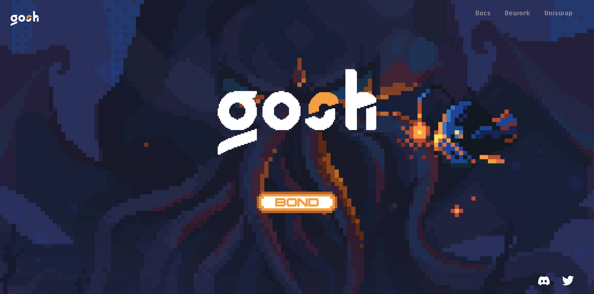
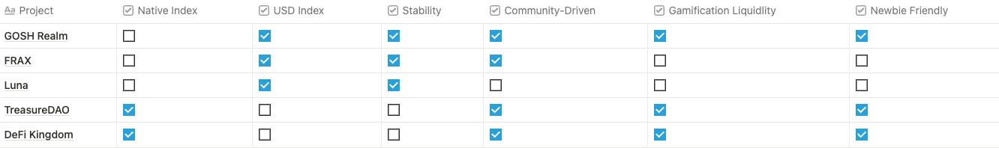

# GOSH Realm：提供一个有趣且沉浸式的算法稳定币协议｜ Jam Review No.8

> 今天 Jam Review 第八期精选推荐游戏化算法稳定币项目 GOSH Realm，欢迎所有致力于 Web3 BUIDL 的朋友一起来测试评论，参与帮助这些项目从产品、招聘、社区到融资等各方面的成长。
>
> 欢迎点击 GOSH Realm 项目页面 https://www.metajam.studio/project/gosh-realm，给项目产品留言评论！

## GOSH Realm

> **类别：** GameFi
>
> **推荐：** M7e
>
> **官网：** https://www.gosh.fun/
>
> **推特：** https://twitter.com/GOSHRealm
>
> **群组：** https://discord.com/invite/P8EvFAe9yr
>
> **博客：** https://mirror.xyz/0x3Bb702aCD6D33f2582E06EFBf7DD39a54b2C8d18

### 你的产品是做什么的？

GOSH Realm 是第一个游戏化的去中心化稳定币协议。法币稳定币（USDC、USDT）必将消亡。 GOSH Realm 正在创造一种 NFT 驱动、机制透明的加密原生货币。GOSH Realm 是算法稳定币 GODL 协议和 GOSH 治理的载体平台。

### 你的产品功能带来什么独特价值？

GOSH Realm 相信游戏化会改变世界，并且这一变化一定是自下而上生长的。

我们相信,如果加密世界的稳定币仍然被中心化机构所掌控，机制依然不透明，这一稳定币将无法满足社区真正的需求而面临最终与整个加密逻辑背道而驰的结果。

我们相信加密世界的项目需要文化，而不仅仅是 APY（年化收益）驱动。没有更好的参与乐趣与参与体验，没有给社区带来一种新的生活方式，最终社区将沉寂，失去自下而上的生命力。

去中心化稳定币成功需要深度的流动性，稳定的价格，高治理参与度。这一切需要良好的算法支撑，信仰热爱的社区文化，以及更低的参与门槛。这之中的每一个问题都有前辈项目进行探索，却并未将这一逻辑清晰地结合并落实到一个核心项目。

GOSH Realm 的目标是提供一个有趣且沉浸式的算法稳定币协议，为整个加密社区提供一个可协作而扩展的稳定币 DAO，将塑造 Web3 世界基石的自由和控制权还给用户：

- 每个用户都能拥有完全属于自己的稳定币。
- 一个完全社区所有的稳定货币，完全透明与更加有生命力。
- 一种正向博弈的代币模型，长期参与者将得到更大的权利与收益。
- 一种新的生活方式，通过 DAO 协作更深度的参与加密原生的世界，全新体验的工作与社交。

我们提倡野蛮生长与自由治理，从最初始状态共同建设发展，共建一个真正的去中心化文化 DAO 社区。

### 你的产品满足或解决了什么需求或问题？

从 AMPL 开始，很多项目尝试了不同的算法稳定币模式，而整个算法稳定币的市值与中心化稳定币市值的差距也在逐渐缩小，去中心化和中心化稳定币对市场话语权争夺的竞争已经一触即发。在这一时间点，一个巨大的机会市场展现在了我们的面前，算法稳定币的模式探索已经基本成熟，而对一个完全透明、有信仰、由社区驱动并掌控的稳定币的需求从未如此急迫。因此，GOSH Realm 决定用独有的方式切入这一赛道。

为创造一个相对而言抗波动、有价值支撑、利用度高（被更广泛的生态使用）的稳定币系统，算法稳定币的机制往往相当复杂，这也为社区驱动制造了高门槛。首先，一大部分社区成员被复杂的说明拦在算法稳定币世界之外，他们对整体世界缺乏理解，难以进入；其次，项目缺乏沉浸式的运营方式，用户们仅对 APY 激励产生兴趣，对整体稳定币的发展漠不关心，也不可能产生信仰。

因此，为解决这些难题，GOSH Realm 将游戏化运营融入到项目设计和用户成长中，降低学习成本，增加深度体验，从而在社区驱动这一关键性需求上树立一个新标准。在 GOSH Realm，参与使用算法稳定币的过程将变得简单而有趣。

### 你的产品如何在竞争中脱颖而出？

### 你们短中长期的增长路径是什么？

**第一阶段 觉醒**

- 里程碑 1 号：治理代币发行
- 里程碑 2 号：BOND 上线
- 里程碑 3 号：铸造头像 NFT

**第二阶段 献祭**

- 里程碑 1 号：上线游戏化算法稳定币
- 里程碑 2 号：开启 NFT 挖矿
- 里程碑 3 号：开启质押+VeToken 机制
- 里程碑 4 号：开启 NFT 交易市场

**第三阶段 召唤**

- 里程碑 1 号：发布原生指数
- 里程碑 2 号：期权对赌机制
- 里程碑 3 号：与游戏协议开展流动性合作

**第四阶段 降临**

- 里程碑 1 号：设计锚定原生指数的新稳定币协议

更多交流讨论，欢迎加入 MetaJam Discord 的 Jam Review 频道：https://discord.gg/wXtj2UuedP
