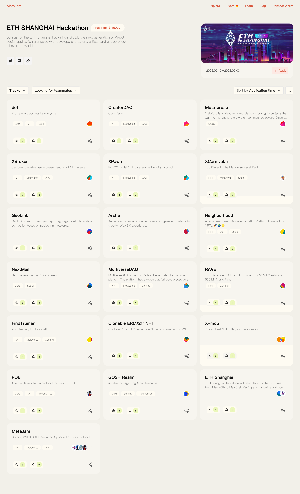
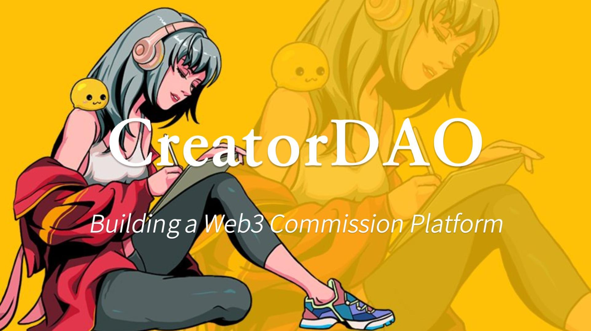
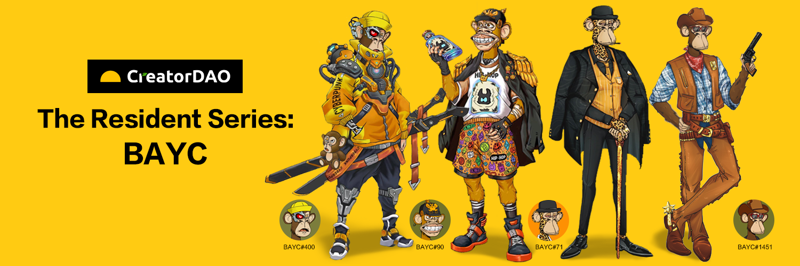
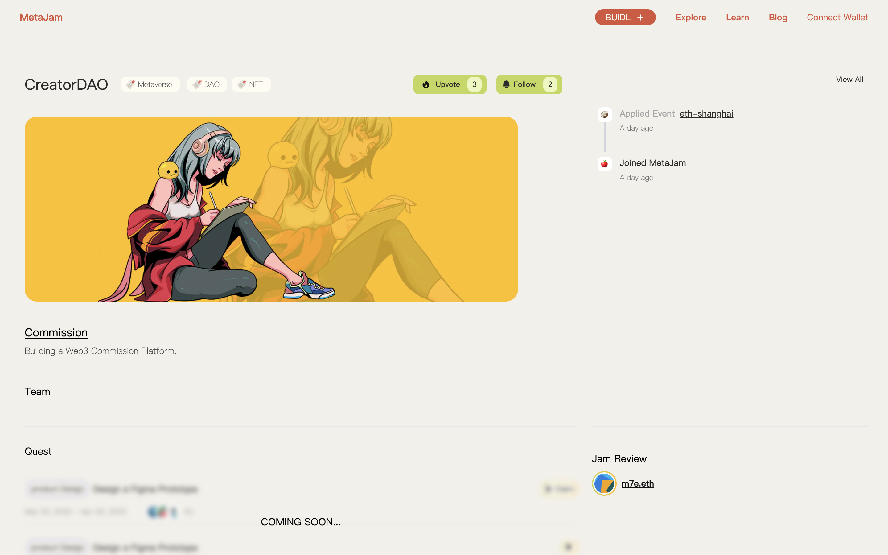

# ETH 上海黑客松参赛项目 CreatorDAO：打造 Web3 约稿平台 ｜ Jam Review No.12

> ETH Shanghai Hackathon 比赛结果将于 6 月 3 日本周五揭晓，已有许多报名参赛 Web3 项目和产品在 MetaJam 创建项目简介，希望在这个 Web3 BUIDL 网络能更好的找人组队、曝光推广，寻求合作。
>
> 
>
> 今天，第 12 期 Jam Review 推荐 [ETH 上海黑客松](https://hackathon.ethshanghai.org/)参赛项目 CreatorDAO，目前独一无二的 Web3 约稿平台，推动 NFT 和元宇宙的二次创作。

## CreatorDAO

(video)

> **类别：** NFT&DAO
>
> **推荐：** Mask Network
>
> **官网：** https://www.creatordao.cc/
>
> **推特：** https://twitter.com/creatordaocc
>
> **群组：** https://discord.gg/creatordao
>
> **博客：** https://medium.com/@CreatorDAO

### 你的产品是做什么的？

我们正在建立一个约稿平台，允许任何东西被委托创作（如图像、音频、3D、传说、动画等）。从愿景到想象力再到创造，将具有无限潜力的种子传播到元宇宙。

我们相信 NFT 领域正在进入下一个阶段，原始 NFT 持有者需要为他们的 NFT 提供新的创意和故事。对于每一个 BAYC，每一个 Azuki，都可能有一个独立的品牌，甚至是一个特定的元宇宙。

而我们是一个让它成为可能的 DAO。

### 你的产品功能带来什么独特价值？

一方面，CreatorDAO 可以帮助创作者快速了解 Web3，并通过被委托约稿参与其中。

另一方面，NFT 持有者可以通过委托艺术家实现他们的想象力来扩大他们 NFT 的可能性。

二次创作的艺术作品和与之诞生的故事属于最初的 NFT 持有者，但它们也是我们许多特定收藏的一部分，就像下面展示的 Resident 系列。

### 你的产品满足或解决了什么需求或问题？

首先，我们领先于市场。NFT 领域的大多数人仍然在玩零和游戏，这是 NFT 的第一个阶段。我们需要采取行动，通过为少数已经意识到接下来会发生什么的人提供最好的服务来传播意识。而我们正是在这样做。我们欢迎任何有兴趣的人加入我们的课程，走在潮流的前面。

其次，我们不断寻找更多的创作者加入。到目前为止，我们有 20 多位艺术家加入，并产生了许多精彩的作品。市场不断给我们提供令人兴奋的反馈，而且需求量很大，有 30 多个请求在排队等待。平均来说，每个艺术家需要 5-10 天的时间来制作一个高水准的作品。因此，目前的需求已经超出了我们的能力。我们需要更多的创作者加入!

### 你的产品如何在竞争中脱颖而出？

我们在这一 NFT 创意委托领域中是早期玩家。目前，我们没有看到在我们这个水平上有太多的竞争对手。未来可能会有更多的竞争，特别是当市场开始成熟时。这就是为什么我们要在三个关键方面建立坚实的优势：

1. **主导供应方。**我们是一个不断成长的艺术家社区，每周都有 10 多位有成功记录的艺术家加入。每个艺术家的加入都是通过提交委托作品，从而为我们的社区增加价值。被选中的艺术家可以在我们的社区开辟他们的委托商店，以确保他们在 CreatorDAO 的业务持续经营。按照目前的速度，我们将在短短几个月内拥有一个非常强大的艺术家基础。
2. **加强需求方的关系。**我们已经与 KOL、企业家和其他在 NFT 领域有重大影响的人建立了强有力的联系，我们将继续扩大范围并加强联系。我们已经与 BAYC 社区成员开展了几次空投，有 30 多个订单正在进行中。除了 BAYC 社区外，我们还将覆盖其他蓝筹 NFT。随着蓝筹 NFT 持有者的需求增加，CreatorDAO 品牌的知名度正在快速传播，而这只是我们计划的开始。就像 NFT 一样，NTF 创意服务是关于品牌的，这正是我们在此快速建立的。
3. **强大的社区。**我们是一个由社区拥有的约稿平台。CreatorDAO 社区正在快速成长。我们的业务并不因每次完成约稿工作而结束。每个持有者和艺术家都会加入我们的社区，成为 CreatorDAO 的一员。在未来，我们可以成为很多东西，除了一个传统的公司。CreatorDAO 的每个成员都可以为我们社区的发展做出贡献并从中受益。

### 你们短中长期的增长路径是什么？

- **短期：**我们专注于最紧迫的事项——发展我们的客户和艺术家群体。在这个阶段，我们将所有艺术家分为三个不同的类别，每个类别都有自己的风格。每个完成的作品都将被放入这三个系列中的一个，并且可以被以太坊网络上的所有人查看。我们计划快速行动，尽快覆盖 300 多个 BAYC、Azuki 和其他顶级的 NFT，这样 CreatorDAO 的产品就可以自己创造一个杰出的品牌。
- **中期：**在这个阶段，我们欢迎更多的风格和创意的表达。更多的类别和系列将被创建，只要它们能够站在自己的立场上。在这个阶段，佣金将是对艺术家的主要激励。在上一阶段建立起我们的品牌后，需求自然会超过供应，所以我们将专注于为艺术家带来收入，帮助他们建立自己的元宇宙。
- **长期：**这将是我们看到事情发展到的最终阶段——一个具有许多颠覆性的 CreatorVerse。每个系列都将有自己的故事和元宇宙，由一个或几个艺术家领导的社区管理。每个元宇宙在未来都是一个品牌，所以 CreatorDAO 可能成为品牌中的品牌或元宇宙的摇篮。然而，这并不是我们愿景的终点，而是一个新的起点，将发生更多有趣的事情。

欢迎点击 CreatorDAO 的项目页面点赞关注、留言评论：https://www.metajam.studio/project/creatordao

更多交流讨论，欢迎加入 MetaJam Discord 的 Jam Review 频道：https://discord.gg/wXtj2UuedP
