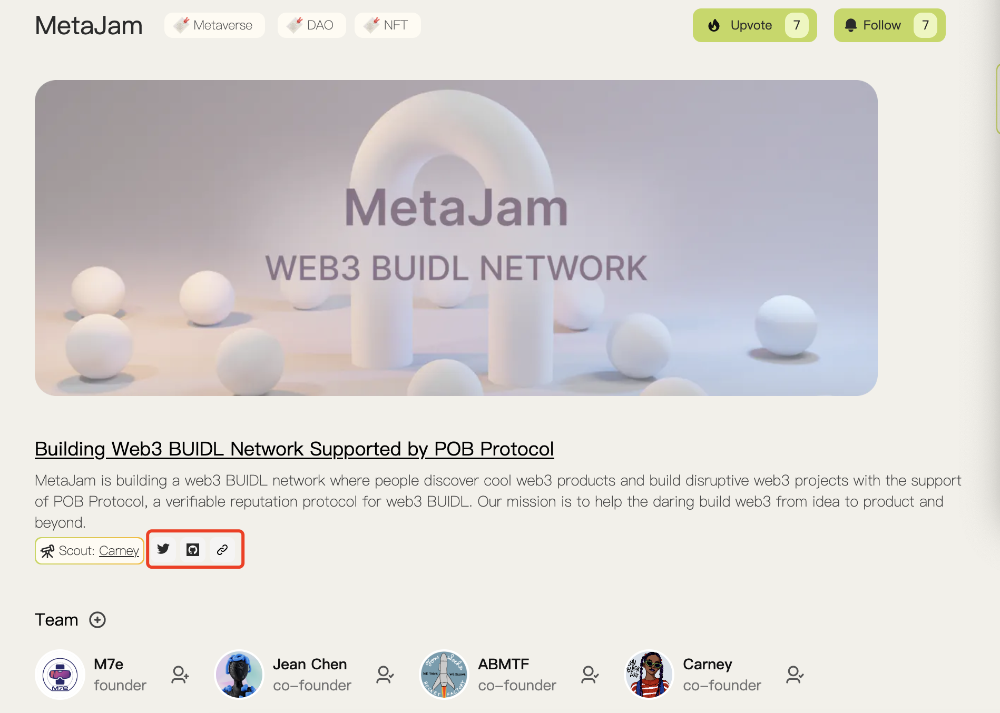
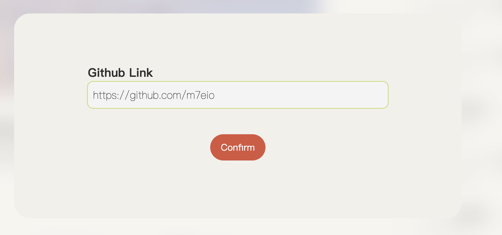
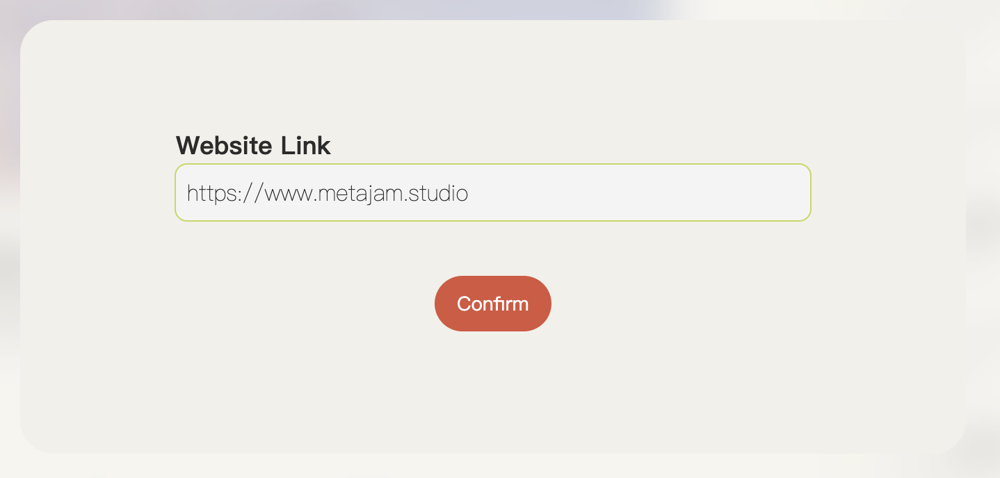
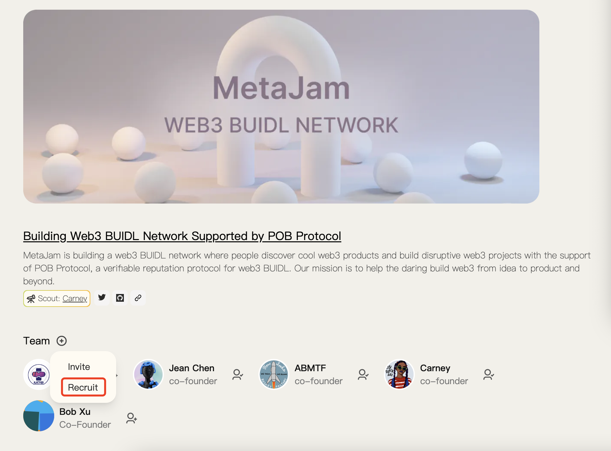
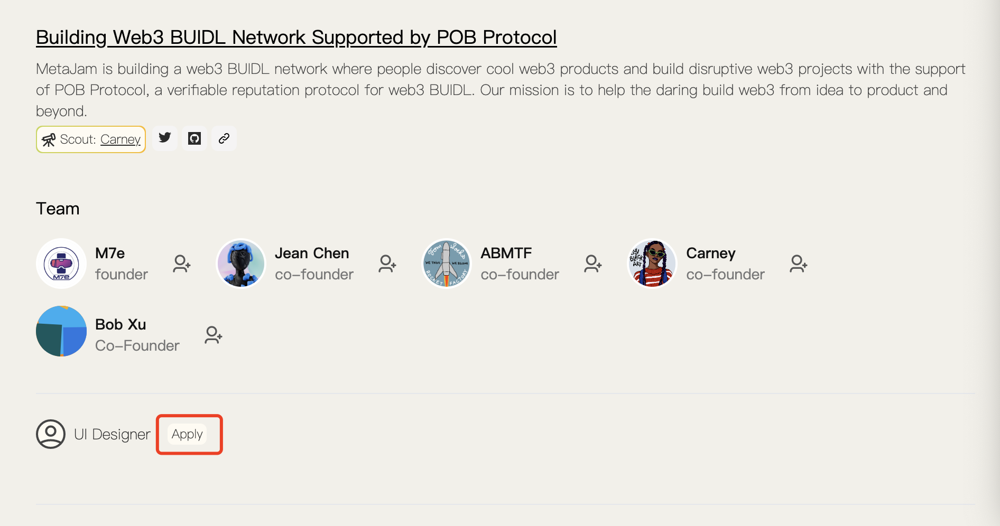
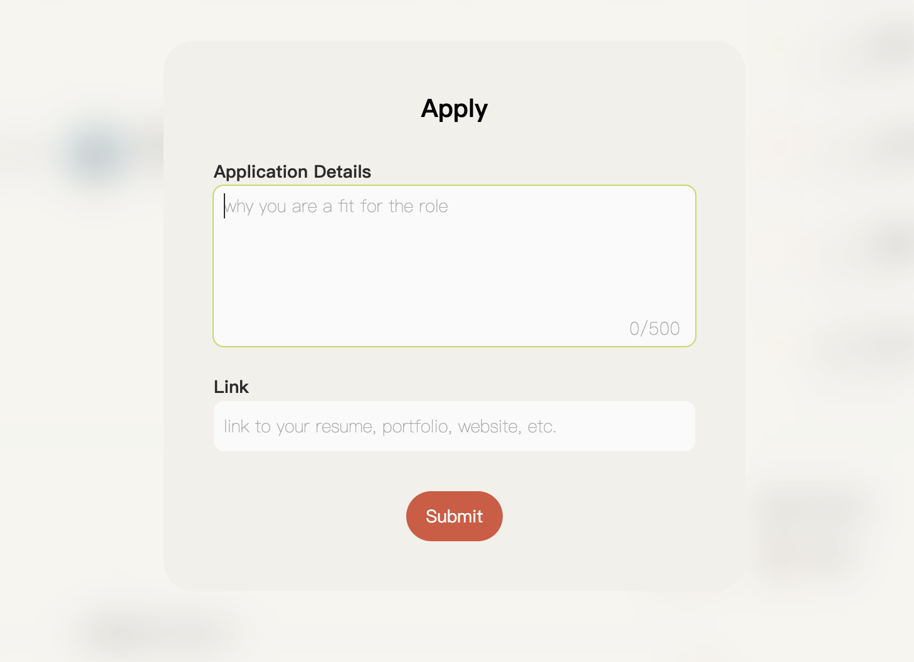
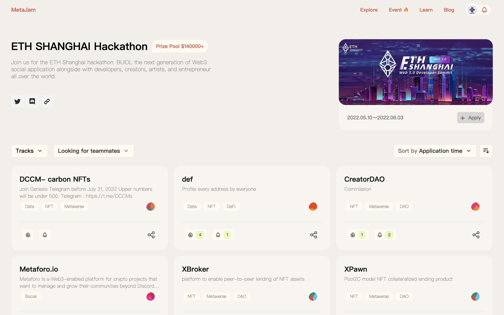
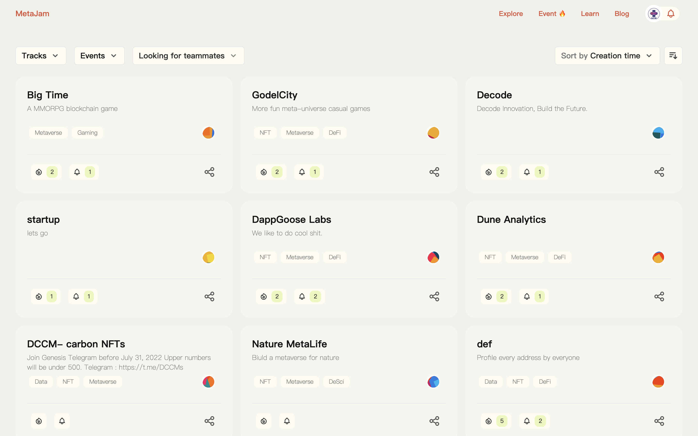

# MetaJam 产品更新双周报第 1 期

> 今天起，我们发布双周报，为大家介绍 MetaJam 产品最新进展和功能。

## 提要

- 社交绑定：支持项目方绑定推特、GitHub、官网地址
- 招聘和应聘：支持项目方发布招聘启事、用户申请应聘
- Event 活动列表：例如 ETH 上海黑客松等
- Explore 项目列表：可查看当前有效的入驻的项目列表

## 更新日志

### 社交绑定

支持项目方绑定推特、GitHub、官网地址。

- 项目方在项目简介页面点击推特、GitHub、官网图标即可输入地址绑定，也可点击右下角铅笔图标编辑修改。

### 招聘和应聘

支持项目方发布招聘启事、用户申请应聘。

- 项目方在项目简介页面点击 Team 的 Recruit 按钮，在弹窗内填写职位名称和简介，即可发布，也可点击右下角铅笔图标编辑修改。

- 用户浏览项目简介时对感兴趣的职位可以点击 Apply 申请，在弹窗内填写相应内容提交即可。

### Event 活动列表

在首页导航栏和活动部分点击 Event 即可查看如 ETH 上海黑客松这样的活动汇聚的项目列表，并可按不同筛选条件查看。

### Explore 项目列表

在首页导航栏点击 Explore 即可查看当前有效的入驻的项目列表，并可按不同筛选条件差看。

- **MetaJam：** https://www.metajam.studio/
- **POB Protocol：** https://www.pob.work/
- **推特：** https://twitter.com/MetaJamStudio
- **电报：** https://t.me/+QXy7Qs9LgEFlOTM1
- **Discord：** https://discord.gg/wXtj2UuedP