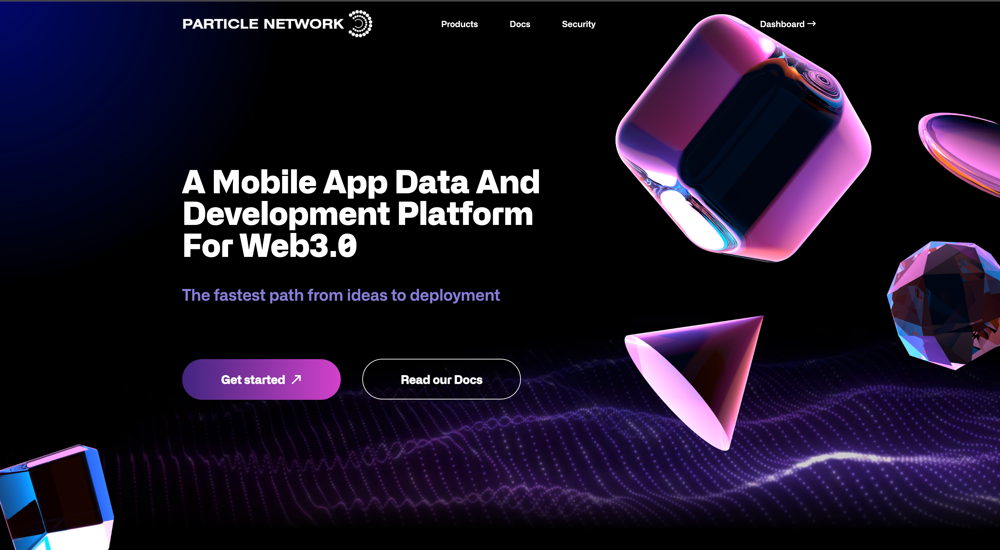
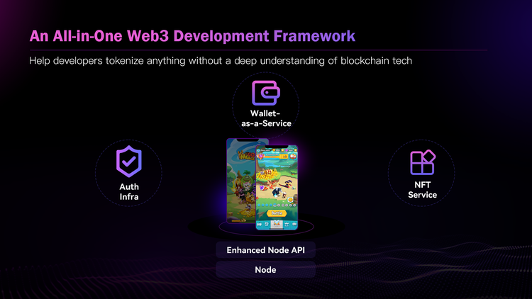
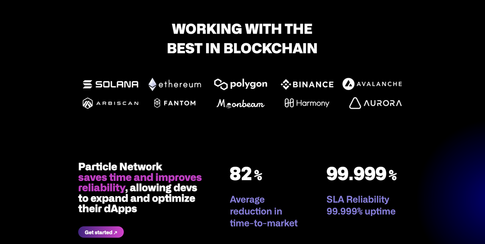
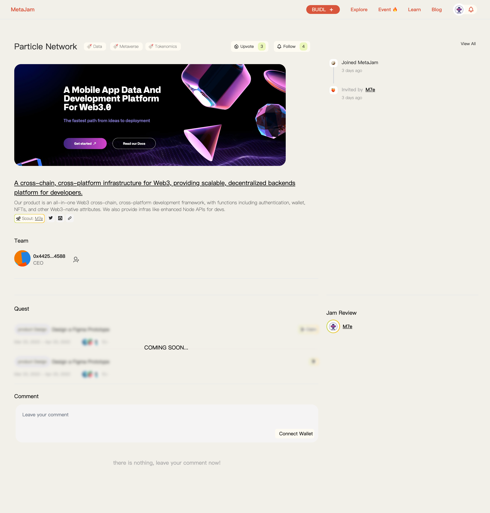

# Particle Network：加速 Web2 产品进入 Web3 ｜ Jam Review No.13

> 今天，第 13 期 Jam Review 精选推荐 Web3 数据和开发平台 Particle Network，旨在降低 Web2 产品进入 Web3 的门槛。开发者无需深入掌握区块链技术，即可开发出可扩展、多链部署、高可靠性的 Web3 移动应用，同时帮助开发者整理和结构化链上数据，并通过这种方式帮助开发者构建用户 DID，从而可以有针对性地进行产品迭代和运营。
>
> Particle Network 上月刚刚完成 180 万美元 Pre-Seed 融资，Longhash Ventures 领投，FSC、Insignia Ventures Partners、Cyberconnect、Monad Labs、Bitcoke Ventures、7 O'Clock Capital 以及多位知名个人投资者及互联网创始人参投。

## Particle Network

> **类别：** 基础设施
>
> **推荐：** Foresight Capital
>
> **官网：** https://particle.network/
>
> **推特：** https://twitter.com/ParticleNtwrk
>
> **群组：** https://discord.com/invite/2y44qr6CR2
>
> **博客：** https://medium.com/@ParticleNetwork

### 你的产品是做什么的？

Particle Network 是一个移动优先、数据驱动和可组合的 Web3 开发平台，愿景是加速传统世界向 Web3.0 世界的过渡。具体产品类似一个中间件平台，通过 API 调用的方式帮助开发者快速实现 Authentication，Wallet，NFT 交易市场以及链上数据索引等功能，同时提供加强型 Node 服务。支持 Web 服务+原生移动端以及 PC 端等跨平台开发，支持 Solana+EVM 链等多链开发与部署。旨在为开发者创造一个单一的链上开发工作流，快速构建跨端跨链的 Web3 产品。

### 你的产品功能带来什么独特价值？

Particle Network 想做的事情就是让开发者能够做他擅长的事情，去优化产品体验，去做用户运营，不需要把时间花在理解不同链的技术特点和如何开发与链相关的功能上面。

具体产品是一个 All-in-One 的 Web3 多链多端的开发框架，包含 Authentication, wallet, NFT 等 Web3 原生功能，同时也提供开发者会用到的跨链数据索引和加强型 Node API 等。

以目前正在使用平台做开发的一款移动端高品质 3D 放置卡牌游戏 Merge Go 为例，可以了解 Particle Network 具体提供的产品和服务：

- Authentication：帮助开发者让用户以他们熟悉的方式建立链上身份体系，简单快速安全，降低新用户流失率，消灭助记词的不安全性。
- 引入 Wallet 功能：用户可以用合规的法币出入金，Swap 游戏内 Token 与 USDT 等主流 Token，同时与其余钱包进行转账等操作。
- 一站式 NFT 服务：帮助开发者快速将游戏内资产上链，实现 NFT Launchpad+二级市场交易功能
- Node：开发者不需要理解链的交互，我们提供了一个 Unified API, 让他通过这个统一 API 与不同的链进行交互，实现任何他想要进行的对链的读写操作，可以极大的提高开发者的开发效率。

经过这几步，玩法类似于 Axie Infinity 的一款高品质 3D 多链 Web3 移动游戏就正式推出了。

在这个过程中我们可以看到，开发者不需要理解任何 Solana 或者 EVM 相关的技术，但推出了一个多链部署的 Web3 游戏。

### 你的产品满足或解决了什么需求或问题？

Particle Network 希望解决开发 Web3 产品门槛过高的问题，帮助开发者更高效的开发 Web3 产品。

Particle Network 团队本身是开发者，同时访谈了大量 Web2 转向 Web3 的开发者，总结了开发者主要面临的四类挑战：

1. Web3 原生功能：如何快速实现一些产品内用到的 Web3 原生的功能，例如钱包，交易市场等
2. 多链：大多数开发者认为多链的格局会保持相当长的一段时间，如何在 EVM，非 EVM 链都能推出服务，游戏资产如果要跨链如何解决，对于大多数开发者都是很头疼的事情
3. 多端：Web3 游戏的未来一定是跨端，如何能够同时推出移动端，Web 端甚至 PC 端的产品
4. 可靠性：安全问题层出不穷，有没有一个强有力的 Web3 后端服务平台确保安全性

### 你的产品如何在竞争中脱颖而出？

Particle Network 主要有产品技术和团队背景两方面的优势，让开发平台具有较高的竞争力：

- 技术方面：我们在 Authentication 和 Wallet-as-a-Service 使用 MPC 多方计算技术。可以使得我们的产品提供天然的跨链体验，确保用户资产的绝对控制权，能提供类似于链上多签的风控规则，但无 gas 费用。另一个在技术方面的优势是多链与多端，我们是少有的将 Solana 生态和 EVM 生态都覆盖且同时支持 Web+Mobile 端的开发平台。
- 团队背景：Particle Network 自身就是游戏开发者出身，我们经营社交游戏平台以及自研自发的移动游戏业务。我们的社交游戏平台 MiniJoy 一度是印度地区用户规模最大的社交游戏平台。移动游戏业务也有不错的成绩，我们开发过不同类型的游戏，包括轻度，mid-core，重度游戏等，其中有 10 款左右的游戏进入美国游戏排行前 10。我们游戏平台和移动游戏业务累计服务超过 2 亿用户，其中 2 款单产品日活接近千万。对高并发服务器架构以及全球节点优化有丰富的经验。由于做过端到端的游戏业务，我们也能够比较深刻的理解开发者的开发诉求和对实际游戏业务的真实需求。

### 你们短中长期的增长路径是什么？

现有客户方面，我们在元宇宙、GameFi、X to Earn 等三个场景各自双向选择了一些标杆客户，帮助标杆客户更好的使用我们的开发平台，尽可能快的上线产品。很快将会有一批使用 Particle Network 开发的产品上线。

在短中期客户覆盖面上，亚洲的开发者很活跃，并且产品产出能力很强，我们会努力以更好的共情能力，把亚洲客户打造成我们的基本盘。从长远来讲我们会坚持 for developers 和 by developers，努力服务好全球开发者生态的同时，把我们自身就是开发者的优势持续保持下去。

欢迎点击 Particle Network 的项目页面点赞关注、留言评论：https://www.metajam.studio/project/particle-network

更多交流讨论，欢迎加入 MetaJam Discord 的 Jam Review 频道：https://discord.gg/wXtj2UuedP
