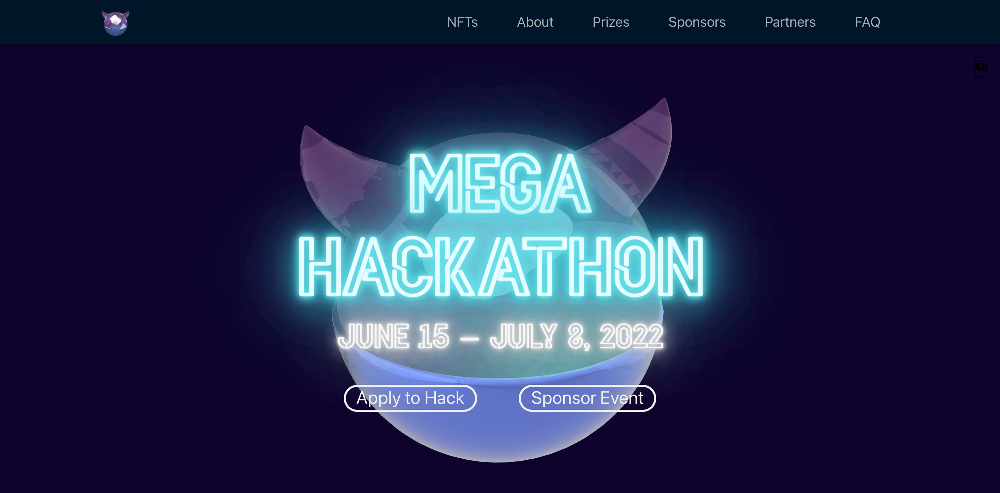
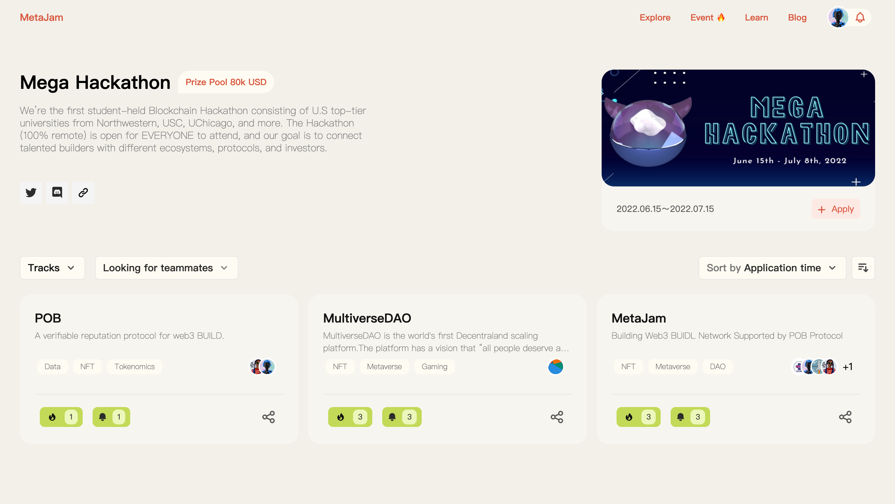
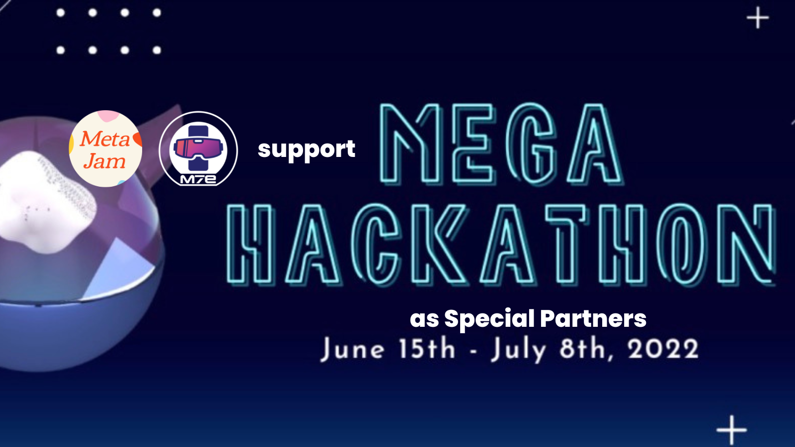

# Mega Hackathon 2022 启动：MetaJam 倾力支持最大高校区块链黑客松

> 明天 6 月 15 日，全美最大学生黑客松活动 Mega Hackathon 2022 正式启动，MetaJam 与 M7e 作为特别合作伙伴倾力支持，Mega Hackathon 专题页面同期正式上线发布 。
>
> Mega Hackathon 官网：https://www.megahackathon.com/

6 月 15 日启动、7 月 8 日收官、为期 4 周的 Mega Hackathon 2022 是由 USC CSSA（南加州大学中国学生学者联合会）和 Northwestern University Blockchain Group（西北大学区块链小组）联合主办的区块链黑客松，也是目前规模最大的高校黑客松 —— 德州大学、帝国理工大学、加州大学欧文分校、剑桥大学、卡耐基梅隆大学、伦敦大学、密歇根大学、牛津大学、纽约大学、乔治亚理工大学、清华大学、香港大学、伊利诺伊大学、芝加哥大学等欧美顶级高校的区块链协会/俱乐部共同参与支持。

Mega Hackathon 设有 8 万美元奖金，平均分配给 4 个赛道：DeFi、NFT、GameFi、Web3。黑客松将 100% 以线上形式进行，以确保来自世界各地的参赛者都能获得公平参与的机会。

Mega Hackathon 致力于为年轻的 builder 和投资人搭建高效的沟通桥梁，为有热情有激情的年轻人提供更多交流合作的机会。黑客松期间也为参赛者准备了一系列相关主题讲座，更有 NFT 抽奖活动、周边 NFT 售卖等福利。

致力于连接 Web3 建设者、打造 Web3 BUIDL Network 的 MetaJam 专门制作推出了 Mega Hackathon 2022 专题页面，为参赛者提供报名通道，并提供项目展示、找人组队、点赞分享、投票评论等社交功能，更好的帮助参赛者从创意构思到项目产品的孵化开发。参赛者可点击页面右上角 Apply 按钮创建项目 Profile 加入。​

MetaJam 具体如何上手？请看视频

任何问题，黑客松参赛者可在以下社交渠道与 MetaJam 联系。

预祝 Mega Hackathon 2022 圆满成功，所有参与者收获满满，WAGMI！

- **MetaJam：** https://www.metajam.studio/
- **推特：** https://twitter.com/MetaJamStudio
- **电报：** https://t.me/+QXy7Qs9LgEFlOTM1
- **Discord：** https://discord.gg/wXtj2UuedP
