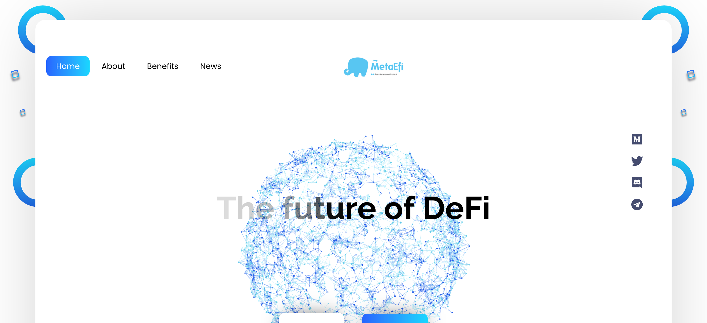
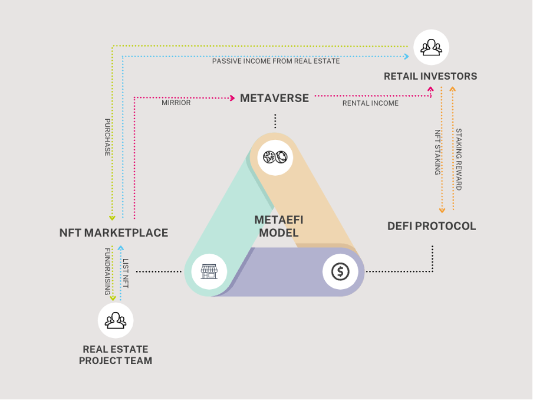
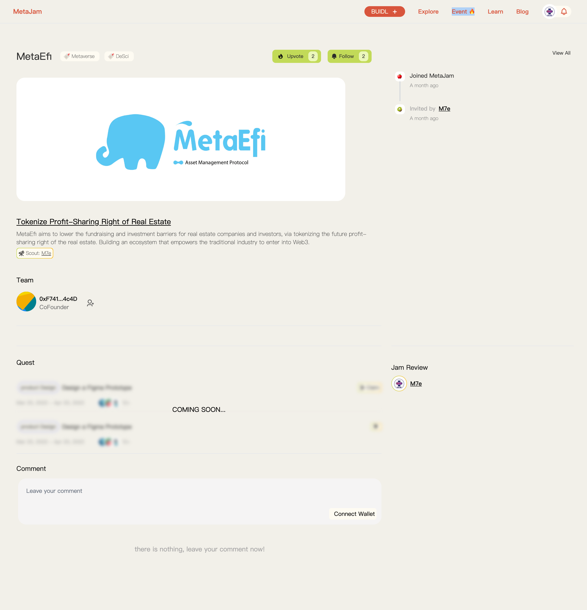
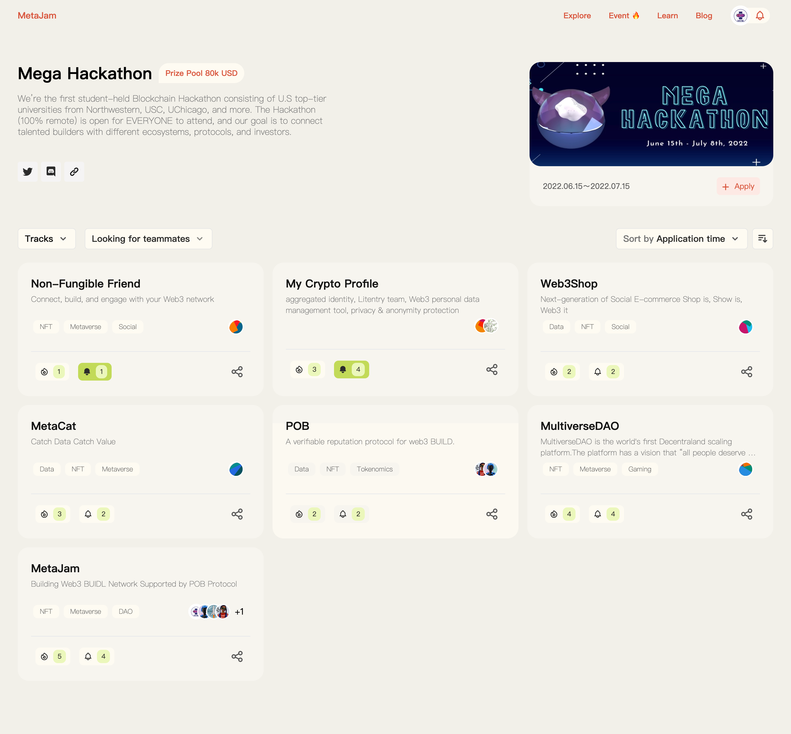

# MetaEfi：构建 Web3 LaaS，连接真实世界与元宇宙房地产 ｜ Jam Review No.14

> 今天，第 14 期 Jam Review 精选推荐 MetaEfi，致力于提供土地即服务（Land-as-a-Service），连接真实世界与元宇宙房地产，帮助传统行业进入 Web3 世界。

## MetaEfi

> **类别：** DeFi
>
> **推荐：** Yiyang
>
> **官网：** https://metaefi.io
>
> **推特：** https://twitter.com/MetaEfi_io
>
> **群组：** https://discord.gg/6TTEXF78KF
>
> **博客：** https://medium.com/metaefi

### 你的产品是做什么的？

我们有两个产品：房地产 NFT 市场和数字孪生元宇宙。MetaEfi 的目标是成为一个土地即服务（Land-as-a-Service）供应商，帮助传统行业进入 Web3 世界。

### 你的产品功能带来什么独特价值？

MetaEfi 作为「土地即服务」供应商提供三重利益：

1. 通过社区代币发行、DeFi 和数字孪生技术，打破了房地产投资回报的玻璃天花板
2. 将营销费用从企业重新分配给客户
3. 通过房地产和建设未来的去中心化社会（DeSoc），为加密原生世界做出贡献

### 你的产品满足或解决了什么需求或问题？

目前存在的问题是：权利过于集中。到目前为止，Web3 的范围在很大程度上局限于权益完全可转让的一小类财产：通证、NFT、艺术品、如首版美国宪法等珍稀手稿。

然而，对可转让性的强调对 Web3 不利，让它无法代表和支持当今一些最简单和普遍的财产合同，如公寓租约。

### 你的产品如何在竞争中脱颖而出？

1. **差异化。** 大多数 Web3 房地产项目侧重于所有权通证化，而 MetaEfi 从利润分享权益入手，加上数字孪生元宇宙和社区通证，让客户同时获得稳定的被动收入和较高的加密回报。
2. **聚焦。** 利润分享权通证化只是土地即服务（LaaS）的前奏，MetaEfi 认为这将是发现现实世界和元宇宙中土地的无限可能性，以及这两个世界之间协同作用的最佳解决方案。

### 你们短中长期的增长路径是什么？

我们为 MetaEfi 规划了三步走的战略计划：

第一步，我们将建立专门用于房地产利润分享权益碎片化的 NFT 市场，并通过数字孪生元宇宙和社区通证释放其多层次的价值。

紧接着是「居住即赚钱」（Live to Earn）。通过向业主提供独特的 NFT，这些加密原生居民将允许他们直接从企业获得营销费用，同时企业也可以通过这些独特的 NFT 准确地锁定他们的客户。

最终的目标是「居住即连接」（Live to Connect）。通过与更多的行业合作，获得信息丰富的 NFT，MetaEfi 将让元宇宙的社会交流更加扁平化，增加 NFT 的社会价值，使之形成去中心化社会的闭环。

欢迎点击 MetaEfi 的项目页面点赞关注、留言评论：https://www.metajam.studio/project/metaefi

更多交流讨论，欢迎加入 MetaJam 社区。

- **MetaJam：** https://www.metajam.studio/
- **推特：** https://twitter.com/MetaJamStudio
- **电报：** https://t.me/+QXy7Qs9LgEFlOTM1
- **Discord：** https://discord.gg/wXtj2UuedP

## 欢迎报名 Mega Hackathon

由 MetaJam、M7e 支持的全美规模最大的高校区块链黑客松 Mega Hackathon 上周三正式启动。点击 Notion 文档了解活动详情：https://www.notion.so/Mega-Hackathon-2022-27db49e65ede4cd38d6c37d3046a8b00

欢迎点击 MetaJam [Mega Hackathon](https://www.metajam.studio/event/mega-hackathon) 活动页面报名参与，你将可以：

1. 发布项目动态，让更多的用户、投资人、合作伙伴了解你的项目
2. 让更多的用户、投资人、合作伙伴来给你的项目点赞留言，社区评论将占最终评选结果的 20% 权重
3. 发布招聘启事，寻找人才加入你的项目
