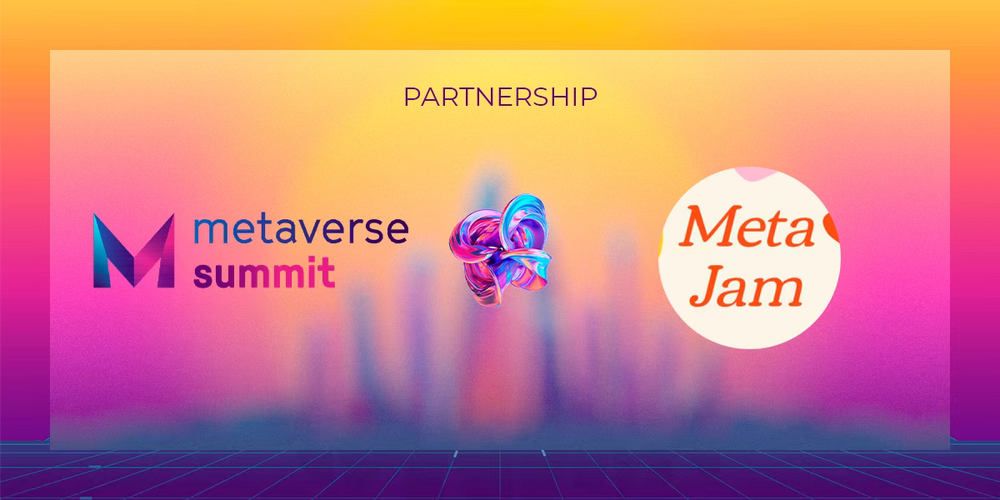
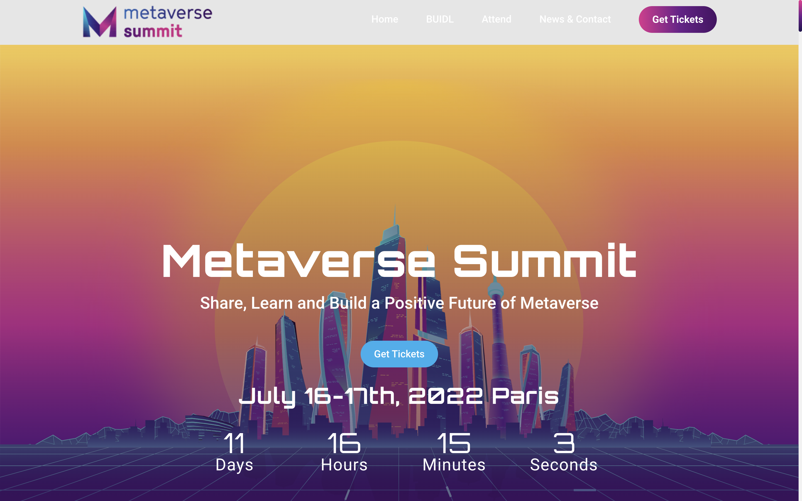
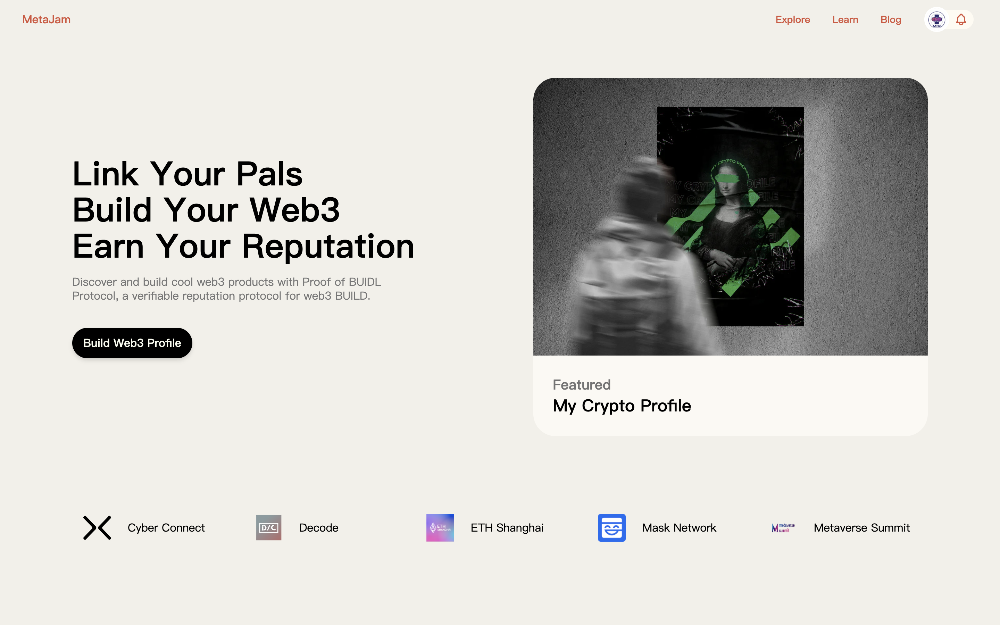

# MetaJam 与 Metaverse Summit 携手合作，为元宇宙项目提供全生命周期服务

> 法国巴黎时间 2022 年 7 月 4 日，MetaJam 和 Metaverse Summit（元宇宙峰会）宣布战略合作，为欧洲游戏产业与元宇宙领域的 BUIDLer（建设者）提供 Web3 项目全生命周期的服务。
>
> Metaverse Summit 官网：https://metaverse-summit.org

## Metaverse Summit：探索和构建元宇宙未来

定于 2022 年 7 月 16 至 17 日在法国巴黎举行的 Metaverse Summit（元宇宙峰会）将来自 3D、VR、AR、Web3 等领域的建设者、企业家、投资人和专家汇聚一堂，从四个方面展示元宇宙在技术、文化、社交和娱乐方面的影响，包括社交和互动性、Web3 和去中心化、游戏与实时 3D、混合现实与虚拟世界等一起分享和交流信息、知识和洞见，共同发现和塑造元宇宙的未来。

为期两天的巴黎峰会活动多样、内容丰富，如一线企业家、投资人和专家的讲座和研讨会。大企业、初创公司和项目将在展厅展示，提供联系和寻找商业机会。

投资者将有机会与 Global Metaverse Startup Competition（全球元宇宙创业大赛）获胜者线下交流，更好的了解元宇宙相关的创新和人才。峰会主办方专辟交流区为为演讲者、赞助商和 VIP 持票者举办一个独家派对。

Metaverse Summit 旨在 Web2 和 Web3 之间建立联系，协助个人和企业为新技术的到来确定其定位和战略。自创建以来，峰会已经聚集了来自世界各地的 10000 多名社区成员，在巴黎、马德里、巴塞罗那、丹佛、迪拜、上海、洛杉矶等地都举办了主题活动，未来还将围绕元宇宙陆续开展更多的活动。

## MetaJam：致力于连接服务元宇宙建设者

致力于建设 Web3 BUIDL 网络的 [MetaJam](https://www.metajam.studio/) 自 5 月上线以来，基于国内知名元宇宙建设者社区 [M7e（元宇宙特攻队）](https://www.m7e.io/)和湾区最大的创新创业社区 [Decode](https://www.decode.build/) 的影响力和资源，吸引了近 200 个中美 Web3 项目入驻，项目和建设者已经开始在组队参加黑客松、曝光推广、人才招募、市场 BD 合作、投融资对接等各需求场景中相互发现、连接和合作。

针对报名参加全球元宇宙创业大赛的 150 个项目以及在巴黎元宇宙峰会现场演示的获胜项目，MetaJam 将制作专题活动页面，为这些项目提供自报名起到峰会现场演示再到峰会闭幕之后的全生命周期服务，让参赛项目与全世界的 Web3 项目、社区用户、投资人和专家交流合作，获得更广泛的接触、曝光、商机与合作。

此外，MetaJam 将协同 M7e、Decode 社区关注推广巴黎元宇宙峰会，并在 Decentraland 元宇宙布设展厅，向来自全世界的元宇宙建设者展示形象、演示最新功能和服务。

- **MetaJam：** https://www.metajam.studio/
- **推特：** https://twitter.com/MetaJamStudio
- **电报：** https://t.me/+QXy7Qs9LgEFlOTM1
- **Discord：** https://discord.gg/wXtj2UuedP
