# 12 强赢家揭晓，Mega Hackathon 2022 圆满收官！

> 今天，MetaJam 与 M7e 倾力支持的 Mega Hackathon 2022 比赛结果最终揭晓！

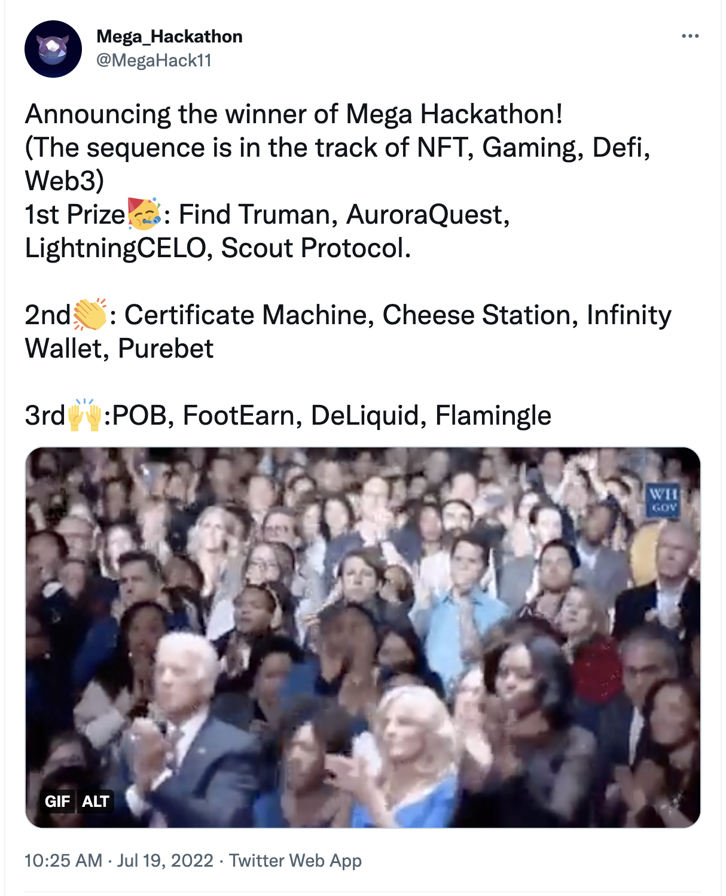

## 4 大赛道 12 强项目诞生

7 月 19 日，全美规模最大的学生区块链黑客松 Mega Hackathon 历时一个多月的线上报名、展示和评审，DeFi、NFT、Gaming、Web3 等四大赛道前三强项目，最终从 41 个报名项目中脱颖而出，正式亮相。

### DeFi

报名项目数：9

**一等奖：** LightningCELO

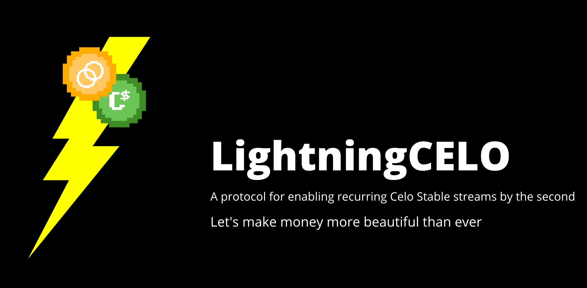

**链接：** https://www.metajam.studio/project/lightningcelo

**简介：** 让你的 $cUSD 像河流一样实时流动，Celo 上的支付流基础设施

**二等奖：** Infinity Wallet

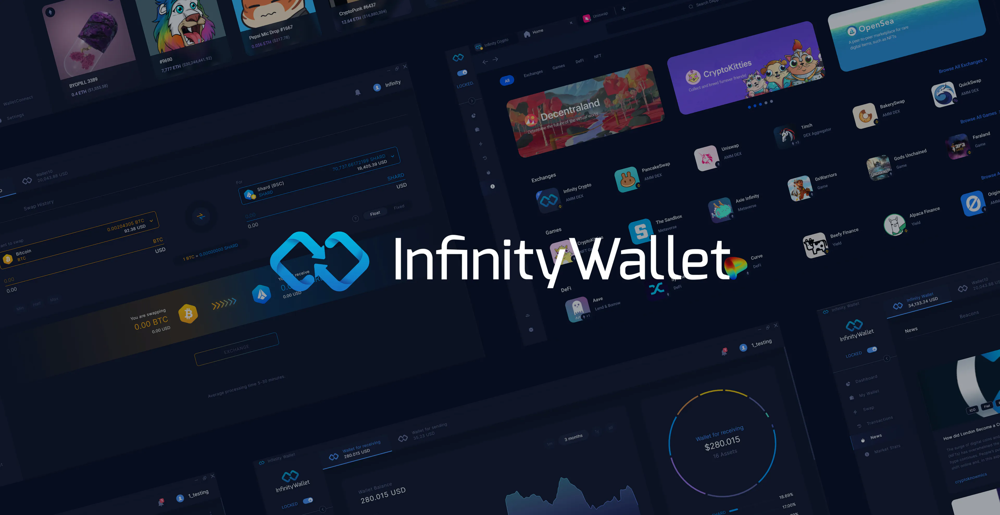

**链接：** https://www.metajam.studio/project/infinity-wallet

**简介：** 第一个桌面一体式钱包平台，专注于为 DeFi 的无缝使用提供一站式解决方案，并进入 Web3 和 DApp 的世界，而无需使用不直观的浏览器扩展钱包。

**三等奖：** DeLiquid

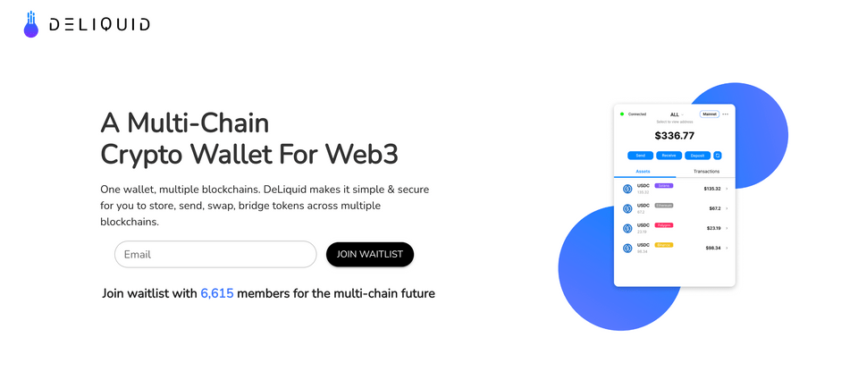

**链接：** https://dorahacks.io/zh/buidl/3133

**简介：** 一个专为 Web3 打造的多链加密钱包，让你在多条区块链上存储、发送、交换、桥接通证变得简单而安全。

### NFT

报名项目数：9

**一等奖：** FindTruman

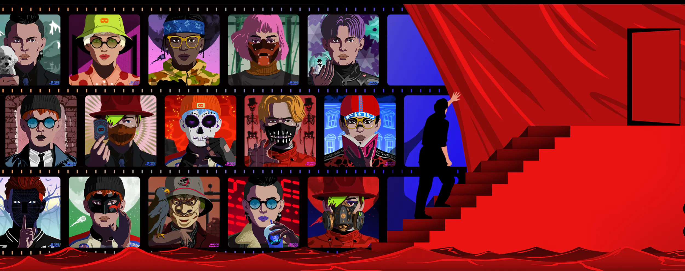

**链接：** https://www.metajam.studio/project/findtruman

**简介：** 首个元宇宙剧本杀游戏。FindTruman 的创始团队来自一个在移动 APP 上拥有 3000 万注册用户的剧本杀游戏应用，FindTruman 试图打造专注于用户生成的内容来制作故事的共创平台。

**二等奖：** Certificate Machine

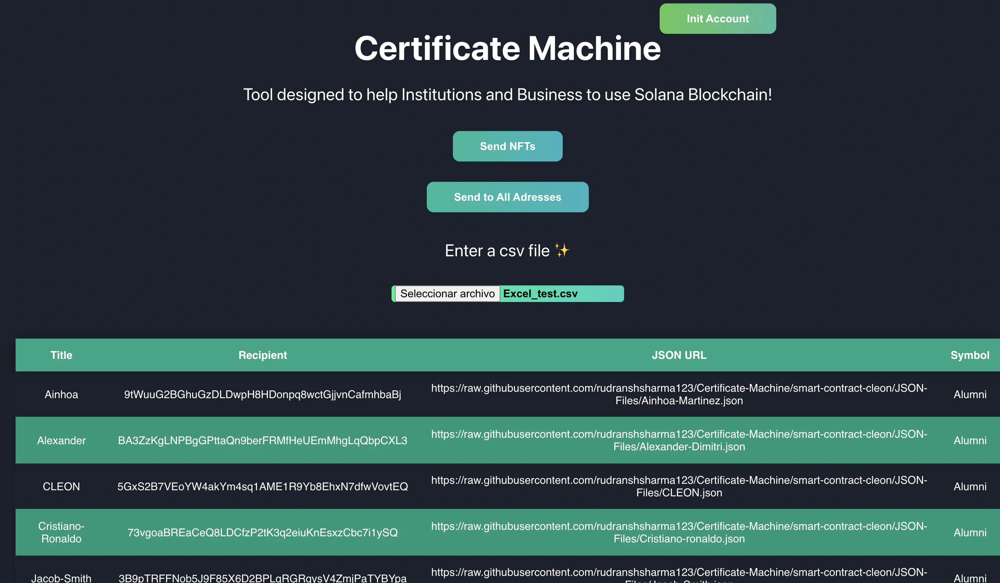

**链接：** https://www.metajam.studio/project/certificate-machine

**简介：** 基于 Solana 链构建，帮助组织和教育机构用 NFT 形式颁发证书。这一使用 Anchor Sealevel 框架的程序允许用户上传一个 CSV 文件，让它铸造并发送 NFT 给文件中提到的用户。

**三等奖：** POB

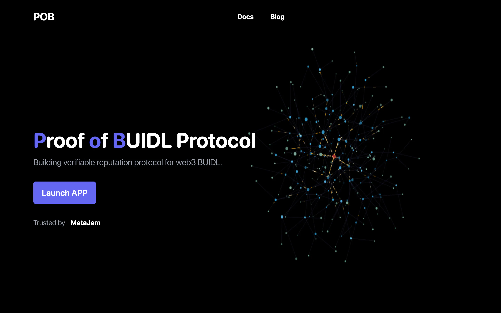

**链接：** https://www.metajam.studio/project/pob

**简介：** POB 协议是围绕 Web3 BUIDL 构建的去中心化工作流协议，用户通过智能合约和验证节点网络发布、领取、提交和验证任务，所有数据都存储在公链和去中心化存储网络上。每个工作流程都支持 Soulbound Token 作为基于 BUIDL 的验证，这构成了可验证声誉系统。

### Gaming

报名项目数：9

**一等奖：** AuroraQuest

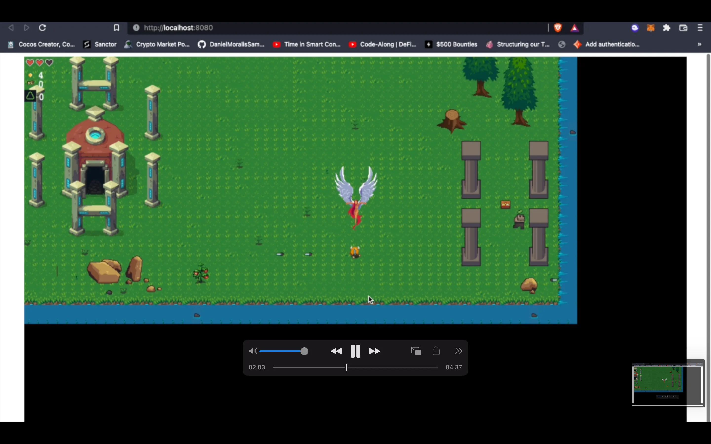

**链接：** https://www.metajam.studio/project/auroraquest

**简介：** 由 NEAR Aurora 测试网支持的，玩赚的角色扮演 NFT 游戏 + 原生 NFT 市场。游戏基于地牢，让玩家能够与守卫箱子的怪物战斗，并从箱子中获得 ERC-20 通证的战利品。市场让玩家可以在游戏中购买 NFT 角色并装备它们。

**二等奖：** Cheese Station

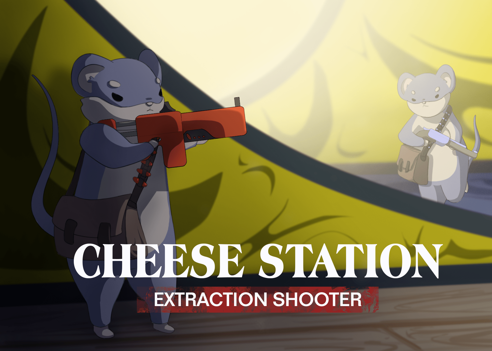

**链接：** https://dorahacks.io/zh/buidl/3132

**简介：** 玩家对决举枪射击游戏，基于「谁动了我的奶酪？」在一个不断发展和持续的世界中，你的装备是在线的。带着你最好的枪支进入并试图带着更多的枪支离开，要么失去所有。

**三等奖：** FootEarn

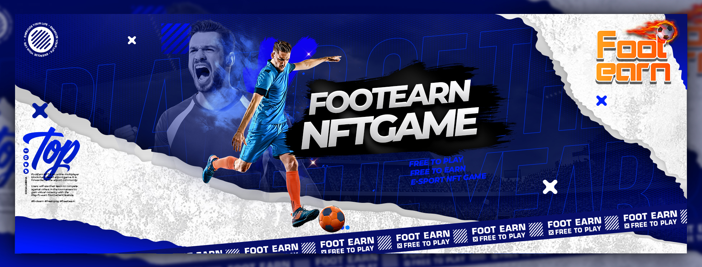

**链接：** https://dorahacks.io/zh/buidl/3084

**简介：** FootEarn 具有引人入胜和易于理解的游戏性，吸引了所有年龄、性别和国家的游戏者。此外，在多人游戏模式中，用户可以直接在锦标赛中相互竞争并获得奖品。

### Web3

报名项目数：14

**一等奖：** Scout Protocol

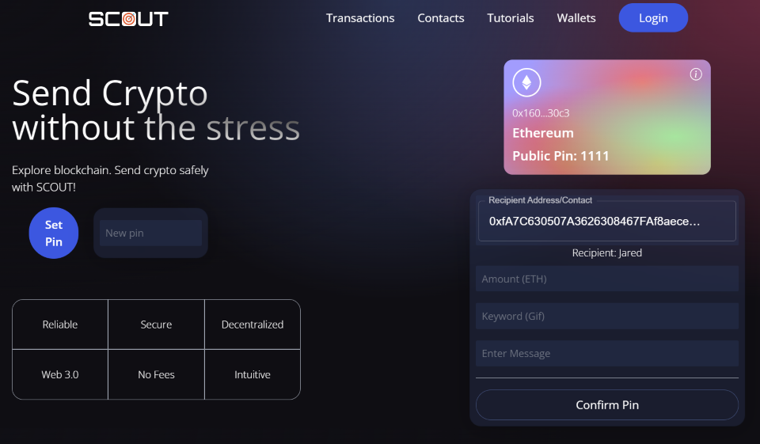

**链接：** https://dorahacks.io/zh/buidl/3125

**简介：** 首创的直观、去中心化的平台，以改善加密货币的支付体验。

**二等奖：** Purebet

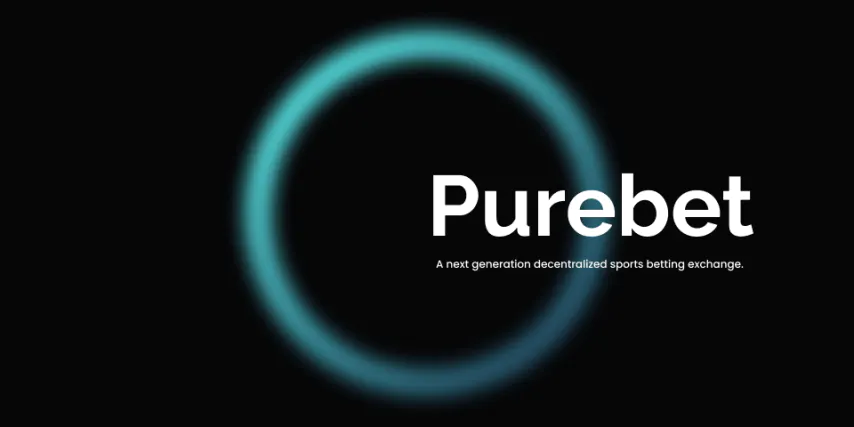

**链接：** https://www.metajam.studio/project/purebet

**简介：** 基于 Solana 区块链构建的去中心化、非托管的博彩交易所，由体育博彩者为同行从头开始定制，提供最佳的使用体验。

**三等奖：** Flamingle

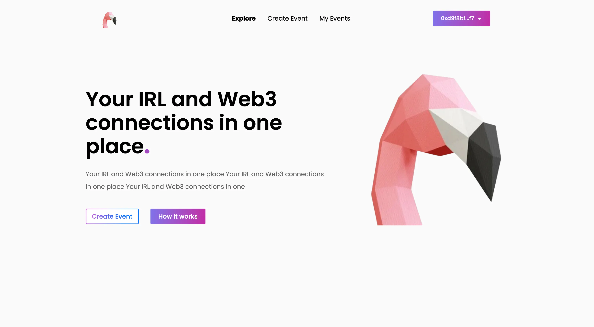

**链接：** https://www.metajam.studio/project/flamingle

**简介：** 第一个通过现实生活连接去中心化身份的 Web3 社交应用，提供一站式 Web3 活动管理解决方案，包括空投和通证限入的派对，以及允许用户从那里建立联系的社交功能。

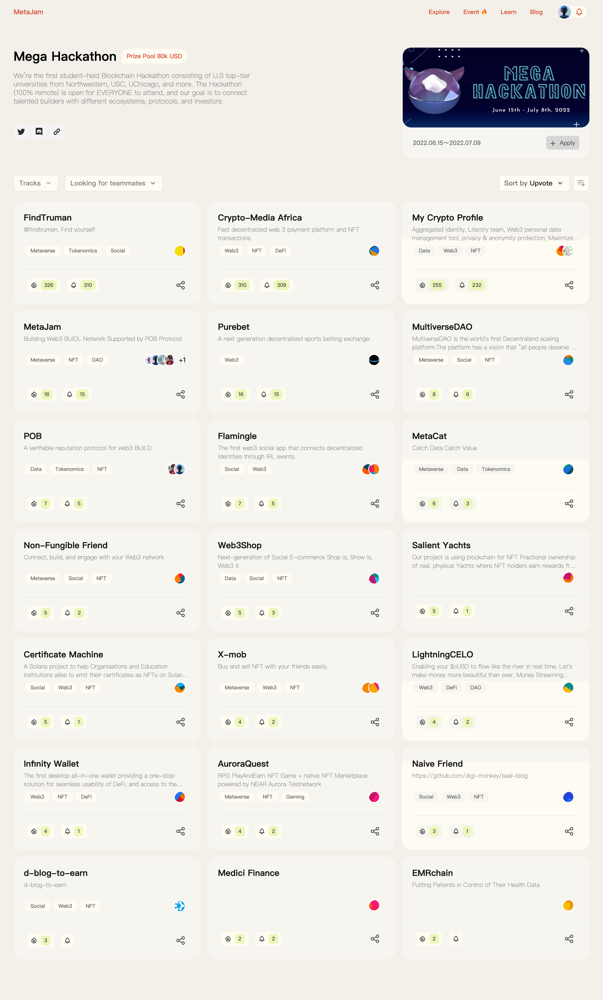

此次 Mega Hackathon 总共有 41 个项目分别通过 DoraHacks 和 MetaJam 两大通道报名参赛，争夺主办方为 4 个赛道设立的各自 2 万、总额 8 万美元的奖金。最终，4 个通过 DoraHacks 报名由经专业评委 100% 评审决定的项目和 8 个通过 MetaJam 报名经专业评委 80% 权重评审和社区 20% 权重投票决定的项目产生。

## MetaJam 将持续支持 Mega Hackathon 参赛项目

致力于连接 Web3 建设者、打造 Web3 BUIDL Network 的 MetaJam 为 Mega Hackathon 2022 专门发布了活动页面，为参赛者提供项目展示、找人组队、点赞分享、投票评论等功能。赛后将持续帮助支持包括 12 强在内的所有报名参赛项目，让项目从创意构思到项目孵化、产品开发全生命周期的获得更好的帮助。

## 关于 Mega Hackathon

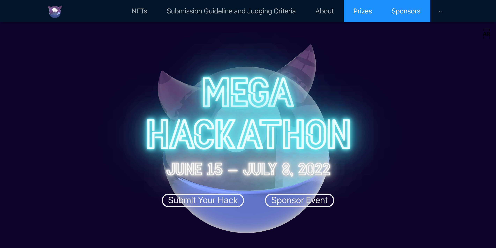

6 月 15 日启动、7 月 8 日收官、为期 4 周的 Mega Hackathon 2022 是由 USC CSSA（南加州大学中国学生学者联合会）和 Northwestern University Blockchain Group（西北大学区块链小组）联合主办的区块链黑客松，也是目前由高校学生主办的规模最大的黑客松活动 —— 德州大学、帝国理工大学、加州大学欧文分校、剑桥大学、卡耐基梅隆大学、伦敦大学、密歇根大学、牛津大学、纽约大学、乔治亚理工大学、清华大学、香港大学、伊利诺伊大学、芝加哥大学等欧美顶级高校的区块链协会/俱乐部共同参与支持。

- **MetaJam：** https://www.metajam.studio/
- **推特：** https://twitter.com/MetaJamStudio
- **电报：** https://t.me/+QXy7Qs9LgEFlOTM1
- **Discord：** https://discord.gg/wXtj2UuedP
