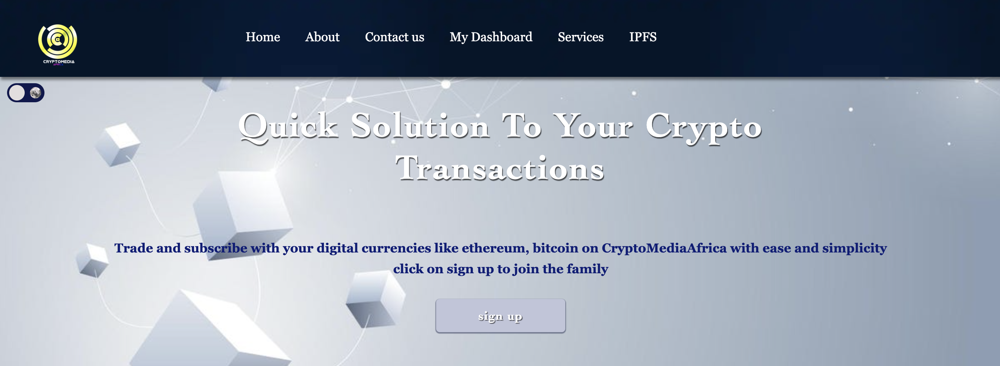
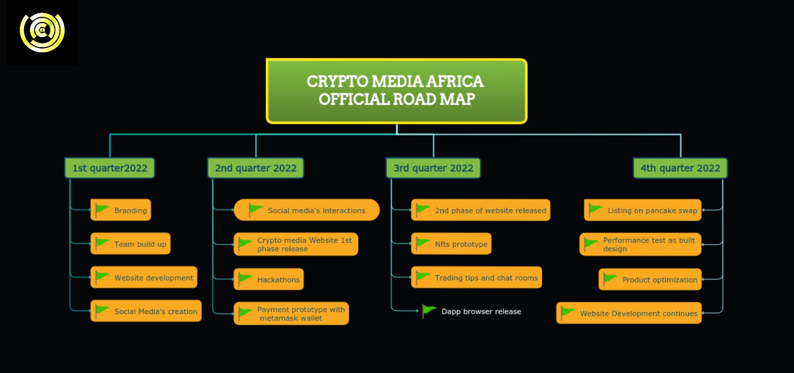
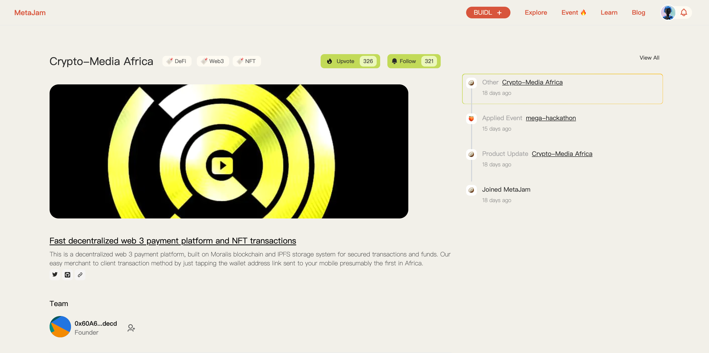

# Crypto Media Africa：非洲第一个去中心化 Web3 支付平台｜ Jam Review No.15

> 今天，第 15 期 Jam Review 推荐一个非洲 Web3 项目 Crypto Media Africa，在日前结束的 Mega Hackathon 社区投票中排名第二。
>
> 虽然，Crypto Media Africa 最终未能获奖，但通过这个项目，大家对非洲的加密市场和行业能够形成一个初步的印象。

## Crypto Media Africa

> **类别：** DeFi
>
> **推荐：** Mega Hackathon
>
> **官网：** https://cryptomediafrica.com
>
> **推特：** https://twitter.com/cryptoMediAfric
>
> **群组：** https://t.me/Cryptomediafrica

### 你的产品是做什么的？

Crypto Media Africa 是非洲第一个建立在以太坊区块链平台上的、快速的、去中心化的 Web3 支付平台。在使用 Metamask 或 WalletConnect 钱包时，可以轻松实现以太坊区块链交易，我们的服务没有特定时期，因为我们希望通过我们简单的商家对客户的交易方式，只需点选发送到你手机上的钱包地址链接，就可以连接整个世界。

### 你的产品功能带来什么独特价值？

- 商家对客户的交易方式，只需点击发送到你手机上的钱包地址链接。
- 通过我们的平台，用户只需一键就可以订阅 Netflix、Dstv 和移动充值等套餐。
- 交易指南：无需更多网上冲浪搜寻吗，即可找到可质押或挖矿的通证 —— 真正的空投。

### 你的产品满足或解决了什么需求或问题？

- Crypto Media Africa 解决在非洲例如加密不是一项好投资的错误信息问题。
- 去除在线支付交易存在中间商的原始方式。
- 向用户介绍加密货币的好处，以及它对投资和在线交易的重要性。
- 使用 IPFS 存储系统来存储用户的数据，保留所有使用我们产品进行交易的跟踪记录。没有资金损失。
- 许多年轻有才华的艺术家不知道如何出售他们的艺术品，可以联系 Crypto Media Africa 帮助铸造 NFT。

### 你的产品如何在竞争中脱颖而出？

- 网站提供非常快速可靠的交易体验和一个用户友好的界面。
- 双因子认证，最大限度保护用户账户免受黑客攻击。
- 24 小时畅通、快速积极的客服回复。
- 点对点服务。
- 无广告。
- 聊天室。
- 商家对客户的交易方法，只需点击发送到你手机上的钱包地址链接，估计是非洲第一个。

### 你们短中长期的增长路径是什么？

以下为创始人自述——

「我在这个领域已经有几年时间了。在这最初的几年里，我必须在工作中获得知识和经验。从一个普通的网站开发者和图形设计师到一个区块链开发者。

『作为一个初学者，我的短期目标发挥了重要作用，它有助于塑造我的职业道路。我有五年的加密经验，我看到了加密货币带来的好处，所以我决定为感兴趣的学生组织一个免费教程，介绍加密货币的工作原理。

「我的中期目标是拥有一所加密学校，在那里我向感兴趣的学生启蒙加密货币的重要性。

「我的长期发展目标是闯入加密领域，我已经是一名开发者，所以我决定升级为区块链开发人员。首先，通过创建一个每个人都可以访问的网站，让大家对加密货币有更多的了解，我现在需要一些能够帮助我完成这个任务的合作伙伴。我们就是这样从 Crypto Media Africa 这个项目开始的。现在，我们像其他项目一样对创建我们自己的通证感兴趣。

「实际上，我们正处于项目路线图的第二季度，我们正在取得进展。为此，我们感谢上帝。」

欢迎点击 Crypto Media Africa 的项目页面点赞关注、留言评论：https://www.metajam.studio/project/crypto-media-africa

更多交流讨论，欢迎加入 MetaJam 社区。

- **MetaJam：** https://www.metajam.studio/
- **推特：** https://twitter.com/MetaJamStudio
- **电报：** https://t.me/+QXy7Qs9LgEFlOTM1
- **Discord：** https://discord.gg/wXtj2UuedP
