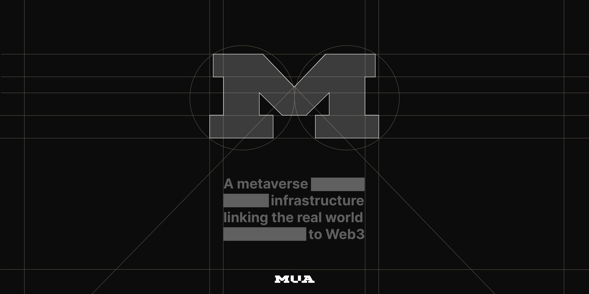
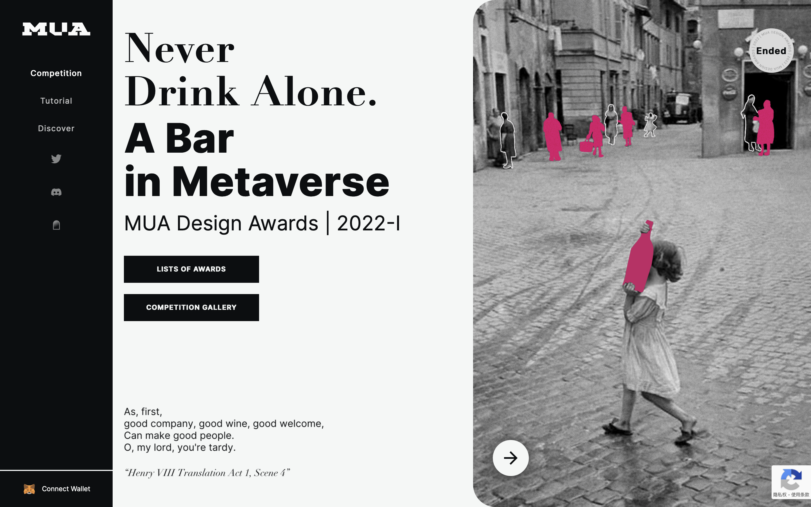
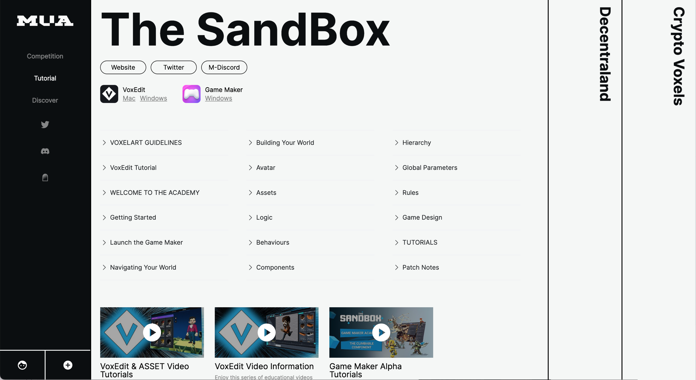
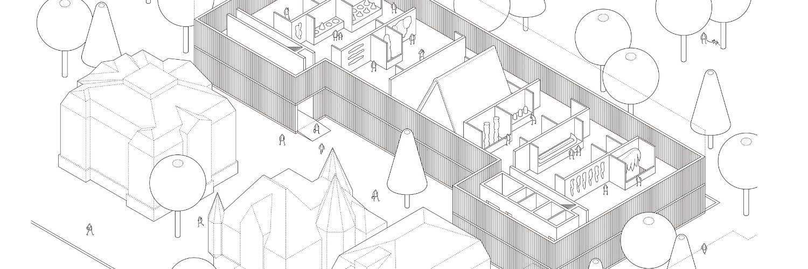
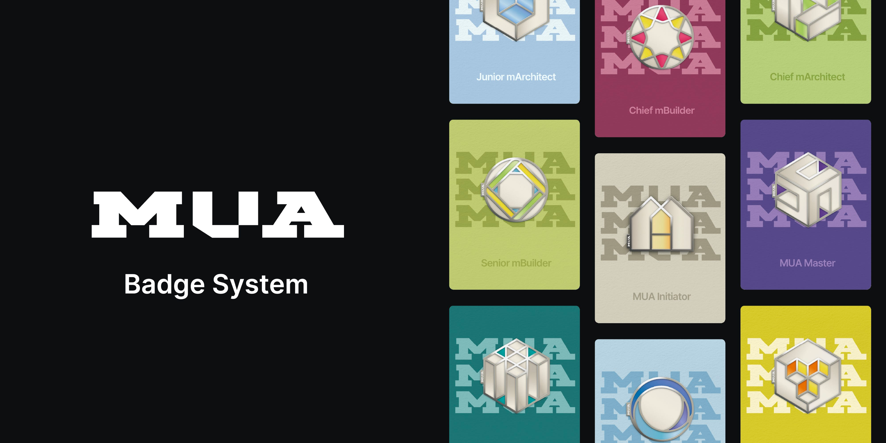
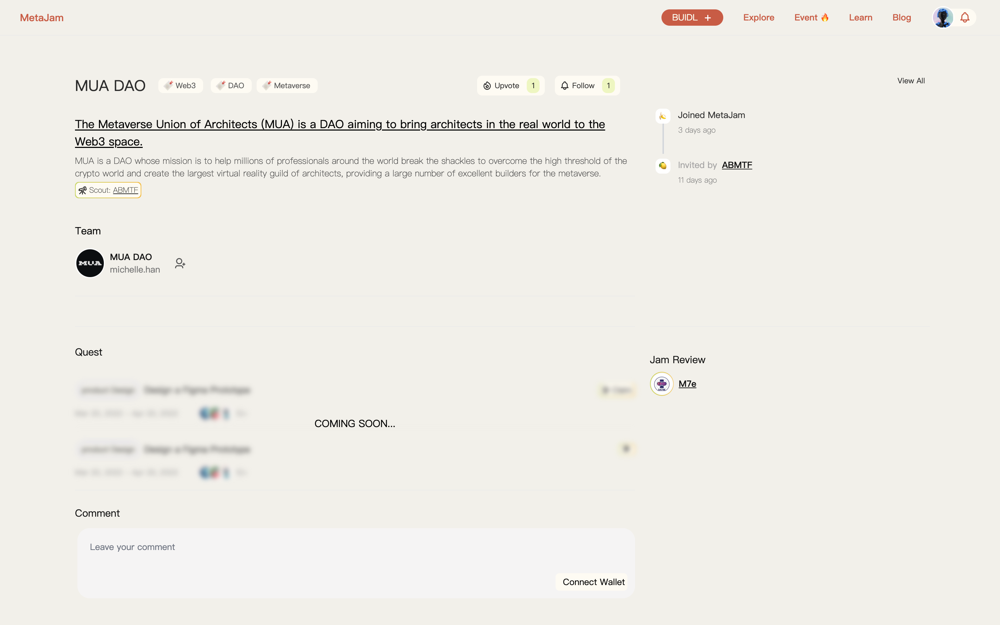

# MUA DAO：打造最大的元宇宙建筑师公会｜ Jam Review No.16

> 今天，第 16 期 Jam Review 精选推荐 MUA DAO，一个立志打造最大的元宇宙建筑师公会。

## MUA DAO

> **类别：** 元宇宙、DAO
>
> **推荐：** Ryan
>
> **官网：** https://muadao.build/
>
> **推特：** https://twitter.com/MUA_MUADAO
>
> **群组：** https://discord.gg/mua-dao
>
> **博客：** https://mirror.xyz/0x801c3CcA3B6c2DE71C44d40814C2fc10dc21eB8E

### 你的产品是做什么的？

**元宇宙建筑师联盟（Metaverse Union of Architects，缩写 MUA）** 是一个去中心化的自治组织（DAO），其使命是帮助全球数百万专业人士打破桎梏，突破加密世界的高门槛，创建最大的虚拟现实建筑师公会，为元宇宙提供大量的优秀建造者。

我们将与更多的公司和项目合作，满足新的需求，解决痛点，优化社区拥有的资产以实现最大效用，并与社区成员分享利润。

我们要实现的最终愿景是聚集越来越多的房地产相关资源和流量，作为有影响力的元宇宙房地产的基础设施，连接现实和未来世界。

### 你的产品功能带来什么独特价值？

- **以优秀创作者为核心的元宇宙资产价值助推器：** MUA 是一个元宇宙内容创作者的行业公会，引导和聚集现实世界中经过专业培训的内容创作者在元宇宙中发挥自己的优势。我们的价值累积生态系统在元宇宙的有机和强劲增长将通过一个基于工具的服务提供商系统，一个跨链、跨平台的元宇宙资产交易平台，以及一个作为高质量 NFT 广泛分布网络的发布平台来实现。
- **土地资产价值助推器：** 我们导入高质量定向内容，为元宇宙项目构建一个繁荣的生态系统。个人土地所有者可以通过将闲置的土地资产质押在创收平台上赢得通证奖励，也可以通过出租自己的土地获得商业租金收入。
- **商业推广的完整解决方案：** 我们支持品牌或企业以最小的成本，在元宇宙利用先进的数字广告技术拓展业务。高质量内容创作者社区的影响力将同时为企业带来额外的流量。
- **建筑服务商：** 建筑服务商通过通俗易懂的介绍性课程、工具和不同主题的建筑竞赛，引入大量优秀的建筑服务商。我们还建立一个平台，推荐高质量的工程和高素质的建筑师。

### 你的产品满足或解决了什么需求或问题？

MUA 正在应对以下关键挑战：

1. 来自土地所有者的挑战。元宇宙项目通常难以快速聚集内容创作者，并为土地 NFT 累积价值。而个人土地所有者没有时间或精力来构建，最重要的是，没有平台来满足他们从其虚拟财产中获利的需求。
2. 来自企业主的挑战：做生意的成本太高，没有平台可以帮助人们快速找到土地资产租赁。
3. 来自服务提供者的挑战：从业人员严重短缺，缺乏客户来源。没有平台可以展示他们的作品。
4. 来自交易痛点的挑战：没有交易平台来实现短期在线租赁。传统的交易过程很原始，需要高度的信任，区块链解决了这个问题。而且很难在多个区块链和元宇宙平台。

### 你的产品如何在竞争中脱颖而出？

- MUA DAO 为在元宇宙中寻求房地产服务的客户提供一站式服务。
- MUA DAO 通过聚合多个元宇宙房地产租赁信息和推荐顶级建筑服务供应商，为客户节省时间。
- MUA DAO 提供了一个由智能合约支持的公开、透明、可信的交易平台，以降低交易成本。

### 你们短中长期的增长路径是什么？

MUA DAO 通过工具方+专业社区的结合，参与不同元宇宙项目的更深入开发合作。我们通过与各知名 IP 联名举办 MUA 设计奖，吸引专业设计师进入社区，然后引导他们使用 MUA 徽章系统中嵌入的元宇宙通用编辑器，与社区分享不同元宇宙平台上的大规模开发，并享受土地运营的好处。

欢迎点击 MUA DAO 项目页面点赞关注、留言评论：https://www.metajam.studio/project/mua-dao

更多交流讨论，欢迎加入 MetaJam 社区。

- **MetaJam：** https://www.metajam.studio/
- **推特：** https://twitter.com/MetaJamStudio
- **电报：** https://t.me/+QXy7Qs9LgEFlOTM1
- **Discord：** https://discord.gg/wXtj2UuedP
