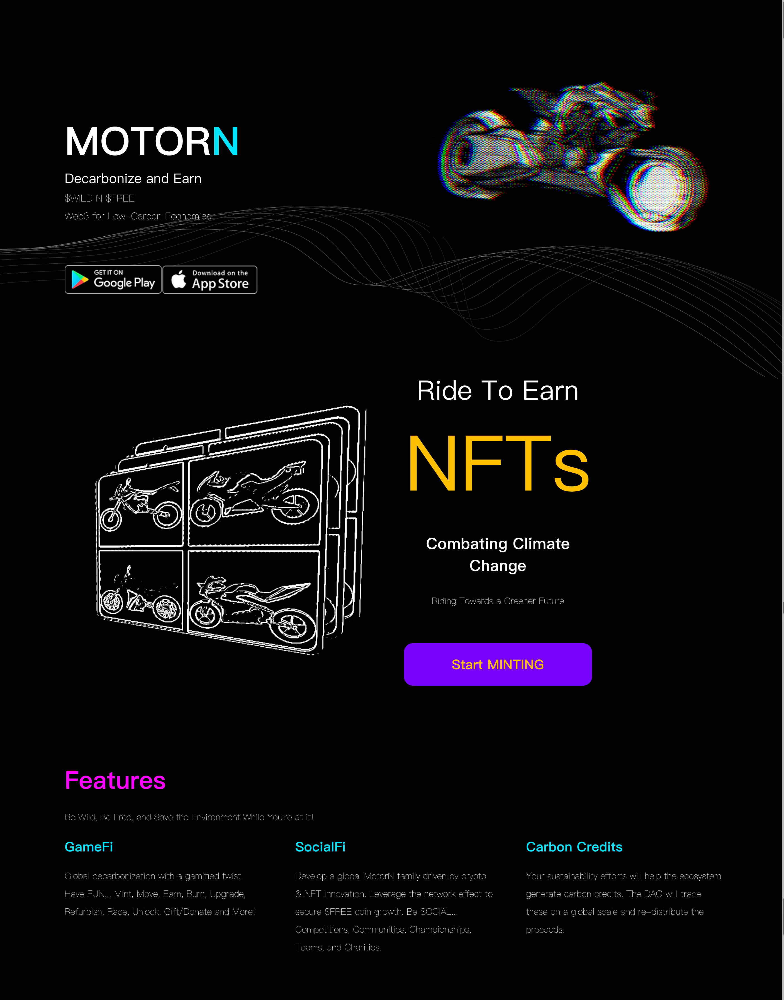
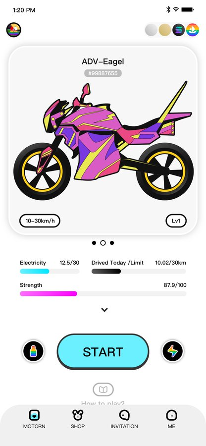
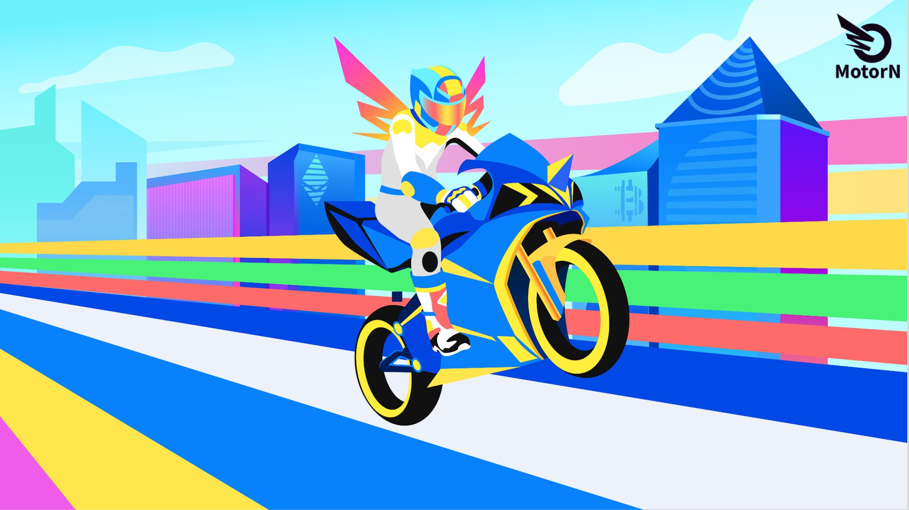
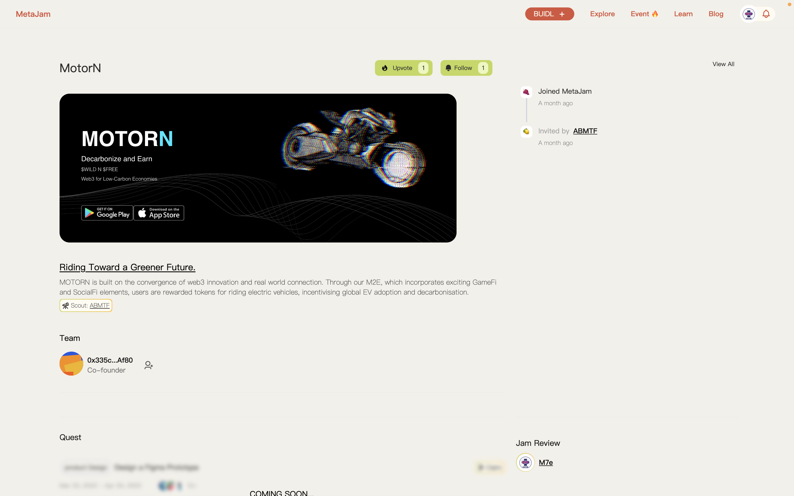

# MotorN：奖励单车用户帮助世界脱碳 ｜ Jam Review No.17

> 今天，第 17 期 Jam Review 精选推荐 MotorN，一个 Web3 运动赚钱（move-to-earn）应用，旨在奖励单车用户帮助世界脱碳。

## MotorN

(video)

> **类别：** GameFi，ReFi
>
> **推荐：** Ryan
>
> **官网：** http://motorn.io/
>
> **推特：** https://twitter.com/motorWeb3
>
> **群组：** https://discord.gg/4n9wSVZf46
>
> **博客：** https://medium.com/@MotorN_Official

### 你的产品是做什么的？

MotorN 是一个 Web3 运动赚钱（move-to-earn）应用，旨在奖励电动车用户帮助世界脱碳。我们的 GameFi 和 SocialFi 元素将为对许多人来说可能变得乏味的通勤带来激动人心的元素。

在我们路线图的后期阶段，MotorN 寻求向制造商提供自己的 API，并制造拥有自己专利的区块链单车。用户骑着他们的电动车能够体验到 Web 3 和现实世界之间的独特融合，因为他们的电动摩托车 NFT 反映了他们的实体车的情况，例如能源消耗等。

碳交易也是该项目不可缺少的一部分，我们用户的脱碳努力将获得回报，因为我们将大部分收益返还给生态。

### 你的产品功能带来什么独特价值？

我们的价值来自于我们对汽车/运输业整个价值链的把握能力。在早期阶段，我们的 GameFi 和 SocialFi 针对消费者，让我们能够不断创新，并利用可产生的大量数据改进行业。再往下，我们生产的实体单车和发布的车辆 API 将我们置于制造商的产业链中，加上我们在下游的用户忠诚度，我们将作为生产者和影响者对上游产生主导权。我们的市场机会是巨大的，我们的价值来自数十亿的摩托车骑手或汽车司机，他们可能寻求更多的收入或帮助世界脱碳。例如，每天从马来西亚到新加坡的 27 万通勤者将是很好的开始。

### 你的产品满足或解决了什么需求或问题？

目前，在所有部门中，交通对化石燃料的依赖程度最高，占全球终端用户二氧化碳排放量的 37%，令人震惊。不幸的是，今天快速增长的运输需求所产生的排放不能被迟缓的可再生能源吸收所抵消，这对我们的环境产生了灾难性的影响。

通过我们的「骑行赚钱」功能，结合令人兴奋的 GameFi 和 SocialFi 元素，用户通过骑行电动车获得通证奖励，激励全球电动车的普及和去碳化。

此外，我们的目标是通过我们的 GameFi 和 SocialFi 元素减少每天上下班通勤的「乏味」和「苦差事」的性质。

### 你的产品如何在竞争中脱颖而出？

我们的业务因为将 Web3 与物理世界相融合而与众不同。虽然其他运动赚钱应用是纯粹的 GameFi，没有实体内容，但我们的长期成功是通过自有的实体区块链电动单车和 API 来提高的。我们的生态系统得到了实体车辆销售和 API 销售的支持，这使得用户可以将他们的 APP 与车辆的电池管理系统连接起来。此外，我们能够通过消费者拥有的最昂贵的物联网产品 —— 车辆来获取宝贵的数据。这使我们能够不断创新和改进，也有助于行业和许多互补性行业的整体进步。这些数据也使我们能够准确地计算出我们用户的碳抵消，这些数据将被审计，并将用于产生世界各地政府的碳积分。这使得碳积分交易成为我们商业模式的一部分，因为我们创造了共享价值，而不是像我们的竞争对手那样只是为了企业社会责任。

### 你们短中长期的增长路径是什么？

短期内，我们的目标是首先在全球内发展我们的社区，覆盖所有骑任何单车的用户，无论是否是电动车。中期内，随着我们全球社区的发展，我们的目标是利用我们的网络效应，发展我们的 SocialFi 功能，在全球范围内实现诸如比赛等。从中长期来看，我们寻求发布我们自有专利的区块链电摩托车和汽车制造商 API，这能让我们用户可以将他们的 APP 与这些车辆无缝连接。用户体验达到新的高度，因为我们的创新和融合 Web 3 与物理世界及物理世界的效用。

欢迎点击 MotorN 项目页面点赞关注、留言评论：https://www.metajam.studio/project/motorn

更多交流讨论，欢迎加入 MetaJam 社区。

- **MetaJam：** https://www.metajam.studio/
- **推特：** https://twitter.com/MetaJamStudio
- **电报：** https://t.me/+QXy7Qs9LgEFlOTM1
- **Discord：** https://discord.gg/wXtj2UuedP
