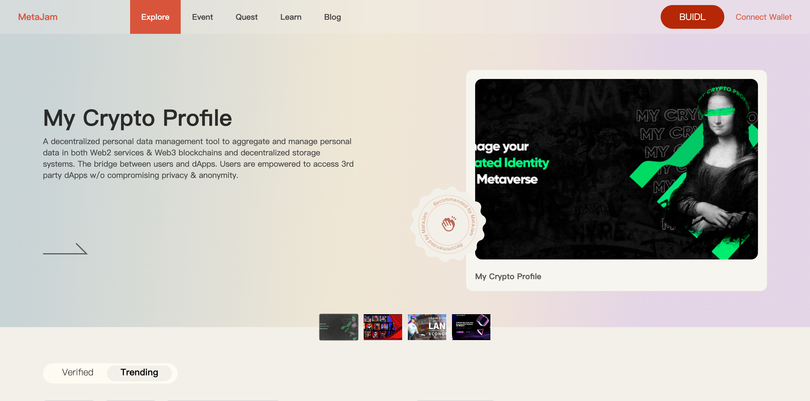

# MetaJam 全新首页亮相：帮助你在 Web3 中探索、连接和建设，并获取链上声誉与奖励

> 今天，每一位全身心拥抱 Web3 的朋友都能通过 MetaJam 第二次改版的主页来探索发现最新最多的 Web3 项目。

首先，让我们来看看新主页最吸引眼球的首屏部分 —— 不再是上一个版本的产品定位描述，而是 MetaJam 定期推荐最酷的 Web3 产品或项目、平台支持的最新黑客松活动，以及 Builder 用户发布的最具吸引力的任务（Quest）。

现在到了 MetaJam 最新版探索（Explore）页面中最激动人心的核心部分：

- 你可以滚动浏览入驻 MetaJam 的验证项目，以及根据社交媒体影响力选择的热门项目。
- 你还能按照赛道、活动、项目创建时间、点赞和关注者数量，以及哪些项目正在寻找队友等过滤条件查看项目。
- 右上角的「Popular」让你了解有哪些基于点赞等指标生成的最受欢迎项目。
- 「Numbers in Total」告诉你目前在 MetaJam 平台上有多少项目可以探索，有多少用户关注他们喜欢的项目，有多少人参与发布、认领和审核链上任务，以及发布的任务提供了多少奖励。
- 还可以浏览 MetaJam 上正在进行的任务（任务的新功能将在几天后的下一个产品更新中揭晓介绍）。
- MetaJam 上任何你感兴趣的项目。用户可以喜欢（Upvote）或/和关注（Follow）。

最新发布的主页为 MetaJam 的价值主张开启了第一步，即帮助我们的 Builder 用户相互发现、相互连接，共同在 Web3 建设创造，并获取奖励、构建自己在链上的声誉。

- **MetaJam：** https://www.metajam.studio/
- **推特：** https://twitter.com/MetaJamStudio
- **电报：** https://t.me/+QXy7Qs9LgEFlOTM1
- **群组：** https://discord.gg/wXtj2UuedP
