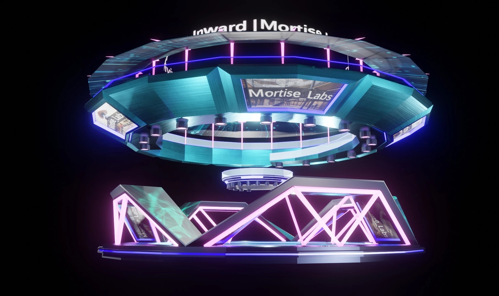
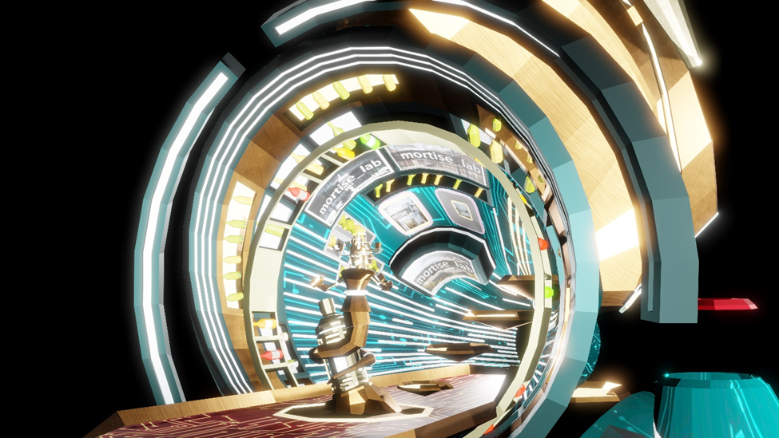
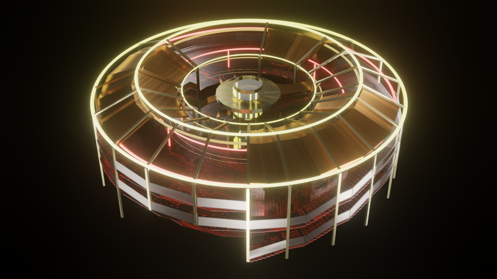
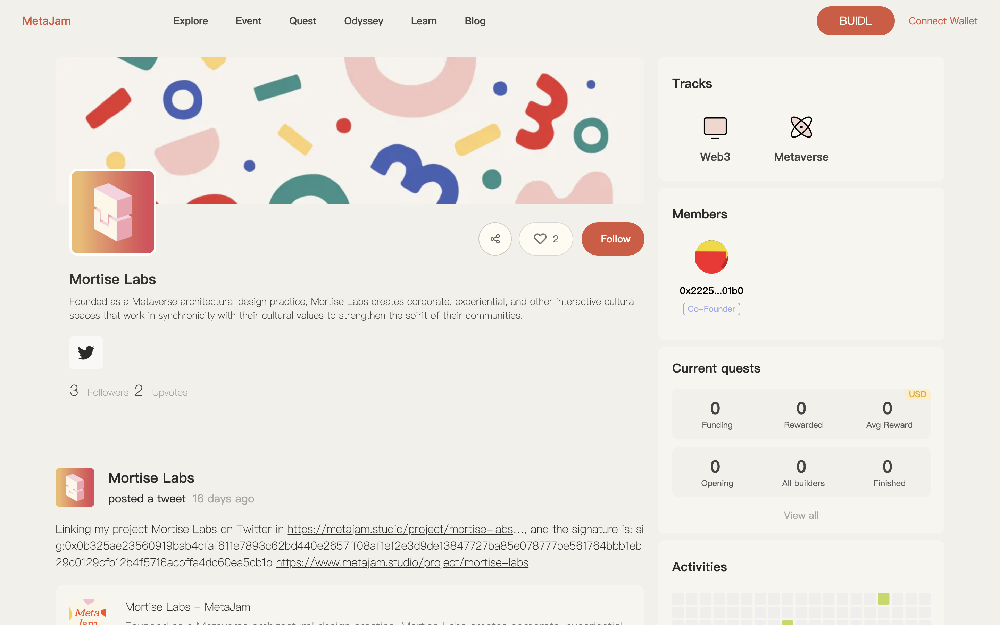

# Mortise Labs：力争元宇宙建筑设计新标杆｜ Jam Review No.18

> 今天，第 18 期 Jam Review 精选推荐 Mortise Labs，专注于为企业和社群提供元宇宙建筑开发设计的服务商。

## Mortise Labs

(video)

> **类别：** Metaverse
>
> **推荐：** Ryan
>
> **官网：** https://www.mortiselabs.io/
>
> **推特：** https://twitter.com/Mortise_Labs
>
> **博客：** https://medium.com/@Mortise_Labs

### 你的产品是做什么的？

Mortise Labs 专注于为企业及社群提供元宇宙建筑开发服务。

通过丰富元宇宙空间场景及内容建设，例如提供元宇宙空间内用地规划、地标建筑设计、知名 IP 引入、活动策划、场景设计等服务，Mortise Labs 将元宇宙互动式空间成为我们客户的文化价值在新维度的延伸，从而加强客户社区的凝聚力。

Mortise Labs 立足数字空间开发，通过行业顶级的设计赋能企业社群形象的传播性、体验性以及交互性，帮助客户在数字经济时代中腾飞翱翔。

### 你的产品功能带来什么独特价值？

我们的创新实践正在成为元宇宙建筑设计领域的新标杆。

作为建筑设计和数字化的新时代先锋，Mortise Labs 专注于将客户的文化价值与它的互动视觉体验同步。我们所提供的定制化设计服务，通过空间设计、交互设计、活动策划等方式，帮助客户成为横跨所有元宇宙平台转型的最佳典范。

_悬浮画廊 Hovering Gallery_

### 你的产品满足或解决了什么需求或问题？

目前市面上能够真正满足品牌和机构需求的元宇宙空间设计服务少之又少，Mortise Labs 为建筑实践在数字时代下如何最好地为客户赋能，正在探索一条全新的道路。

现有的元宇宙空间产品普遍存在「脸谱化」和「伪元宇宙」等问题。设计机构由于自身设计能力的缺失以及对客户空间需求理解的不充分，导致市面上大量「一稿多用」的情况，最终产品同质化严重，无法反映出客户的品牌特点和需求。其次，由于元宇宙概念的火爆，众多缺乏交互设计且理念过时的产品被重新包装成「元宇宙产品」以次充好，其效果和体验完全无法表达元宇宙空间的创新性与优越性。Mortise Labs 的出现完美的填补了元宇宙空间设计领域的空缺。

_BYOB 酒吧_

### 你的产品如何在竞争中脱颖而出？

Mortise Labs 的团队以其超越市场平均水准的专业成熟度和跨领域能力为客户带来一流的元宇宙空间设计。

- 团队的核心成员拥有多年大型商业和公共建筑项目的实践经验，能够充分理解客户对于空间的要求，在元宇宙这一全新语境下，能够将传统建筑设计语言与 Web3 前沿思潮进行互动整合，为客户打造价值最大化的产品；
- 团队集聚了一批跨领域，拥有交互设计和计算机科学背景的人才，除了传统的交互设计之外，还有能力能够在元宇宙空间内，结合最新的 AI 机器学习技术部署最前沿的交互算法，创造最佳的用户体验；
- 团队具备空间运营和活动策划能力，能够结合当下的社会热点、舆论趋势和传播渠道，为所设计的空间量身定制最有效，最符合社群认同需求的 Z 世代营销策略，达到空间最大的传播度。

目前从事相关或相似业务的公司主要为游戏设计公司和小部分传统建筑设计机构，无论是设计思维或技术支持都存在各种短板，Mortise Labs 以上优势都是业内竞争者短时间内无法同时做到的。

_赛博土楼 Cyber Tulou_

### 你们短中长期的增长路径是什么？

Mortise Labs 通过设计产品力确立自己在元宇宙建筑设计领域的品牌知名度，在元宇宙相关技术和空间建设需求即将集中爆发的今天，Mortise Labs 用独特的设计实践，为元宇宙中的个人、组织带来最大的价值。

在成立不到半年的时间内，Mortise Labs 已获得众多业界的认可，其中包括:

- 元宇宙创新应用大赛**优胜奖**
- AIM 首届元宇宙设计竞赛**入围 36 强**
- MUA 元宇宙建筑师协会举办的首届可交互设计大赛**综合全能奖、最佳建筑奖、最佳舞台奖、最佳虚拟人奖**
- 第五届「中国·创翼」创业创新大赛**上海市静安区三等奖**

Mortise Labs 的建筑实践积极拥抱了数字时代下设计行业的变迁，从建筑设计物理逻辑、空间与使用者的互动和以数据为依据的设计决策等方面，全面探索展示了传统建筑设计的迭代与重生。

欢迎点击 Mortise Labs 项目页面点赞关注、留言评论：https://www.metajam.studio/project/mortise-labs

更多交流讨论，欢迎加入 MetaJam 社区。

- **MetaJam：** https://www.metajam.studio/
- **推特：** https://twitter.com/MetaJamStudio
- **电报：** https://t.me/+QXy7Qs9LgEFlOTM1
- **Discord：** https://discord.gg/wXtj2UuedP
