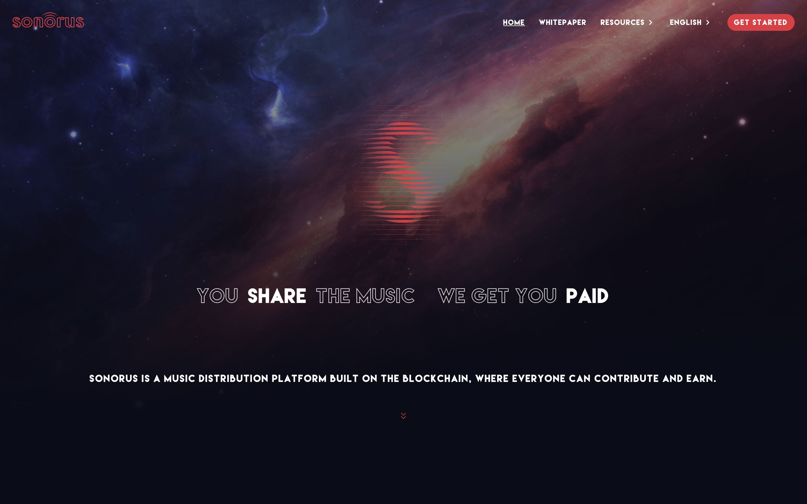
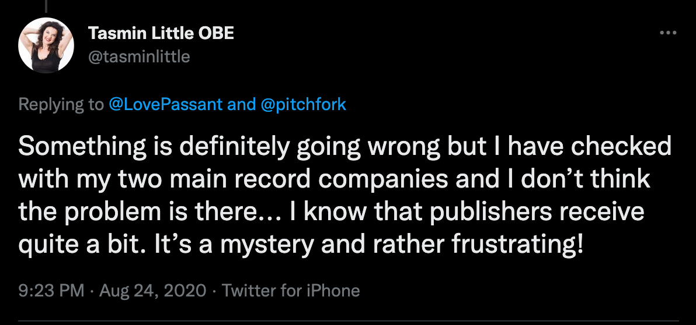
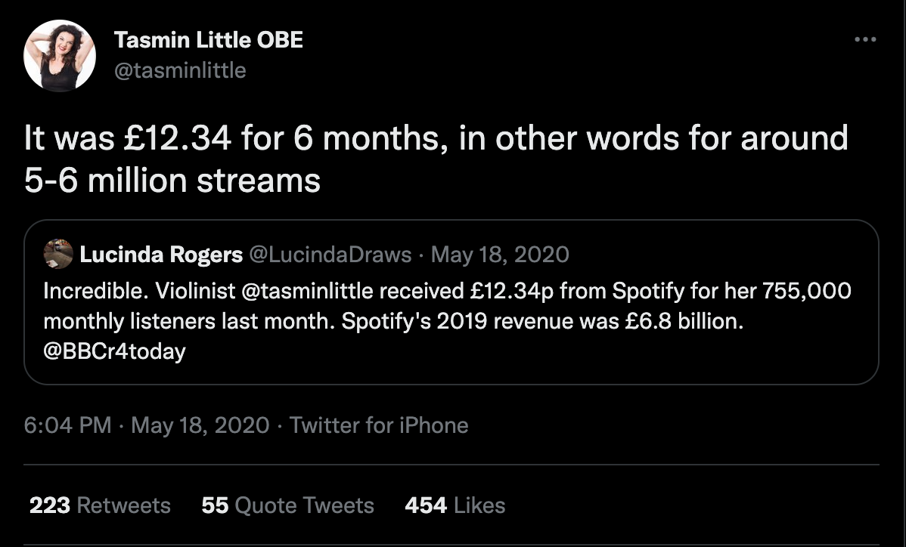
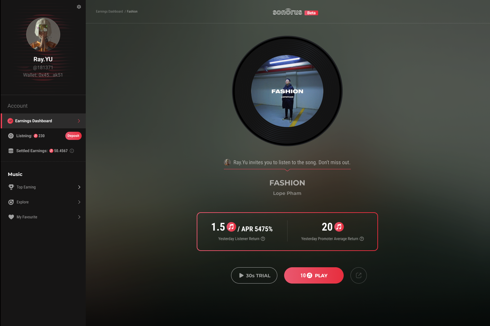
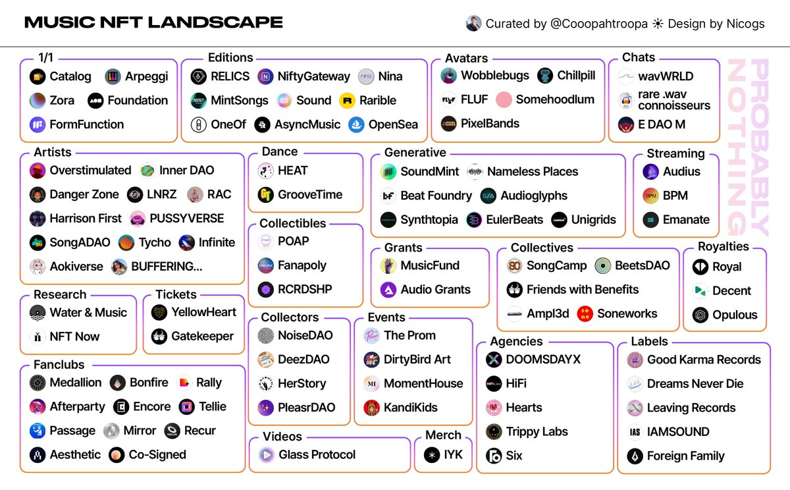

# Sonorus：让你听歌、转发音乐也能赚钱｜ Jam Review No.19

> 今天，第 19 期 Jam Review 精选推荐 Sonorus，一个彻底改变音乐发现、传播和播放方式的 Web3 协议。

## Sonorus

(video)

> **类别：** NFT
>
> **推荐：** Ryan（@ABMTF_crypto）
>
> **官网：** https://sonorus.network
>
> **推特：** https://twitter.com/SonorusOfficial
>
> **群组：** https://discord.gg/4gUwcbvh
>
> **博客：** https://medium.com/@SonorusOfficial

### 你的产品是做什么的？

Sonorus 是一个彻底改变音乐发现、传播和播放方式的 Web3 协议。通过我们的「推广-赚钱」和「收听-赚钱」智能合约，Sonorus 激励每个人尽早发现伟大的艺术家和音乐，并将其推广给其他人。该协议还让开发者能够在自己的产品中嵌入音乐，例如将 Sonorus 的音乐作为游戏背景音乐，并将音乐添加到你的社交档案中，从而让音乐能够在各种用户场景中被使用、传播和聆听。

### 你的产品功能带来什么独特价值？

**对艺术家**

- 解锁一个让他们的音乐得到传播和聆听的强大的方式
- 通过我们透明和公平的智能合约，从他们的音乐中赚取更多的收入
- 保持对自己音乐权利的控制

**对普通用户**

- 通过发现、推广和聆听，对任何有助于音乐生态系统的行为，赚取金钱
- 轻松实现他们音乐播放列表的多样化和更新

**对开发者**

- 能够以可承受的价格获得受版权保护的音乐目录，而不是像现在这样选择一次性支付数百万美元，而这个价格是由垄断的唱片公司决定的
- 如果他们的用户继续分享音乐，就能在这个过程中获得推广者的收入

### 你的产品满足或解决了什么需求或问题？

**大唱片公司主宰着音乐产业**

大唱片公司正主导着这个行业。许多青年才俊不得不与大公司签订不公平的合约，以便出版他们的音乐并获得营销资源。他们没有自由创造自己风格的音乐，而不得不听从唱片公司的指示。这种情况也伤害了普通听众。人们抱怨当前的音乐作品变得越来越同质化和商业化。

寡头垄断正在扼杀音乐产业的创造力，让一切都变得如此无聊。

视频解释：https://youtu.be/_GMlEDKzwXg

**版税分配不透明且不公平**

音乐家从流媒体服务中获得的版税不透明，而且比他们应得的要低得多。2020 年 5 月，古典小提琴家塔斯敏·利特尔（Tasmin Little）透露，她在 Spotify 的 6 个月的播放量「大约为 500-600 万次流媒体」而获得的报酬仅约 15.67 美元。

**只有前 1%的艺术家得到关注**。

目前，大多数流量都流向了前 1% 的艺术家。同样的音乐家和他们的作品在不同的音乐流媒体平台上不断出现在我们的播放主页上。他们很有才华，但反复看到同样的名字也很无聊。

其他有才华的音乐家需要有机会被听到，听众也需要自己的播放列表飘来新鲜空气。

**普通听众对音乐传播的贡献被忽视了**。

尽管音乐传播系统在纸面上已经过时，但谁也不能否认它已经进入了一个新的阶段 —— 很少有人依靠音乐广播来获得新的音乐。人们从别人的播放列表、网上的短视频和家庭聚会中找到新的音乐。是广大普通的听众将音乐传播出去。然而，大唱片公司仍然拿走了所有的营销费用，普通听众的贡献在目前的体系中从未得到充分的认可和经济上的回报。

### 你的产品如何在竞争中脱颖而出？

在 Web3 音乐领域有很多玩家，但分销问题仍未解决。Sonorus 加入了这个游戏，因为我们看到了关于音乐分销的痛点，我们相信这个问题可以通过适当的智能合约和通证经济来解决。

大多数 Web3 音乐项目主要只关注与超级明星的合作，或通过智能合约解决版税分配的黑箱问题，而 Sonorus 则额外关注更有效地发现和分销高质量的音乐，从而为音乐产业带来良性循环。

如何做到？

- 通过革命性的「收听-赚钱」和 "推广-赚钱』机制，我们承认并奖励听众对音乐发现和传播过程的贡献，这涵盖了其他 Web3 音乐项目所忽视的空白阶段。
- 有了通证经济，普通听众现在有足够的经济激励来探寻和分享高质量但并不广为流行的音乐。分发过程变得去中心化、民主和更有效率，这与传统模式有着革命性的区别。

### 你们短中长期的增长路径是什么？

**短期：**

- 专注于越南市场，并制定一个有效的协议设计
- 专注于建立一个充满活力的音乐推广人社区（艺术家、评论家、粉丝领袖、KOL 等）。

**中期：**

- 专注于原生通证开发
- 专注于通过 Sonorus SDK 为开发者赋能

**长期：**

- 专注于在全球范围内扩展，并在音乐行业建立一个健康、民主和经济公平的发现和分配系统

欢迎点击 Sonorus 项目页面点赞关注、留言评论：https://www.metajam.studio/project/sonorus

更多交流讨论，欢迎加入 MetaJam 社区。

- **MetaJam：** https://www.metajam.studio/
- **推特：** https://twitter.com/MetaJamStudio
- **电报：** https://t.me/+QXy7Qs9LgEFlOTM1
- **Discord：** https://discord.gg/wXtj2UuedP
