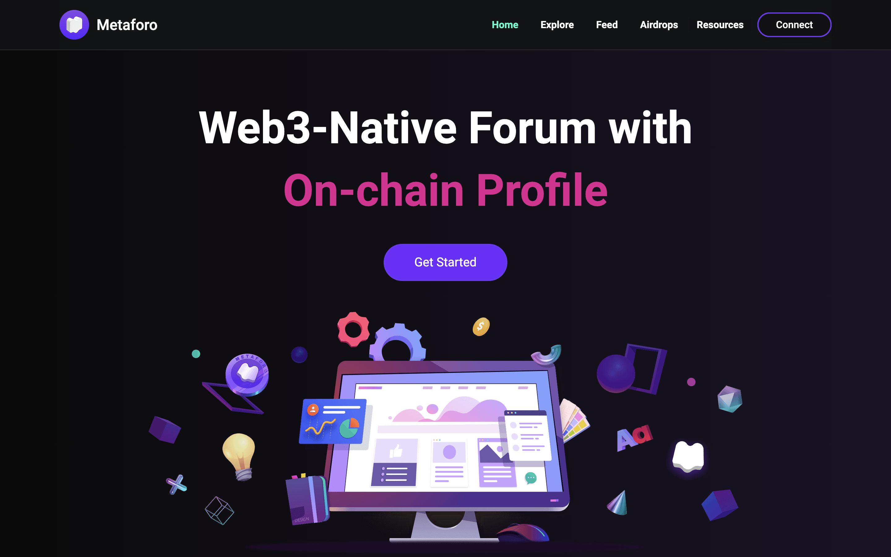
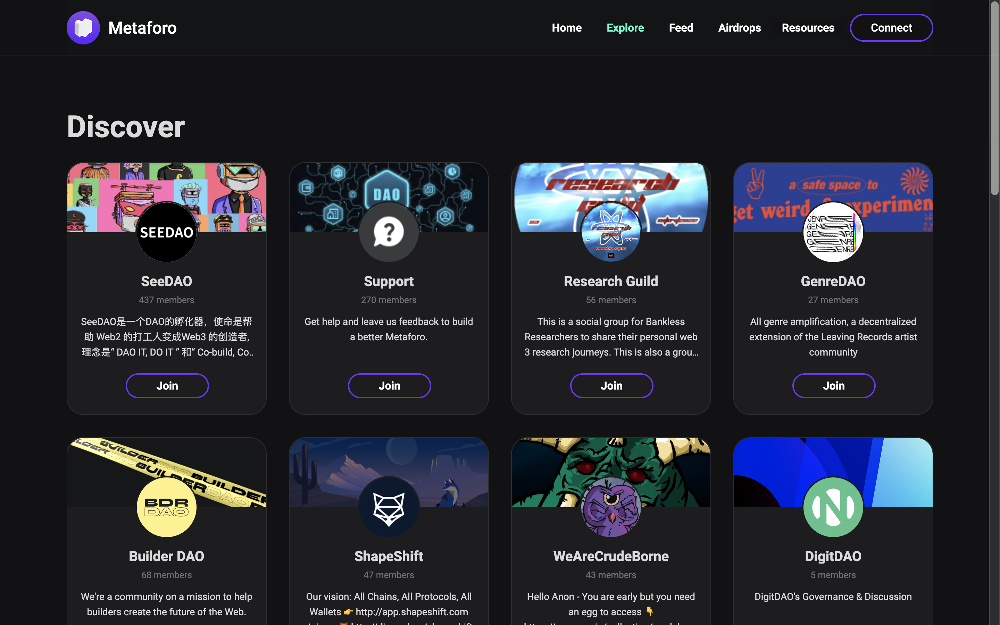
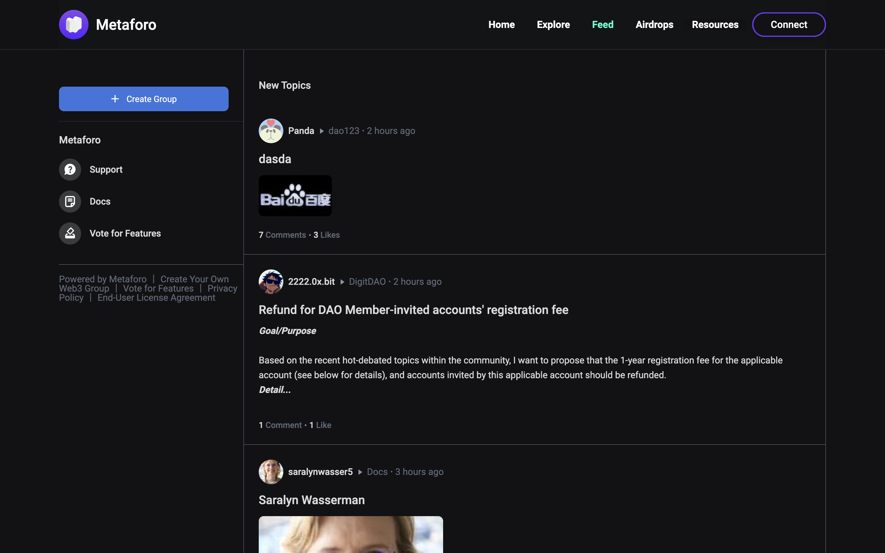
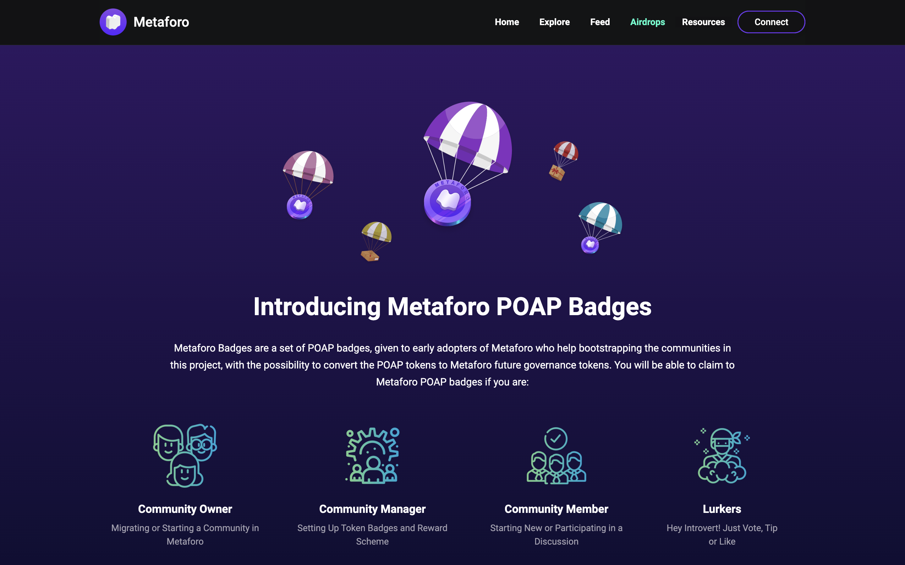
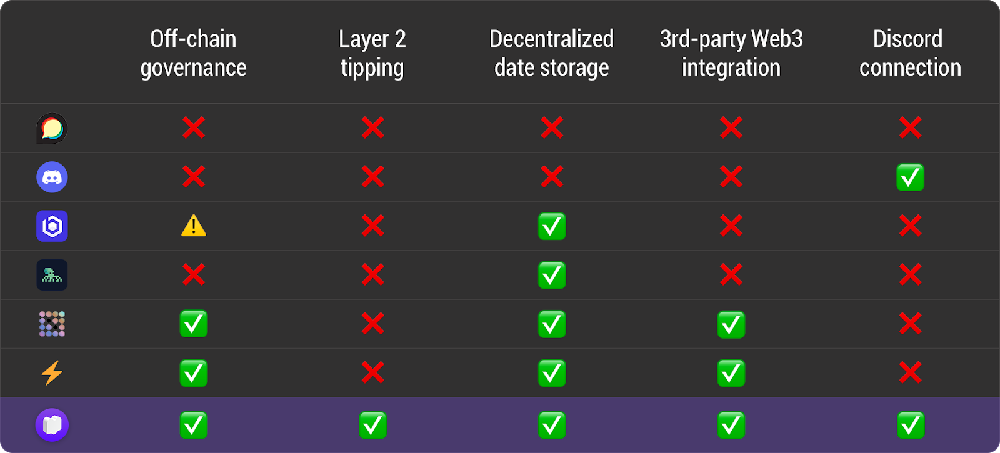
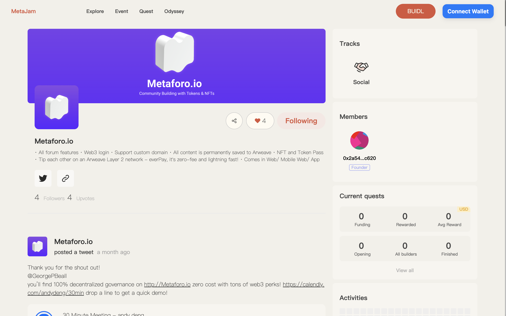

# Metaforo：专为 Web3 项目打造的论坛平台｜ Jam Review No.20

> 今天，第 20 期 Jam Review 精选推荐 Metaforo，一个 Web3 原生的论坛平台。

## Metaforo

> **类别：** Social
>
> **推荐：** Suji Yan
>
> **官网：** https://metaforo.io/
>
> **推特：** https://twitter.com/realmetaforo
>
> **群组：** https://discord.gg/uwxYdPx2wh
>
> **博客：** https://metaforo.io/g/MetaforoOfficialDiscussionGroup

### 你的产品是做什么的？

Metaforo 是一个 Web3 原生论坛平台，专为寻求真正 Web3 治理的加密项目服务。

### 你的产品功能带来什么独特价值？

Metaforo 为创业项目从 Web2 迁移至 Web3 搭建了桥梁。用一站式的治理工具集取代繁琐的跨平台操作。

例举一些首次提供给加密项目社区的 Web3 论坛功能：

1. 空投+点对点小费：自定义空投和参与赚取奖励的规则
2. 通证/NFT 门槛权限和投票：不仅控制谁可以投票，而且还奖励投票的成员
3. NFT 徽章和头衔：基于 NFT 的跨平台声誉和节制
4. Discourse 到 Metaforo 的论坛迁移：所有内容和用户包括论坛的链接都能迁移，并加入通证门控权限和其他 Web3 功能。

### 你的产品满足或解决了什么需求或问题？

社区治理是几乎所有加密项目成功的基石。现有的论坛系统缺乏对链上的支持，无法支持这些社区日益增长的需求，无法用链上的证明来治理日常活动。Metaforo 是为建来为 Web 3 项目服务，解决 Web2 论坛无法满足其需求的问题，从而取而代之：

1. 货币化：货币化是 Web2 社区的一个大问题。在 Metaforo 上，所有社区成员都可以通过他们的会员通证的价值来赚钱，即空投、NFT 空投、点对点奖励；
2. 会员资格：Web2 社区往往难以界定谁是会员，谁是浏览者。这让社区建设者很难理解和服务他们的核心人群。有了 Metaforo，会员资格（和所有权）是以通证来衡量的，这使得会员可以获得设有门槛的内容和投票权等；
3. 参与性：在 Web2 社区中，为了保持成员参与，人们在创造内容和组织活动方面投入了大量的精力。在 Metaforo，由于系统提供的通证激励，持有通证的成员应该得到经济上的激励，以持续为社区做出贡献；
4. 数据所有权：数据由 web2 社区的论坛平台集中拥有。在 Metaforo 上创建的内容则被存储在 Arweave 等去中心化存储服务中。

### 你的产品如何在竞争中脱颖而出？

### 你们短中长期的增长路径是什么？

目前，我们的目标是两类用户：那些没有论坛系统的加密项目，和那些已经有一些在线社区存项目，即一个 Discourse 论坛。

- 2022 年第二季度：软启动 Metaforo 的所有论坛功能和点对点奖励系统。
- 2022 年第三季度：通证/NFT 门控投票；策略投票；NFT 徽章和头衔；UI/UX 翻新和 Discourse 迁移
- 2022 年第四季度：悬赏系统；移动应用启动；主题支持和去中心化的权限和头衔。
- 2023 年第一季度：DID 整合；时间表；Arweave 数据恢复工具；NFT 策略投票
- 2023 年第二季度：前端节点；开发者的插件

欢迎点击 Metaforo 项目页面点赞关注、留言评论：hhttps://www.metajam.studio/project/metaforo-io

更多交流讨论，欢迎加入 MetaJam 社区。

- **MetaJam：** https://www.metajam.studio/
- **推特：** https://twitter.com/MetaJamStudio
- **电报：** https://t.me/+QXy7Qs9LgEFlOTM1
- **Discord：** https://discord.gg/wXtj2UuedP
