# 解码 Web3 BUIDL，欢迎报名「MetaJam Odyssey SF | 道创旧金山奥德赛」

> 10 月 10 日启动、11 月 6 日收官，全球首场线上+线下 Web3 奥德赛活动**MetaJam Odyssey SF | 道创旧金山奥德赛**，7 大板块，持续 28 天，横跨 7 城 2 大洲，将吸引 10,000+ 建设者，解码 Web3 BUIDL，解锁 Web3 协作，共建 Web3 新世界，欢迎报名参与！

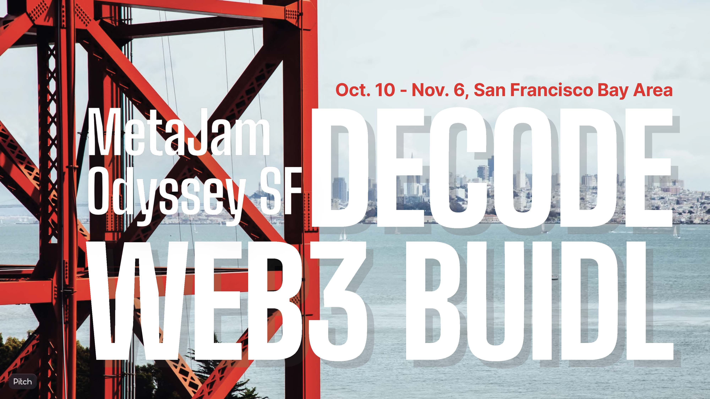

步入 2022 年 10 月， Web3，由人人共有共治共享的下一代互联网，并未因全球政经动荡、熊市漫漫而沉寂，相反，随着大量人才资本从 Web2 涌向 Web3，从祖国涌向坡县，围绕 Web3 的技术、应用、产品、社区、创业、投资、监管等的交流讨论，甚至争论，愈加火爆。

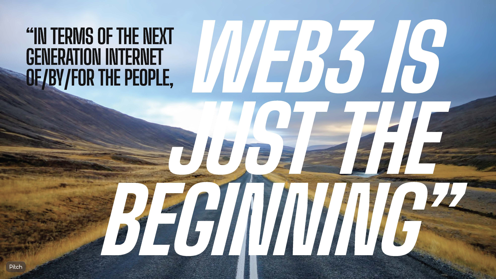

然而，我们始终认为，混沌初生的 Web3 只有一个真问题：抱持长期主义的 BUIDL（建设），而这无关地域、语言和种族。

尽管加密钱包用户数、进入 Web3 的开发者数，和创业项目数量和融资金额，以及加密货币市值在去年牛市创下新高，但不足 2 万名 Web3 开发者仅占全世界开发者的 0.068% 这一数据说明，目前 Web3 首先存在供给侧的问题：

- **用户：** 如何通过有真正用户价值和体验的产品从而享受 Web3 带来的自我主权的好处？
- **建设者：** 如何在有限的基础设施、人才、工具、技能组合和资金的情况下构建 Web3 产品？
- **投资人：** 如何通过发现和投资明星产品从而实现从 Web2 到 Web3 的范式转变？
- **从业者：** 如何快速学习 Web3 知识、增长技能？

尽管如今互联网发达，资讯随手可得，疫情三年来，我们逐渐适应虚拟沟通的场景，但上述根本问题的头脑碰撞和协作火花迸发，仍然离不开线下面对面的深度交流——8 月大理瓦猫之夏、9 月新加坡 Token2049 的火爆，即为明证。

## 解码 Web3 BUIDL | 解锁 Web3 协作 | 共建 Web3 新世界

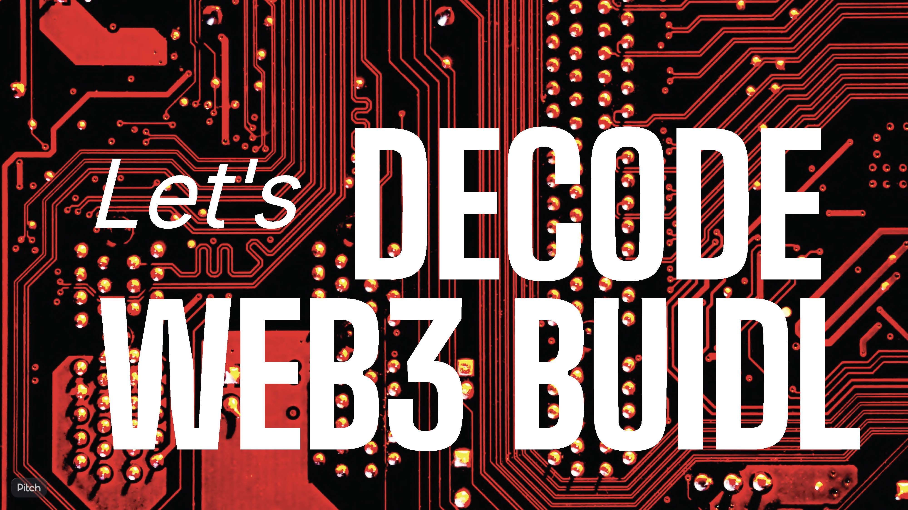

以上为由 [MetaJam](https://www.metajam.studio)、[Decode](https://www.decode.build/)、[M7e](https://www.m7e.io/) 发起 **MetaJam Odyssey SF | 道创旧金山奥德赛**确定的活动主题。

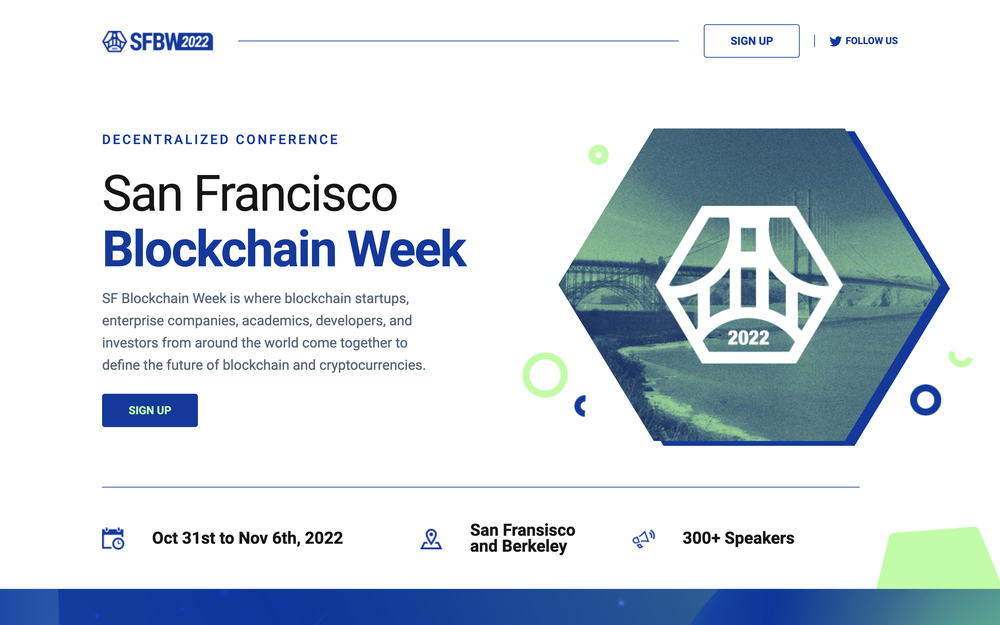

「MetaJam Odyssey SF | 道创旧金山奥德赛」将与 [2022 年旧金山区块链周](https://sfblockchainweek.io/)同期举行，为世界各地的 Web3 建设者搭建一个提供交流思想、寻求机会和建立伙伴关系的活动平台。

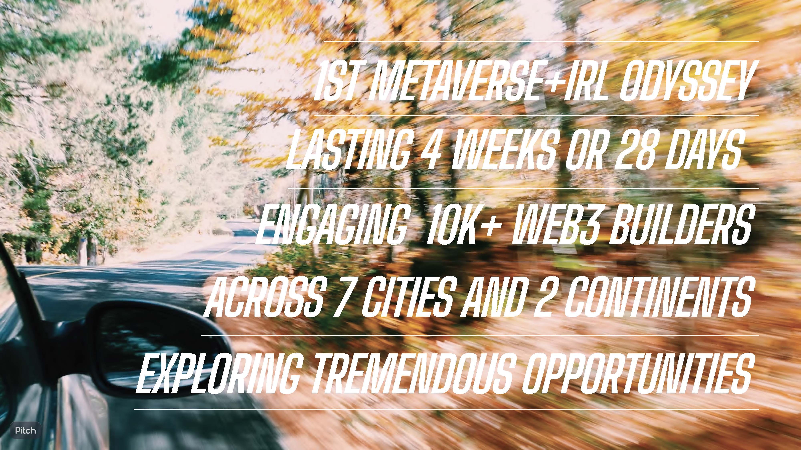

## 序曲：10 月 10 日 - 11 月 4 日

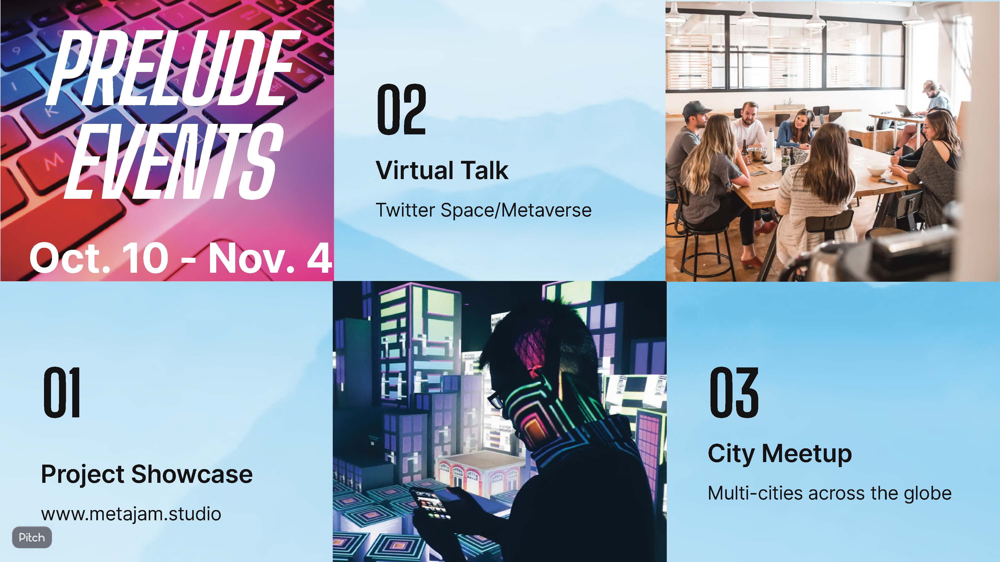

### 活动 ① PROJECT SHOWCASE：创建 Web3 项目形象

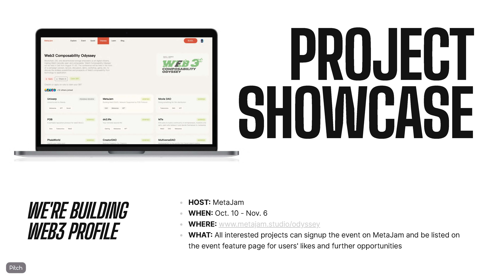

- **主办：** MetaJam
- **时间：** 10 月 10 日至 11 月 6 日
- **地点：** MetaJam 网站
- **内容：** 所有感兴趣的 Web3 项目都可以在 MetaJam 上报名参加活动，并在活动专题页面集中亮相，供用户关注，以及下一步的机会。

### 活动 ② VIRTUAL TALK：分享关于 Web3 的观点和创意

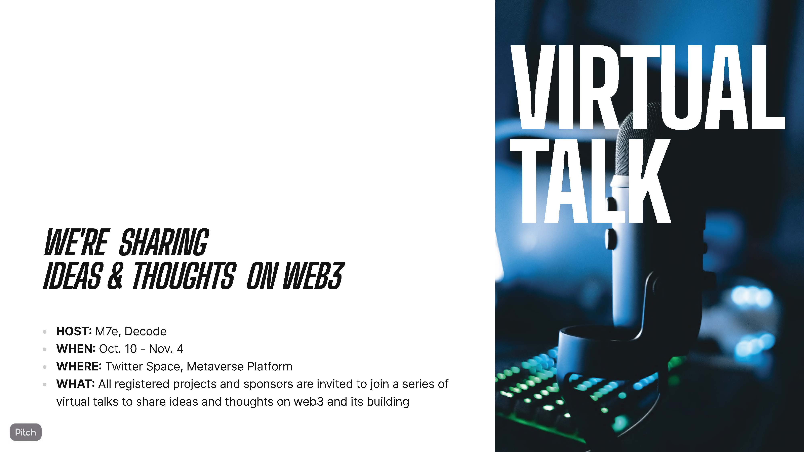

- **主办：** Decode 道创、M7e 元宇宙特攻队
- **时间：** 10 月 10 日至 11 月 4 日
- **地点：** 推特 Space、元宇宙平台等
- **内容：** 报名项目和赞助商都将受邀参加一系列线上交流，分享关于 Web3 及其建设的想法和思路。

### 活动 ③ CITY MEETUP：潜心研究 Web3 建设

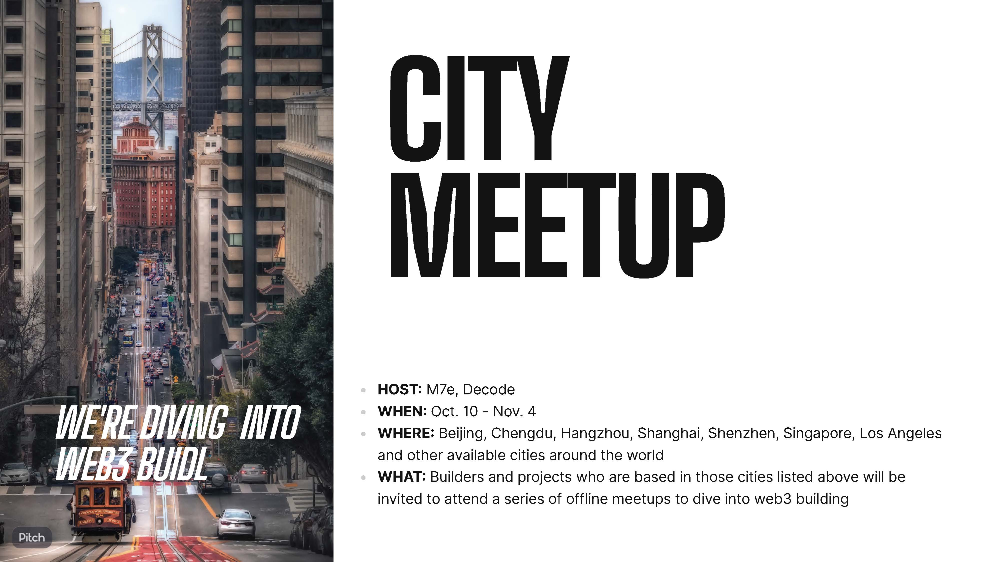

- **主办：** Decode 道创、M7e 元宇宙特攻队
- **时间：** 10 月 10 日至 11 月 4 日
- **地点：** 上海、杭州、深圳、北京、成都、新加坡、洛杉矶等
- **内容：** 上述这些城市的建设者和项目将受邀参加一系列线下聚会，潜心研究 Web3 建设。

## 高潮：11 月 5 日 - 11 月 6 日

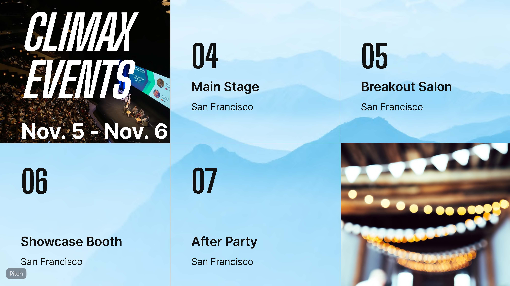

### 活动 ④ MAIN STAGE：开展 Web2 与 Web3 的对话

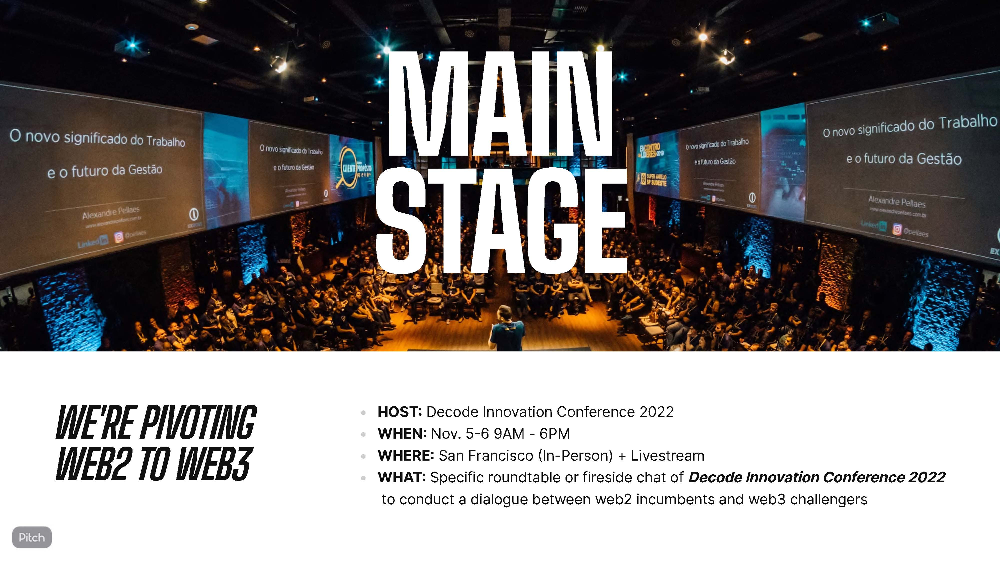

- **主办：** Decode 道创峰会 2022
- **时间：** 11 月 5 至 6 日，早 9 时至晚 6 时
- **地点：** 旧金山 + 线上直播
- **内容：** 2022 Decode 道创峰会的专题圆桌会议或炉边谈话，开展 Web2 的在位者和 Web3 的战者之间的一场对话。

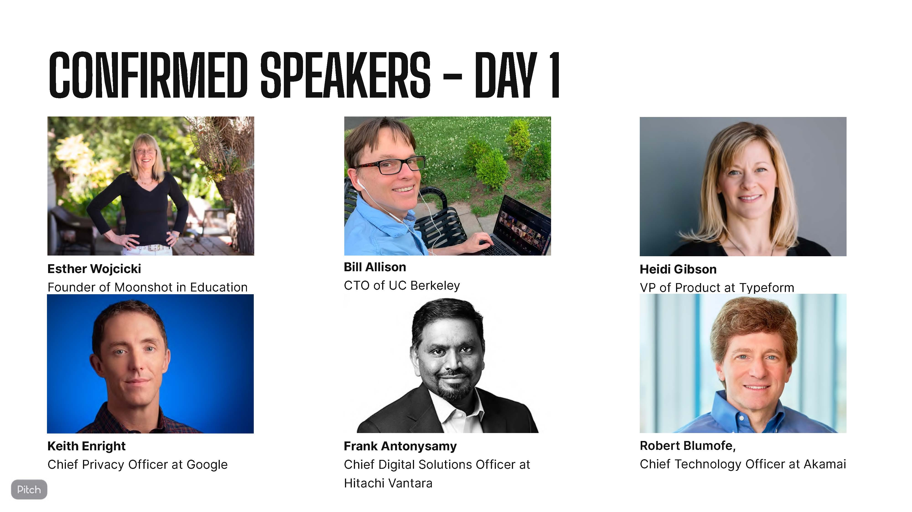
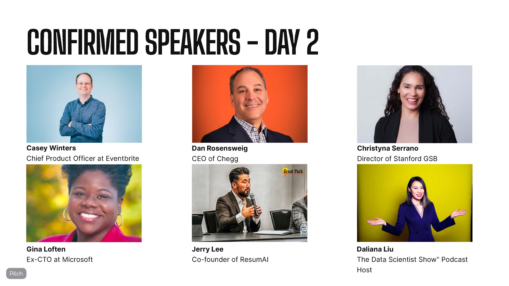
_2022 道创峰会目前确认嘉宾_

Decode 道创峰会以解码创新，激励年轻人为宗旨，由加州大学伯克利分校和斯坦福大学的学生和校友联合主办，每年接待 2000 多名观众，并有 50 多名行业领袖作为演讲者。自 2016 年启动以来，已成为硅谷最大的学生组织的创业会议。2022 道创峰会以 Opportunties in Uncertain Times 为主题，为年轻人解码如何在这个巨变的时代中找到自己的机遇

**延伸阅读：**

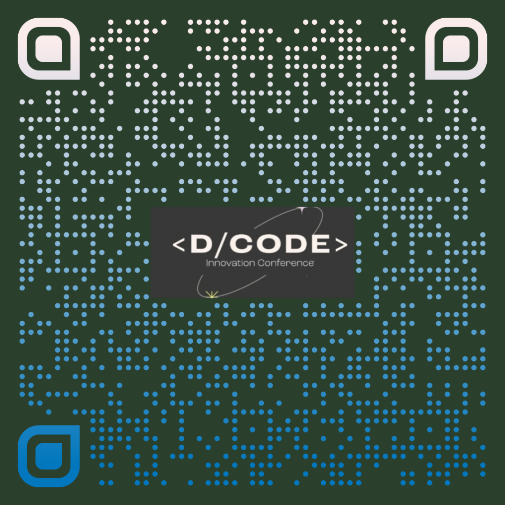
_扫码购票_

### 活动 ⑤ BREAKOUT SALON：开启 Web3 建设的协作

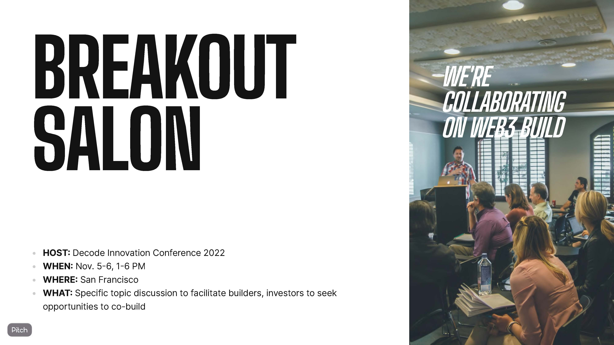

- **主办：** Decode 道创峰会 2022
- **时间：** 11 月 5 至 6 日，下午 1 时至 6 时
- **地点：** 旧金山
- **内容：** 若干场特定主题的分组讨论，以促进建设者、投资人、合作伙伴之间合作

### 活动 ⑥ SHOWCASE BOOTH：展示 Web3 建设成果

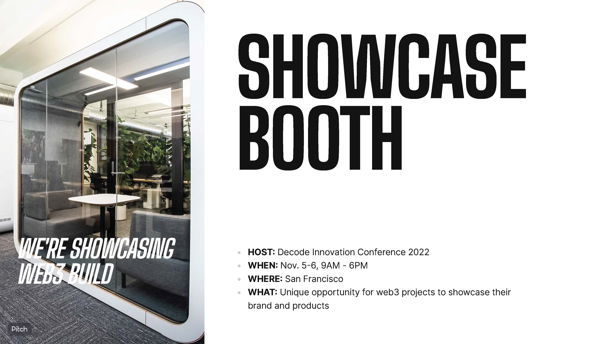

- **主办：** Decode 道创峰会 2022
- **时间：** 11 月 5 至 6 日，早 9 时至晚 6 时
- **地点：** 旧金山
- **内容：** Web3 项目展示其品牌和产品的独特机会

### 活动 ⑦ AFTER PARTY：构建 Web3 建设者社交网络

- **主办：** Decode 道创、MetaJam、M7e 元宇宙特攻队
- **时间：** 11 月 6 日晚 7 时至 9 时
- **地点：** 旧金山
- **内容：** 赞助商活动，编织 Web3 建设者信任的社交网络

## 欢迎报名 参与共创

只要你从思想到行动上都 All in Web3，对解码 Web3 BUIDL 这一问题真心感兴趣，希望获得与世界同步的认知，链接海内外的协作机会，无论你是创业者、开发者、创作人、投资人、布道者、从业者，还是项目、机构、媒体、社区、DAO 的负责人，乃至年轻学生，无论通过**赞助、演讲分享、宣传推广，还是线下活动志愿者、线上线下活动听众**，都能参与到 MetaJam Odyssey SF | 道创旧金山奥德赛」中来！

_扫码或点击「阅读原文」报名_

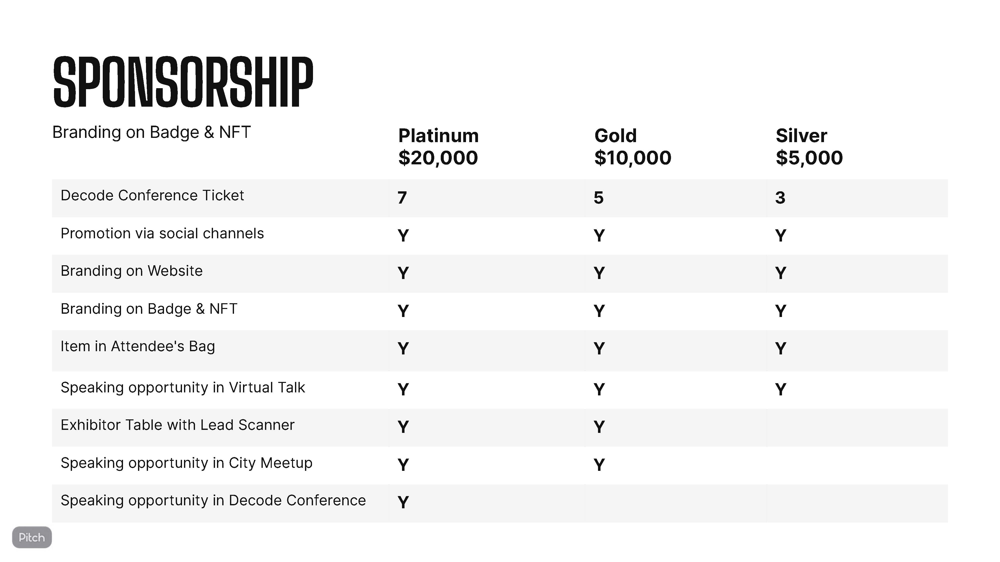

有意赞助者，请加活动负责人微信 **Jeanchen27** 沟通。

## MetaJam、Decode、M7e 联袂发起

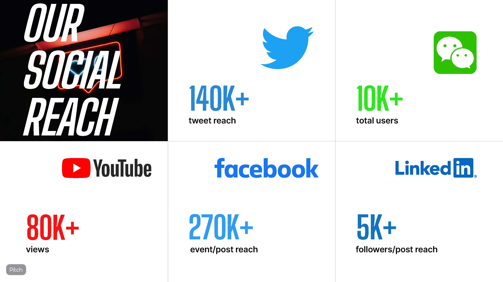
_活动发起方合并社交媒体矩阵影响力_

### MetaJam

MetaJam 正在构建发现 web3 产品、构建创新项目的协作网络。目前聚合了数千个 Web3 项目，建设者在 MetaJam 能够相互联系、互相帮助产品成长。今年 8 月 17 日至 20 日在云南大理，MetaJam 以活动大篷车的形式举办了 Web3 可组合性奥德赛活动，以讲座、演示、研讨、游戏等吸引了 500 多名观众和 10 多名行业领袖的分享。

(video)
_大理 Web3 可组合性奥德赛_

### Decode 道创

Decode 道创是位于湾区的最大的技术、创新和创业社区，它与加州大学伯克利分校和斯坦福大学的学生组织、校友网络和创业中心联合主办，拥有 10,000 多名跨渠道的用户，每年吸引 50 多名顶级演讲者。作为 501(c)(3)法规注册的非盈利组织，Decode 道创的使命是给学生、创始人和投资者一个学习和探索未来的平台。

(video)
_2021 Decode 道创峰会_

### M7e 元宇宙特攻队

M7e 元宇宙特攻队通过媒体、活动、孵化等方式连接元宇宙建设者，推动下一代互联网早日到来。M7e 目前已成为中国最具影响力的 Web3 建设者社区之一，在各渠道拥有 10,000 多名订阅者，并通过 2021 年上海元宇宙文化周、与 IOSG 合办的 元宇宙嘉年华、2022 年元宇宙新春茶话会等一系列活深孚众望。

(video)
_2021 上海元宇宙文化周_

