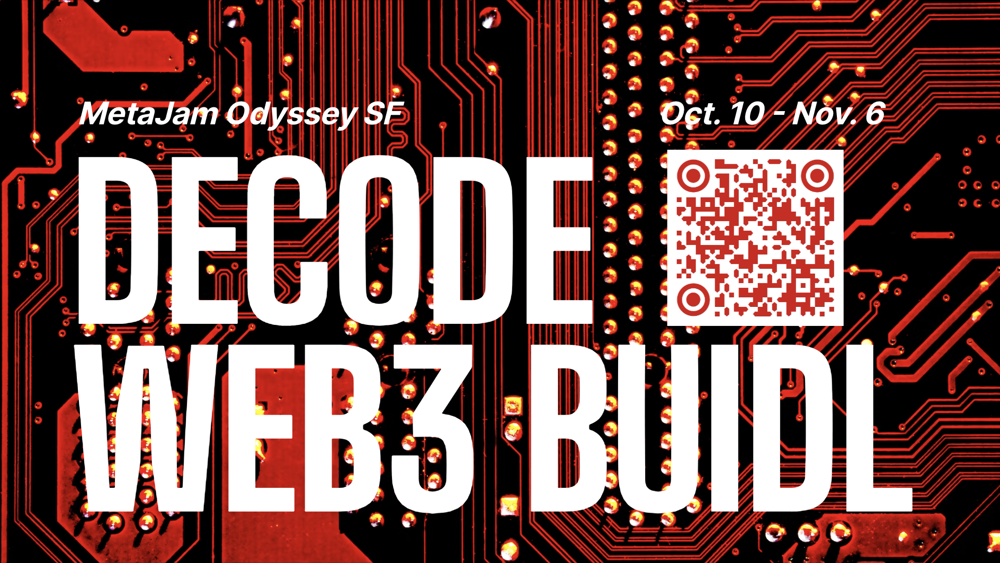

# SwapChat：Web3 原生跨平台聊天应用 ｜ Jam Review No.21

> 今天，第 21 期 Jam Review 精选推荐 SwapChat，一个由 Web3MQ 协议驱动，为 Web3 用户打造的原生跨平台聊天应用。

## SwapChat

(video)

> **类别：** Social
>
> **推荐：** Beryl
>
> **官网：** https://www.web3messaging.online/SwapChat/
>
> **推特：** https://twitter.com/SwapChatNFT
>
> **群组：** discord.gg/rWMavdATcM
>
> **博客：** https://swapchat.super.site/

### 你的产品是做什么的？

SwapChat 是一个由 S3 实验室孵化的 Web3 原生跨平台聊天应用，由 Web3MQ 驱动，为 Web3 用户打造。我们提供一个跨平台的聊天信息服务，旨在使用户的信息在不同的社交平台上可以互通，加密，高效，无边界。

用户可以在 OpenSea、Twitter 和 Discord 等平台上发送地址。SwapChat 还原生集成了交易工具和协议，如 Sudoswap，与目前的消息传递工具如 Discord 和 Telegram 相比，SwapChat 上的交易更加安全。

### 你的产品功能带来什么独特价值？

有了 SwapChat，用户只需点击一下，就可以通过社交平台向 NFT 持有者提出 NFT 购买请求。此外，通过 SwapChat 群聊，一个内嵌交换的社区空间将被解锁。

SwapChat 允许在用户浏览时将 NFT 交易原封不动地嵌入整个网站。绕过第三方 NFT 交易平台，用户将不再需要频繁地从社交平台切换到市场，或以其他方式。通过 SwapChat，我们将交易产生的价值返还给社区。

_**说明：** 全过程加密。用户的聊天数据只有您可以访问，我们不会收集其任何个人聊天信息。_

### 你的产品满足或解决了什么需求或问题？

### 目前这些通讯平台存在什么问题？

现今，用户使用任何通讯工具的信息都会被审查，用户的隐私和安全都在受这些平台的控制，面临很大的风险。此外，用户如果使用 Twitter 或其他平台，就无法直接联系 Instagram 的朋友。但互联网最初的想法就是将所有人连接起来。这种情况必须改变。

这些社交媒体平台不能让用户体验一个安全的交易环境，因为这不是他们的利益所在。但是用户不能使用一个统一平台与其交谈的任何人交易，这不是有效沟通应该有的样子。

### 我们要解决什么问题，如何解决？

区块链技术是为了保护交易证券而创建的，SwapChat 设法使其成为更好的信息传输手段，为用户和其朋友提供端到端交流的解决方案。

SwapChat 通过其拓展插件连接到主流平台。用户只需单击一下，就可以与其指定的人创建私有的端到端通信通道。最重要的是，用户可以使用 SwapChat 和所有联系人交流，而不需要切换平台。

SwapChat 让用户可以很容易地使用 SwapChat 交换他们喜欢的 NFT。用户可以在 Opensea 和其他平台上与 NFT 持有者交谈，这将让交易体验更好更有效——通过交谈、同意、出价和接受，目前交易方面外接了 Sudoswap，用户可以跳转到 sudo 实现交易。

Swapchat 只接受已认证的用户，用户无需担心与其交谈的人的身份。如果埃洛·马斯克(Elon Musk)出现在 SwapChat 上，你就会非常肯定是他在跟你说话。

### 你的产品如何在竞争中脱颖而出？

SwapChat 支持用户使用我们开发的 Web3MQ 底层协议，启动安全加密的即时通讯，除了点对点通信，我们同时支持群聊，被同一个 NFT 项目吸引的用户可以有一个聚合平台来讨论并产生新想法，同时还可以支持 NFT 交易，不仅允许买卖双方相互交流，而且允许买方间交换信息并给出去中心化的评论。

SwapChat 的消息通知功能支持用户更有效地发送和接收消息，并在新消息传入时收到通知。同时，对于项目方，SwapChat 开放更多公众功能，允许他们直接向创建了 SwapChat 聊天室或群组的用户发布更新。

与同赛道的竞争对手相比，SwapChat 可以实现真正的基于 Web3MQ 的 P2P 即时通讯，并保证整体网络性能不会随着网络节点数量的增加而下降。

此外，SwapChat 将支持嵌入到几乎所有的 Dapp 场景中，并且可以直接用作可靠的即时通讯工具。

### 你们短中长期的增长路径是什么？

Swapchat 项目的核心是社交通讯，同时集成了 Sudoswap 交易功能，未来计划和更多的项目合作，共同助力 Web3 社交应用产品的落地和社交系统的构建。SwapChat 将和其背后的通讯协议 Web3MQ 一同发展，并作为其生态的有力组成部分，共同赋能 Web3 通讯新时代。

Web3MQ Roadmap 发展计划如下：

欢迎点击 SwapChat 项目页面点赞关注、留言评论：https://www.metajam.studio/project/swapchat

MetaJam Odyssey SF | 道创旧金山奥德赛今天启动，活动 7 大板块，持续 28 天，纵横 8 城 3 大洲。

SwapChat 已参与 MetaJam Odyssey SF，并邀请全球 Web3 建设者扫码报名参与，共同解码 Web3 BUIDL，解锁 Web3 协作！

- **MetaJam Odyssey SF：** https://www.metajam.studio/event/sf-odyssey
- **推特：** https://twitter.com/MetaJamStudio
