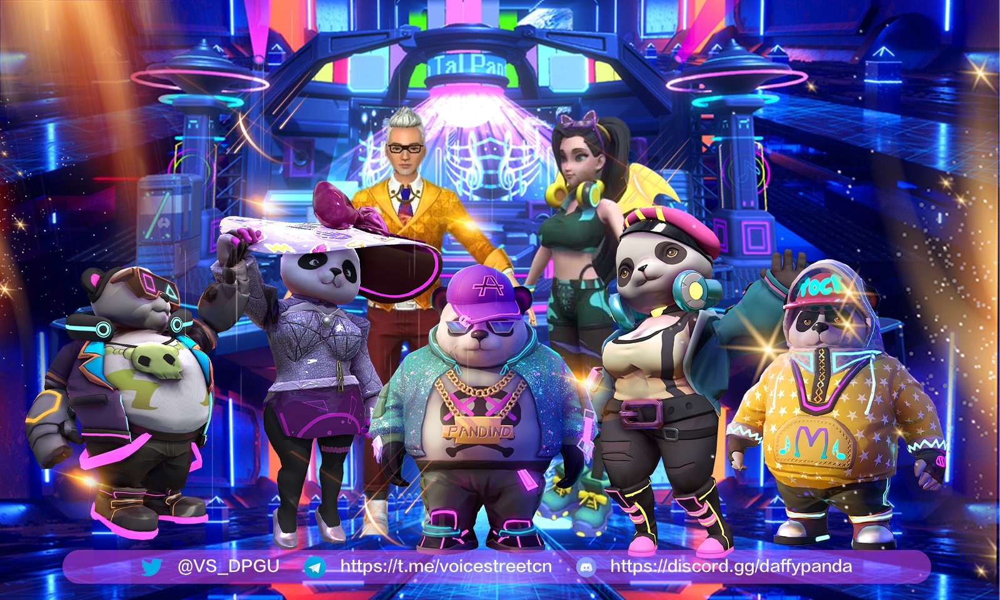

# Voice Street：致力于构建音乐 Web3 的链上基础设施｜ Jam Review No.22

> 今天，第 22 期 Jam Review 精选推荐 MetaJam Odyssey SF 战略共创伙伴 Voice Street，致力于构建音乐 Web3 的链上基础设施。

## Voice Street

(video)

> **类别：** NFT
>
> **推荐：** @cryptojean27
>
> **官网：** https://voicestreet.org/
>
> **推特：** https://twitter.com/voicestreetnft
>
> **群组：** https://discord.gg/daffypanda
>
> **博客：** https://medium.com/@voicestreet

### 你的产品是做什么的？

Voice Street 是一个致力于将音乐带入 Web3 的实验室，目标是构建音乐 Web3 的链上基础设施。旗下拥有音乐 NFT 平台，元宇宙演唱会，音乐人 Live House 虚拟空间定制以及音乐相关游戏等多款产品。 Voice Street 希望通过对音乐版权，艺术家相关 IP、音乐衍生品 NFT 、NFT 游戏化和元宇宙的链上开发，实现音乐 IP 衍生价值的多重拓展，解决音乐 IP 变现管道单一，变现能力差的问题。目前 Voice Street 主要有音乐衍生运营，音乐游戏板块以及音乐元宇宙三个板块。

### 你的产品功能带来什么独特价值？

**Initial Music - copyright Offering (IMO)和粉丝 Earning**

Initial Music - Copyright Offering (IMO)是 Voice Street 首次提出的新型方式，允许音乐人以 NFT 的形式形成完整的歌曲版权，并将其版权碎片化为歌曲通证。在创作者获得销售收入的同时，持有音乐通证的粉丝可以从音乐产生的销售和运营收入中获益。销售管道可以包括流媒体、电视合作伙伴、改编和翻唱。这样一来，一个以音乐创作者为中心的良性互动生态系统就会形成，忠实的粉丝也会从中受益。用户可以在 Voice Street 平台上购买歌曲版权 IMO 通证，通过质押获得歌曲线下版权运营的收益，并通过 DAO 社区的投票决定歌曲的未来运营。

Voice Street 音乐粉丝 IMO 通证创新功能 Earning 是升级音乐忠实粉丝权益、使用 IMO token 支援音乐人并赚取奖励的绝佳方式。通过 Earning，IMO 用户可以质押自己拥有的 IMO 通证，支持自己喜欢的音乐人并领取额外的 VST 通证奖励。 IMO 资产所有者通过质押将具有版权收益权属性的资产质押进入特定的收益池中，IMO 作品版权运营的收入扣除经营成本，利润部分返回到质押池中，最大程度的 IMO 音乐版权的价值和 IMO 所有者的权益。 VST 通证奖励通过预定的收益池发放。发放比例由支援 IMO 通证的质押类型、每种质押 IMO 对应的作品版权运营的收入、粉丝力以及参与人数决定。 IMO 通证的质押时间越长，获得的粉丝奖励越高。

Voice Street 已帮助多位来自不同国家的音乐人，包括 Kpop 明星申凯文、百大 DJ 22BULLETS、PinkPanda、KAKA、马来西亚歌手巫启贤等众多音乐人成功推出 IMO，累计参与人数达 8000 人。

**元宇宙游戏与 Daffy Panda Ganging Up（DPGU）**

Ark of Panda 是一个建立在 Voice Street 平台上的去中心化线上角色扮演游戏和元宇宙社区，在 Ark of Panda 元宇宙中，每个玩家在游戏内扮演一位满心向往娱乐圈生活的青年，购买一把乐器开始自己的音乐之旅，不断的在这个虚拟国度通过提升自身修养，与志同道合的朋友组成乐队开始向梦想进军，这个虚拟国度是世界性的。玩家在游戏中可以通过音乐节、打工、大乐透、演唱会等，和来自世界各地玩家沟通和交流。

Daffy Panda Ganging Up 是一款基于音乐游戏开发的限量版 NFT 系列，总计发售 10000 个，其中 8888 个作为个人获得，1112 个为明星音乐人持有。在 Ark of Panda 元宇宙里， Daffy Panda NFT 是进入游戏的唯一通行证，并且持有者们能免费体验元宇宙中的内容。另外，DPGU 还可以邀请其他玩家进 Ark of Panda，被邀请人在游戏中 Play to Earn 和 Win to Earn 所产生的收益有 5% 归邀请人。 DPGU 的持有者还拥有永久免费参与演唱会的资格及社区内拥有对应 DPGU 形象标签，另外，DPGU 持有者才能 mint 游戏中土地购买原始凭证。

Voice Street 通过 Ark of Panda 为载体将打造一个全新的音乐元宇宙世界，Voice Street 的每一位元音乐人，将在元宇宙中以专属 DPGU 体现为 3D 化身，通过元宇宙世界中的演出，与全世界粉丝一起欢腾。他们的 3D 化身将基于 NFT 生成艺术塑造而成，在元宇宙内活动，与粉丝互动。在超越时空的元宇宙世界里，VOICE STREET 将提供舞台举办演出活动。截至目前，已经有 30 个音乐人与 Voice Street 达成合作，登录 Voice Street Metaverse Concert 举行自己的演唱会。后续 Voice Street 将邀请 IP 和名人一起入驻元宇宙，建立属于自己的专属粉丝社区。粉丝可以在元宇宙中购买土地、房屋、资产，选择和自己喜欢的明星做邻居，将自己的想像力带入现实，在元宇宙中创造酒吧、博物馆、AMA 场地等，举办 Live House、成长资源与孵化计划各种充满个性的活动和倡议。

### 你的产品满足或解决了什么需求或问题？

目前市面上绝大多数的 NFT 产品，无论是 PFP 头像类的 NFT，还是 NFT 书画艺术品、照片、音乐类的 NFT，大多都还停留在「数字消费品」这个阶段，这类产品只存在单一收藏价值。这意味着所持有追求的是 NFT 具有稀缺性和身份认同感。而对于音乐来说，与其他的艺术表现形式不同，音乐天然具有传播的属性，通过人们的复制传播欣赏实现价值共识，是音乐产生价值的前提。而音乐作品一旦开源传播，其本身失去了收藏性。一个音乐人第一次发行了 3000 套 NFT 形式 NFT Vocal，可能会造成大家的疯抢，产品的价格会远超实体的 EP，但是当同一个音乐人推出第二个 NFT Vocal 的时候，产品的稀缺性和收藏价值会同时下降，这就导致这类 NFT 产品只能是一次性的炒作，无法形成长期自洽的商业逻辑。复制传播和稀缺性的矛盾是大部分把 NFT 作为承载音乐产品的载体的音乐类 NFT 项目和产品面临的困境。

Voice Street 是一个专注于服务音乐人的平台。更进一步说，Voice Street 服务的不是顶级音乐人，众所周知，1% 的顶级音乐人能吸引 55% 的流量，这类音乐人收入可观粉丝量大，版权公司给他们的条件和价格比较合理，他们在 Web2.0 中的收入客观并不需要改变什么。Voice Street 希望帮助剩下的 99% 的音乐人。这些音乐人分为两类，一类是有 100 万的粉丝量以上的音乐人，他们有一定的收入但是没有和大平台的议价能力，我们会帮助他们发行单曲或者一个专辑的 IMO，粉丝成为歌曲的版权碎片拥有者，可以获得几十年的版权收益，可以通过粉丝的 DAO 组织的投票运行，协助音乐人提供不同价位的定制产品和服务，通过包括与 Binance Charity 合作推出 NFT 产品，授权其他 NFT 平台使用等外部合作，并通过直播收益、游戏收益，打赏收益，NFT 收益衍生活动增加收益，提高音乐的传播度和价值。

另一类音乐人是最早期的没有粉丝的音乐人，Voice Street 可以提供给他们音乐 NFT 平台和音乐游戏元宇宙场地，在保护自己版权的前提下，更多的参与比赛和推广，让更多的喜欢音乐的人了解他们。我们也在探索包括 NFT 在内的多种形式的 IMO，staking NFT 的功能将会更多的服务于不是太知名的或者还没有很多粉丝的潜力音乐人上。版权类 NFT 产品的销售和质押，使得音乐人不需要像以往的 IMO 一样担心销量的问题（是否有足够多的人参与 IMO）、需要提供通证的流动性、并进行相关的管理。他们可以发行少量的 NFT 产品，开启质押来完成简单的 IMO。并对于这部分有潜力、知名度还不高、粉丝也没有很多的音乐人，给予一定的扶持和激励。

### 你的产品如何在竞争中脱颖而出？

随着 2021 年 NFT 的流行，Web3 应用浪潮开始向金融之外的领域蔓延，音乐赛道一直是 Web3 一个非常热门的一个赛道，目前绝大多数的 web3 音乐赛道的项目都还讲的是做取代 Web2.0 流媒体平台流媒体的单一的叙事故事，也有一些项目试图通过发行 NFT 来解决音乐人的收入问题，但单纯的发行 NFT 并不能给音乐人，也不能给草根音乐人带来长期稳定的收入。

与传统的音乐公司相比，Voice Street 让音乐人轻松便捷地融入到音乐 Web3 的世界中。Voice Street 提供了一个 Web3 的音乐基础设施，音乐人可以在这里发布自己的 NFT 作品，积累名气和粉丝，参与 IMO，获得发布音乐作品的初始资金。参加 Live House 在线音乐会，DAO 社区，与粉丝进行多种方式的交流。与音乐公司相比，与 Voice Street 合作的音乐人将获得更多额外的 Web3 收入。

与其他 Web3 音乐项目相比，这些项目仅仅通过发布 NFT 来解决音乐家的收入问题。单纯发布 NFT 并不能给音乐人带来长期稳定的收入。Voice Street 更注重音乐作品的深度开发，试图以更深入的形式帮助音乐人解决收入低的问题，通过从音乐的生产（NFT 发行交易平台）到发行（IMO），再到后续运营（元宇宙演唱会、音乐人 DAO 粉丝社区）实现全方位音乐 IP 衍生价值的多元化发展，实现 NFT 版权价值和 NFT 所有者权益的最大化。

### 你们短中长期的增长路径是什么？

**短期：** 短期内 Voice Street 希望以 Daffy Panda Ganging Up 开发的 NFT 系列限量版和 Kevin Shin、22BULLETS、Pink Panda、KAKA、Eric Moo、Rapper Long Zeyu 等明星的 IMO 版权 NFT 产品为突破口，快速导入流量，积累粉丝，完成项目形象和知名度的建立（已完成）。

**中期：** 在发展更多明星版权作品的同时，专注扶持原创音乐人，设立原创音乐人扶持计划，提供元宇宙的基础设施，帮助原创音乐人一键生成自己的特色 NFT 作品。开发 Live House 在线演唱会、DAO 社区、NFT 化道具、明星 IP 联名等功能，在把握未来头部音源的同时，实现音乐 IP 衍生价值的多元开发，解决音乐 IP 变现渠道单一、变现能力差的问题。（进行中）。

目前 Voice Street 会在两个方向上进行进一步的尝试，一方面是 Voice Street 会尝试更加细分的 IMO 产品，例如特定区域或者特定风格的音乐厂牌和 Web3 以及 web2.0 的音乐机构进行合作，推出更加具有价值的音乐版权作品。例如 Voice Street 合作的其中一个音乐厂牌 MOST，他们是专门针对 DJ 和 rapper 的音乐项目 Web3 音乐项目。第二个方面是借助于 Ark of Panda 的元宇宙游戏的深度开发，帮助音乐人进行衍生收益方向上多方位的探索。

**长期：** Voice Street 探索更加广义的无形资产证券化 NFT 化，完成音乐领域甚至是泛娱乐行业内一切非结构化的可交易权益的自由交易流转。

欢迎点击 Voice Street 项目页面点赞关注：https://www.metajam.studio/project/voice-street

> MetaJam Odyssey SF | 道创旧金山奥德赛 10 月 10 日启动，活动 7 大板块，持续 28 天，纵横 8 城 3 大洲。

> Voice Street 参与 MetaJam Odyssey SF 共创，诚挚邀请全球 Web3 建设者扫码报名参与，共同解码 Web3 BUIDL，解锁 Web3 协作！

- **MetaJam Odyssey SF：** https://www.metajam.studio/event/sf-odyssey
- **推特：** https://twitter.com/MetaJamStudio
