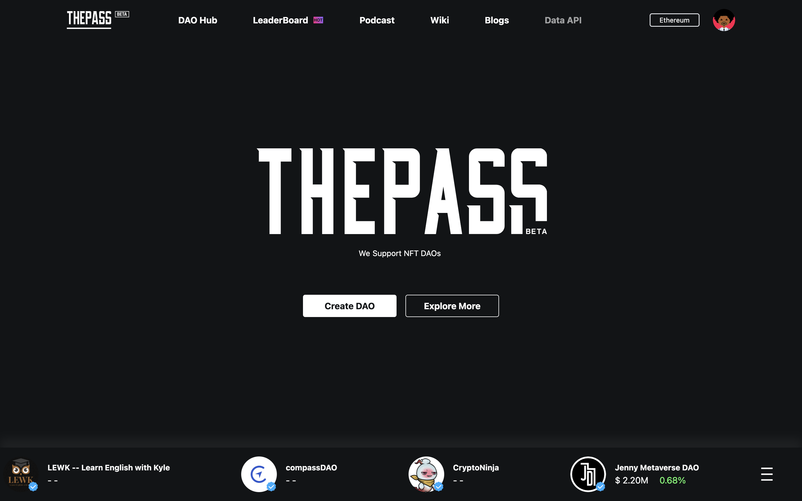
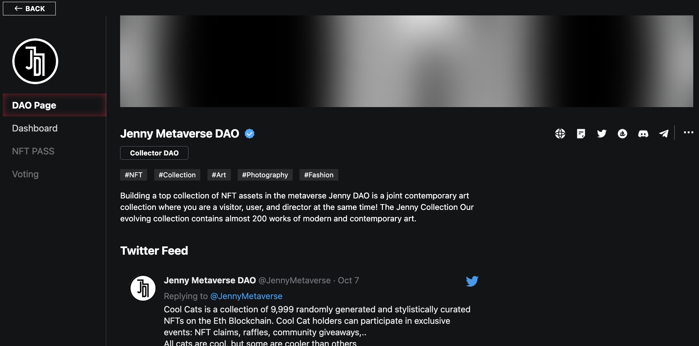
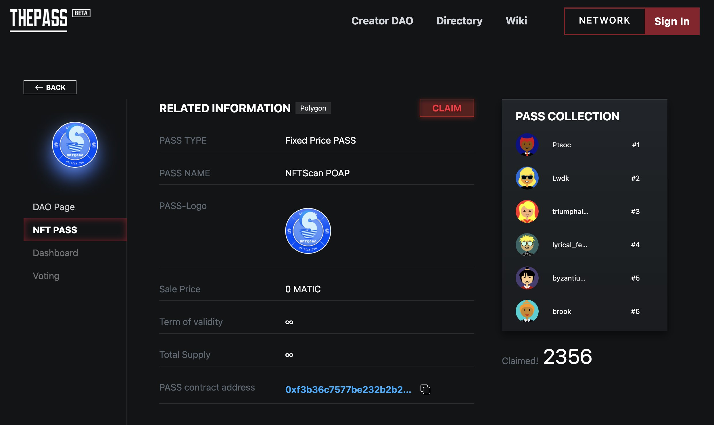
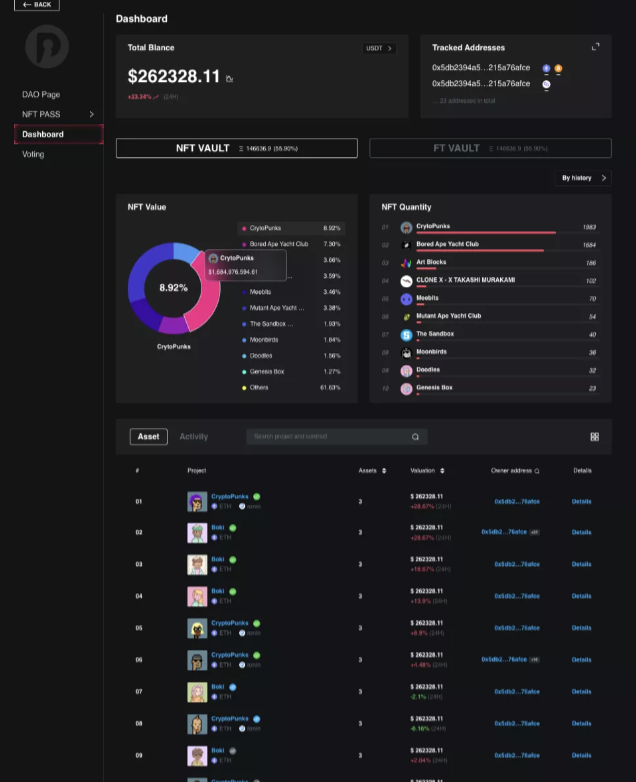
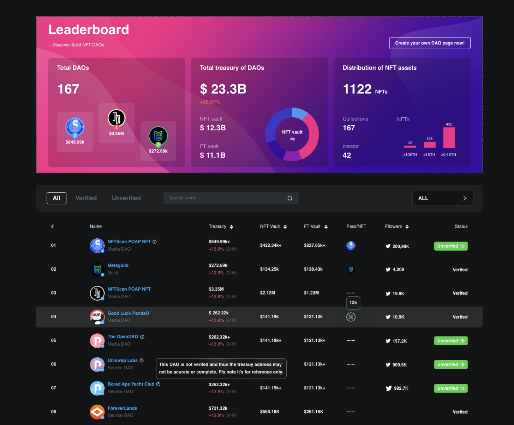
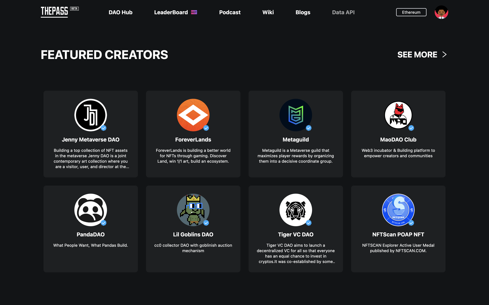
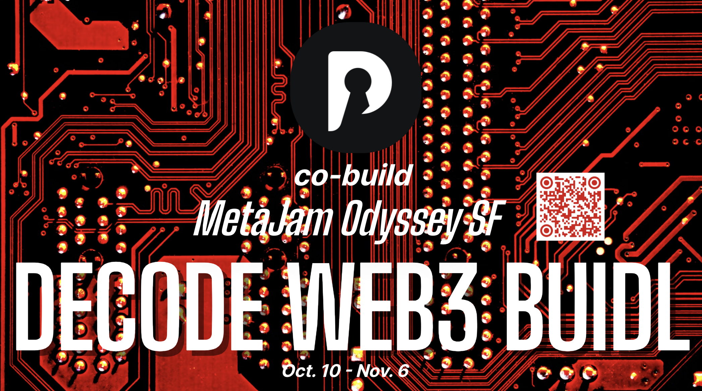

# The PASS：助你发现更好的 DAO ｜ Jam Review No.23

> 今天，第 23 期 Jam Review 精选推荐 MetaJam Odyssey SF 战略共创伙伴 The PASS，独有的 DAO 聚合与国库资产追踪平台，帮助用户找到更好的 DAO。

## The PASS

(video)

> **类别：** DAO
>
> **推荐：** @cryptojean27
>
> **官网：** https://thepass.to/
>
> **推特：** https://twitter.com/thepass_to
>
> **群组：** https://discord.gg/N6f25tPs9W
>
> **博客：** https://medium.com/@thepass_to

### 你的产品是做什么的？

THE PASS 是一个 DAO 聚合与国库资产追踪平台。用户可以通过 The PASS 追踪 DAO 的链上链下社交图谱，FT 和 NFT 资产状况，投票信息等情况，从而帮助自己寻找更好的 DAO 标的。目前平台已有数十家 DAO 组织正式入驻平台。

### 你的产品功能带来什么独特价值？

1. **DAO Page：** 快速为 DAO 搭建个性化主页，支持多平台媒体账号聚合，方便用户更好更快更方便的了解 DAO 的相关信息。

2. **NFT PASS：** 支持多种类型 PASS 发行方式：（1)Fix Price:这是一种非常标准和正常的 NFT 交易形式，即新发行的 NFT PASS 正在以固定价格进行拍卖；(2) Bonding Curve：混合了投机和 DAO 实用程序的 NFT PASS。一般来说，供应越多，价格越高。换句话说，当人们购买创作者的 NFT PASS 时，NFT 的价格会自动上涨一定比率；（3)Staking Token PASS ：可以分为 ERC20 通证质押 NFT PASS 和 ERC721 通证质押 NFT PASS。顾名思义，NFT PASS 是通过质押 ERC20 通证或质押 ERC721 通证 (NFT) 来铸造的。

3. **以 DAO 为单位关于 FT/NFT 资产评估的数据看板 Dashboard：** 通过 DAO 在各个地址的 NFT 和 FT 合约，分析合约在链上的转账记录以及各大平台交易、挂单数据评估资产估值，方便用户和 DAO 本身更加方便的了解 DAO 的资产状况。

4. **Leaderboard：** 通过监控各个 DAO 的国库、PASS 以及社交媒体等方面形成 DAO 的排行榜，方便用户从多维度快速发现优质的 DAO。

### 你的产品满足或解决了什么需求或问题？

- 提高 DAO 知名度：NFT PASS 作为一个专门从事 DAO 聚合与管理平台，给 DAO 提供了一个很好的宣传曝光平台。
- 提供资产追踪和评估：帮助 DAO 更加方便快捷的查看自身当前的资产状况以及一段时间内某地址下的 FT 与 NFT 资产变化趋势，也可以查看某一时间节点评估的资产价值与较前一天资产的收支明细等。
- 帮助 DAO 发行和展示 PASS：DAO 拥有着们可以根据自己 DAO 的治理情况选择增加不同类型、不同用途的 PASS，以便更好的管理社区用户。
- 发现优质的 DAO：为用户发现优质的 DAO 提供一个可靠的渠道。

### 你的产品如何在竞争中脱颖而出？

THE PASS 是一个 DAO 聚合与国库资产追踪平台。用户可以通过 The PASS 追踪 DAO 的链上链下社交图谱，FT 和 NFT 资产状况，投票信息等情况，从而帮助自己寻找更好的 DAO 标的。随着 NFT 项目的崛起，目前市面上的 DAO 分析平台大部分缺少 NFT 数据，The PASS 在国库信息追踪中融合了 NFT 数据和资产价格评估，从而形成更加完整的多维度的 DAO 资产信息，目前仍然没有直接的同类型的竞争对手。在后期的发展中 NFT PASS 将保持对于 DAO 的专注，不断基于 DAO 管理宣发后期运营全链路的痛点开发并优化相关产品以提高用户粘性加强自身护城河建设。

### 你们短中长期的增长路径是什么？

**初期（优化沉淀产品）：** 通过和一些知名 DAO 的合作，为他们提供服务、深入地了解他们的需求，在此过程中不断的建设优化我们的产品。

**中期（多渠道扩张）：** 不断的基于 DAO 的需求优化产品，提供多种 DAO 的管理运营工具，并在多媒体宣发 NFT PASS，结合热点事件在多平台多渠道宣传我们产品，让更多的 DAO 知道我们的产品。有更多的产品功能以吸引不同需求的 DAO 入驻。

**后期（提高用户粘性）：** 优化产品满足用户对于 DAO 相关信息可视化的更多诉求，从普通用户和 dao 两方面入手、相互促进形成产品闭环。从而不断扩大平台的用户量，提高用户粘性。

欢迎点击 The Pass 项目页面点赞关注：https://www.metajam.studio/project/the-pass

> MetaJam Odyssey SF | 道创旧金山奥德赛 10 月 10 日启动，活动 7 大板块，持续 28 天，纵横 8 城 3 大洲。

> The Pass 参与 MetaJam Odyssey SF 共创，诚挚邀请全球 Web3 建设者扫码报名参与，共同解码 Web3 BUIDL，解锁 Web3 协作！

- **MetaJam Odyssey SF：** https://www.metajam.studio/event/sf-odyssey
- **推特：** https://twitter.com/MetaJamStudio
