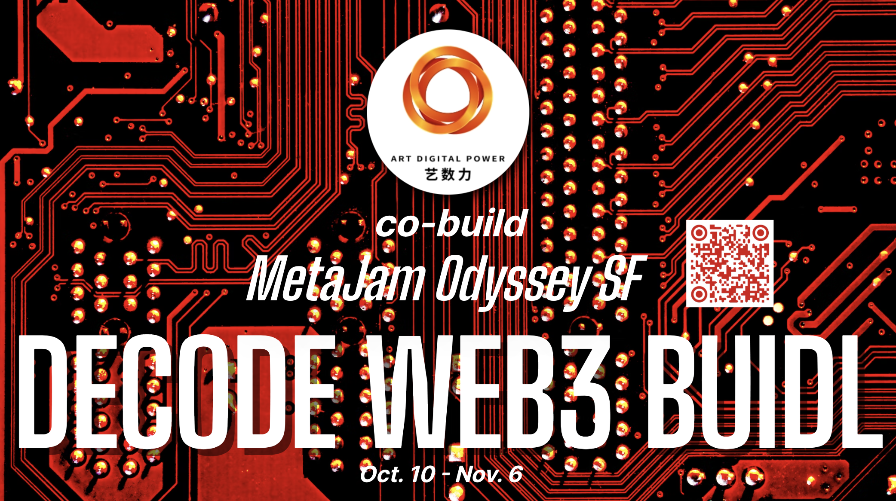

# 「MetaJam Odyssey SF | 道创旧金山奥德赛」序曲华章不断，欢迎即刻参与！

> **MetaJam Odyssey SF | 道创旧金山奥德赛**，全球首场线上+线下 Web3 奥德赛活动，7 大活动板块，纵横 8 城 3 大洲，环绕太平洋，邀约全球 Web3 建设者，解码 Web3 BUIDL，解锁 Web3 协作，共建 Web3 新世界，自 10 月 10 日启动以来，反响热烈，观众踊跃报名、合作伙伴纷至沓来……

# 目前加入的合作伙伴

(video)

_赞助商、共建伙伴、合作媒体纷纷发推打 Call_

- **Bing Ventures, Metaforo, MultiverseDAO, Uphonest Capital**

- **0xGenLabs, 0xW3 音乐节, Adot, Aptos Global, Aptos Hub, AptosYo, 艺数力, CreatorDAO, CyberConnect, FindTruman, Foresight Ventures, JDI Ventures, LetsMeMe, MetaEfi**

- **MetaEstate, Movebit, MOST, OVT Hubs, PAKA, Redline DAO, Sonorus, Sui World, Swap Chat, The PASS, Tiger VC DAO, Voice Street, WhoKnows DAO, Xcarnival**

- **币扑，比推，Blocklike，链捕手，Coinlive，海盗电台，Foresight News，金色财经**

_注：以上为截至 2022 年 10 月 19 日的名单，顺序按字母排列_

## 解码 Web3 BUIDL 欢迎参与共创

由 [MetaJam](https://www.metajam.studio)、[Decode](https://www.decode.build/)、[M7e](https://www.m7e.io/) 共同发起组织、与借[2022 旧金山区块链周](https://sfblockchainweek.io/)同期举行的 **MetaJam Odyssey SF | 道创旧金山奥德赛**，旨在为世界各地的 Web3 建设者搭建一个提供交流思想、寻求机会和建立伙伴关系的活动平台。

只要你 All in Web3，对解码 Web3 BUIDL 这一问题真心感兴趣，希望获得与世界同步的认知，链接海内外的协作机会，无论你是创业者、开发者、创作人、投资人、布道者、从业者，还是项目、机构、媒体、社区、DAO 的负责人，乃至年轻学生，无论通过**赞助、演讲分享、宣传推广，还是线下活动志愿者、线上线下活动听众**，都能参与到 MetaJam Odyssey SF | 道创旧金山奥德赛」中来！

_扫码或点击「阅读原文」报名_

有意赞助者，请加活动负责人微信 **Jeanchen27** 沟通。

# 序曲华章，精彩不断

原定于 10 月 10 日至 11 月 4 日举行的序曲活动（Prelude Events）是为 11 月 5 至 6 日在旧金山湾区举行的高潮活动（Climax Events）开展预热、吸引更多人关注参与，然而活动启动后，不仅有共建伙伴在 10 月举办活动，在 11 月 6 日之后仍然有各种活动希望加入 MetaJam Odyssey。

## PROJECT SHOWCASE：项目报名踊跃

- **主办：** MetaJam
- **时间：** 10 月 10 日至 11 月 6 日
- **链接：** https://www.metajam.studio/event/sf-odyssey
- **内容：** 所有感兴趣的 Web3 项目在 MetaJam 平台创建项目后，即刻点击上述链接勾选报名，在 Odyssey 活动专题页面集中亮相，供用户关注，以及下一步的机会。

## CITY MEETUP、VIRTUAL TALK：精彩正在上演

### 10 月 22 日 CITY MEETUP SHANGHAI：上海 Web3 造物节 by CreatorDAO

- **主办：** CreatorDAO
- **时间：** 10 月 22 日 10 时至 17 时
- **地点：** 上海闵行区得丘礼享谷
- **内容：** CreatorDAO 邀请全球知名 Web3 项目方和创作者参加主题为 Expanding Global Web3 Community Creativity 的线下派对，旨在为 Web3 创作者搭建互相交流和合作的机会，同时帮助项目社区和优质创作者建立联系。派对将大量展出首次面向公众展示的 Web3 创意作品，包括二创作品、实物插画、工具模型等。这些作品代表了过去一年 Web3 蓬勃发展的文化结晶。目前确认出席的知名项目方或社区包括 BAYC, Doodles, AZUKI, CheersUp, Theirsverse, Angry Cat, Sandbox 大中华社区, Gene_sis, CloneX, NFTPlay, Xbeyond, ARC DAO 等。

### 10 月 22 日 CITY MEETUP CHENGDU：Web3 成都集会 by OVT Hubs

- **主办：** OVT Hubs
- **时间：** 10 月 22 日 10 时至 18 时
- **地点：** 成都都江堰
- **内容：** 由多个 web3 社区和从业者共建发起，主要以分享、交流为主的派对聚会。主题为问 DAO 青城｜ Chengdu Web3 Fall Fest 不仅承接了大理 Web3 集会的精神，更是一次的自组织精神下的协作共创的实验与探索。
- **详情：** (微信文章)

### 10 月 22 日 CITY MEETUP HANGZHOU：D-Fun Web3 涂鸦滑板艺术节 by 0xGenLabs

- **主办：** 0xGenLabs
- **时间：** 10 月 22-23 日 10 时至 18 时
- **地点：** 浙江杭州钱塘区白蓝地文创街区
- **内容：** 国内首个 Web3 大型的涂鸦艺术节活动，本次活动场地面积达 3600 平米，平均单块可涂鸦面积 2m\*2m 以上。活动期间会邀请 Web3 知名设计师及专业涂鸦艺术家，以及 Collab Bayc 的滑板品牌，邀请专业的滑板团队前来滑板表演。本次涂鸦滑板节由当前 Web3 最火热和活跃的 10 多个项目联合举办，意通过更紧密的线下社交打造各个项目的影响力。同时也希望通过线下活动让更多人了解、加入、共建 Web3！

### 10 月 27 日 VIRTUAL TALK：2022 Move 开发者峰会 by Aptos World/Sui World

- **主办：** Aptos World/Sui World
- **时间：** 10 月 27-28 日
- **地点：** 线上
- **内容：** 亚太地区首场、规模最大、嘉宾最重磅的 Move 开发者峰会。数十名 Move 开发者、研究人员和创业者将汇聚一堂，进行一场为期两天的线上峰会，与来自 Sui 的 Sam Blackshear、Aptos 的 Wolfgang Grieskamp、Starcoin 的 Jolestar 等多位顶级 Move 开发者，了解 Move 开发的主要特性、使用案例及最新进展，同时也是一个对 Web3 下一代新技术——Move 语言的深入了解的机会。
- **详情：** (微信文章)

### 10 月 29 日 CITY MEETUP SHENZHEN：闭门会「GameFi 2.0 将会在哪里发生」by WhoKnows DAO

- **主办：** WhoKnows DAO
- **时间：** 10 月 29 日 14 时至 17 时
- **地点：** 深圳南山软件产业基地附近
- **内容：** 线下闭门分享会，限 15 人，定向邀约，深度探讨 GameFi 2.0。

### 11 月 4 日 CITY MEETUP LOS ANGELES：小组讨论「Web3 如何彻底改变娱乐业」by Foresight Ventures

- **主办：** Foresight Ventures
- **时间：** 11 月 4 日
- **地点：** 美国洛杉矶
- **内容：** 线下闭门分享，深入交流 Web3、NFT 与娱乐业

### 11 月 6 - 8 日 VIRTUAL TALK：首届 MoveCTF 安全竞赛 by Movebit

- **主办：** Movebit
- **时间：** 11 月 6-8 日
- **地点：** 线上
- **内容：** 全球首届 Move 安全竞赛，以吸引更多对 Move 语言和 Move 生态系统感兴趣的安全专家和开发者。
- **详情：** https://blog.movebit.xyz/post/movectf.html

### 11 月 11 - 14 日 CITY MEETUP SHANGHAI：加密上海·喜玛拉雅 Web3.0 数字艺术大展 by 艺数力

- **主办：** 艺数力
- **时间：** 10 月 11 日
- **地点：** 上海浦东喜马拉雅美术馆
- **内容：** 希望推动艺术生态的变革，确保 Web3.0 数字艺术发生在上海，实现一场“去中心化”的区块链上的大众艺术市集，邀请大众参与进一场发生于上海的加密艺术运动，提供一个具有突破性的前沿艺术的教育空间，同时也借 WEB3.0 的领先精神，打破加密艺术与传统艺术家，前沿艺术与传统文化，以及艺术群体之间的边界。
- **详情：** （微信文章）

**悉尼、新加坡、北京等各站 CITY MEETUP 和其他 VIRTUAL TALK 正在来的路上，敬请留意！**

## 沟通交流群现已开放

_电报群，扫码加入_

_微信群，扫码加管理员微信申请加入_

# MetaJam + Decode + M7e 联袂发起

_活动发起方合并社交媒体矩阵影响力_

## MetaJam

MetaJam 正在构建发现 web3 产品、构建创新项目的协作网络。目前聚合了数千个 Web3 项目，建设者在 MetaJam 能够相互联系、互相帮助产品成长。今年 8 月 17 日至 20 日在云南大理，MetaJam 以活动大篷车的形式举办了 Web3 可组合性奥德赛活动，以讲座、演示、研讨、游戏等吸引了 500 多名观众和 10 多名行业领袖的分享。

(video)
_大理 Web3 可组合性奥德赛_

## Decode 道创

Decode 道创是位于湾区的最大的技术、创新和创业社区，它与加州大学伯克利分校和斯坦福大学的学生组织、校友网络和创业中心联合主办，拥有 10,000 多名跨渠道的用户，每年吸引 50 多名顶级演讲者。作为 501(c)(3)法规注册的非盈利组织，Decode 道创的使命是给学生、创始人和投资者一个学习和探索未来的平台。

(video)
_2021 Decode 道创峰会_

## M7e 元宇宙特攻队

M7e 元宇宙特攻队通过媒体、活动、孵化等方式连接元宇宙建设者，推动下一代互联网早日到来。M7e 目前已成为中国最具影响力的 Web3 建设者社区之一，在各渠道拥有 10,000 多名订阅者，并通过 2021 年上海元宇宙文化周、与 IOSG 合办的 元宇宙嘉年华、2022 年元宇宙新春茶话会等一系列活深孚众望。

(video)
_2021 上海元宇宙文化周_

