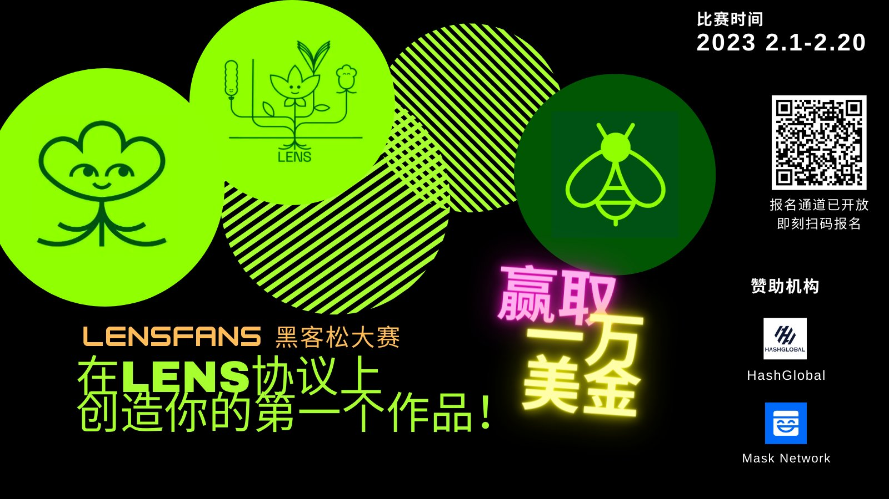
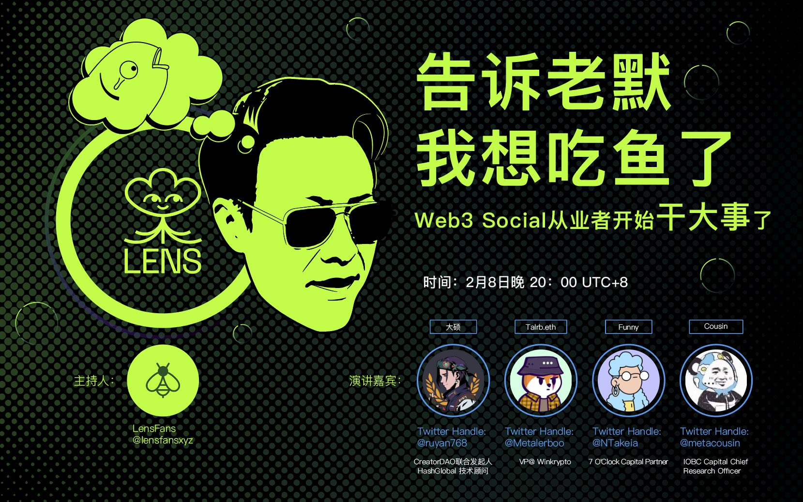
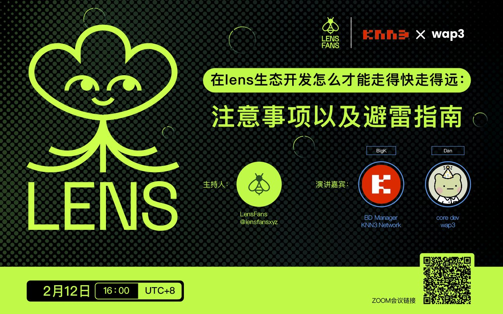

# Web3 社交春江水暖，LensFans Hackathon 参赛项目鸭先知？

> 确保用户身份数据自主、打破中心化审查垄断的 Web3 社交在去年生根发芽，而最近 Nostr 闪亮开局则预示着今年可能迎来爆发。由 Aave 团队开发的去中心化社交图谱协议 Lens 是该领域迄今为止最重要的协议之一，目前生态正在加速生长。为了让更多的华语开发者能够参与到 Lens 生态，贡献早期建设红利，**Lens 中文社区于 2023 年 2 月 3 日至 2 月 20 日举办 LensFans Hackathon**。

由 M7e 元宇宙特攻队和 MetaJam 参与支持的 LensFans 线上黑客松围绕社交媒体、社区/DAO 工具、创作者变现工具、DID、音乐、交易市场等数个细分赛道展开。截至 2 月 11 日，有 30 个团队报名参赛，20 日将举行 Demo Day 通过下列标准决出胜负，分配总额 10,000$的奖金：

- 创新度 30%
- 技术难度 20%
- 项目完整度 20%
- 增长潜力 20%
- 用户体验 10%

以下为参赛项目简介——

## 社交媒体

**项目名称：** Bookoo

- **参赛者：** 3andwich
- **描述：** Bookoo 是一款去中心化的短视频分发平台，旨在为用户带来有趣的体验，通过 create-to-earn 的方式为内容创作者们带来创作激励
- **目标：** 1.在现在产品的基础上完善更多功能模块的设计，完成移动端应用（iOS 和安卓）的开发；2.不断优化用户体验，降低用户使用门槛；3.不断吸引更多的内容创作者加入 Bookoo 社区

**项目名称：** DeSchool

- **参赛者：** CL
- **描述：** DeSchool 是一个 Web3 原生教育工具。通过整合社交协议、推荐协议、安全协议和关于 X2E 的智能合约、灵魂绑定证书、自动分配收入，DeSchool 正在建立 Web3 的教育基础设施，并重塑元宇宙里的教育系统
- **目标：** 1.实现所有计划的功能；2.为站点带来 1 万以上访问用户；3.加入 Lens 社区

**项目名称：** Lensfolio

- **参赛者：** Erc Wang
- **描述：** 在做一个类似 Dribble 的创作者平台
- **目标：** 1.基础功能；2.上线测试网

**项目名称：** MemeBook

- **参赛者：** 0xjohn
- **描述：** Web3 智能信息社区。用户迈入了解 Web3 的第一站。通过资讯观点与投资分析链上信息的智能分发，合约点评与社区互动 UGC 信息的公开共享，让 Web3 世界更加透明，对新用户更加舒适友好
- **目标：** 1.测试版本刚上线，帮助初级中级用户了解并进入 Web3 世界；2.调研 lens Protocol 整合进入 MemeBook

**项目名称：** Withlens.xyz

- **参赛者：** Delbert
- **描述：** 基于 Lens Protocol 开放协议的社交软件，通过 withlens.xyz 你可以发现、连接特定 NFT 持有者，加入社区。你可以按照 NFT Collection 查找或通过钱包登录等方式发现他们的 Lens Handle 并建立连接。
- **目标：** 1.上线测试版 withlens.xyz；2.索引并建立 20 个蓝筹 NFT 社区；3.NFT 发放并获取 1 万用户

**项目名称：** 未命名之浏览器插件

- **参赛者：** phiracle
- **描述：** Lens 浏览器插件，可以在发 Twitter 的同时，将内容发布到 lens
- **目标：** 1.插件下载量破 10,000；2.日活地址破 1000；3. 用户档案（Profile）超过 100

**项目名称：** 未命名之游戏化产品

- **参赛者：** Xingyu Li
- **描述：** 通过电脑桌面角色与区块链互动的过程游戏化
- **目标：** 公开版产品在以太坊主网上线，发布 NFT

## 社区/DAO 工具

**项目名称：** FansNFT

- **参赛者：** Sam
- **描述：** 帮助 KOL 在社区中发行粉丝 NFT，购买此 NFT 的用户将成为 KOL 的忠实粉丝，并且此 NFT 包含了粉丝含金量数值，数值越大，表示粉丝越忠实，KOL 可根据此数值为不同的粉丝提供不同价值的内容或服务
- **目标：** 1.完成项目测试并上线；2.发展 100 个 KOL，带来 10,000 个粉丝；3.结合 Lens Protocol 和 Nostr，为 KOL 和粉丝提供基于 NFT 认证的沟通渠道

**项目名称：** LensGrow

- **参赛者：** harlan009
- **描述：** 方便创作者一键发行内容 NFT，一键创建 DAO 组织，实现作品共有、分账等功能
- **目标：** 1.实现 Demo；2.集成 Lens；3.获取用户

**项目名称：** ShineX

- **参赛者：** ShineX Team
- **描述：** 一个致力于服务 Web3 内容生态和社区构建的增长引擎，帮助品牌加速流量或内容生态的增长，让每一个品牌的贡献者都能够获得应得的回报。品牌方可以通过项目提供的社交量化能力和通证激励系统来为每一位内容创作者和传播者公平提供回报，最大化激励社区成员参与，推动粉丝、流量、内容生态这三者飞轮的转动。
- **目标：** 1.项目上线主网，实现社交挖矿；2.与部分 KOL 达成合作；3.上线 NFT 激励早期核心用户

**项目名称：** Wap3.online

- **参赛者：** Steven Xu
- **描述：** 基于 Lens 的社交营销工具集
- **目标：** 1.完成投票功能主网上线；2.红包功能上线；3.达成 10 个项目合作采用

**项目名称：** 未命名之即时通讯产品

- **参赛者：** Johnny Zhang
- **描述：** Lens 的即时通讯类产品
- **目标：** 能够进行实地测试

## 创作者变现工具

**项目名称：** Buidlers.Space

- **参赛者：** Bruce
- **描述：** 一个提供给创作者零代码创建 NFT 并持续 build 及变现的工具，同时有一个 NFT 交易平台
- **目标：** 有 100 以上创作者入驻平台，100 以上 NFT 在平台上交易

**项目名称：** Gameland

- **参赛者：** Vincent
- **描述：** 一个独特的社区驱动的游戏社交及租赁基础设施，将开发者与他们的玩家联系起来。
- **目标：** 1.集成 Lens protocol 的社交图谱；2.集成 Lens protocol 有关 Gamefi 的内容文章；3.与 Gameland 的 Game id 相互绑定

**项目名称：** Lenstime

- **参赛者：** orrvan2
- **描述：** 1.用户可以将所有帖子或收藏进行分类建册，分类完成后相当于生产了对应的相册（image)、歌单(audio)、影集(video)、文字专刊；2.作为生产者可以分享自己建好的册子，也可以通过生产的内容去赚钱，或者获取流量和粉丝。作为普通用户，无需注册也可以浏览精彩的册子内容，在注册后还可以快速定位到对应的帖子进行收藏或者评论；3.通过策展功能，可以更好的发挥册子的功能，创作者通过自己拥有的所有册子，可以更好的二次创作，DIY 一个场景来分享给用户或自己的粉丝。
- **目标：** 1.完善册子功能，实现图册，歌单，影集的生成和分享；2. 在用户同意和授权的情况下，网站主页展示用户创建好的册子，吸引普通用户在网站留存；3.完成策展功能的初步开发，可以策展并分享。

**项目名称：** 未命名之 Wordpress

- **参赛者：** lyman
- **描述：** 基于 VitePress 开发 Web3 版本的 WordPress 工具
- **目标：** 1.添加用户友好的新建站点 NFT 功能；2.写 cli 让用户可以一个命令即可发布其已经写好的 Markdown 格式文章到 IPFS 上；3.添加通证门限功能，帮助创作者变现

## 数据分析工具

**项目名称：** MetaTrend

- **参赛者：** Will
- **描述：** MetaTrend 是基于 Web3 Social 数据的 Trends 协议，通过强大的数据挖掘与处理能力，为开发者提供多维度、个性化、可组合且便捷的 Trend APIs，帮助社交应用更精准地触达目标用户。
- **目标：** - 为至少 3 个 Lens 生态的社交应用接入服务- 完成至少 40 个 Trend APIs 开发- 支持除了 Lens 以外的第二个社交生态

**项目名称：** Lentics

- **参赛者：** Spring Zhang
- **描述：** Lentics 是 Lens 创作者分析工具，可分析其数据、互动、收入等
- **目标：** 正式版上线稳定运行，辅助创作者寻找最佳实践方案，提升创作者变现机会和能力

## DID

**项目名称：** Lensidentity

- **参赛者：** Alex
- **描述：** 现有 Lens Protocol 上的 Profile 类应用都只是让用户自行填写自己的社交账号链接，并没有去验证其真实性。我们计划创建个基于 Lens 的 Profile 应用。可以让用户登录并链接他们的社交账号,比如 Twitter/Discord/LinkedIn/Github 等, 并在验证过每个社交账号后铸造一个 NFT 来以此证明其真实性
- **目标：** 计划在 3 个月内完成大部分的功能并发布到主网, 包括以下功能：1.允许用户登录并验证其社交平台账号；2.允许用户在登录其社交平台账号后铸造一个相关的 NFT；3.用户在完成所有的认证后可以选择燃烧掉之前的 NFT 来获得一个更高级别的 NFT；4.创建手机应用并结合基于位置的 API，允许用户创建基于地区的 NFT，并以此来搜索附近的 Lens 用户；５.允许用户自定义各自 Profile 的样式

**项目名称：** 未命名之类 Linktree 应用

- **参赛者：** easy
- **描述：** 基于 Lens 的生态体系构建类似 Linktree 的身份 ID
- **目标：** 1.完成 Lens 前端设计；2.完成 Lens 代码的撰写；3.数据上链

## 音乐

**项目名称：** LensTune

- **参赛者：** Summer
- **描述：** 我们计划创建一个建立在 Lens Protocol 之上的音乐共享和播放平台，允许艺术家们创建专辑，上传他们的音乐作品，并为他们的音乐指定相关的 Creative Commons 版权许可证。粉丝们则可以购买收集音乐，创建自己的播放列表并与他人分享
- **目标：** 发布 dApp 到 Polygon 主网, 并实现以下功能：1.创建专辑；2.上传音乐；3.为每一首歌设置收集费用和 Creative Commons 的版权；4.搜索歌曲/歌手名字/专辑名字 等；5.创建并分享歌单 (playlist)；6.优化在线听歌；7.如果时间允许，将创建手机 App

**项目名称：** MMMM

- **参赛者：** Siela
- **描述：** 我们是 ORIGAMI LABS，一家专注于 Web3 音乐和娱乐行业的公司。我们的第一个产品 MMMM（Make Music Make Mess）是一个基于 Web3 的卡拉 OK 唱歌的应用。MMMM 允许你录制卡拉 OK，通过音乐结交粉丝和朋友，展示你的歌唱天赋，并以最令人兴奋的方式进行社交。O-labs 相信 Web3 的潜力，我们致力于探索和推动去中心化资产和社交方式的发展和应用。MMMM 是一款为热爱唱歌的人设计的 CreatorFi，音乐和娱乐的应用。
- **目标：** App DAU reach 100,000

**项目名称：** 未定名之音乐社交应用

- **参赛者：** gin
- **描述：** 音乐社交 NFT
- **目标：** 找到 10 位网红 DJ/音乐人入驻；收听量累计 100 万；用户 5,000 以上

## 其他

**项目名称：** Daily Lens

- **参赛者：** Jupiter
- **描述：** 基于推荐系统的的邮件订阅服务
- **目标：** 1. 完成内容推荐算法 2. 上线订阅网站 3. 完成订阅邮件服务

**项目名称：** Murmes

- **参赛者：** Heichen
- **描述：** 一个基于区块链的代币化字幕众包协议，它致力于解决当前视频媒体平台中存在的「语言孤岛」问题。通过一套完整的交易机制和经济模式，视频创作者、字幕制作者、观众、投资者和视频媒体平台被连接在一个公开、透明和多方共赢的生态之中
- **目标：** 1.智能合约代码完成审计；2.前后端承载公众的测试使用；3.构建社区

**项目名称：** Spred

- **参赛者：** DaPangDun
- **描述：** 初期定位为服务创作者的中间件。通过链接 Web2 的主流社交媒体（如 Twitter，Facebook，Instagram）与 Lens，实现创作者内容的自动分发和个性化同步。项目鼓励在 Lens 上进行创作，并分发至其他平台，助力更多的加密用户使用原生的 Web3 平台，赋能 Web3
- **目标：** 1.产品 1.0 版完成，上线测试网；2.产品激励模型设计完成；3.产品受到 Lens 官方关注和认可

**项目名称：** Sophia

- **参赛者：** Jessica Wu
- **描述：** Sophia 智能是第一个由人工智能驱动的去中心化知识交易所。我们带有激励性的知识交易所，对休闲的求知者来说是高效和易于使用的，同时为寻求在现代商业世界中获得竞争优势的关键决策者提供重要的深入行业见解和点对点咨询。我们通过整合人工智能和区块链技术连接知识寻求者和提供者；我们结合人类智能和人工智能来促进学习和改善决策；我们为用户提供广泛的机会，让他们在平台上投入的时间能够赚取和获得真正的货币奖励；我们正在以边学边赚的机制革新知识流程的整个生命周期，以让智慧流动起来。
- **目标：** 1.通过开发智能算法、支付智能合约套装和平台用户体验来构建 MVP（最小可行性产品）。2.将平台的月度活跃用户群发展到至少 20,000 人，我们相信该项目将在此达到临界点。我们的目标是通过传统的用户获取和以加密为重点的营销的组合来实现这一目标；3.开展以吸引商业伙伴和机构加入为目标的对外拓展

**项目名称：** 未命名之签到应用

- **参赛者：** noy
- **描述：** Lens 签到打卡协议
- **目标：** 1.基本功能开发完毕，上线 Polygon 主网；2.得到 Lens 官方认可，加入 Lens 生态；3.开始有真实用户使用

LensFans Hackathon 2 月 3 日开赛以来，已组织导师和一线开发者开展了 3 场在线 AMA 和辅导和定期 AMA，赛后将优秀的项目提供资金支持对接。

- 2 月 3 日开幕式视频：https://youtu.be/3BO0eL75IVg

- 2 月 8 日推特 Space：https://twitter.com/lensfansxyz/status/1623289480185794561?s=20&t=8eLnz6UubK2j17brM4jOjA

- 2 月 12 日工作坊视频：https://youtu.be/iEzezAQD8lc
