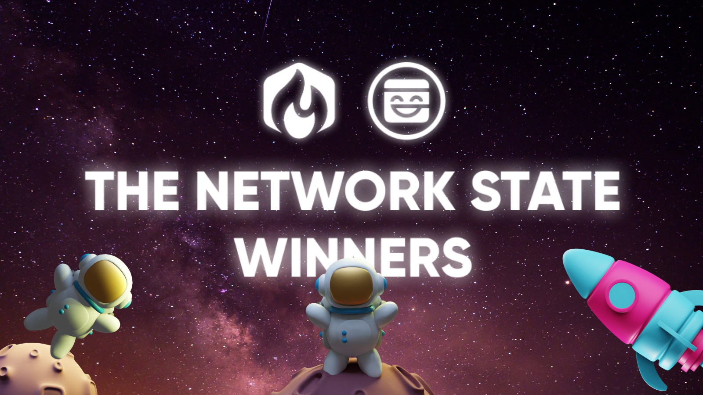
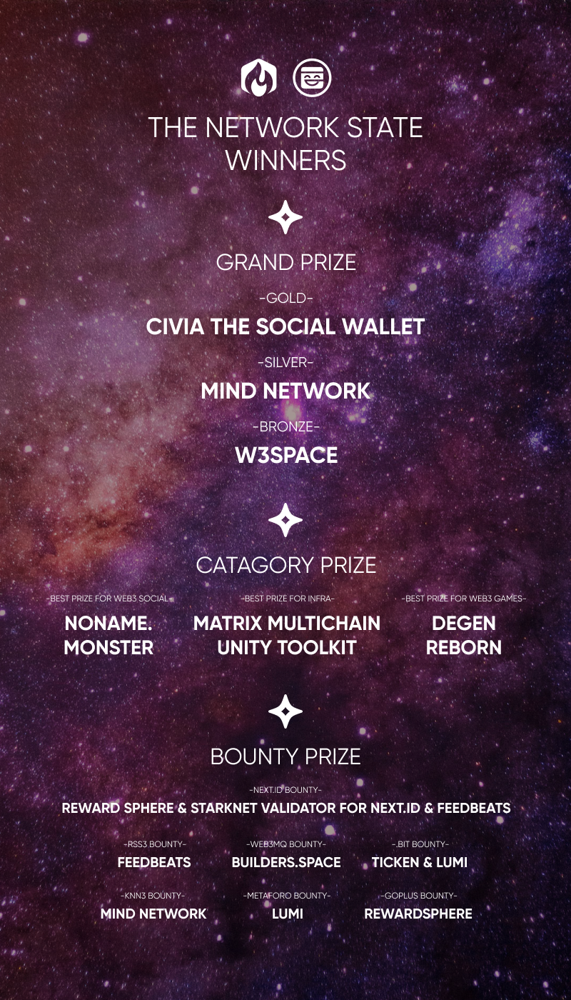

# Network State 线上黑客松获奖项目一瞥 | Jam Review No.24

> Web3 建立在人类新的协作方法的基础上，让人类可以在赛博世界创作属于自己的社区、货币、甚至是国家。在赛博空间中对游戏与劳动、数据与信息、经济与娱乐等这一切的探索，构筑了人们在数字时代对新的思想家园乌托邦的畅想。

2 月 10 日至 20 日，Mask Network 与 Matchbox 联合举办的 Network State 黑客松在线上举行，并于 2 月 20 日成功举办 Demo Day。本次黑客松获得了 Starkware 官方及其核心生态项目们的支持，同时获得了 Mask Network 社交生态支持。赞助方为开发者们提供超过 5 万美金的奖金，以吸引全球开发者们对新一代游戏、社交、及创作者经济进行构建。

黑客松期间共收到超过 200 名选手报名，开发者们来自中国、印度、美国、尼日利亚、日本、新加坡等全球各地。经过评审打分，18 个使用赞助商提供开发工具的优秀项目脱颖而出，入选本次黑客松 Demo Day。

## 奖项揭晓

**综合奖**

- **金奖**：Civia the Social Wallet
- **银奖**：Mind Network
- **铜奖**：W3Space

**分类奖**

- **最佳社交**：Noname.Monster
- **最佳基础设施**：Matrix Multicahin Unity Toolkit
- **最佳游戏**：Degen Reborn

## Demo Day 项目简介

[Civia the Social Wallet（金奖）](https://devfolio.co/projects/civia-the-social-wallet-386a)

Cvia the Social Wallet 基于 Starkware 的帐户抽象支持和 Argent 代码开发了具有社交恢复和社交图谱的钱包原型。该钱包除了可以用于加密资产交易之外，同时支持社交场景。在 Civia 中，用户受朋友邀请安装 app，并成为其社会恢复的「监护人」。用户还可以通过钱包关注来他们的朋友，这些链上活动会创建用户的社交图谱。

[Mind Network（银奖暨 KNN3 奖金](https://devfolio.co/projects/mind-network-4173)

Mind Network 提供了一个去中心化且实现隐私保护的数据湖，将在不牺牲隐私保护的情况下最大化数据的可用性。Mind Network 由一群世界级的专家建立在尖端的加密和隐私计算技术之上。在本次黑客松中，Mind Network 实现了在 SocialFi 上共享私人照片。通过 Mind Network，用户故事得到了改革：

- 只有加密过的照片才能公开共享和访问。原始照片无法访问，甚至泄露；
- 重要信息（例如面部编码）已加密。只有授权用户才能访问基于权限的重要信息；
- 和访问权限是去中心化的一样，AI 模型为去中心化且安全的。

[W3Space（铜奖）](https://devfolio.co/projects/wspace-cb41)

W3.work 是一个去中心化的面向 Web3.0 专业人士的社交元宇宙，能够显着提高 Web3.0 团队的社交活动、远程工作和社区互动的效率。主要亮点为：

- Web3 专业人员的工作场所，让远程工作更具吸引力；
- 用于商业和社交网络的元宇宙，连接 Web3.0 组织、团队、VC 和创作者；
- 一种有趣的新 Web3 工作方式，赋予创新和创造力。

[Noname.Monster（最佳社交奖）](https://devfolio.co/projects/nonamemonster-c3da)

Noname.Monster，Web3 的 GoDaddy，为 Web3 身份和域名提供了一个一体化平台，使用户能够在多个区块链上搜索、注册、交易和管理来自不同发行人的 Web3 身份，并简化 Web3 项目的集成工作流程。在 StarkNet 上，Noname.Monster 为 StarkNet.id 实现了单一注册、批量注册和域名探索功能。用户可以轻松浏览流行的 StarkNet.id 名称并一次注册多个 StarkNet.id。

[Matrix Multichain Unity ToolKit（最佳基础设施奖）](https://devfolio.co/projects/matrix-multichain-unity-toolkit-470a)

MultiChain Web3 ToolKit for Unity 提供组件包（脚本和 UI），旨在帮助游戏开发人员将 Web3 API 与 Unity 3D WebGL 构建集成。功能包括：

- 帮助将 WebGL Unity 3D 构建与 Web 集成
- 为 Ethereum、Flow、Aptos、Sui 等钱包提供集成 Web 3 Auth 的框架和标准 UI
- 提供 Unity 3D 和 React 的封装
- 可定制的 UI，易于集成的 API
- 提供用于签署消息、交易的 API

[Degen Reborn（最佳游戏奖）](https://devfolio.co/projects/degen-reborn-550f)

DegenReborn 是一款融合了加密货币机制的下一代创新生活模拟游戏。玩家可以购买代币、升级特定技能、提升游戏属性以赢得比赛。在 DegenReborn 中，游戏玩家可以将自己重生到为他们量身定制的多彩而又热闹的生活轨迹中！

[Starknet Validator for Next.ID（Next.ID 奖金）](https://devfolio.co/projects/starknet-validator-for-nextid-7648)

Starknet Validator for Next.ID 集成了 Starknet 对 Next.ID 验证的支持。它与平台无关，因为一旦它与证明服务器集成，用户就可以通过任何平台访问。

[RewardSphere（Next.ID 奖金暨 GoPlus 奖金）](https://devfolio.co/projects/rewardsphere-365d)

RewardSphere 是一种 Web3 社会影响力激励协议。RewardSphere 正在重新定义社交网络中的价值传递链。RewardSphere 让用户摆脱平台的束缚，利用平台的固有优势重塑 web3 社会影响的价值传递。在传统的 web2 社交媒体中，大部分价值都被社交媒体平台捕获。RewardSphere 从平台中夺回价值，并将其提供给真正的内容创作者和内容交互者，帮助他们为内容赢得更多关注。RewardSphere 通过使用 ERC1155 协议和 DID 技术，共享每个推特的所有权，让内容生产者与内容交互者形成良好的协作关系。且内容交互者可以根据自己的实际贡献获得一部分 twit NFT 的所有权。

[Feedbeats（Next.ID 奖金暨 RSS3 奖金）](https://devfolio.co/projects/feedbeats-827e)

作为 Web3 游戏玩家，很难知道 alpha 社区的用户是如何玩链上游戏的。对于所有 Web3 游戏玩家来说，赶上最新趋势并获得一席之地绝对有价值。Feedbeats 作为面向所有游戏玩家的 Web3 Feed，用户能够查看 alpha 用户在玩什么游戏。他们可以获取用户遵循 Lens 协议的事件信息作为提要内容。我们通过 RSS3 获取专注于链上游戏的链上事件。

[Builders.Space（Web3MQ 奖金）](https://devfolio.co/projects/buidlersspace-c913)

Builders.Space 提供创作者和品牌的一体式 Web3 空间。提供无代码的 DAO 构建、社区通证建设、会员 NFT 门槛，并适用于现实世界的各个行业。

[Ticken（.bit 奖金）](https://devfolio.co/projects/ticken-f143)

Ticken 是基于智能合约和开放协议帮助活动主办方创建 NFT 门票的工具，支持公开发售、门票空投&邀请等基本模式。解决二级市场的购票风险，并解决行业中存在的黄牛对门票的加价痛点。

[Lumi（.bit 奖金 & Metaforo 奖金）](https://devfolio.co/projects/lumi-pray-to-give-unite-to-build-7bc4)

Lumi 帮助有共同信念的人更好地团结和捐助，实现他们的理想世界。我们首先从基督教社区开始，因为我们聚集了 100 万基督徒追随者。

美国每年捐助总额为 5000 亿美元，其中最大的部分来自基督徒。然而，中心化的捐助机构存在高佣金、传播效率低、权力集中、只用筹集金钱的数额衡量贡献度等问题。Lumi 是一种让人们找到自己的精神共同体并团结起来建立理想世界的新方式。

[Builder Card](https://devfolio.co/projects/buidler-card-d96a)

Builder Card 是一种为 Network State 设计的，基于 SBT 基础的 ID 系统。在 Network State 中，每个成员都必须创建和维护包含其个人信息的 ID 卡。ID Card 不可转让，不可出售，这也是 Buidler Card 被设计成 SBT 的原因。未来 Builder Card 计划与 RSS3、.bit 整合，重写智能合约并部署到 StarkNet 上，以获得更好的体验和更低的更新个人信息的 gas 费用。

[Hamster](https://devfolio.co/projects/hamster-1a47)

Hamster 为 StarkNet 的一站式开发者提供工具包框架。使开发者能够通过智能合约模板、CICD 等实现高性价比的自动化开发。使开发者/团队实现高性价比、自动化的开发运维流程，包括合约模板、代码/合约检查、部署、节点服务、CI/CD 等，赋能 StarkNet 项目提升编码和交付 速度、质量和效率，以及产品的可靠性和安全性。

[Pink Paper](https://devfolio.co/projects/pink-paper-c9b0)

Pink Paper 试图通过为自由表达提供安全空间并通过筹款促进积极的社会变革来对抗大型科技平台上日益增加的审查趋势。通过 Pink Paper，用户可以通过创建和发布博客等形式的内容，分享对各种话题的看法。该平台提供了一个去中心化和无审查的空间，每个人都可以在这里表达自己而不必担心被压制。此外，Pink Paper 为筹款和支持改变世界的技术提供了途径，从而促进社会的积极变革。

[Uveryderiv](https://devfolio.co/projects/uveryderiv-6bfc)

Uveryderiv 是一个鼓励艺术结合的衍生社交平台，它使任何人都可以轻松地为创意项目做出贡献并迭代现有想法。

[Metopia & Metobadge](https://devfolio.co/projects/metopia-metobadge-ff4c)

Metopia 是基于声誉的 Web3 治理平台，用户可以探索非金融化的社区治理并通过 SBT 绑定的 MetoBadges 解锁链上声誉。MetoBadges 充当激励池的入场券，其中 USDT 通证、NFT 和其他可交易资产等奖品可以奖励给忠实会员。这意味着 MetoBadges 作为“钥匙”可以“解锁”不同的激励措施。

[Starsocial](https://devfolio.co/projects/starsocial-f457)

Socialstar 是一款社交媒体聚合器应用程序，它将多个 web3 社交（如 Farcaster 和 Lenster）组合到一个平台中，解决了社交媒体过载的问题。现在市场上有过多的社交媒体平台，用户要在多个平台上跟上他们的帐户是一项挑战。Socialstar 通过允许用户从单一平台查看他们的社交媒体帐户并与之互动来解决该问题，从而使其更加高效和方便。用户可以轻松地在不同的社交媒体平台之间切换，在所有平台上发布更新，并根据自己的喜好定制他们的订阅源。通过将 web3 社交聚合到一个地方，该应用程序简化了用户的社交媒体体验，节省了时间并减轻了管理多个社交媒体帐户的负担。
