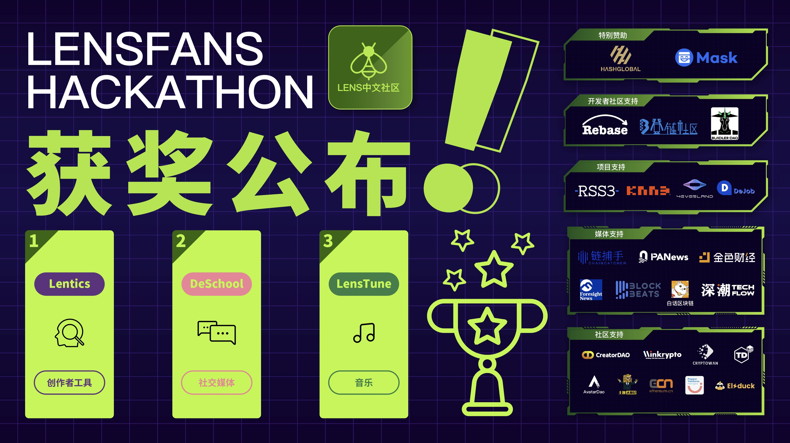
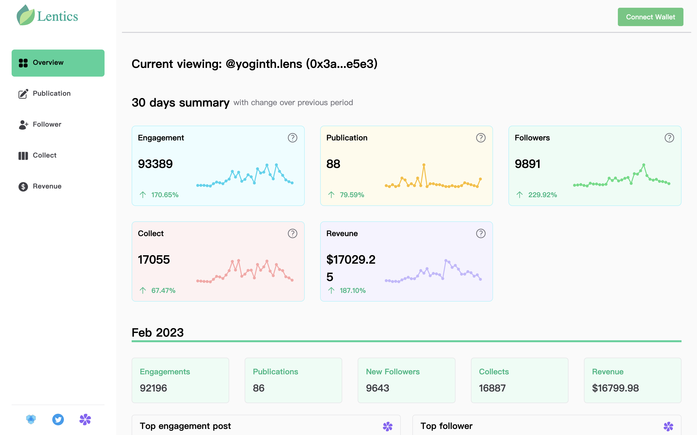
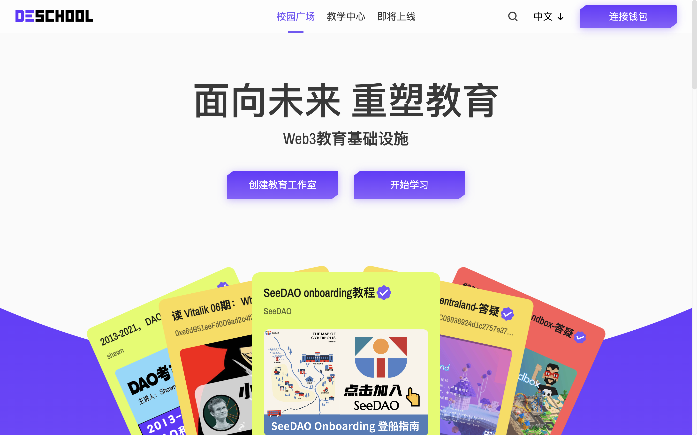
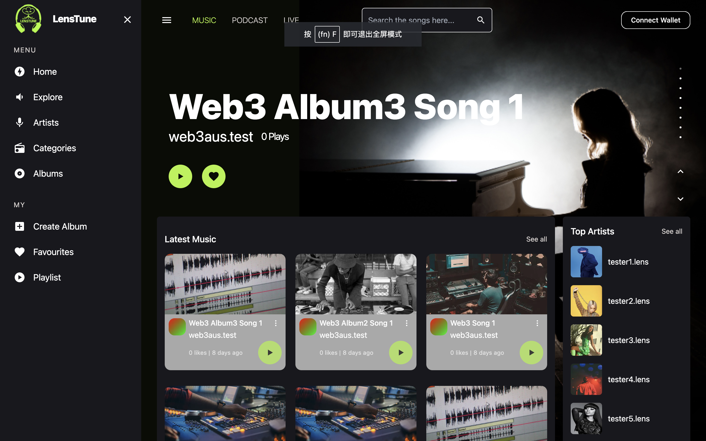

# LensFans Hackathon 揭晓：创作者工具、教育、音乐 NFT 名列三甲

> Lens 中文社区组织的 LensFans Hackathon 日前落下帷幕：**创作者分析管理工具 Lentics，教育社交媒体 DeSchool 和音乐 NFT 平台 LensTune** 分别获得本次黑客松前三名，分别获得$4000、$3000、 $3000 的奖金。

本次黑客松是围绕 Lens 协议建设的一个开始，Lens 中文社区将持续关注和扶持所有 Lens 生态的优秀中文应用，欢迎和 Lens 中文社区（推特@Lens_CN、Lens 账号 LensCN.lens）建立联系！支持本次黑客松的机构和项目方包括 HashGlobal、Mask Network、CreatorDAO、PANews、Winkrypto、BuidlerDAO、Rebase、KNN3、RSS3、MetaJam、M7e 元宇宙特攻队等。

## 第一名：Lentics

_https://lentics.xyz_

- Lentics 是服务 Lens 创作者的分析工具，可分析其数据、互动、收入等。
- 项目在完整度、增长潜力上都很突出，并且完全集成 Lens，**最终获得 31.34 的高分，勇夺第一**。

## 第二名：DeSchool

_https://deschool.app_

- DeSchool 是一个 Web3 原生教育工具。通过整合社交协议、推荐协议、安全协议和关于 X2E 的智能合约、灵魂绑定的证书、自动分配收入，DeSchool 正在建立 Web3 的教育基础设施，并重塑元空间的教育系统。
- DeSchool 是在创新度、技术、完整度、用户体验等方面都很出色的项目，目前正在加速集成更多的 Lens 功能。**项目最终得分 26.75，获得第二名**。

## 第三名：LensTune

_https://lenstune.xyz/_

- LensTune 是一个建立在 Lens Protocol 之上的音乐共享和播放平台, 允许艺术家们创建专辑, 上传他们的音乐作品，并为他们的音乐指定相关的 Creative Commons 版权许可证。粉丝们则可以购买/收集音乐，创建自己的播放列表并与他人分享。
- LensTune 为音乐 NFT 带来了全新的播放和收藏体验，这也是 Lens 协议所大力倡导的方向。**项目最终得分 23.66，获得第三名**。

## Demo Day 路演项目

- **Lensfolio** 正在打造一个类似于 Dribble 的基于 Lens 协议的创作者平台。
- **MetaTrend** https://metatrend.io/ 基于 Web3 Social 数据的 Trends 协议，通过强大的数据挖掘与处理能力，为开发者提供多维度、个性化、可组合且便捷的 Trend APIs，帮助社交应用更精准地触达目标用户。
- **Lensidentity** 基于 Lens 的 profile 应用，可以让用户登录并链接他们的社交账号, 比如推特、Discord、LinkedIn、Github 等，并在验证过每个社交账号后 mint 一个 NFT 来以此证明其真实性。
- **Lenstime** https://lensview.xyz/ 一款可以为用户在 Lens 上的数字资产进行分类建册，并提供引流、广告投放和策展功能的相册工具。
- **LensLink.xyz** https://lenslink.xyz 基于 Lens 的生态体系构建类似 Linktree 的身份 ID。
- **MMMM** 一个基于 Web3 的卡拉 OK 唱歌应用，为热爱唱歌的人提供的 creator-fi、音乐和娱乐等服务的应用。
- **Wap3.online** https://wap3.online/ 基于 Lens 的社交营销工具集。
- **Daily Lens** ​https://dailylens.social 基于推荐系统的的邮件订阅服务。
- **ShineX** https://www.shinex.club/ 一个致力于服务 Web3 内容生态和社区构建的增长引擎，愿景是帮助品牌加速流量或内容生态的增长。品牌方可以通过我们的项目提供的社交量化能力和代币激励系统来公平的为每一位内容创作者和传播者提供物质回报。以最大化的刺激社区成员的参与，推动粉丝、流量、内容生态这三者飞轮的转动。
- **Gameland** 是一个独特的社区驱动的游戏社交和租赁基础设施，将开发者与他们的玩家联系起来。
- **MemeBook** https://www.memebook.xyz/ Web3 智能信息社区，用户迈入了解 Web3 的第一站。通过资讯观点与投资分析链上信息的智能分发，合约点评与社区互动 UGC 信息的公开分享，让 Web3 世界更加透明，对新用户更加舒适友好。
- **Buidlers.Space** https://www.buidlers.space 一个提供给创作者零代码创建 NFT 并持续 build 及变现的工具，同时有一个 NFT 交易平台，平台的用户主页中接入了 lens protocol 数据流及发布 post 功能。
- **Bookoo** http://bookoo.xyz/ 一款去中心化的短视频分发平台，旨在为用户带来有趣的体验，通过 create-to-earn 的方式为内容创作者们带来创作激励。
- **Murmes** 是一个基于区块链的代币化字幕众包协议，它致力于解决当前视频媒体平台中存在的「语言孤岛」问题。通过一套完整的交易机制和经济模式，视频创作者、字幕制作者、观众、投资者和视频媒体平台被连接在一个公开、透明和多方共赢的生态之中。
- **GPTBot4Lens** 包含两大模块，基于 Telegram 的 ChatGPT 聊天机器人和基于智能合约的会员认证服务。其中，会员认证服务集成了 Lens Protocol 协议，使得 Lens 生态中的 KOL 可以和项目方进行合作，为其粉丝在开通会员时谋取更多优惠。
- **AIVERSE** https://aiverse.me 致力于打造基于 AIGC 内容标签的价值社交。在 AIVERSE 中，任何人都可轻易使用丰富多样的 AIGC 工具（包括：文本生成图片，音乐，视频，3D 模型等）将自己的绝妙想法快速转化成有趣的内容。AIVERSE 集成了 Lens Protocol 协议，所创造的作品能够发布成为 Lens 发布物，并绑定到 Lens Profile 中，赋能 Lens 生态中的所有用户低门槛，高效率地创作多元化的内容，在 Lens 生态中产生面向未来的价值交换。
