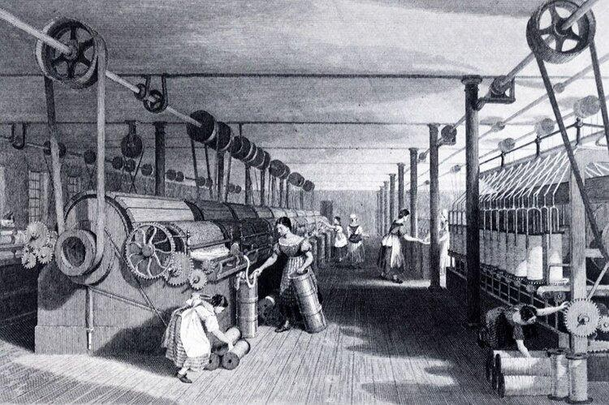
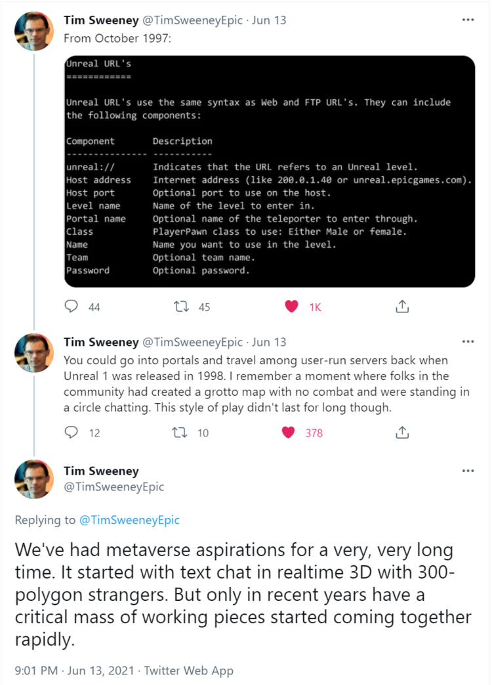
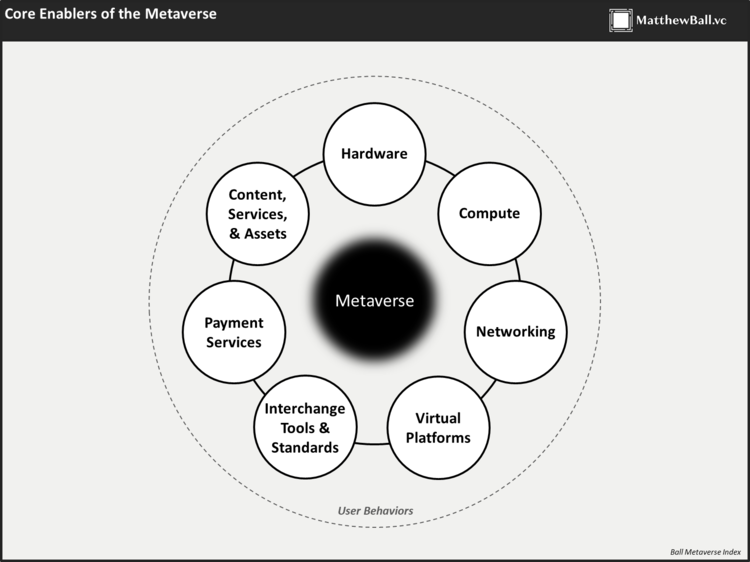
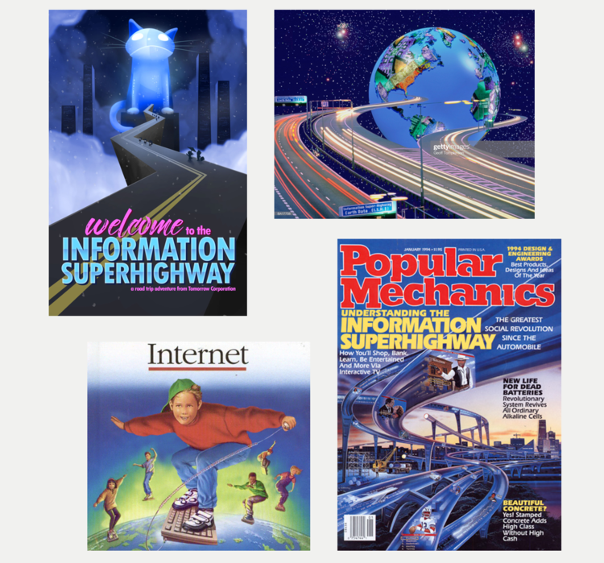

# 元宇宙初探（一）：认知元宇宙的一个框架 | Thought for Today

> 眼下，「元宇宙」（Metaverse）成为犹如炎炎盛夏般火热滚烫的领域、概念和术语。那么到底什么是元宇宙？ 有哪些构成要素？元宇宙何时到来？它将带来什么影响？试图介绍解答的文章内容层出不穷，与此同时，有越来越多的创业项目和投资都标榜「元宇宙」概念，一时令人眼花缭乱，因此也有人斥之为「泡沫」。
>
> 从今天起，元宇宙特攻队翻译连载由全球最早且最全面介绍「元宇宙」的投资人、策略师兼作家 Mathew Ball 新近撰写的《元宇宙初探》（The Metaverse Primer），以飨读者。

**By Mathew Ball**

> 我在 2018 年撰写了关于元宇宙的[首篇文章](https://www.matthewball.vc/all/fornite)，并在 2020 年 1 月题为 [The Metaverse: What It Is, Where to Find it, Who Will Build It, and Fortnite（元宇宙：是什么？在哪里找到它？谁来建造它？以及堡垒之夜）](https://www.matthewball.vc/all/themetaverse)的更新文章中全面修改了我的想法。从那时起，发生了很多事情。新冠疫情迫使数以亿计的人进行视频学习和远程工作。Roblox 成为历史上最受欢迎的娱乐体验之一。谷歌趋势中关于元宇宙的关键词索引在 2021 年 3 月达到 100 峰值——而从 2005 年 1 月到 2020 年 12 月，元宇宙这词的使用量从未超过 7。考虑到这一点，我认为是时候做一次更新了——对我的想法在过去 18 个月里是怎么变化的做一个说明，并解决我在这段时间里收到的各种问题，例如「元宇宙降临了吗？」、「它何时到来？」以及「它需要什么来发展？」。欢迎阅读[《元宇宙初探》](https://www.matthewball.vc/the-metaverse-primer)的前言。

移动互联网时代是什么时候开始的？有些人认为是从最早的移动电话问世开始的。有些人则觉得从 2G 的商业化部署开始，因为这是第一个数字无线网络。有些人是以无线应用协议标准的引入作为开始，因为它提供了 WAP 浏览器，从而让我们能够从几乎所有的「傻瓜手机」去访问大多数网站，即使那是相当原始的版本。当然，还有一些人认为是从黑莓 85x 系列问世开始的，因为这是第一个为随身数据设计的主流移动设备。但大多数人会说是从 iPhone 开始，不过它比第一部黑莓手机晚十多年，是在 WAP 出现的八年后问世。即便它在 2G 出现的近二十年后出现，距离第一个移动电话问世也过去了 34 年，但它的出现，从此定义了移动互联网时代的许多视觉设计原则、经济和商业实操。

事实上，罗马并非一日建成。我们可以确定一项具体的技术是什么时候创造、测试或部署的，但不能确定一个时代确切发生的时间。这是因为要推进技术的变革需要大量的技术更迭，然后才能一起出现。例如，电力革命不是一个稳定增长的单一时期。相反，它是两波独立的技术、产业和工艺相关的变革。

第一波开始于 1881 年左右，当时托马斯·爱迪生在曼哈顿和伦敦建立了发电站。尽管这是电力时代的一个快速开端——爱迪生仅在两年前就创造了第一个可用的白炽灯泡，并且仅在一年后就实现了商业化——但产业应用却很缓慢。在爱迪生的第一座发电站约 30 年后，美国只有不到 10% 的机械驱动力来自电力（其中三分之二的电力是在当地产生的，而不是来自电网）。但是，突然间，第二波浪潮开始了。[在 1910 年和 1920 年之间](https://eh.net/encyclopedia/the-u-s-economy-in-the-1920s/)，电力在机械驱动力中的份额翻了 5 倍，超过了 50%（其中近 2/3 来自独立的电力公司。到 1929 年，这一比例达到 78%）。)

第一波和第二波之间的区别不在于美国产业界有多少使用电力，而在于它使用的程度，以及围绕它的设计。

当工厂首次采用电力时，它通常被用于照明和/或取代工厂的内部电源（通常是蒸汽）。然而，这些工厂并没有重新考虑或取代传统的基础设施，将这些电力输送到整个工厂并让它投入工作。相反，他们继续使用笨重的齿轮网络，这些齿轮杂乱无章，声音大而危险，难以升级或改变，要么「全开」，要么「全关」（因此需要同样的电力来支持单个操作站或整个工厂，并遭受无数的「单点故障」），并努力支持特定工作。

但最终，新的技术和认知让工厂有理由也有能力对电力进行端到端的重新设计，从用电线取代齿轮，到为缝纫、切割、冲压和焊接等功能安装定制的专用电力驱动的单个工位。

其好处是广泛的。同一个工厂现在有相当大的空间，更多的光线，更好的空气，以及更少危及生命的设备。更重要的是，各个工位可以单独供电（这提高了安全性，同时减少了成本和停机时间），并使用更多的专业设备（例如电动套筒扳手）。

此外，工厂可以围绕生产过程的逻辑来配置生产区域，而不是庞大的设备，甚至可以定期重新调整这些区域。这两个变化意味着更多的行业可以在他们的工厂中部署装配线（实际上在 17 世纪末就已经出现了），而那些已经拥有这种生产线的企业可以更进一步、更有效地扩展它们。例如，在 1913 年，亨利·福特创造了第一条移动装配线，它使用电力和传送带将每辆汽车的生产时间从 12.5 小时减少到 93 分钟，同时使用电力更少。根据历史学家大卫·奈（David Nye）的说法，福特著名的高地公园工厂是「建立在电灯和电力应该随处可见的假设之上」。

一旦少数工厂开始这种转变，整个市场就被迫追赶，从而刺激了对基于电力的基础设施、设备和工艺的更多投资和创新。在其第一条移动装配线的一年内，福特公司生产的汽车数量就超过了整个行业其他公司的总和。到第 1000 万辆汽车下线时，福特制造的汽车已超过了道路上所有汽车的一半。

电力产业化采用的「第二波」并不取决于一个有远见的人从托马斯·爱迪生的核心工作中取得的进化飞跃。它也不仅仅是由越来越多的电站所驱动。相反，它反映了大量相互关联的创新，涵盖了电力管理、制造硬件、生产理论等方面。这些创新中的一些适合于工厂经理的手掌，其他的需要一个房间，少数需要一个城市，他们都依赖于人和过程。

回到奈所说的，「亨利·福特并不是先构思出装配线，然后把它的开发委托给他的经理们……高地公园工厂汇聚许多经理和工程师，他们了解美国使用的大多数制造工艺……他们集思广益，借鉴他们不同的工作经验，创造了一种新的生产方法。」这个在全国范围内发生的过程带来了「喧嚣的 20 年代」，它见证了一百年来劳动和资本生产率的最大的年平均增长。

## 为移动互联网提供动力

这就是如何看待移动互联网时代的方法。iPhone 令人感觉是移动互联网的开端，因为它将我们现在认为是「移动互联网」的所有东西统一和/或提炼成一个我们可以触摸、持有和喜爱的最小可行产品。但是，移动互联网是由很多东西创造和推动的。

事实上，我们可能甚至不是指第一部 iPhone，而是指第二部，即 iPhone 3G（在所有 iPhone 中，它的机型增长幅度最大，销量超过 4 倍）。第二款 iPhone 是第一个 3G 手机，它使移动网络变得可用，并运营 iOS 应用商店，让无线网络和智能手机变得有用。

但是，无论是 3G 还是应用商店都不是苹果公司独有的创新或创造。iPhone 通过英飞凌制造的芯片接入 3G 网络，这些芯片通过 ITU 和 GSMA 制定的标准进行连接，并由 AT&T 等无线运营商部署在 Crown Castle 和 American Tower 等塔台公司建造的无线塔顶上。iPhone 有「一个应用」，因为数以百万计的开发者建造了它们，就像 20 世纪 20 年代成千上万的不同公司为工厂建造专门的电动马达设备一样。此外，这些应用建立在各种各样的标准之上--从 KDE 到 Java、HTML 和 Unity——这些标准由外部各方建立和/或维护（其中一些在关键领域与苹果竞争）。应用商店的支付能使用是因为主要银行建立的数字支付系统。iPhone 还依赖于[无数其他技术](https://appleinsider.com/articles/08/07/12/every_iphone_3g_chip_named_illustrated_in_detail)，从三星的 CPU（从 ARM 获得授权），到意法半导体的加速器，康宁公司的大猩猩玻璃屏幕，以及其他来自博通、沃森和国家半导体等公司的组件。

上述所有的创造和贡献，共同促成了 iPhone 的诞生，开启了移动互联网时代。他们还确定了其改进路径。

琢磨一下 2020 年发布的 iPhone 12。苹果公司不可能花多少钱来发布 iPhone 12 作为其 2008 年的第二款机型。即使苹果当时能设计出 5G 网络芯片，也不会有 5G 网络供其使用，也不会有 5G 无线标准来与这些网络进行通信，也不会有应用来利用其低延迟或带宽。即使苹果早在 2008 年就制造了自己的类似 ARM 的 GPU（比 ARM 本身早了十多年），游戏开发者（创造了超过 2/3 的应用商店收入）也会缺乏利用其超强能力所需的游戏引擎技术。

实现 iPhone 12 需要整个生态系统的创新和投资，其中大部分都在苹果的能力范围之外（尽管苹果利润丰厚的 iOS 平台是这些进步的核心动力）。Verizon 的 4G 网络和美国铁塔公司的无线铁塔建设的商业应用取决于消费者和企业对 Spotify、Netflix 和 Snapchat 等应用激发的更快、更好的无线网络的需求。如果没有它们，4G 的「杀手级应用」将是……稍快一点的电子邮件。同时，更好的 GPU 被更好的游戏所利用，更好的相机被 Instagram 等照片分享服务所取代。而这些更好的硬件为更大的参与度提供了动力，这推动了这些公司更大的增长和利润，从而推动了更好的产品、应用和服务诞生。因此，我们应该认为整个市场是在自我驱动，就像电网的普及导致了小型工业电机的创新，反过来推动了对电网本身的需求。

我们还必须考虑改变用户能力的作用。第一代 iPhone 本可以完全省略 Home 键，而不是等到第十代。这将在设备内部为更高质量的硬件或更大的电池开辟更多空间。但是，对于一个比消费者习惯的更复杂、更有能力的手机来说，Home 键是一个重要的训练。就像关闭翻盖手机一样，如果用户感到困惑或点击了错误的应用程序，它是一种安全、简单和触觉的方式来「重启」iPhone。消费者花了十年时间才能够没有专用的 Home 键。这个想法很关键。随着时间的推移，消费者对先进的技术越来越熟悉，因此能够更好地采用进一步的创新——其中一些可能早已成为可能！

正如消费者转向新的思维定势一样，行业也是如此。在过去的 20 年里，几乎每个行业都围绕移动工作流程、产品或业务线进行了招聘、重组和重新定位。这种转变与任何硬件或软件创新一样重要——反过来，也为后续创新创造了商业应用。

## 我们应该如何看待元宇宙的问题，它何时会出现？

有了上述的认知，让我们来谈谈元宇宙。元宇宙经常被错误地描述为虚拟现实。这就像说移动互联网就是 iPhone 一样。iPhone 不是移动互联网，它是最常被用来访问移动互联网的消费者硬件和应用平台。

有时元宇宙被描述为一个虚拟的用户生成内容（UGC）平台。这就好比说互联网是雅虎、Facebook 或《魔兽世界》。雅虎是互联网门户/索引，Facebook 是以 UGC 为中心的社交网络，《魔兽世界》是大型多人在线游戏。其他时候，我们会碰到一个更复杂的解释，例如「元宇宙是一个持久的虚拟空间，能够实现身份和资产的连续性」，这更接近事实，但也是不够充分的。这有点像说互联网是 Verizon，或 Safari，或 HTML。这些都是连接你和整个网络的宽带供应商，一个可以从一个屏幕和 IP 标识符访问/显示所有互联网网页的网络浏览器，以及一种能够创建和显示网络的标记语言。当然，元宇宙并不意味着一个你可以在那里闲逛的游戏或虚拟空间（同样，元宇宙现在也不在「这里」，只是因为我们现在有更多的人在虚拟空间更经常地闲逛）。

相反，我们需要将元宇宙视为移动互联网的一种继承状态。虽然消费者将拥有核心设备和平台，通过它们与宇宙进行互动，但元宇宙取决于更多的东西。我们不说 Facebook 或谷歌是互联网，是有原因的。它们是互联网之上或其中的站点和生态系统，每个都可以通过浏览器或智能手机访问，也可以访问互联网的广大其他部分。同样，《堡垒之夜》和 Roblox 感觉像是元宇宙，因为它们将如此多的技术和趋势体现在一个单一的体验中，就像 iPhone 一样，是有形的，感觉与之前的一切都不同。但它们并不构成元宇宙。

## 元宇宙的框架

这篇文章的目的是提供一种思考元宇宙兴起的方法。我曾经写过，理想化的元宇宙愿景（由无限的持久性、无处不在的同步性、无限的并发性、广泛的互操作性等特征定义）还有几十年的时间才能实现。但我们将通过在众多领域进行持续的、相互关联的、交叉影响的进步来实现这一目标。

今天，这无疑正在进行中——不仅仅是因为互联网和移动互联网与之相关并被重新利用，还因为有大量新兴的、针对元宇宙的技术、体验和行为。

就我个人而言，我围绕着 8 个核心类别追踪元宇宙的出现，这些类别可以被认为是一个堆栈。

1. **硬件：** 用于访问、互动或开发元宇宙的物理技术和设备的销售和支持。这包括但不限于面向消费者的硬件（如 VR 头盔、手机和触觉手套）以及企业硬件（如用于操作或创建基于虚拟或 AR 的环境，如工业相机、投影和跟踪系统以及扫描传感器）。这个类别不包括如 GPU 芯片和服务器等计算专用硬件，以及如光缆或无线芯片组网络专用硬件。

2. **网络：** 由主干网供应商、网络、交换中心和在它们之间路由的服务以及管理到消费者的「最后一英里」数据的供应商提供持久、实时连接、高带宽和去中心化数据传输。

3. **计算：** 启用和提供计算能力以支持元宇宙，支持诸如物理计算、渲染、数据协调和同步、人工智能、投影、动作捕捉和翻译等多样化和高要求的功能。

4. **虚拟平台:** 开发和运营沉浸式数字和通常是三维的模拟、环境和世界，用户和企业可以在其中探索、创造、社交和参与各种各样的体验（例如，赛车、画画、上课、听音乐），并参与经济活动。这些业务有别于传统的在线体验和多人视频游戏，因为存在一个由开发者和内容创作者组成的大型生态系统，他们在底层平台上产生大部分内容和/或收取大部分收入。

5. **交换工具和标准：** 工具、协议、格式、服务和引擎，作为互操作性的事实上的标准，并让元宇宙的创建、运行和持续改进成为可能。这些标准支持诸如渲染、物理和人工智能等活动，以及资产格式及其从这个到那个经验的导入/导出、前向兼容性管理和更新、工具和创作活动，以及信息管理。

6. **支付：** 对数字支付流程、平台和业务的支持，其中包括从法币到纯数字货币和金融服务的通道（一种数字货币兑换形式），包括加密货币，如比特币和以太坊，以及其他区块链技术。

7. **元宇宙内容、服务和资产：** 数字资产的设计/创造、销售、再销售、存储、安全保护和财务管理，如虚拟商品和货币，与用户数据和身份有关。这包括所有「建立在」元宇宙之上和/或「服务于」元宇宙的业务和服务，这些业务和服务不是由平台所有者垂直整合到虚拟平台的，包括专门为元宇宙建立的内容，并独立于虚拟平台。

8. **用户行为：** 消费者和企业行为（包括消费和投资、时间和注意力、决策和能力）中可观察到的变化，这些变化或者与元宇宙直接相关，或者以其他方式让元宇宙成为可能，或者反映元宇宙的原则和理念。这些行为在最初出现时几乎总是像「趋势」（或更多贬义的「时髦」），但后来却显示出持久的全球社会意义。

_你会注意到「加密」或「区块链技术」不是一个类别。相反，它们跨越和/或推动了几个类别，最明显的是计算、交换工具和标准，以及支付——也可能是其他类别。_

这些圆圈中的每一个都对元宇宙的发展至关重要。在许多情况下，我们对每个元素需要如何发展有很好的感觉，或者至少在哪里有一个关键的阈值（例如，VR 分辨率和帧率，或网络延迟）。

但最近的历史告诫我们，不要教条式地看待任何特定的路径，或理想化的愿景，即一个全面运作的元宇宙。

互联网曾经被设想为「信息高速公路」和「万维网」。这两种描述对 2010 年或 2020 年的规划都没有特别的帮助，更不用说了解世界和几乎每一个行业将如何被互联网所改变。即使更具体的论述是正确的，它们也很少与最终的结果相吻合。几十年来，互联网显而易见会有纯粹的数字交易、大量的用户生成的内容和在线网络游戏，但这并没有让人能够预测到比特币、抖音或 Twitch。而且，即使人们能够预测到这些产品和服务的技术或运作原理，其用户的行为、货币化模式以及对社会的更广泛影响也是不可知的。

这就是说，我们对实现元宇宙所需的个别技术和行为有很好的感觉，但它们如何结合在一起，产生什么，才是艰难、重要和改变社会的部分。就像电力革命的意义不仅仅在于 1900 年代纽约每平方英里所生产的千瓦时。

然而，根据先例，我们可以猜测，元宇宙将彻底改变几乎所有行业和功能。从医疗保健到支付、消费产品、娱乐、钟点工，甚至是性工作。此外，全新的行业、市场和资源将被创造出来，以实现这个未来，新类型的技能、职业和认证也将被创造出来。这些变化的综合价值将达到数万亿。

以上为《元宇宙初探》的前言。

## 关于作者

Mathew Ball 是 EpyllionCo 的管理合伙人，负责运营早期风险基金和企业和风险咨询部门。EpyllionCo 的投资组合包括 Genvid Technologies、The Athletic、Dapper Labs、Antenna、Subspace、Dave's Hot Chicken、Parrot Analytics、Pushkin Industries、Blaseball、Headspace、Mirror.XYZ、One More Multiverse 等。

此外，Mathew Ball 是全球最大的游戏风险基金 Makers Fund 的合伙人，也是 Ball Metaverse Research Partners 的联合创始人，该公司创建并运营 Roundhill Ball Metaverse ETF 指数（纽交所代码：$META）。

2016 至 2018 年，Mathew Ball 担任亚马逊工作室的全球战略主管。在此之前，他是切宁集团下属奥特媒体的董事，一家由长期担任新闻集团 COO 和 20 世纪福克斯 CEO 的 Peter Chernin 和一位埃森哲战略公司高管创办的数字媒体投资公司。在 2000 年代，他是加拿大自然资源部的一名全职森林消防员，并代表加拿大海岸警卫队发放划船许可证。

Mathew Ball 在《纽约时报》、《经济学人》和彭博社拥有专栏，并被这些媒体以及《大西洋》、《华尔街日报》、《纽约客》、《华盛顿邮报》、Vice、The Verge、CNN、CNBC、《金融时报》、BBC、《环球邮报》等报道。

**延伸阅读**

这里是「元宇宙特攻队」，我们下期见。
