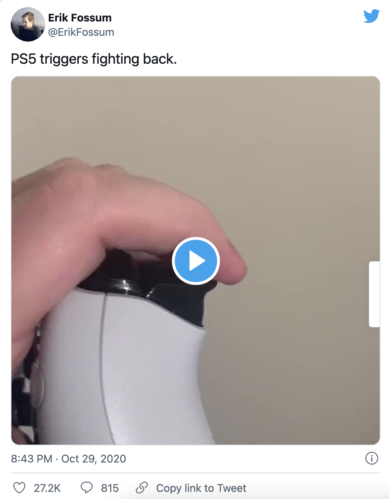
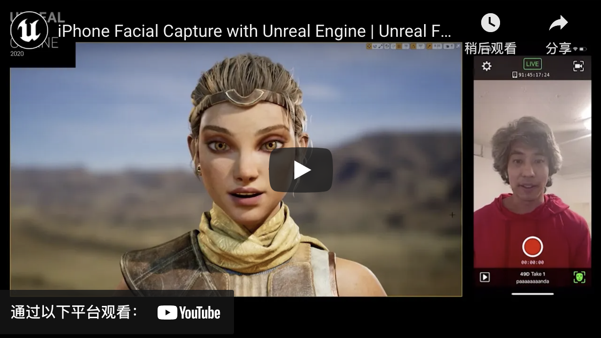
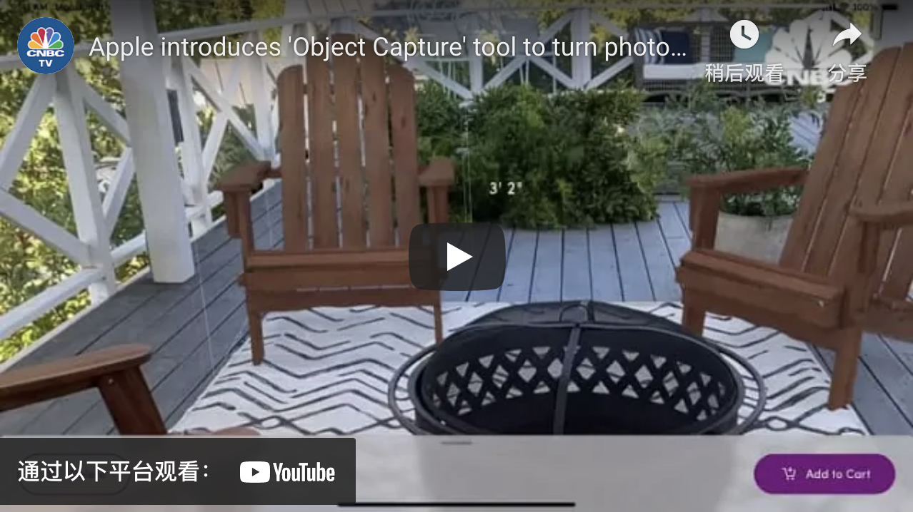
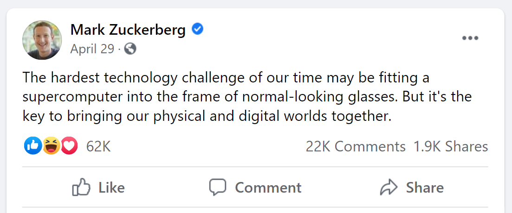
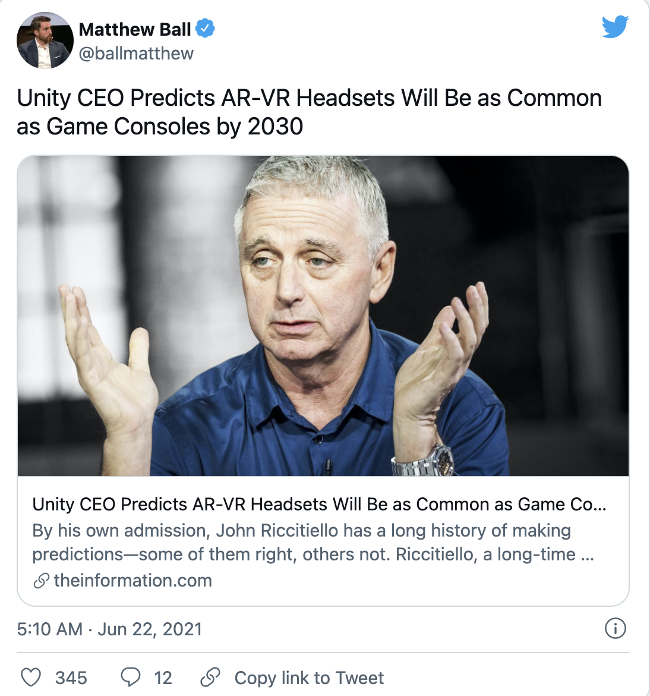
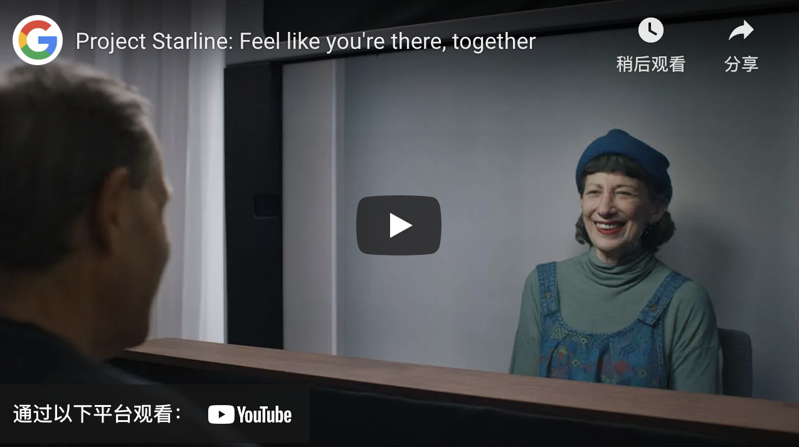
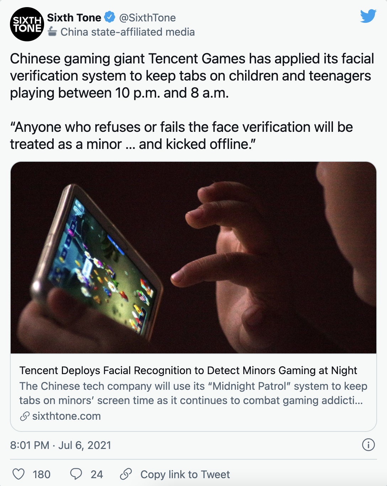

# 元宇宙初探（二）：硬件与元宇宙 | Thought for Today

> 昨天元宇宙特攻队翻译发布的《元宇宙初探》（The Metaverse Primer）的前言部分介绍了元宇宙的 8 个核心类别，今天介绍硬件对于元宇宙的作用。

**By Mathew Ball**

本文是《元宇宙初探》的第二部分，重点讨论硬件在「元宇宙」中的作用。在这里，硬件被定义为「用于访问、互动或开发元宇宙的实体技术和设备的销售和支持。这包括但不限于面向消费者的硬件（如 VR 头盔、手机和触觉手套）以及企业硬件（如用于操作或创建基于虚拟或 AR 的环境，如工业级相机、投影和跟踪系统以及扫描传感器）。这个类别不包括如 GPU 芯片和服务器等计算专用硬件，以及如光纤布线或无线芯片组等网络专用硬件。」

## 消费类硬件

每年，消费类硬件都受益于更好、更强的传感器，更长的电池寿命，更复杂/多样化的触觉，更丰富的屏幕，更清晰的摄像头，凡此种种。我们还看到越来越多的智能设备，如手表、VR 头盔（很快就会有 AR 眼镜）。所有这些进步都增强和扩展了用户的沉浸感，尽管软件提供了实际的体验或「魔法」。

推文链接：https://twitter.com/ErikFossum/status/1321794690572816389?s=20

作为一个有限的例子，考虑一下实时头像应用，如 Bitmoji、Animoji 和 Snapchat AR。这些都依赖于相当有能力的 CPU/GPU，以及复杂的软件。但它们也需要强大的脸部追踪相机和传感器硬件，并且这些硬件还在不断改进，使之更加丰富。更新的 iPhone 现在通过红外传感器追踪你脸上的 3 万个点。虽然这最常用于 Face ID，但它现在可以连接到 Epic Games 的 Live Link Face 应用程序，从而让任何消费者能够创建（和流直播）一个实时的、基于虚幻引擎的高保真头像。很明显，Epic 的下一步将是利用这一功能将《堡垒之夜》玩家的脸实时映射到他们的游戏角色上。

油管视频：https://youtu.be/R3c4WjSFXJg

同时，苹果公司的「物体捕捉」让用户能够在几分钟内用他们标准的 iPhone 手机中的照片创建高保真的虚拟物体。然后，这些物体可以被移植到其他虚拟环境中，从而降低合成物品的成本并提高其保真度，或者被叠加到真实环境中，用于艺术、设计和其他 AR 体验。

油管视频：https://youtu.be/88rttSh7NcM

许多新的智能手机，包括 iPhone 11 和 iPhone 12，都采用了新的超宽带芯片，每秒可发射 500,000,000 个雷达脉冲，接收器可处理返回信息。这让智能手机能够创建广泛的雷达地图，从你的家，到你的办公室，以及你走过的街道——并将你置于这些地图中，相对于其他本地设备，精确到几厘米。这意味着，当你从外面走近时，你的家门可以解锁，但从里面看仍然是关闭的。使用实时的雷达地图，你将能够在不需要摘下你的 VR 头盔的情况下浏览家里的大部分地方。

所有这些都可以通过标准的消费级硬件实现，这是令人惊讶的。这种功能在我们日常生活中的作用越来越大，这也解释了为什么 iPhone 能够将其平均销售价格从 2007 年的大约 450 美元提高到 2021 年的 750 美元以上，而不仅仅是以同样的价格提供更多的功能。

XR 头盔是另一个说明硬件方面的进步和突出需求的很好的例子。第一个消费级头盔 Oculus（2016 年）每只眼睛的分辨率为 1080×1200，而四年后发布的 Oculus Quest 2，每只眼睛的分辨率达到 1832×1920（大致相当于 4K）。Oculus 的创始人之一 Palmer Luckey 认为，要克服像素视野问题并成为主流设备，VR 需要两倍以上的分辨率。Oculus Rift 的刷新率也达到了 72 赫兹，而最新版本的刷新率为 90 赫兹，通过 Oculus Link 连接到游戏 电脑时，最高可达 120 赫兹。许多人认为 120 赫兹是避免一些用户迷失方向和恶心的最低门槛。而在理想情况下，这将在不需要游戏级个人电脑和拴绳的情况下实现。

虽然人类视野平均可以看到 210°，但微软的 HoloLens 2 显示屏只覆盖 52°（从 34° 起步）。Snap 即将推出的眼镜也只有 26.3°。推动应用起飞，我们可能需要更广泛的视野。而这些主要是硬件上的挑战，而不是软件上的。更重要的是，我们需要在取得这些进展的同时，提高可穿戴设备内其他硬件（如扬声器、处理器、电池）的质量--最好也能缩小它们的差距。

推文链接：https://twitter.com/ballmatthew/status/1407083433499803652?s=20

另一个例子是谷歌的 Starline 项目，这是一个基于硬件的展台，让你和其他人视频对话时感觉同处一室，它是由十几个深度传感器和摄像头，以及一个基于织物的多维光场显示器和空间音频扬声器驱动。这些都是通过体积数据处理和压缩来实现的，然后通过 webRTC 传送，但硬件对于捕捉和呈现「看似真实」的细节水平至关重要。

油管视频：https://youtu.be/Q13CishCKXY

## 非消费类硬件

鉴于消费级设备的种种可能性，工业/企业硬件的价格和尺寸成倍增长令人震惊，就不足为怪。徕卡公司现在售价为 20,000 美元的摄影测量相机，其「激光扫描设置点每秒可达 360,000 个」，旨在捕捉整个商场、建筑和住宅，其清晰度和细节比普通人肉眼所见的还要好。与此同时，Epic Games 的 Quixel 使用专用相机生成由数百亿个像素精确的三角形组成的环境 MegaScans。

这些设备让公司更容易和更便宜地生产高质量的「镜像世界」或物理空间的「数字孪生」，以及使用现实世界的扫描来生产更高质量和更便宜的幻想世界。15 年前，我们对谷歌捕捉（和资助）世界上每条街道的 360 度二维图像的能力感到震惊。今天，数十家企业可以购买激光雷达相机和扫描仪，以建立地球上任何东西的完全沉浸式的三维摄影测量复制品。

推文链接：https://twitter.com/SixthTone/status/1412381165604982785?s=20

当这些摄像头超越了静态图像捕捉和虚拟化，进入实时渲染和更新现实世界时，它们变得特别有趣。例如，今天，Amazon Go 零售店的摄像头将通过代码同时追踪几十名消费者。在未来，这种跟踪系统将被用来在一个虚拟的镜像世界中实时再现这些用户。然后，像谷歌的 Starline 这样的技术将允许远程工作人员从某种离岸的「元宇宙呼叫中心」出现在商店（或博物馆，或 DMV，或赌场）——或者也许在家里的 iPhone 面前。

当你去迪斯尼乐园时，你可能会看到你在家里的的朋友的虚拟（甚至是机器人）代表，并与他们合作打败奥创（Ultron）或收集无限宝石。这些体验需要的远不止是硬件——但它们是通过硬件来制约、启用和实现的。

以上为分为 9 部分的《元宇宙初探》的第 2 部分。

## 关于作者

Mathew Ball 是 EpyllionCo 的管理合伙人，负责运营早期风险基金和企业和风险咨询部门。此外，他还是是全球最大的游戏风险基金 Makers Fund 的合伙人，也是 Ball Metaverse Research Partners 的联合创始人。2016 至 2018 年，Mathew Ball 担任亚马逊工作室的全球战略主管。在此之前，他是切宁集团下属奥特媒体的董事。在 2000 年代，他是加拿大自然资源部的一名全职森林消防员，并代表加拿大海岸警卫队发放划船许可证。

Mathew Ball 在《纽约时报》、《经济学人》和彭博社拥有专栏，并被这些媒体以及《大西洋》、《华尔街日报》、《纽约客》、《华盛顿邮报》、Vice、The Verge、CNN、CNBC、《金融时报》、BBC、《环球邮报》等报道。

**延伸阅读**

这里是「元宇宙特攻队」，我们下期见。
