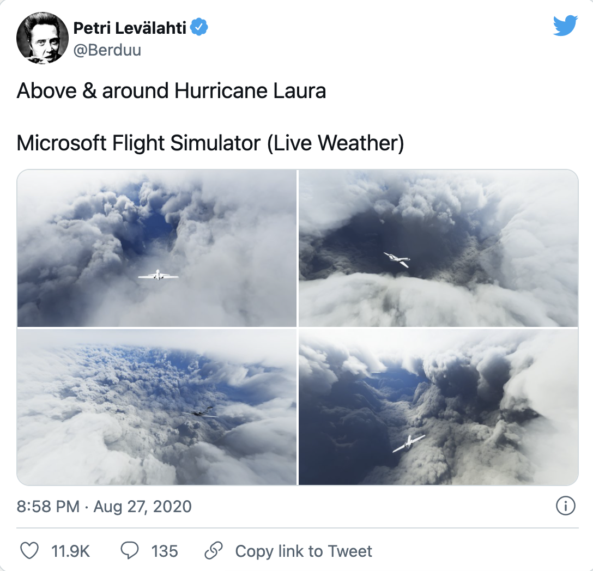
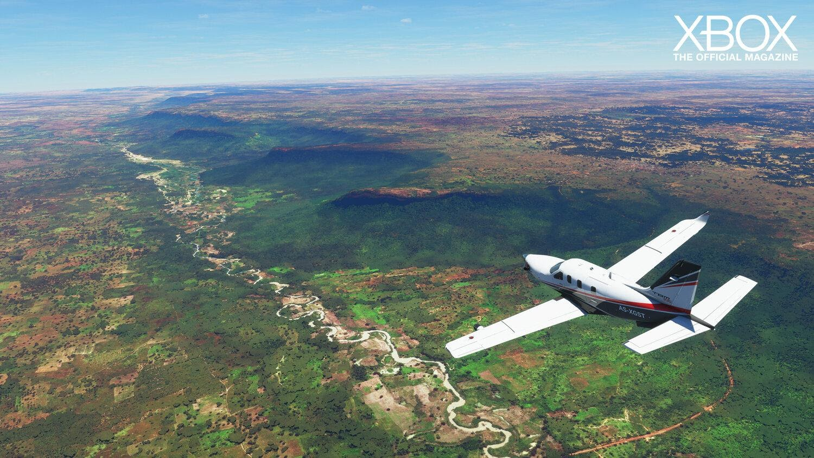
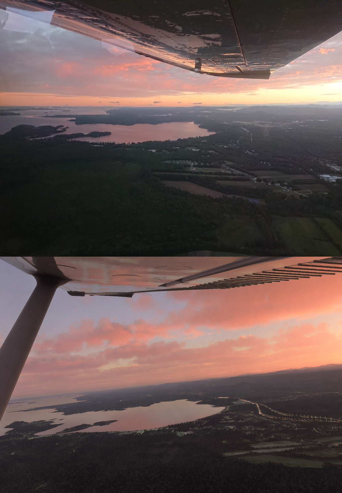
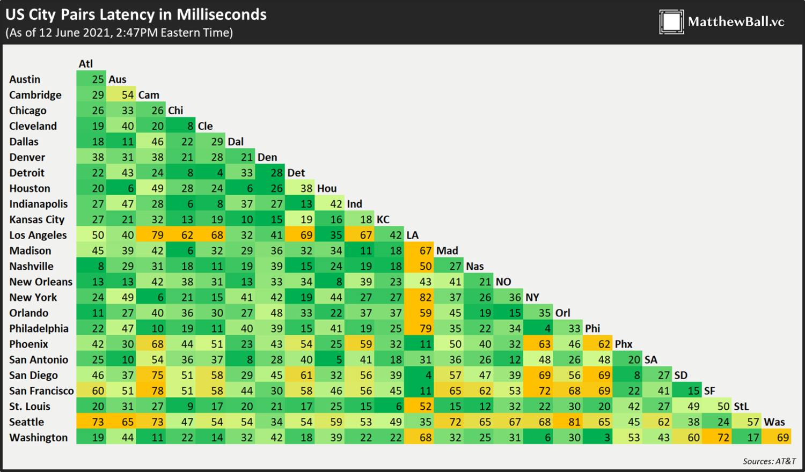
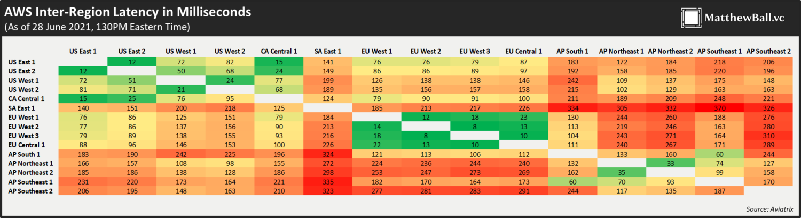
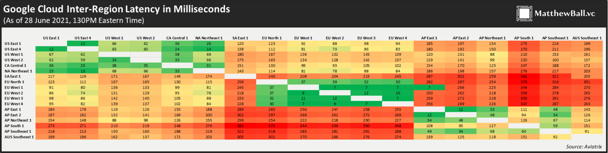

# 元宇宙初探（二）：硬件、网络与元宇宙 | Thought for Today

> 上次元宇宙特攻队翻译发布的《元宇宙初探》（The Metaverse Primer）的前言部分介绍了元宇宙的 8 个核心类别，今天介绍硬件、网络传输对于元宇宙的作用。

**By Mathew Ball**

## 硬件与元宇宙

> 《元宇宙初探》的第二部分重点讨论硬件在「元宇宙」中的作用。在这里，硬件被定义为「用于访问、互动或开发元宇宙的实体技术和设备的销售和支持。这包括但不限于面向消费者的硬件（如 VR 头盔、手机和触觉手套）以及企业硬件（如用于操作或创建基于虚拟或 AR 的环境，如工业级相机、投影和跟踪系统以及扫描传感器）。这个类别不包括如 GPU 芯片和服务器等计算专用硬件，以及如光纤布线或无线芯片组等网络专用硬件。」

### 消费类硬件

每年，消费类硬件都受益于更好、更强的传感器，更长的电池寿命，更复杂/多样化的触觉，更丰富的屏幕，更清晰的摄像头，凡此种种。我们还看到越来越多的智能设备，如手表、VR 头盔（很快就会有 AR 眼镜）。所有这些进步都增强和扩展了用户的沉浸感，尽管软件提供了实际的体验或「魔法」。

https://twitter.com/ErikFossum/status/1321794690572816389?s=20

作为一个有限的例子，考虑一下实时头像应用，如 Bitmoji、Animoji 和 Snapchat AR。这些都依赖于相当有能力的 CPU/GPU，以及复杂的软件。但它们也需要强大的脸部追踪相机和传感器硬件，并且这些硬件还在不断改进，使之更加丰富。更新的 iPhone 现在通过红外传感器追踪你脸上的 3 万个点。虽然这最常用于 Face ID，但它现在可以连接到 Epic Games 的 Live Link Face 应用程序，从而让任何消费者能够创建（和流直播）一个实时的、基于虚幻引擎的高保真头像。很明显，Epic 的下一步将是利用这一功能将《堡垒之夜》玩家的脸实时映射到他们的游戏角色上。

https://youtu.be/R3c4WjSFXJg

同时，苹果公司的「物体捕捉」让用户能够在几分钟内用他们标准的 iPhone 手机中的照片创建高保真的虚拟物体。然后，这些物体可以被移植到其他虚拟环境中，从而降低合成物品的成本并提高其保真度，或者被叠加到真实环境中，用于艺术、设计和其他 AR 体验。

https://youtu.be/88rttSh7NcM

许多新的智能手机，包括 iPhone 11 和 iPhone 12，都采用了新的超宽带芯片，每秒可发射 500,000,000 个雷达脉冲，接收器可处理返回信息。这让智能手机能够创建广泛的雷达地图，从你的家，到你的办公室，以及你走过的街道 —— 并将你置于这些地图中，相对于其他本地设备，精确到几厘米。这意味着，当你从外面走近时，你的家门可以解锁，但从里面看仍然是关闭的。使用实时的雷达地图，你将能够在不需要摘下你的 VR 头盔的情况下浏览家里的大部分地方。

所有这些都可以通过标准的消费级硬件实现，这是令人惊讶的。这种功能在我们日常生活中的作用越来越大，这也解释了为什么 iPhone 能够将其平均销售价格从 2007 年的大约 450 美元提高到 2021 年的 750 美元以上，而不仅仅是以同样的价格提供更多的功能。

XR 头盔是另一个说明硬件方面的进步和突出需求的很好的例子。第一个消费级头盔 Oculus（2016 年）每只眼睛的分辨率为 1080×1200，而四年后发布的 Oculus Quest 2，每只眼睛的分辨率达到 1832×1920（大致相当于 4K）。Oculus 的创始人之一 Palmer Luckey 认为，要克服像素视野问题并成为主流设备，VR 需要两倍以上的分辨率。Oculus Rift 的刷新率也达到了 72 赫兹，而最新版本的刷新率为 90 赫兹，通过 Oculus Link 连接到游戏 电脑时，最高可达 120 赫兹。许多人认为 120 赫兹是避免一些用户迷失方向和恶心的最低门槛。而在理想情况下，这将在不需要游戏级个人电脑和拴绳的情况下实现。

虽然人类视野平均可以看到 210°，但微软的 HoloLens 2 显示屏只覆盖 52°（从 34° 起步）。Snap 即将推出的眼镜也只有 26.3°。推动应用起飞，我们可能需要更广泛的视野。而这些主要是硬件上的挑战，而不是软件上的。更重要的是，我们需要在取得这些进展的同时，提高可穿戴设备内其他硬件（如扬声器、处理器、电池）的质量 —— 最好也能缩小它们的差距。

https://twitter.com/ballmatthew/status/1407083433499803652?s=20

另一个例子是谷歌的 Starline 项目，这是一个基于硬件的展台，让你和其他人视频对话时感觉同处一室，它是由十几个深度传感器和摄像头，以及一个基于织物的多维光场显示器和空间音频扬声器驱动。这些都是通过体积数据处理和压缩来实现的，然后通过 webRTC 传送，但硬件对于捕捉和呈现「看似真实」的细节水平至关重要。

https://youtu.be/Q13CishCKXY

### 非消费类硬件

鉴于消费级设备的种种可能性，工业/企业硬件的价格和尺寸成倍增长令人震惊，就不足为怪。徕卡公司现在售价为 20,000 美元的摄影测量相机，其「激光扫描设置点每秒可达 360,000 个」，旨在捕捉整个商场、建筑和住宅，其清晰度和细节比普通人肉眼所见的还要好。与此同时，Epic Games 的 Quixel 使用专用相机生成由数百亿个像素精确的三角形组成的环境 MegaScans。

这些设备让公司更容易和更便宜地生产高质量的「镜像世界」或物理空间的「数字孪生」，以及使用现实世界的扫描来生产更高质量和更便宜的幻想世界。15 年前，我们对谷歌捕捉（和资助）世界上每条街道的 360 度二维图像的能力感到震惊。今天，数十家企业可以购买激光雷达相机和扫描仪，以建立地球上任何东西的完全沉浸式的三维摄影测量复制品。

https://twitter.com/SixthTone/status/1412381165604982785?s=20

当这些摄像头超越了静态图像捕捉和虚拟化，进入实时渲染和更新现实世界时，它们变得特别有趣。例如，今天，Amazon Go 零售店的摄像头将通过代码同时追踪几十名消费者。在未来，这种跟踪系统将被用来在一个虚拟的镜像世界中实时再现这些用户。然后，像谷歌的 Starline 这样的技术将允许远程工作人员从某种离岸的「元宇宙呼叫中心」出现在商店（或博物馆，或 DMV，或赌场）—— 或者也许在家里的 iPhone 面前。

当你去迪斯尼乐园时，你可能会看到你在家里的的朋友的虚拟（甚至是机器人）代表，并与他们合作打败奥创（Ultron）或收集无限宝石。这些体验需要的远不止是硬件 —— 但它们是通过硬件来制约、启用和实现的。

## 网络和元宇宙

> 《元宇宙初探》第三部分主要讨论网络在「元宇宙」中的作用。在这里，网络被定义为「由主干网供应商、网络、交换中心和在它们之间路由的服务以及管理到消费者的「最后一英里」数据的供应商提供持久、实时连接、高带宽和去中心化数据传输。」

网络传输的三个核心领域 —— 带宽、延迟和可靠性 —— 可能是大多数读者最不感兴趣的元宇宙推动因素。然而，它们的约束和增长决定了我们如何设计元宇宙产品和服务，我们何时可以使用它们，以及我们可以（以及可能永远无法）做什么。

### 带宽

带宽通常被认为是「速度」，但它实际上是指在一个单位时间内可以传输的数据量。元宇宙的要求比大多数互联网应用和游戏要高得多，也超出了许多现在的网络连接。了解这一点的最好方法是通过微软飞行模拟器。

微软飞行模拟器是历史上最逼真、最广泛的消费级模拟器。它包括 2 万亿棵单独渲染的树木、15 亿座建筑和全球几乎所有的道路、山脉、城市和机场......所有这些看起来都像「真实的东西」，因为它们是基于真实事物的高质量扫描。但要做到这一点，微软飞行模拟器需要超过 2.5 PB 的数据 —— 即 250 万 GB。消费者设备（或大多数企业设备）没有办法存储如此大量的数据。

即使他们可以，微软飞行模拟器是一个实时服务，可以更新反映真实世界的天气（包括准确的风速和风向、温度、湿度、雨量和照明）和空中交通。你可以真正地飞入现实世界的[飓风](https://www.theverge.com/2020/8/27/21403769/hurricane-laura-microsoft-flight-simulator)中，同时跟踪 IRL 商业客机的准确飞行路线。

https://twitter.com/Berduu/status/1298968244200632321?s=20

微软飞行模拟器的工作方式是在你的本地设备上存储核心数据（它也运行游戏，就像任何主机游戏一样，与 Stadia 等基于云的游戏流服务不同）。但是当用户在线时，微软就会根据需要将大量的数据流传到本地玩家的设备上。想想看，这就像现实世界的飞行员一样。当他们翻过一座山或转过一个弯时，新的光信息就会传进他们的视网膜，第一次揭示看清那里的情况。在此之前，他们什么都没有，只是知道那里会有什么东西。

许多玩家认为这就是所有在线多人视频游戏中发生的事情。但是，事实上，大多数游戏服务只向单个玩家发送位置数据、玩家输入数据（如射击、投掷炸弹）和摘要级数据（如在战斗中剩余的玩家）。所有的资产和渲染数据都已经在你的本地设备上了，因此下载和安装的时间很漫长，加上硬盘驱动器的使用。

通过在需要的基础上发送渲染数据，游戏可以拥有更多的物品、资产和环境的多样性。而且，它们可以在不需要延迟游戏的下载和安装、更新批处理或巨大的用户硬盘的情况下做到这一点。因此，许多游戏现在正在接受这种本地存储信息和数据流的混合模式。然而，这种方法对以元宇宙为重点的平台最为重要。例如，与《马里奥卡丁车》或《使命召唤》这样的游戏相比，Roblox 需要（并从）资产、物品和环境多样性中获益更多。

随着虚拟仿真的复杂性和重要性的增加，需要流直播的数据量也会增加。至少在目前，Roblox 得益于一些基础预制构件和资产被广泛重新利用和轻度定制的现状。鉴于此，Roblox 主要是传输关于如何调整先前下载的物品的数据。但最终，这个虚拟平台会希望有近乎无限的变化和创造（几乎所有的变化它都无法完全预测）。

虚拟孪生平台（也被称为「镜像世界」），如微软飞行模拟器，已经需要重现现实世界的几乎无限的（和可证明的）多样性。这意味着发送的数据要比「这里的乌云」或「95% 像乌云 C-95 的乌云」多得多。相反，它是一个完全像这样的乌云。而且关键是，这些数据是实时变化的。

最后一点是关键。如果我们想在一个大型的、实时的、共享的、持久的虚拟环境中进行互动，我们将需要接收超级丰富的云推流数据。

_其中一个不是真的_

将{真实世界}与《堡垒之夜》的地图相比较。地球上的每个人都在同一个「模拟」中，在同一时间，并且具有完全的永久性。如果我砍了一棵树，那棵树就不可逆转地消失了，对每个人来说都不复存在。当你玩《堡垒之夜》时，它只是通过一个固定的时间点的地图版本进行操作。而你在该地图中所做的一切，只与少数用户共享，而且在重置前的很短一段时间内。砍了一棵树？它将在 1-25 分钟内被重置，而它首先只为最多 99 个其他用户而消失。地图只有在 Epic Games 发布新版本的时候才会真正改变。而如果 Epic Games 想把你的世界发给其他人，他们会选择你的宇宙，不考虑他们的宇宙，并在一个特定的时间点修复你的宇宙。对于许多虚拟体验来说，这很好。对于许多特定的元宇宙体验来说，这也会很好。但是有些（如果不是最重要的）体验会希望在所有的用户中，在任何时候都有持久性。

如果我们想在不同的虚拟世界之间无缝跳跃穿梭，云数据流也是必不可少的。《堡垒之夜》的 Travis Scott 音乐会涉及将玩家从游戏的核心地图无缝传送到一个从未见过的海洋深处，然后到一个从未见过的星球，然后深入到外太空。为了做到这一点，Epic 在活动前几天至几个小时通过标准的堡垒之夜补丁将所有这些游戏世界发送给用户（当然，这意味着如果用户在活动开始前没有下载和安装更新，他们将无法参与活动）。然后，在每个场景中，每个玩家的设备都在后台加载下一个场景。这个系统工作得非常好，但它要求发行商提前很长时间知道用户接下来会去哪个世界。如果你想选择，而且要从广泛的目的地中选择，你必须不是下载所有潜在选项的全部内容（这是不可能的），就是通过云推流下载。

除了增加环境数据外，还有增量的玩家数据。当你今天在《堡垒之夜》中看到你的朋友时，《堡垒之夜》服务器只需要向你发送你的朋友在哪里以及他们想做什么的信息，动画（例如重新装载突击步枪或摔倒）已经加载到你的设备上，你只需要运行。但是，当你有一个实时动作捕捉被映射到你朋友化身上时，这些详细信息也需要连同其他所有人一起被发送。如果你想在这个游戏内观看一个视频文件，就像《堡垒之夜》有时提供的那样，那么这也需要在虚拟世界内直播。听到人群的空间音频？一样。感觉到路人拂过你的触觉连体衣的肩膀一样。

许多玩家已经在为只需要位置和输入数据的在线游戏的带宽和网络拥堵而努力挣扎。元宇宙只会加剧这些需求。好消息是，全世界的宽带普及率和带宽正在不断提高。第三部分将详细讨论的计算也在不断改进，它可以通过预测在「真实」数据可以被替换进来之前应该发生的事情，来帮助替代受限的数据传输。

### 延迟

网络传输中最大的挑战也是它最不被理解的：延迟。延迟指的是数据从一个点到另一个点再返回所需的时间。与网络带宽和可靠性相比，延迟通常被认为是最不重要的 KPI。这是因为大多数互联网流量是单向的或异步的。在发送 WhatsApp 信息和收到阅读回执之间需要 100 或 200 毫秒甚至两秒钟的延迟，这并不重要。如果你点击 YouTube 的暂停按钮后，需要 20 或 150 甚至 300 毫秒，视频才停止，也没有关系。在观看 Netflix 时，连续播放流媒体比马上播放更重要。为此，Netflix 人为地推迟了视频流的开始时间，以便你的设备能够在你观看的那一刻之前下载。这样，如果你的网络阻塞一两分钟，你并不会有所察觉。

即使是视频通话，它也需要同步和持久的连接，对延迟的容忍度相对较高。视频是通话中最不重要的元素，因此音频是「最轻」的数据，如果出现网络拥堵，视频通话软件通常会优先处理音频。如果你的延迟暂时增加 —— 甚至到了几秒钟，而不是几毫秒的程度 —— 软件可以通过提高音频记录的播放速度和快速编辑摆脱停顿来拯救你。此外，参与者很容易管理延迟 —— 你只需等待一下。

然而，最具沉浸感的 3A 级在线多人游戏需要低延迟。这是因为延迟决定了玩家接收信息的速度（例如，玩家在哪里，手榴弹是否被扔出或足球是否被踢出），以及他们的反应被传输给其他玩家的速度。换句话说，延迟决定了你是赢还是输，是杀人还是被杀的结局。这就是为什么大多数现代游戏的帧数是视频平均帧数的 2-4 倍，以及为什么我们迅速接受这些增长，即使我们抵制传统视频的高帧数。这是性能的需要。

在视频游戏中，人类对延迟的阈值低得令人难以置信，特别是与其他媒介相比。例如，考虑一下传统的视频与视频游戏。一般人甚至不会注意到音频是否与视频不同步，除非它过早到达超过 45 毫秒，或过晚超过 125 毫秒（总共 170 毫秒）。可接受的阈值甚至更宽：提前 90 毫秒，推迟 185 毫秒（总共 275 毫秒）。对于数字按钮，例如 YouTube 的暂停按钮，如果我们在 200-250 毫秒后没有看到回应，我们才会认为我们的点击失败了。在 3A 级游戏中，狂热的游戏玩家在 50 毫秒延迟时感到沮丧，甚至非游戏玩家在 110 毫秒时也会感到受阻。游戏延迟在 150 毫秒时就无法玩了。[Subspace](https://www.subspace.com/) 发现，平均而言，延迟增加或减少 10 毫秒就会减少或增加每周游戏时间 6%。这是一个非同寻常的发现 —— 其他企业都没有面临这个问题。

考虑到上述频段，让我们看看全球的平均延迟。在美国，从一个城市发往另一个城市的数据往返时间的中位数是 35 毫秒。许多配对都超过了这个时间，特别是高密度和密集需求高峰的城市（例如，旧金山到纽约的晚间）。然后是「城市到用户」的传输时间，这特别容易发生减速。密集的城市、社区或公寓很容易出现拥堵。如果你是通过手机玩，今天的 4G 技术平均还有 40 毫秒。如果你住在主要城市中心以外，你的数据可能要再走 100 英里，而且是在陈旧的、维护不善的有线基础设施上。在全球范围内，城市之间的数据延迟中位数为 100-200 毫秒。

为了管理延迟，在线游戏行业已经开发了许多解决方案。然而，没有一种方法完全解决问题。

例如，大多数高保真多人游戏都是围绕服务器区域进行「匹配」的。通过最大限度地减少居住在美国东北部、西欧或东南亚的玩家的集中，游戏发行商能够在地理基础上最大限度地减少延时。由于游戏是一种休闲活动，通常是与一到三个朋友一起玩，这种集群的效果足够好。毕竟，你不太可能和几个时区以外的人一起游戏。而且你也不太关心你的未知对手（你通常甚至无法与之交谈）住在哪里。不过，Subspace 发现，在中东地区，大约有四分之三的互联网连接超出了动态多人游戏的可玩延迟水平，而在美国和欧洲，有四分之一的互联网连接超出了可玩延迟水平。这主要反映了宽带基础设施的限制，而不是服务器的位置。

多人在线游戏也使用[「网络代码」解决方案](https://arstechnica.com/gaming/2019/10/explaining-how-fighting-games-use-delay-based-and-rollback-netcode/)，以确保同步性和一致性，从而确保玩家游戏。基于延迟的网络代码将告诉玩家的设备（如 PlayStation 5）人为地延迟渲染其主人的输入，直到更多潜在玩家（即他们的对手）的输入到达。这让那些适应低延迟的玩家感到烦恼，但它是有效的。回滚网络代码更加复杂。如果对手的输入延迟了，玩家的设备将根据它预期发生的情况进行。如果发现对手做了一些不同的事情，设备将尝试解开正在进行的动画，然后「正确」地重放它们。

这些解决方案对于一对一游戏（如 2D 战斗机）、小的延迟故障（如 ±40 毫秒）以及具有有限的高度可预测动作的游戏（如驾驶游戏、2D 战斗机）来说效果不错。但是当我们扩展到更多的以元宇宙为重点的体验，有更多的玩家、更大的延迟变化和更多的动态场景时，这些解决方案就会退化。我们很难连贯和正确地预测十几个玩家，并以一种非破坏性的方式「回滚」他们。相反，简单地断开一个滞后的玩家的连接更有意义。虽然视频通话有许多参与者，但每次只有一个人真正重要，因此有一个「核心」延迟。在游戏中，从所有玩家那里获得正确的信息是很重要的，而延迟则是复杂的。

对于大多数游戏来说，低延迟并不是一个问题。《炉石传说》或《以文会友》等游戏要么是回合制，要么是异步制，而《王者荣耀》或《糖果粉碎》等其他热门游戏既不需要完美的像素，也不需要毫秒级的精确输入。真正需要低延迟的只是像《堡垒之夜》、《使命召唤》和《福尔扎》这样的快速切换游戏。这类游戏利润丰厚，但按游戏产量计算，它们在整个游戏市场中只占一小部分，在总游戏时间中的份额更小。

然而，虽然元宇宙不是一个快速切换的 3A 级游戏，但它的社会性质和预期的重要性意味着它将需要低延迟。细微的面部动作对人类对话来说非常重要 —— 而我们对细微的错误和同步问题非常敏感。社交产品也依赖于它们的普遍性。试想一下，如果 FaceTime 或 Facebook 不工作，除非你的朋友或家人在 500 英里以内，例如。或者只有当你在家的时候。如果我们想在虚拟世界中开发国外或远距离的劳动力，我们需要的不仅仅是多余的带宽。

不幸的是，延迟是所有网络属性中最难解决的，也是最慢的。如上所述，这个问题的部分原因是很少有服务和应用需要超低延迟交付。这限制了任何网络运营商或以延迟为重点的内容分发网络（CDN）的商业应用 —— 而这里描述的商业应用已经受到挑战，并与基本的物理定律发生争执。

在 11,000-12,500 公里范围，从纽约市到东京或孟买只需 40-45 毫秒。这符合所有的低延迟阈值。然而，虽然大多数互联网骨干网是光纤，但光纤电缆比光速低 30%，因为它很少在真空中（+损耗通常为 3.5dB/km）。铜缆和同轴电缆在距离上有更糟糕的延迟衰减，而且带宽更有限，这意味着拥堵和延迟交付的风险更大。这些电缆在住宅和商业建筑内部以及社区中仍占较大比例。

此外，这些电缆的铺设都不是一帆风顺的。而我们通常认为的「互联网主干网」实际上是一个松散的私人网络联盟，其中没有一个网络能完全传递数据包（或有动力将其延伸到拥有一两个更快的网段的竞争者那里）。因此，一对服务器或服务器和客户之间的网络距离可能比它们的地理距离大得多。此外，网络拥堵可能导致流量的路由更不直接，以确保可靠和持续的交付，而不是最大限度地减少延迟。这就是为什么从纽约市到东京的平均延迟是光在这两个城市之间旅行时间的 4 倍以上，而从纽约市到孟买的平均延迟是 4-6 倍。

升级或中继任何基于电缆的基础设施是非常昂贵和困难的，特别是如果目标是尽量减少地理距离。它还需要相当多的监管和政府批准。当然，要解决无线问题更容易。而 5G 当然有帮助，因为它平均在 4G 上减去 20-40 毫秒（并承诺低至 1 毫秒的延迟）。然而，这只有助于最后几百米的数据传输。一旦你的数据到达塔台，你就回到了传统的骨干网。

SpaceX 的卫星互联网公司 Starlink 承诺为整个美国提供高带宽、低延迟的互联网服务，并最终覆盖世界其他地区。但这并不能解决超低延迟的问题，尤其是在很远的距离。虽然 Starlink 实现了从你家到卫星再到你家的 18-35 毫秒的旅行时间，但当数据必须从纽约到洛杉矶再到纽约时，这个时间会延长。毕竟，这需要在多颗卫星上进行中继。在某些情况下，Starlink 甚至加剧了旅行距离。纽约到费城的直线距离约为 100 英里，通过电缆可能为 125 英里，但在前往低轨道卫星并返回时则超过 700 英里。此外，光缆的损耗比通过大气层传输的光要小得多，特别是在阴天。密集的城市地区也很嘈杂，因此会受到干扰。2020 年，埃隆·马斯克强调，Starlink 专注于「电信公司很难触达、最难服务的客户」。在这个意义上，它将更多的人带入元宇宙，而不是提升那些已经参与的人。

正在开发全新的技术、业务线和服务，以满足对实时带宽应用日益增长的需求。例如，Subspace 在数百个城市部署硬件，以开发用于低延迟网络寻路的「天气图」，运营一个网络堆栈，然后将低延迟应用的需求与构成这一路径的许多第三方进行协调，甚至还建立了一个光网络，在各种光纤网络之间进行拼接，以进一步缩短服务器之间的距离，尽量减少非光纤电缆的使用。

同时，Fastly 提供了一个为低延迟应用而优化的 CDN，而不仅仅是交付可靠性和带宽。该公司采用「基础设施即代码」的方法，允许客户定制该公司边缘计算集群的几乎每一个方面，承诺一个软件应用可以在 150 毫秒内清除和替换全球所有这些集群的所有缓存内容，并且可以实时缓存和加速单个区块链交易。

### 可靠性

可靠性是相当明显的。我们向虚拟劳动和教育转变的能力直接取决于可靠的服务质量。这既包括整体的正常运行时间，也包括其他属性的一致性，如下载/上传带宽和延时。对于今天许多「生活在网上」的人来说，上述大部分内容可能看起来是危言耸听。Netflix 的流媒体在大多数时候都是 1080p 甚至 4K，完全没有问题！然而，像 Netflix 利用的可靠性解决方案，对于游戏或元宇宙应用来说，效果并不好。

像 Netflix 这样的非现场视频服务在向观众提供视频文件之前的几个小时到几个月就已经收到了所有的视频文件。这使他们能够进行广泛的分析，以便通过分析帧数据来缩小（或「压缩」）文件的大小，以确定哪些信息可以被丢弃。Netflix 的算法将「观察」一个有蓝天的场景，并决定，如果观众的网速下降，500 种不同的蓝色可以简化为 200 种，或 50 种，或 25 种。流媒体公司的分析甚至在上下文的基础上做到这一点 —— 认识到对话的场景比那些节奏更快的动作可以容忍更多的压缩。这就是多通道编码。正如前面所讨论的，Netflix 还利用闲置带宽在用户需要之前将视频发送到用户的设备上 —— 因此，如果连接性暂时下降或延迟增加，终端用户不会遇到任何变化。此外，Netflix 会在本地节点上预装内容；因此，当你要求看最新一集的《陌生人》时，它实际上只在几个街区之外。这对于实时创建的视频或数据来说是不可能的，根据上文所述，它们也需要更快的到达。这就是为什么 1GB 的 Stadia 云推流比 1GB 的 Netflix 更难。

因此，即使它的目标不一定是竞争性质的，我们也应该把元宇宙看作是把对网络的所有方面 —— 延迟、可靠性/弹性和带宽 —— 的要求提高到 3A 级多人游戏的水平。如果你的设备不能及时接收它所需要的所有信息，那么你的设备无论有多强大都不重要。

## 关于作者

Mathew Ball 是 EpyllionCo 的管理合伙人，负责运营早期风险基金和企业和风险咨询部门。此外，他还是是全球最大的游戏风险基金 Makers Fund 的合伙人，也是 Ball 元宇宙 Research Partners 的联合创始人。2016 至 2018 年，Mathew Ball 担任亚马逊工作室的全球战略主管。在此之前，他是切宁集团下属奥特媒体的董事。在 2000 年代，他是加拿大自然资源部的一名全职森林消防员，并代表加拿大海岸警卫队发放划船许可证。

Mathew Ball 在《纽约时报》、《经济学人》和彭博社拥有专栏，并被这些媒体以及《大西洋》、《华尔街日报》、《纽约客》、《华盛顿邮报》、Vice、The Verge、CNN、CNBC、《金融时报》、BBC、《环球邮报》等报道。

**延伸阅读**

这里是「元宇宙特攻队」，我们下期见。
