# 元宇宙初探（三）：计算、虚拟平台与元宇宙 | Thought for Today

> 前两期元宇宙特攻队翻译发布的《元宇宙初探》（The Metaverse Primer）的前言和第一部分介绍了认知元宇宙的框架，硬件、网络传输和元宇宙的关系，今天介绍计算、虚拟平台对于元宇宙的作用。

**By Mathew Ball**

## 计算与元宇宙

> 这部分主要讨论**计算**在元宇宙中的作用。在这里，计算被定义为「为支持元宇宙而提供的计算能力，支持诸如物理计算、渲染、数据协调和同步、人工智能、投影、动作捕捉和翻译等多样化和高要求的功能。」

### 估计对更大计算能力的需求

在硬件和网络部分中，我只是回顾了作为元宇宙的一部分将被生成、发送和接收的增量数据 —— 如触觉、面部扫描和实时环境扫描。完整的范围将大得多。

例如，英伟达的创始人兼首席执行官黄仁勋认为，沉浸式模拟的下一步是比更真实的爆炸或街头比赛更伟大的东西。相反，它是对「粒子物理学、重力、电磁学、电磁波（包括）光和无线电波……压力和声音的规律」的应用。正如虚拟世界被增强一样，「真实」的世界也将被增强。每年，更多的传感器、照相机和物联网芯片将被集成到我们周围的物理世界中，其中许多将被实时连接到一个可以互动的虚拟模拟。同时，我们的个人设备将成为我们进入这些体验的通行证和兼职的创作工具。简而言之，我们周围的大部分世界将持续地相互联系和在线，包括我们自己。

总的来说，元宇宙将拥有人类历史上最大的持续计算需求。而计算资源现在和将来都可能是极其稀缺的。引用 Andreessen Horowitz 基金的普通合伙人 Chris Dixon 的话来说：「历史上，世界上每一种好的计算资源都是供不应求的……CPU 是如此，GPU 也是如此。」因此，计算能力的可用性和发展将制约和定义元宇宙（尽管终端用户不会意识到这一点）。如果数据不能被使用，你能收到多少数据，或多快，或为什么，都不重要。

考虑一下今天最流行的类似于元宇宙的体验，如堡垒之夜或 Roblox。虽然这些平台通过令人难以置信的创造性成就获得了成功，但重要的是要认识到，它们的基本想法远非全新 —— 它们只是新的可能性。开发者长期以来一直想象着在一个单一的、共享的模拟环境中，有几十个（如果不是几百个或几千个）活生生的玩家一起体验，以及除了想象力以外没有任何能够限制的虚拟环境。

只是到了 2010 年代中期，数以百万计的消费级设备才能够处理一场有 100 名真实玩家的游戏，并且有足够多价格低廉的服务器端硬件，能够近乎实时地同步这些信息。一旦这一技术障碍被打破，游戏行业很快就被专注于丰富的用户自创内容（UGC）和高并发用户数量的游戏所超越（《自由之火》、《PUBG》、《堡垒之夜》、《使命召唤：战地》、《Roblox》、《Minecraft》）。而这些游戏随后迅速扩展到以前 「只有 IRL」的各种媒体体验（例如《堡垒之夜》中的 Travis Scott 音乐会，或 Roblox 中的 Lil Nas X 的音乐会）。

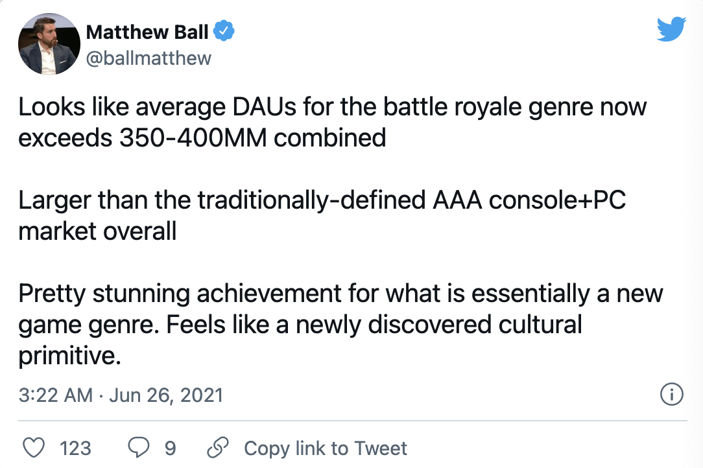
_https://twitter.com/ballmatthew/status/1408509957327273992?s=20_

然而，即使在大逃杀类型出现四年后，仍然需要一些技巧来确保它发挥作用。例如，大多数玩家从未真正在一起。相反，他们分散在一张大地图上。这意味着，虽然服务器需要跟踪每个玩家在做什么，但每个玩家的设备不需要渲染他们或跟踪/处理他们的行动。而当《堡垒之夜》将玩家聚集到一个更狭窄的空间进行社交活动时，例如音乐会，它将参与者的数量减少到 50 人，并限制了他们与标准游戏模式相比能做什么。而对于处理器不那么强大的用户来说，要做出更多的妥协。几年前的设备会选择不加载其他玩家的定制服装（因为它们没有游戏后果），而只是将他们表现为库存角色。值得注意的是，《自由之火》只有手机版，而且大多在新兴市场的中低端安卓系统上运行，其主战模式的上限是 50 人。

> [Tim Sweeney 2009 年说](https://www.wired.com/story/epic-games-qa/)：「这让我想知道，这些类型的游戏未来的演变将走向何方，而这个未来我们今天不可能建立。我们的巅峰是《堡垒之夜》的 1070 万玩家 —— 但那是 10 万个百人会议。我们最终能把他们都放在这个共享的世界里吗？这种体验会是什么样子的呢？由于技术不断进步，有一些全新的类型流派甚至还不能被发明出来。」

当然，这个问题会慢慢得到解决。《使命召唤：战争地带》在 2019 年提供了 150 人的比赛（尽管只在更高功率的游戏机和个人电脑里提供；《使命召唤》移动版则限制在 100 人）。Roblox 也允许在其相对较低保真度的世界里有 200 名玩家同时游戏，[在公测版中可能达到 700 人](https://devforum.roblox.com/t/max-player-count-increased-in-beta/722045)（并承诺有 1000 多人）。Improbable 已经做了 [4000 人同时在线的公开测试](https://www.gamesradar.com/heres-what-happened-when-4000-players-poured-into-one-game-lobby-in-scavengers/)。但「更多的并发用户」并不是对我们计算设备的唯一要求。我们希望我们在《堡垒之夜》中的角色能有更多可定制的物品，而不仅仅是一套衣服和一个背包。独立的鞋子和帽子呢？能否参与到虚拟音乐会中，而不仅仅是在一个基本没有互动、没有围栏的地方参加音乐会？回到前面的例子，只有不到 1% 的台式机或笔记本电脑的 Mac 和 PC 可以在最低保真度的设置下玩微软飞行模拟器。甚至微软的新一代 Xbox 游戏机 S 系列和 X 系列发布两个月后，也还不支持它（尽管它们将在今年晚些时候支持）。

这并不意味着所有元宇宙为重点的体验都需要丰富的、即时的处理，更不用说所有的时间了（沉浸式体验的保真度更高，但能够从更多的设备上访问它们比只能从你最好的设备上访问它们更好）。

但人类历史表明，额外的计算能力总是会带来进步 —— 这正是对计算的需求总是超过其供给的原因。为此，黄仁勋想要模仿上帝的神圣设计，可能看起来过分且不切实际，但这需要预测和否定可能产生的创新。谁会想到，能够容纳 100 人同时战斗的游戏会改变世界？

### 在哪里定位和建立计算

当涉及到解决我们对计算的不断扩大的需求及其相对稀缺性时，有几个不同的思想流派。一种是将尽可能多的模拟处理集中在云端，而不是本地计算设备上。例如，谷歌 Stadia 和亚马逊 Luna 在云端处理所有的视频游戏，然后将整个渲染的体验作为视频流推送给用户的设备。客户端设备唯一需要做的就是播放这个视频和发送输入（例如，向左移动按 X）。这种方法的支持者喜欢强调通过电网和工业发电厂为我们的家庭供电的逻辑，而不是私人的、针对家庭的发电机。基于云的模式允许消费者将其消费级的、不经常升级的计算机替换成企业级的「计算上荒谬的」（杰夫·贝索斯语）机器，这些机器每单位处理能力的成本效益更高，而且更容易替换。这意味着，无论你是有一台 1500 美元的 iPhone，还是一台有 WiFi 功能的带视频屏幕的旧冰箱，理论上你都可以玩《赛博朋克 2077》的所有渲染的荣耀。

另一个观点认为，我们最好把赌注押在本地计算的进步上，而不是押在必须与不可靠的网络抗争的远程超级计算机上。基于云的渲染和视频流是一个引人注目的想法，但它也大大增加了需要交付的低延迟数据量。如前所述，游戏内容的目标是每秒至少 60 帧（超过视频标准的两倍），多达 90-120 帧，最好是 2K 到 4K 的清晰度。在同一时间，以低延迟向每个想参与元宇宙的人可靠地提供这些内容……真的很难。这就是发电机的比喻开始破裂的地方：我们并不用这么努力来获得我们每天所需的电力，也不需要那样快。

即使在超低延迟的情况下，考虑到相机移动和接收新的输入数据的速度（即字面上的光速和只有几英尺远），流式（相对于本地处理）AR 数据也没有什么意义。考虑到 AR 的密集计算要求，我们的核心个人/移动设备可能会在大多数实时渲染方面做得「足够好」。

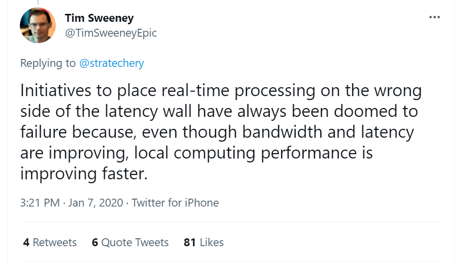

到目前为止，远程计算也没有被证明在渲染方面有多大的效率。这是因为基于云的 GPU 并不产生通用的渲染「能力」。相反，它们是被锁定的实例。单个 GPU，不管是远程还是本地，都只支持单个用户的渲染。还没有人想出如何有效、低成本、以现代人对分辨率和帧率的期望，将其渲染能力分给多个用户，就像电厂将电力分给多个家庭一样，或者一个 CPU 服务器可以支持百名玩家的输入、位置和同步数据的战斗。

因此，云渲染服务器通常面临着利用率问题，因为需要对高峰需求进行规划。一个云游戏服务在周日晚上 8 点可能需要 75,000 台专用服务器用于克利夫兰地区，但在周一凌晨 4 点只需要 4000 台。作为一个消费者，你可以购买一个 400 美元的 GPU，并让它尽可能多地处于离线状态，但数据中心的经济学是以优化需求为导向的。
这就是为什么 AWS 给客户一个优惠的价格，如果他们提前从亚马逊租用服务器（即「保留实例」）。客户可以保证在下一年使用，因为他们已经支付了服务器的费用，而亚马逊则将其成本和客户价格之间的差额收入囊中（AWS 最便宜的 Linux GPU 保留实例，相当于一台 PS4，一年的费用超过 2000 美元）。如果客户想在需要的时候访问服务器（「现货实例」），他们可能会发现没有，或者只有低端 GPU 可用，或者只有其他地区的 GPU 可用，这意味着更大的延迟。

如果这种模式流行，价格将得到改善（「AWS 消费级保留实例的利润率是我的机会」），但租用利用率低和企业加价的高端 GPU 始终是昂贵的。数据中心也会产生相当大的热量，这需要昂贵的能源来冷却，而从云流数据到高分辨率、高帧率内容的转变也意味着带宽成本大幅提高。与本地计算相比，这两项费用都是累加的。

最重要的是，消费级别处理器的改进要比网络快得多，因为它们的更换频率要高得多，而且并不是真的在与光速作斗争。这种增长并不能缓解所有的网络挑战，但它表明，我们最好要求客户端设备执行更多的计算，而不是向这些设备发送大量的视频流。这可能会随着时间的推移而改变，但斯威尼定律看起来可能在可预见的未来保持不变。

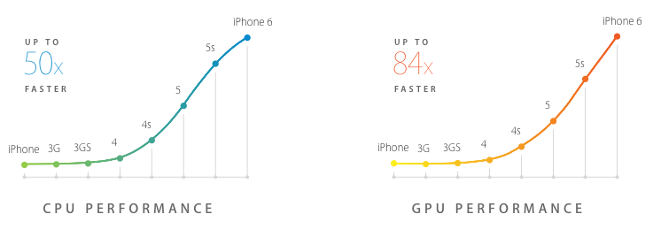

边缘计算经常被强调为元宇宙的一个关键基础设施战略。具体来说，这种模式涉及在消费者和较远的中央服务器之间的关键网络节点上部署超级计算机。边缘计算与上述两大流派思想都是兼容的，而且是相辅相成的，因为它可以帮助终端用户补充他们的本地计算，同时也可以将基于网络的延迟和网络拥堵风险降到最低。

这种方法的应用价值仍不确定。例如，微软的 xCloud 从标准的 Azure 数据中心而不是边缘进行操作。这可能是由于前面提到的云服务利用率问题 —— 你运营的边缘中心越多，利用率问题就越严重。大多数使用边缘计算的消费者服务，如 Netflix，实际上只是把它当作一个边缘硬盘，在离用户更近的地方存储文件。

Cloudflare 公司的创始人兼首席执行官 [Matthew Prince 认为](https://blog.cloudflare.com/cloudflare-workers-serverless-week/)，边缘计算的机会在于合规。由于政府法规要求对用户数据进行本地处理，互联网变得越来越分散，公司将别无选择，只能将数据的存储和处理放在离用户更近的地方。这在元宇宙中可能也是如此；政府的要求（无论是 GDPR 还是 CCPA）随着时间的推移只会越来越苛刻，就像在中国和俄罗斯早已发生的那样。

虽然谷歌是边缘计算的忠实信徒，但苹果认为未来真正的「边缘」计算模式将是我们口袋里日益强大的手机，因为它们将为我们周围的其他设备如手表和智能眼镜承担大部分负担。

但是，即使我们提高了消费级设备的计算能力，将更多的企业计算能力移到上述消费者身边，并建立更集中的基础设施，我们仍然可能会有不足。

这里有一个今年年初让我震惊的例子。从 2020 年 12 月到 2021 年 3 月，Genvid Technologies 在 Facebook Watch 上运营其第一个大型 [MILE](https://www.matthewball.vc/all/cloudmiles)（即大规模互动现场活动）。这个叫 Rival Peak 的活动，是一种虚拟化的美国偶像＋迷失+老大哥，一个为期 13 周、24 小时乘以 7 天的模拟游戏，13 个 AI 选手被困在一个虚构的太平洋西北地区。虽然没有任何角色是单独控制的，也没有任何一个观众是单独的角色，但数以万计的同时在线的观众能够实时影响模拟情境 —— 解决谜题以帮助参赛者，选择他们可以做什么，甚至影响谁生存和出局。Rival Peak 不可能在消费级设备上运行（它的高 CCU 尽管有延迟，但仍能工作，因为它为低延迟互动设计）。事实上，它几乎没有在 AWS 上运行。Rival Peak 有八个环境（生产、备份、暂存、质控和开发），每个环境都由十几个 GPU 和数百个其他 CPU 支持，在 AWS 上的 GPU 服务器曾经用完，而且在测试期间，经常耗尽可用的现货服务器。

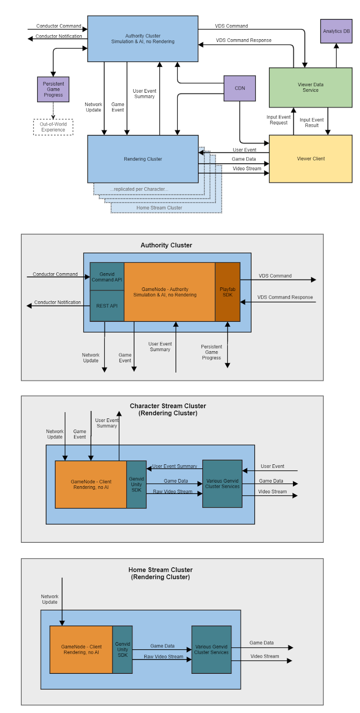

_Rival Peak 系统架构_

因为没有具体的玩家（更不用说「头号玩家」了），所以 Rival Peak 并不符合元宇宙的内在定义。然而，一个持久的、无休止的虚拟世界的运作，支持无限的互动，每一个互动都有持久的后果，这和其他任何一种最终状态的元宇宙接近。而且，即使是在它的雏形中，在不需要有意义的消费者端处理的情况下，它也在耗尽计算能力。

试想一下，英伟达对一个互联的镜像世界的愿景需要什么。或者绘制一个城市的整个几何形状所需的那种模拟，然后调整从交通灯到 5G 无线电波的一切，以便实时优化人流和信息流。只是为了[明年的 MILE](https://jnavok.medium.com/rival-peak-the-first-mile-is-the-hardest-255447221652)（尚未公布），Genvid 将需要增加 200% 的 GPU 和 CPU。

### 去中心化的计算

对处理的永不满足的需求 —— 最好是在离用户尽可能近的地方，但甚至在工业服务器群附近 —— 无一例外地激发了去中心化计算的概念。在消费者的家中和手中有这么多强大且经常不活跃的设备，我们开发系统来有效利用它们是不可避免的。至少在文化上，这个想法已经被充分理解。任何在家里安装了太阳能电池板的人都可以将多余的电力卖给当地电网（以及间接地卖给邻居）。伊隆·马斯克吹嘘说，在未来，你的特斯拉在不使用时可以作为自动驾驶汽车为你赚取租金，而不是在其 99% 的寿命里只是停在你的车库里。

> [Tim Sweeney 2019 年](https://www.wired.com/story/epic-games-qa/时说)，「在 1998 年我们交付第一款虚幻游戏时，我的待办事项清单上有一个有趣的项目。那就是让游戏服务器能够相互交谈，这样我们就可以在一个游戏进程中拥有不限数量的玩家 —— 而且这似乎仍然在我们的愿望清单上。你是否可以建立一个游戏，让数百万的玩家都能在一个共享的世界里一起玩，这个问题对现在的游戏行业来说是一个非常有趣的挑战。」

事实上，早在 20 世纪 90 年代，就出现了利用日常消费硬件进行分布式计算的项目。这方面的例子包括伯克利的 [SETI@HOME](https://en.wikipedia.org/wiki/SETI@home)，消费者将自愿使用他们的家用电脑为寻找外星生命提供动力。但最近的区块链概念，包括智能合约和通证，为这种共享提供了一个经济模型。在这个概念中，未被充分利用的 CPU 和 GPU 的所有者将因其处理能力的使用而得到某种加密货币的「支付」，也许是位于拓扑网络中「靠近」它们的用户。甚至可以对这些资源的使用进行现场拍卖，要么是有「任务」的人竞标使用，要么是有能力的人竞标任务。

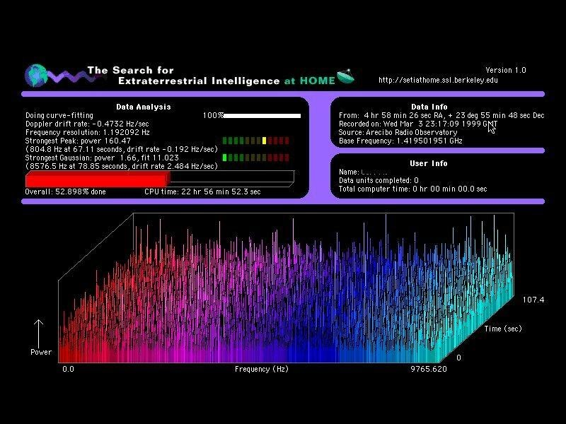

_SETI@HOME_

这种机制的一个例子是 OTOY 的 [Render Network](https://rendertoken.com/#intro)。作为第一个完全利用 GPU 的无偏差光线跟踪器，Octane Render 开创了周转时间，让实时修改场景成为可能。但对于其用户 —— 包括特效工作室、艺术家、动画师、设计师、建筑师和工程师 —— 来说，要利用这些突破性的能力，他们需要获得强大的实时处理能力。OTOY 通过创建基于以太坊的 RNDR 网络和通证，提出了利用闲置 GPU 网络的想法。作为昂贵的云计算供应商的替代方案，客户将渲染任务发送到计算机网络上，用通证支付给它们的所有者。双方之间的所有谈判和合约都由协议在几秒钟内处理，任何一方都不知道正在执行的任务的身份或具体细节。

> [Tim Sweeney 2017 年](https://venturebeat.com/2017/08/30/game-boss-interview-epics-tim-sweeney-on-blockchain-digital-humans-and-fortnite/)说，「你会意识到，区块链实际上是一个运行程序、存储数据和可验证地进行交易的通用机制。它是计算中存在的一切的超集。我们最终会把它看成是一台分布式的计算机，其运行速度比我们桌面上的计算机快十亿倍，因为它是每个人的计算机的组合。」

像这样一个提供市场的云是否可以提供元宇宙所需的大量处理能力？想象一下，当你浏览沉浸式空间时，你的账户会不断向你附近的人（也许是走在你旁边的人）持有但未使用的移动设备发出必要的计算任务，以便对你遇到的体验进行渲染或制作动画。当然，之后当你不使用自己的设备时，你会在他们的回报中赚取通证。这种加密交换概念的支持者认为它是所有未来微芯片的一个不可避免的特征。每台计算机，无论多小，都将被设计成总是在拍卖任何空闲周期。数十亿动态排列的处理器将为最大的企业客户的深度计算周期提供动力，并提供终极和无限的计算网格，让宇宙成为可能。

> 黄仁勋 2018 年说，「区块链将用很长时间降临，它将成为一种基本的全新的计算形式。」

## 虚拟平台和元宇宙

> 这部分重点讨论**虚拟平台**在元宇宙中的作用。在这里，虚拟平台被定义为「开发和运营沉浸式的数字、通常是三维的模拟、环境和世界，用户和企业可以在其中探索、创造、社交和参与各种各样的体验（如赛车、画画、上课、听音乐），并参与经济活动。这些业务有别于传统的在线体验和多人视频游戏，因为存在一个由开发者和内容创作者组成的大型生态系统，他们在底层平台上产生大部分内容和/或收取大部分收入」。

在可预见的未来，我们大多数人将通过面向消费者的、互动的和沉浸式的虚拟平台与正在萌芽的元宇宙进行交流。这些平台可以通过各种设备访问，如网络浏览器和 VR 头盔，我们将在这里闲逛，购买和展示东西，协作和建设，学习和表演，工作和放松，在元宇宙消费和体验。

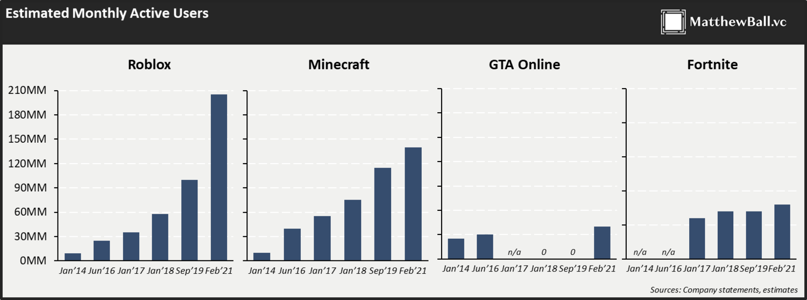

今天，最受欢迎的虚拟平台是 Roblox 和 Minecraft，以及在较小程度上，《侠盗猎车手在线》和《堡垒之夜》创意模式（它们只是其主游戏的一个子集）。正如移动互联网的领先指标是智能手机的渗透率和使用率，以及应用开发者的数量和他们的总收入一样，这些虚拟平台的增长很容易跟踪：总的活跃用户和参与，以及总的活跃用户支出和开发者收入。在过去的十年里，所有这些都在增长 —— 而且，至少到目前为止，在全球疫情大流行之后还能持续增长。

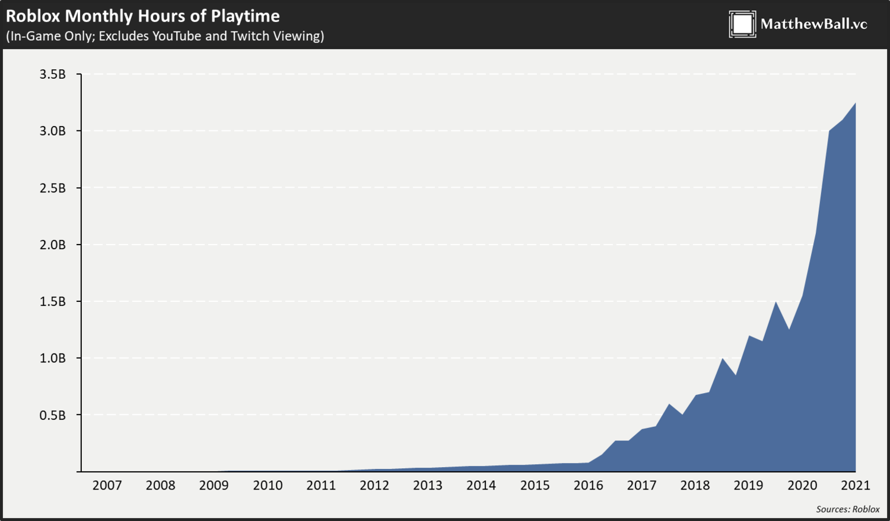

今天所有领先的虚拟平台都起源于游戏，这并不是巧合。长期以来，游戏一直是最复杂、规模最大、最多样化的模拟，因为没有其他消费级体验需要类似的计算能力。而且，由于这些体验设计有趣，而不是纯粹元宇宙，它们也吸引并保留了更多的用户和更多的用户消费。[构建元宇宙平台的更明确的努力](https://en.wikipedia.org/wiki/Facebook_Horizon)要么失败，要么遇到相对低矮的天花板。

> [黄仁勋 2021 年](https://time.com/5955412/artificial-intelligence-nvidia-jensen-huang/)说，「一个市场同时具有规模和技术要求的条件是极其罕见的。通常的情况是，需要真正强大计算机的市场规模非常小，无论是气候模拟还是分子动力学药物发现。这些市场如此之小，它无法负担非常大的投资。这就是为什么你没有看到一个公司是为了做气候研究而成立的。视频游戏是我们做出的最好的战略决定之一。」

为此，有必要强调，虚拟平台是虚拟世界的一个子集，而不是它们的同义词。热门的多人游戏《使命召唤》，即使有大量的用户互动，也不是一个虚拟平台。它是一个虚拟世界和游戏。《塞尔达传说》的最新版本是一个开放世界的沙盒游戏，不是一个平台，更不是一个具有开发者和 UGC 功能的在线多人游戏。《动物森友会》也不符合这个定义。能够丰富地定制物品，然后出售或交易它们并不意味着一个游戏是一个平台。一个虚拟的迪斯尼主题公园，让你用预制板制作自己的游乐设施，也不符合这个定义；那只是一个品牌的模拟城市（或者，真的是模拟主题公园）。

根据[比尔·盖茨的说法](https://stratechery.com/2018/the-bill-gates-line/)，「平台是指使用它的每个人的经济价值，超过创造它的公司的价值。」[Tim Sweeney 认为](https://twitter.com/TimSweeneyEpic/status/1210345159549968384)，「当人们所花时间的大部分内容是由他人创造的时候，这就是一个平台。」虚拟世界，无论是基于游戏还是类似于时装秀或画廊，都可以连接到元宇宙平台，与基于元宇宙的服务整合，并使用元宇宙特定的技术，但它们不是虚拟平台。相反，它们更像是应用或网站的元宇宙版本。

一个虚拟的元宇宙平台必须具备（相对不受约束的）创造的技术能力（引擎+工作室+工具），支持它的服务（预制构件和资产市场、语音聊天、玩家账户、支付服务），并运营一个多方面的经济（即与平台上的创造者/开发者共享的消费者花销，以及创造者/开发者之间的收入）。在成功中，这些平台产生了一个良性循环。更好的技术和工具带来了更好的体验，这带来了更多的用户和更多的人均消费，这意味着更多的平台利润，通过这些利润可以生产更好的技术和工具，以及更大的创造者/开发者利润，通过这些利润可以生产更好的体验，从而吸引更多的开发者和用户，等等。

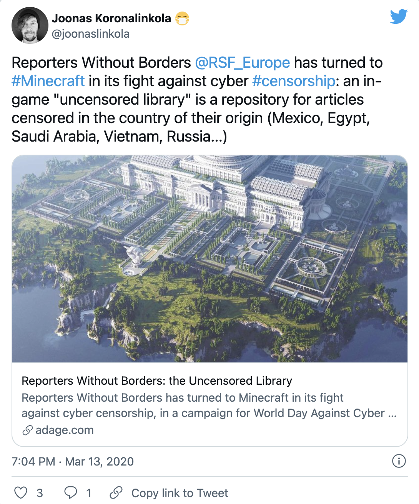

_https://twitter.com/joonaslinkola/status/1238420760940740609?s=20_

### 展望游戏之外

最重要的是，这些要求并不局限于游戏（Roblox 不再将自己归类为游戏平台，并将其内部构建的内容定义为「体验」而非「游戏」）。因此，我们已经看到 —— 当然也会看到更多 —— 其他类型的平台。例如，Snap 正在努力成为一个增强现实和基于位置的元宇宙平台，该平台也是围绕他们的账户和头像系统（Bitmoji）建立的，有时通过他们的硬件提供。Niantic 也在努力开发一个「用于当前和未来几代 AR 硬件的星球级增强现实平台」。而这很可能会整合到 Pokémon Go 中，该游戏继续扩大其 UGC 能力，并且仍然是全球最大的移动游戏之一（以及迄今为止最大的 AR 游戏）。Facebook 正在开发自己的 VR 和 AR 平台，而微软继续通过其 HoloLens 平台（整合到 Minecraft 虚拟世界）追求同样的机会。

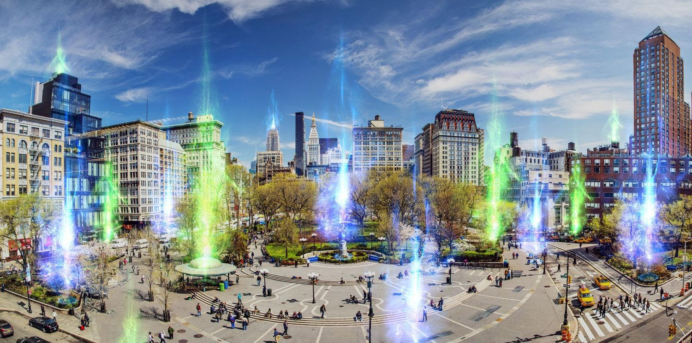

_Niantic 真实世界平台_

英伟达的 Omniverse 是另一个很好的例子。该服务帮助企业将各种数字资产，无论其格式或引擎如何，都汇集到一个单一的虚拟环境中。这是一个交换解决方案，而不是严格意义上的平台，因为 Omniverse 实际上只是让企业能够使用更多的文件格式，特别是与使用不同技术栈的第三方进行合作。但不难看出，这可能是一个最终的结局。

香港国际机场是用 Unity 设计的，这是一个著名的游戏引擎。使用 Unity 并不是因为它是设计机场的最佳工具 —— 那通常是为建筑行业专门设计的渲染软件。相反，Unity 被使用是因为它在模拟方面的优势。作为一个游戏引擎，Unity 不仅可以渲染一个尚不真实的环境，而且可以对火灾、洪水、停电、跑道堵塞以及紧急情况下的人流进行真实的压力测试。这本身就是一个巨大的飞跃。而且，它现在被用于无数其他领域，从工业工程到电影。汽车正在使用模拟/游戏引擎进行设计，然后同样的软件被部署到最终产品中。悍马的仪表盘用户界面现在是基于 Unreal 引擎的，可以实时模拟车辆。

这就是 Omniverse 的潜力变得如此令人兴奋的地方。随着世界向镜像世界和模拟技术的转变，以前独立的模拟变得可以相互连接。想象一下，将香港国际机场与当地的高速公路相互连接，对交通流进行情景测试。然后再连接到管理交通的路灯系统。可能会有当地路网上每辆车的精确信息。

Omniverse 的关键是它可以做到这一点，而不考虑正在使用的文件格式和引擎/模拟技术。换句话说，一切都不必在 Unity、Unreal 或 AutoCAD 上。虽然 Omniverse 今天是用于设计和测试，但我们可以想象英伟达利用这项技术，加上其自身的工业计算能力，来操作整个镜像世界的大部分内容。

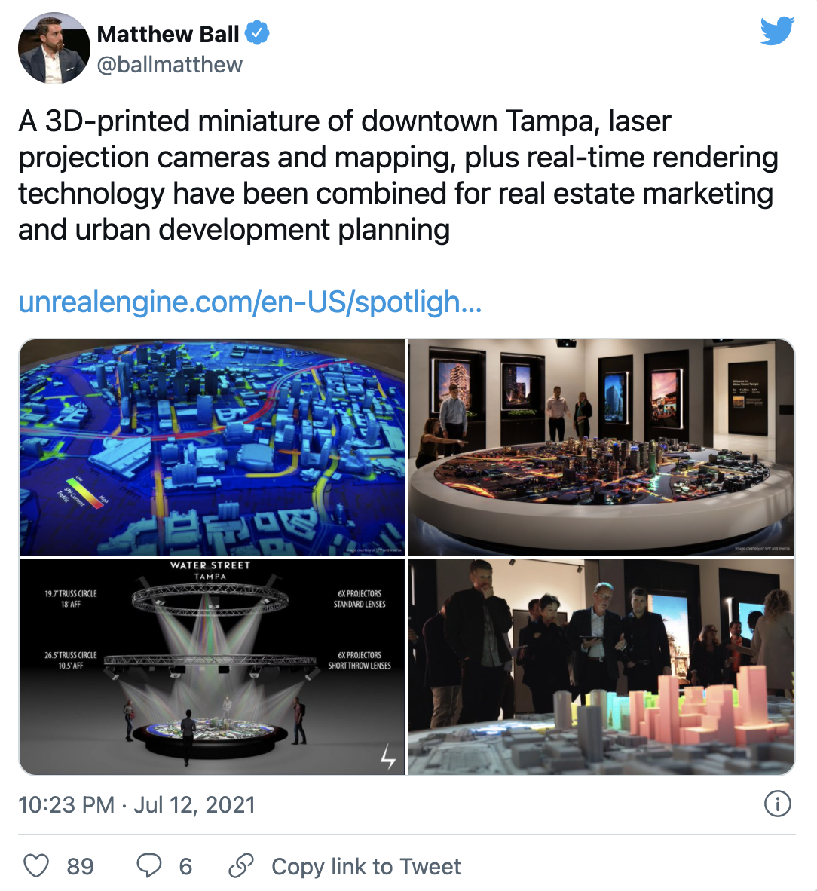

_https://twitter.com/ballmatthew/status/1414591323718488073?s=20_

其他公司希望从其他角度追求这一机会。Matterport 让房地产业主能够创建其房产的生动副本。这里最基本的价值是，买家、租户、供应商、建筑专业人士和服务提供商可以通过这些 3D 扫描来了解潜在的问题和机会，而这是用蓝图或照片无法做到的。下一步是整合「实时」数据，代表动态设施或街区系统。电力、安全、暖通空调、天气和交通的实时或模拟流动成为视觉和互动的覆盖物。然后，在这之后，试图将这些许多数字孪生体连接起来，以至于传统的「平面图」或「街道图」已经变得不重要了。而 PTC 公司则希望通过工业 AR 来实现这一目标。

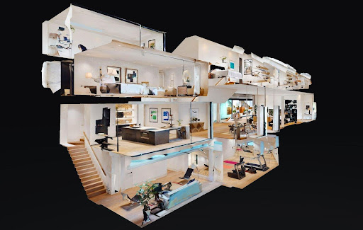

_Matterport_

还有一些虚拟平台，希望通过使用区块链来取代 Minecraft 和 Roblox 等。这些平台包括 Decentraland、The Sandbox、Cryptovoxels、Somnium Space 和 Upland，还有几十个正在开发中。随后的章节将讨论更多基于区块链的基础和去中心化的技术优势。但与今天的领导者相比，更重要的是他们的经济激励。这些平台为用户/玩家提供了真正拥有游戏中的物品或土地的能力，产生现实世界收入的能力大得多，直接参与平台整体价值增长的范围，有时甚至对其有部分治理权。如果操作得当，这对用户的动机来说是一个很大的刺激。如果我们喜欢玩《堡垒之夜》或使用 Instagram，那么，如果我们能够从中获利和/或帮助管理它们，我们就会更多地投资和使用它们。毕竟，数以百万计的人花了数十亿小时在 Farmville 耕地和播种作物，既没有收入，也没有 Farmville 或他们自己的农场的所有权。这就是 Zynga 的联合创始人创立的 Gala Games 的前提，它是 Zynga（Farmville 的制造商）的一种区块链重构。

尽管最成功的虚拟平台受益于强大的良性反馈循环，但很多虚拟平台都有可能存在并受到欢迎。一个乐观的观点，考虑一下过去七年的情况。当 Mojang 在 2014 年被卖给微软时，Minecraft 的销量比历史上任何其他游戏都要多，而且月活跃用户（2500 万）也比历史上任何西方游戏都多。今天，Minecraft 的规模已超过 5 倍。同时，Roblox 从不到 250 万的 MAU 增长到超过 2 亿，堡垒之夜创建后，现在拥有 7000 万，GTA Online 增加了一倍多，达到 5000 万以上，此外还有各种基于区块链的平台。

> [Tim Sweeney 2020 年说](https://www.latimes.com/entertainment-arts/story/2020-05-13/epic-games-outlines-a-fortnite-driven-more-connected-future)，「就像几十年前每家公司都创建了一个网页，然后在某些时候每家公司都创建了一个 Facebook 页面一样，我认为我们正在接近这样一个点，即每家公司都将通过与游戏公司的合作或通过像《堡垒之夜》和 Minecraft 以及 Roblox 这样的游戏，拥有一个实时的实时 3D 存在。这种情况现在已经开始发生了。这将是一个比以前这些代际转变更大的事情。」

当然，科技/游戏界认为会有更多的事情发生。去年年初，Riot Games 收购了 Hypixel Studios，该公司在关闭之前运营着最大的私人 Minecraft 服务器，以建立他们自己的基于体素的沙盒平台。一些资金充足的初创公司，如 Mythical Games、Playable Worlds 和 Singularity6，也在不断壮大。

最关键的是，元宇宙的设计是以互联为导向的，而今天占主导地位的社交/Web 2.0 平台则不是这样。如果 Facebook 不是「互联网」，甚至不是 GAFAM 的全部，那么，元宇宙也应该是丰富的。这就把我们带到了下一个，也是最重要的部分。

## 关于作者

Mathew Ball 是 EpyllionCo 的管理合伙人，负责运营早期风险基金和企业和风险咨询部门。此外，他还是是全球最大的游戏风险基金 Makers Fund 的合伙人，也是 Ball 元宇宙 Research Partners 的联合创始人。2016 至 2018 年，Mathew Ball 担任亚马逊工作室的全球战略主管。在此之前，他是切宁集团下属奥特媒体的董事。在 2000 年代，他是加拿大自然资源部的一名全职森林消防员，并代表加拿大海岸警卫队发放划船许可证。

Mathew Ball 在《纽约时报》、《经济学人》和彭博社拥有专栏，并被这些媒体以及《大西洋》、《华尔街日报》、《纽约客》、《华盛顿邮报》、Vice、The Verge、CNN、CNBC、《金融时报》、BBC、《环球邮报》等报道。

**延伸阅读**

这里是「元宇宙特攻队」，我们下期见。
