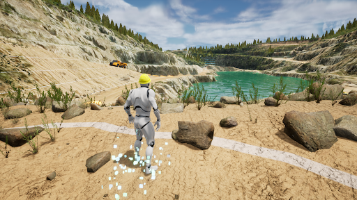
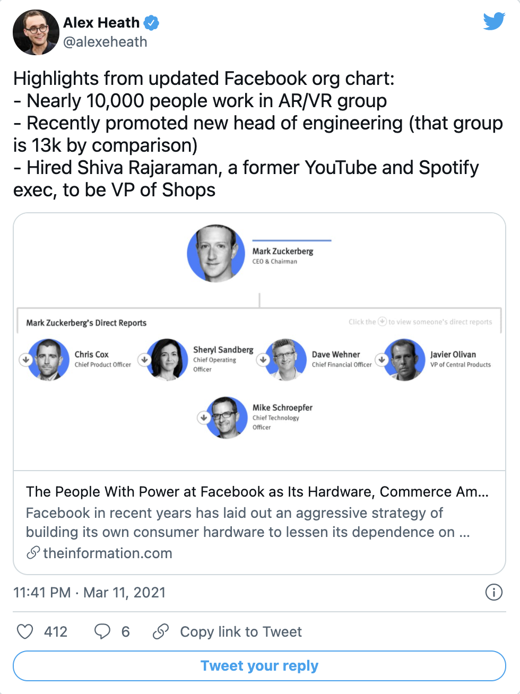
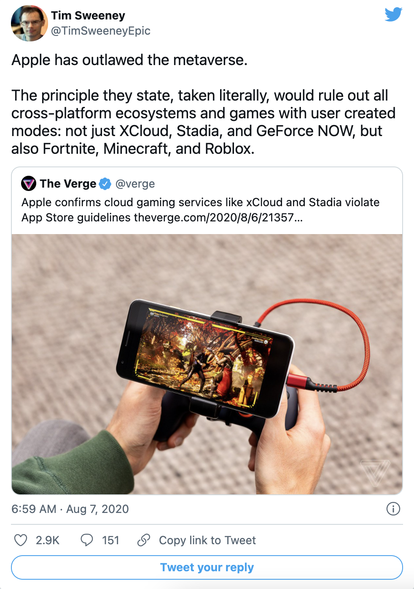
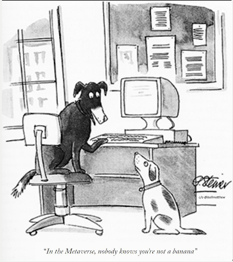
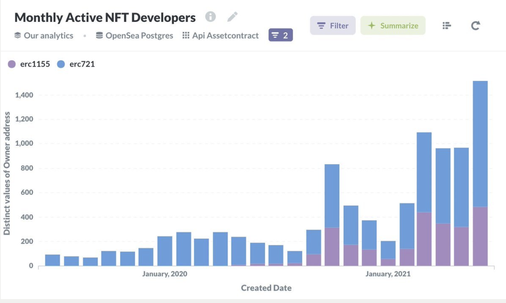

# 元宇宙初探（四）：交换工具+标准、支付+区块链与元宇宙| Thought for Today

> 前三期元宇宙特攻队翻译发布的《元宇宙初探》（The Metaverse Primer）的前言、第一部分和第二部分介绍了认知元宇宙的框架，硬件、网络传输、计算、虚拟平台和元宇宙的关系，今天介绍交换工具+标准、支付+区块链对于元宇宙的作用。

**By Mathew Ball**

## 交换工具+标准和元宇宙

> 这部分重点介绍交换工具和标准在元宇宙中的作用。 在这里，交换工具与标准被定义为「工具、协议、格式、服务和引擎，作为互操作性的事实上的标准，并让元宇宙的创建、运行和持续改进成为可能。这些标准支持诸如渲染、物理和人工智能等活动，以及资产格式及其从这个到那个体验的导入/导出、前向兼容性管理和更新、工具和创作活动，以及信息管理。」

出于顺序上的原因，这一部分在本文中出现得相对较晚。毕竟，除非有一个能够（而且确实）使用它们的生态系统，否则标准是不相关的。而这个生态系统首先需要硬件（否则就没有办法设计或访问元宇宙）、计算（为其提供动力和渲染）、网络（提供和分享）和虚拟平台（以便有地方可去，有事情可做）。

然而，交换标准和工具 —— 一个广义的类别，包括各种技术解决方案、协议、格式和能够实现互操作性的服务 —— 也许是这篇文章最重要的方面。没有它们，就不会有元宇宙 —— 而只是今天的移动互联网和应用商店的一个更加虚拟和沉浸的版本。更重要的是，这种苍白的模仿将毫无利润、活力和健康。

### 起初，有一个拨号音

互联网之所以如此有利可图和具有变革性，原因之一是它是如何创建的。在整个 20 世纪 60 年代到 90 年代，今天的互联网的基础是通过各种联盟组织和非正式工作组建立的，这些联盟和工作组由政府研究实验室、公立大学和独立技术专家组成。这些通常不以营利为目的的集体通常专注于建立开放标准，以帮助他们从一个服务器到另一个服务器共享信息（即消息或文件），并在这样做时让未来的技术、项目和想法更容易合作。

这种奇特的开端所带来的好处是广泛的。其中许多好处一直延续到今天。例如，任何能够连接互联网的人都可以在几分钟内免费使用纯 HTML 建立一个网站，而使用 GeoCities 这样的平台甚至更快（当时还是免费的！）。这个网站的单一版本可以（或至少可以）被每一个连接到互联网的设备、浏览器和用户访问。此外，没有用户或开发者需要被去中介化。如果他们选择使用一些中介，如支付服务、平台或零售商，他们有很多选择。通用标准的使用也意味着雇用、与外部供应商合作、整合到第三方软件或应用或重新使用代码更容易、更便宜。如此多的标准是免费和开源的，这也意味着单独的创新往往有利于整个生态系统，同时给付费的专有标准带来竞争压力，并有助于遏制网络和用户之间的平台（如设备制造商、操作系统、浏览器和 ISP）的寻租倾向。

上述情况并没有阻止企业在互联网上获利，部署付费墙，或建立专有技术。相反，它使更多的公司能够在更多的领域建立起来，接触到更多的用户，实现更大的利润，同时也阻止了前互联网的巨头（尤其是电信公司）控制它。今天，世界上大多数最有价值的上市公司都来自于互联网时代或通过互联网重生。

不难想象，如果互联网是由跨国媒体集团创建的，以便销售东西、提供广告、收集用户数据以获取利润，或者控制你的端到端体验（AT&T 和 AOL 都曾试图这样做，但都失败了），互联网会有什么不同。下载一张 JPG 格式图片可能要花钱，而下载一张 PNG 格式图片要多花 50% 的钱。电话会议软件可能需要使用宽带运营商的应用或门户网站（例如，欢迎使用 Xfinity™ 浏览器，点击这里查看 Xfinitybook™ 或由 Zoom™ 提供的 XfinityCalls™）。想象一下，如果制作一个网站需要两年或一千美元。或者，如果网站只能在 Internet Explorer 或 Chrome 浏览器中运行 —— 而且你必须为使用该浏览器支付年费。或者，用户需要向他们的宽带供应商支付额外的费用来阅读某些编程语言或使用特定的网络技术（本网站需要 Xfinity Premium 与 3D 渲染）。微软被起诉，部分原因是将 IE 浏览器与 Windows 操作系统捆绑在一起。如果一个公司发明了互联网，他们会允许竞争的浏览器（真正的网络入口）吗？他们会允许用户在这些浏览器上做任何他们想做的事情，或者访问（和修改）他们选择的任何网站吗？不管具体的差异如何，互联网的渗透率很可能会降低，使用率和相关的商业/价值也会降低。

元宇宙不会像互联网那样发展。公共机构、军事研究实验室和独立学者引领了互联网的发展，因为他们实际上是唯一拥有计算才能、资源和建立万维网的雄心的人，而工业界中很少有人了解其商业潜力。当涉及到元宇宙时，这些都不能成立。

但是，我们仍然希望元宇宙能够像互联网那样蓬勃发展。我们希望有尽可能多的新平台、技术和公司诞生 —— 以最大限度地增加元宇宙用户的数量，以及它所覆盖的设备 —— 同时也遏制主导平台的寻租本能。要做到这一点，我们将需要一个「交换」解决方案的生态系统，在无数不同的、相互竞争的平台之间互连、翻译和交换信息/用户/资产。仅仅拥有更强大的硬件、计算、网络、虚拟平台以及元宇宙工具和技术是不够的。

### 封闭式标准的问题

为了理解交换的重要性，让我们考虑元宇宙的一个关键需求：在本地设备上进行渲染。

所有的视频游戏机操作系统，要求使用主机硬件，都选择不支持开放或第三方渲染 API 集合，如 OpenGL 或 WebGL。相反，微软 Xbox 专门使用微软的 DirectX，而索尼则为 PlayStation 使用其 GNMX。移动设备通常支持多种标准，但它们经常限制（或直接阻止）对许多驱动程序的访问，这有助于推动开发者使用它们的专有产品。PC 和 Mac 更加开放，但它们只对微软的 DirectX 和苹果的 Metal API 进行了优化。因此，开发者的软件需要专门为每个平台的「标准」重新编写。《堡垒之夜》需要为 Xbox 使用微软的 DirectX，为 PlayStation 使用索尼的 GNMX，为任天堂 Switch 使用 Nvidia 的 NVM，为 iOS 使用苹果的 Metal。只有谷歌的安卓系统围绕 OpenGL 建立了自己的解决方案，但人们可以说它在 Chrome 和 Chromium 的主导地位控制了这些网络标准。

GPU 也有上述这些协议的味道。英伟达的驱动程序实际上是一个「平台」，开发者利用它来访问 PC 用户的硬件，与微软的 DirectX 协同工作，进行渲染。

这种分化有很多好处。「渲染技术栈」上下的竞争导致了更好的定价、更多的创新、更多的内容投资等等 —— 所有这些都有利于开发者和终端用户。当然，这些好处并不是计算机行业或渲染用例所特有的。竞争几乎总是最有效的市场机制。

但当涉及到平台时，竞争的结果几乎总是成功的平台（无论是否占主导地位）利用一切可以利用的东西，从 API 到消费者账户和软件审核，来锁定开发者和用户，并确保他们自己是标准，而不是通用标准。

例如，几乎每一个平台都会争辩说，他们专有的 API 最适合他们专有的操作系统和/或硬件，因此，开发者可以使用它们写出更好的软件，这导致用户更快乐。然而，这些平台也会扼杀或拒绝支持可能证明结果相反的更好选项。随着这些平台变得更加强大，它们通常会变得更加严格，并阻碍那些显然对生态系统有利的变化，因为这可能会危及它们自己的地位。由于数字网络效应（横跨开发者和最终用户），加上零边际成本的收入，这种策略通常是有力的，也是有害的。

我们从最近的历史中可以找到几个关键的例子。

十多年来，索尼拒绝支持在 PlayStation 和其他平台上玩的游戏之间的交叉游戏、交叉购买或交叉进展。这意味着两个朋友玩同一个游戏，但在不同的主机（如 PlayStation 和 Xbox）上，永远无法一起玩。即使玩家购买了同一游戏的两个副本（例如，一个用于他们的 PlayStation，另一个用于他们的笔记本电脑），他们的游戏货币和许多奖励仍然是孤立不互通的。该政策的批评者认为，PlayStation 的排斥是由其市场主导地位造成的，因为跨平台服务会削弱平台的网络效应，让用户更容易更换平台。该部门的总裁在 2016 年默认了这一点，并表示「技术方面可能是最容易」开放其 PlayStation 网络访问的部分。不管怎么说，这显然对开发者和玩家都是不利的。

同样，Valve —— 占主导地位的 PC 游戏平台 Steam 的所有者 —— 已经规定，所有通过 Steam 商店购买的游戏将永远需要在该商店进行游戏（这意味着永久收到所有收入的分成）。它还防止玩家将他们的成就、游戏数据和朋友名单带到其他地方，同时将游戏中的聊天内容分割成碎片。Steam 的领先优势，加上锁定，使得任何人都几乎不可能与该平台竞争，尽管其收费很高。2019 年，EA 宣布，在通过其 EA Origin 商店独家销售其 PC 游戏 8 年后，它将再次开始通过 Steam 发布其游戏。这意味着通过商店费用失去了大约 20-25% 的收入，以及玩家的部分所有权，这意味着 Steam 的主导地位已经意味着错过了至少 30%的 PC 市场。2018 年，Epic Games 推出了自己的商店，与 Steam 竞争，并用西方最受欢迎的 3A 级游戏《堡垒之夜》作为平台启动。尽管向开发商收取的商店费用比 Steam 低 3-6 倍，并且给予完全的用户和他们的成就的控制权 —— 还向玩家赠送数百万免费游戏，每周都有新的免费游戏 —— Epic Games 商店每年亏损数亿美元，根据 Epic 自己的估计，预计到 2020 年代末才会产生累计利润。与此同时，Steam 每年产生数十亿美元的收入，估计毛利率在 70%以上。

虽然苹果毫无疑问地推动了移动互联网时代的发展，但它现在利用其当之无愧的成功来防止颠覆性创新，限制「开放网络」，并最大化其 CEO 蒂姆·库克所说的「自有知识产权的总回报」。我们通过它对所有 iOS 应用分发和货币化的控制，它对 iOS 内竞争应用商店和移动平台的禁止，它胁迫元宇宙平台改变[应用自述以求入苹果青眼](https://twitter.com/ballmatthew/status/1393332691312025605?s=20)的能力，它对数字支付收取 5-6 倍于标准的费率的权力，它对其平台上的[竞争应用降权排名](https://www.theverge.com/2021/6/11/22528701/apple-rank-own-app-over-competitor-files-dropbox-wwdc-2017)的理由诡辩，它以[竞争对手无法做到](https://twitter.com/tomwarren/status/1358152783590002688?s=20)的方式宣传自己的服务，它将竞争对手排挤出其[关键的 API/能力](https://www.ft.com/content/13da1d7e-d771-40b1-a597-e37ab7112d46)之外，它单方面决定何时以及如何提供新的创新，它[改变其政策以损害竞争对手](https://mobiledevmemo.com/apple-robbed-the-mobs-bank/)并[按其认为合适的方式定义它们](https://www.theverge.com/2020/9/18/20912689/apple-cloud-gaming-streaming-xcloud-stadia-app-store-guidelines-rules)。在 iOS 上，允许开发者在网络浏览器中产生丰富的 2D 和 3D 渲染环境的 WebGL 受到了严重的限制，以至于它对大多数富媒体应用来说都是不可行的。批评者认为，这是因为苹果希望迫使所有的开发者进入其应用商店，在那里，苹果从所有的购买中获取分成。而在苹果发布其 MacBook 系列，从而让所有 iOS 应用能够在其笔记本电脑上运行（这需要使用 Mac 应用）的一年前，苹果宣布 macOS 将废弃 OpenGL（尽管它仍然保持该标准）。

苹果政策的悲剧在于，如果没有 20 世纪 90 年代和 21 世纪的开放网络，iPhone 本身就不可能出现。有线和无线电信公司显然更倾向于我之前描述的封闭式互联网 —— 一个允许他们对网络上的一切进行把关、征税和封锁，以避免被像苹果这样的公司破坏，同时也使电信公司的利润最大化。据 [The Verge 报道](https://www.theverge.com/2021/6/7/22521476/apple-walled-garden-carrier-app-store-innovation)，「苹果不仅仅是一个带围墙的花园，它[现在]自身就是一个[电信公司]。」

再来说说渲染，在过去的 20 年里，计算平台的数量和 3D 模拟的复杂性都有了很大的增长。由于主要的平台不支持共同的渲染标准，对于开发者来说，要制作出能在所有这些平台上运行的软件，并因此惠及所有用户，成本已经变得非常高。这意味着错过了收入，或蚕食了利润。唯一从中受益的是那些已经拥有最多用户的平台，因此是每个开发者的首选，或者是那些已经拥有最高收入的游戏发行商，因此有能力进行投资。记住，渲染只是开发者需要解决的众多问题之一。

### 交换方案

为了抵消多平台开发的难度和成本，并缓和主导平台的力量，在过去十年中出现了一些交换解决方案。

最好的例子是跨平台的游戏引擎，如虚幻引擎和 Unity。尽管 Epic 是在 20 世纪 90 年代作为游戏开发商成立的，但该公司最终将重点放在了其热门游戏《虚幻竞技场》背后的引擎上，并将其授权给其他游戏制造商。虚幻引擎的各种迭代（第 5 版现在处于早期访问阶段）是为了让它们能够运行 —— 并为其优化 —— 每一个主要的游戏 PC 堆栈或平台以及其专有的 API 集合，包括微软的 Xbox 和索尼的 PlayStation 从 21 世纪初开始，以及苹果的 iPhone 从 2009 年开始，以及底层硬件供应商的驱动程序（如英伟达或三星）所需。这为开发者提供了几个好处。首先，他们可以把精力集中在他们最擅长和最有可能得到回报的事情上：制作伟大的游戏。第二，这些开发者不再需要担心（或投资管理）操作系统更新、技术变化或新设备（这特别有利于小型/新兴的开发者）。第三，他们可以将他们的可触达市场扩大到所有可能的玩家，而且只需从总收入中抽取 5%。第四，事实上的标准引擎的存在意味着招人更容易，而不用进行再培训。第五，游戏制作者可以离开他们的雇主，成立新的工作室，不需要开发自己的引擎。没有一个个人电脑或主机平台能够成功地将自己的引擎变成标准（例如 Valve/Steam 的源引擎）。

独立的、跨平台的引擎所带来的影响是巨大的。想象一下，今天作为一个移动游戏开发者，尤其是西方国家的开发者。iOS 在美国拥有 60% 的智能手机份额，在青少年中拥有 80% 的份额，在全球拥有超过三分之二的移动游戏收入。此外，你只需写十几个 iPhone SKU，就能接触到近 90% 的 iOS 用户。全球市场的其余部分则被数百种不同的安卓设备所瓜分。如果被迫在这两个平台之间做出选择，开发者总是会选择 iOS。但是，通过使用 Unity，他们可以很容易地在所有平台（包括网络）上发布他们的游戏，从而使他们的收入潜力增加了 50% 以上，而且几乎没有增量成本。这种额外的利润，反过来又为所有用户带来了更好的游戏，从而带来了更好的货币化和更大的利润。显然，在所有条件相同的情况下，苹果更喜欢更多的独家游戏，以及为他们的硬件完全优化的游戏，但可以说，大多数移动开发者使用 Unity 对所有人，包括 iOS 用户和应用商店都更好。

关键交换解决方案的另一个例子包括直播游戏服务提供商，如微软的 PlayFab 和亚马逊的 GameLift。这些为发行商提供了统一的后台基础设施功能，如玩家账户管理和单点登录、排行榜、匹配、分析、语音聊天等。这些解决方案中的大多数都是任何网络游戏所需要的，而且对于单个开发者来说，构建、测试和扩展都很耗时 —— 尤其是那些支持跨平台购买和游戏的解决方案。然而，这些服务所需的核心技术在不同的游戏下基本上是相同的。因此，大多数开发商将这些解决方案外包出去。此外，微软和亚马逊利用价格低廉的 PlayFab 和 GameLift 服务来吸引开发者使用 Azure 和 AWS。

值得注意的是，跨平台引擎和实战基础设施的优势有助于打破本节前面讨论的许多上述封闭平台政策和限制。例如，PlayStation 在 2018 年决定启用交叉游戏、交叉购买和交叉进展，并不是基于内部的偏好。相反，它是对一年前推出的《堡垒之夜》的成功的回应（并非巧合，它来自一家专注于跨平台游戏的公司 Epic Games）。

《堡垒之夜》有许多罕见的属性。它是第一款可以在全球几乎所有主要游戏设备上玩的主流 3A 级游戏，包括两代 PlayStation 和 Xbox、任天堂 Switch、Mac、PC、iPhone 和安卓平台。这款游戏也是免费的，这意味着玩家不必购买多个副本就能在多个平台上玩。《堡垒之夜》还被设计成一个社交游戏；当你的朋友越多，它就越好玩。它是围绕实时服务建立的，而不是固定的叙事或任何离线游戏，这意味着游戏的内容永远不会结束，每周更新两次。这一点，加上出色的创意执行，帮助《堡垒之夜》在 2018 年底成为全球（不包括中国）最受欢迎的 3A 级游戏。而且它每月产生的收入比历史上任何游戏都多。

支持这一成功的事实是，索尼的游戏竞争对手都已经接受了《堡垒之夜》的跨平台服务。个人电脑和手机从来没有阻止过这种功能；Windows 和任何移动平台都没有购买过独家游戏(然而，鉴于硬件和输入要求的巨大差异，同一个游戏在两个这样的设备上体验良好，过去和现在都很罕见）。任天堂从一开始也支持《堡垒之夜》的众多跨平台服务 —— 但是，与索尼不同，它没有[真正的在线网络业务](https://www.matthewball.vc/all/onnintendo)，也没有优先考虑它。最后，微软长期以来一直为跨平台游戏提出请求。这可能是由于它在游戏机市场的份额比索尼小 2-3 倍（通常也落后于任天堂），而其 PC 服务的规模还不到 Steam 的十分之一。因此，微软受益于任何竞争性网络效应的减弱。

缺乏跨平台整合意味着 PlayStation 不仅拥有最差的《堡垒之夜》版本，而且 PlayStation 用户几乎在任何时候都有许多更好的版本，而且不需要支付一美元来使用它们。这从根本上改变了索尼的无交叉游戏政策的影响。拒绝向《使命召唤》这样的游戏提供这样的能力，在当时仍以 60 美元的拷贝为重点，可能对 Activision （动视）销售的拷贝数量影响不大，但这些游戏中只有一部分会首先流向 PlayStation，而 PlayStation 仍拥有大多数《使命召唤》玩家。但对于《堡垒之夜》，索尼错过了大部分的游戏收入，将 PlayStation 的玩家推向了竞争平台，而且总体上只拥有一小部分玩家。当然，PlayStation 提供了比 iPhone 更好的技术体验，但大多数玩家认为游戏的社交元素比其规格指标更重要。最后，Epic 在 PlayStation 上[「意外」激活了交叉游戏](https://www.reddit.com/r/xboxone/comments/7reo5y/players_are_reporting_that_they_are_able_play/)，据称没有得到索尼的许可，至少有三次 —— 从而召集了[更多不高兴的用户向索尼请愿要求改变](https://www.theverge.com/2018/6/12/17454606/fortnite-nintendo-switch-ps4-block-accounts-cross-play-e3-2018)，并证明阻碍因素纯粹是政策，而不是技术。

总体而言，这迫使索尼改变其政策。这显然是件好事。今天，一些热门游戏可以被全球几乎所有的计算设备访问（因此任何人都可以随时随地玩），而用户不需要重新付费，也不需要分割他们的身份、成就或玩家网络。此外，跨平台游戏、进阶和购买意味着每台游戏机都在硬件、内容和服务上进行竞争，而不是锁定。而在这里，索尼仍然在蓬勃发展。PlayStation [继续推动占《堡垒之夜》总收入的 45% 以上的增长](https://www.theverge.com/2021/4/28/22407939/fortnite-biggest-platform-revenue-playstation-not-ios-iphone)，并刚刚经历了其有史以来[最好的主机发布](https://www.sony.com/en/SonyInfo/IR/library/presen/strategy/pdf/2021/speech_E.pdf)。

Epic 还试图利用其跨平台的力量来削弱 Steam 在 PC 游戏中的霸权地位。如上所述，这些努力不如针对索尼的努力成功。但值得注意的是，就在 Epic 推出其相比于 Steam 的 30%、只抽取 7-12% 佣金比例的 Epic 游戏商店的三天前，Valve 宣布 Steam 将对总销售额达到 1000 万美元的游戏的佣金降至 25%，达到 5000 万美元降至 20%。因此，开发者现在每年通过 Steam 多获得数亿的利润。

当然，Epic 已经花费了数亿美元 —— 而且放弃了数亿的《堡垒之夜》收入 —— [试图打破苹果对 iOS 的控制](https://www.matthewball.vc/all/applemetaverse)。

### 元宇宙在深化

在元宇宙时代，上述所有挑战都有可能变得更难，甚至更糟。这反过来又会使新平台更难出现 —— 坦率地说，也会使元宇宙更难建立。

例如，我们希望世界上尽可能多的东西都能融入元宇宙。这意味着我们今天身边的许多设备和平台的互联，从你的汽车和家庭安全摄像头，到你雇主的生产力软件，以及完全新的设备，如 VR 和 AR 头盔、投影相机和屏幕可穿戴设备等等。一如既往，上述的许多硬件和体验都需要使用专有标准，或者至少受益于专有标准的使用。Facebook 正在大力投资 XR，以便建立自己的操作系统，回击当今移动操作系统的把关，并避免使用由其直接竞争对手（如 Snap）创建的标准。所有这些都给开发者带来了负担，并可能形成恶性循环，即没有一个平台有足够的用户来开发，也没有一个平台有足够的内容来吸引用户。

我们也希望许多已经存在的虚拟体验能够以全新的方式相互连接。到目前为止，玩家在《使命召唤》和《堡垒之夜》中唯一共享的「东西」是一个受控的平台 ID，他们通过这个 ID 访问在线多人游戏。但在未来，我们会想要移动资产、物品、成就、游戏历史、货币、头像等。然而，许多游戏发行商将继续使用他们自己的引擎和账户系统。而且他们有[许多合理的理由这样做](https://www.matthewball.vc/all/epicprimer1)（例如，控制他们的技术管道，最大化他们的毛利，避免赋能竞争性平台）。但我们也不希望这些发行商切断与可互操作的元宇宙的联系，除非他们投资学习如何使用另一个发行商的引擎，然后投资将他们的实时操作游戏移植到他们身上。

更重要的是，已经有数十亿美元的资金被投入到其他非游戏的渲染解决方案和扫描中。例如，电影和电视行业主要使用 Maya、Houdini、皮克斯的 RenderMan 和 Blenderman 等软件来制作 CGI 资产、场景和角色。同时，工程行业专注于一系列本地的解决方案，以及 AutoCAD。这些产品中的每一个都有自己的本地文件类型、专有编解码器、元数据系统、规则等等。而且，至少在可预见的未来，高度垂直化的软件很可能最能满足专门的垂直需求。这使得互连本身就很困难。然而，就像游戏发行商一样，我们希望尽可能多地利用现有的模式、投资和技能组合来建设元宇宙。

至关重要的是，开发者可以轻松地将他们的作品从一个虚拟平台、渲染解决方案或引擎导出到另一个平台。这是因为元宇宙中的大多数创作都会持续下去，并不断地进行扩展 —— 这与大多数媒体产品（如电影、音乐专辑和书籍）不同，后者在很大程度上是一次性的投资损益，拥有前端收入。然而，虚拟体验并不容易复制 —— 没有「重新录制」或「复制和粘贴」。这可能会给开发者带来一些不利的结果，尤其是小型开发者，让他们在转向提供更好的经济、功能或增长潜力的新平台时很费劲。这反过来又会使成功的元宇宙平台很容易通过政策变化和提高费率来寻租 —— 仅仅是因为多年前有开发者选择了他们。如果这些平台中的任何一个摇摇欲坠，他们中的许多开发者就会被击垮。为了让元宇宙繁荣起来，我们需要开发者繁荣起来。这意味着让虚拟沉浸式教育环境或 AR 游乐场从一个平台转移到另一个平台，就像转移博客一样容易。

身份和玩家数据的范围有限，也是对元宇宙经济的一个阻碍。考虑一下游戏中的负面问题。Activision 可能会因为辱骂或种族主义语言而禁止玩家 B 参与《使命召唤》，但玩家 B 可以继续在 Epic Games 的《堡垒之夜》（或在推特或 Facebook）上捣乱。玩家 B 还可以创建一个新的 PlayStation 网络账户，或改用 Xbox Live，虽然这意味着他或她的成就被分割开来，但无论如何，其中一些成就是锁定在特定的平台。当然，发行商并不想让他们的竞争对手的游戏变得更好，他们通常也不倾向于分享他们的游戏数据。但没有一家游戏公司能从负面行为中获益，每个人都会受到负面影响。银行和其他金融机构以前也不分享信用数据 —— 但是，最终他们意识到信用评分对所有人都有利。竞争对手 Airbnb 和 Vrbo 现在也在与第三方合作，防止有不良行为记录的客人在未来进行预订。除非身份（以及其他许多东西）可以互换，否则一个无处不在的人工智能助理是不可能的。

如果监管机构迫使苹果公司开放 iOS 平台，以实现直接安装、替代性应用商店、替代性支付方式和更多地使用本地驱动程序，那么开发者将可能从更高的净收入和更好的产品中受益。然而，他们的应用在技术上的操作和优化也将变得更加复杂，他们也将需要承担新的成本。就像游戏中的直播服务一样，在内部建立这一切是没有意义的。

更广泛地说，元宇宙的领先虚拟平台可能会比今天的移动领导者更加有利可图和强大。这是因为，与今天的 iOS 和 Android 相比，这些「操作系统」将跨越更多的物理世界，同时也控制更多的劳动力和创意产品本身。举个例子，虽然今天有数百万人通过他们的 iPhone 被雇用，并使用他们的 iPhone 工作，但他们并没有真正（好吧，实际上是）在 iOS 系统内执行他们的工作。当你的女儿通过 Zoom 上学时，她通过 iPhone 访问 Zoom 和她的学校，但学校并不是由 iPhone 操作的。而当你在 iOS 中制作或编辑图片时，它只是存储在那里，而不是被拴在它里面。使用封闭的工具来建立锁定在（并且只能通过）一个封闭的平台上的体验是有巨大风险的，这个平台也运营着一个封闭的玩家网络，它也是独家收费的。鉴于这些扩大的权力，额外的审查和互换解决方案将是至关重要的。

> [Tim Sweeney 2016 年](https://venturebeat.com/2016/12/09/the-deanbeat-epic-boss-tim-sweeney-makes-the-case-for-the-open-metaverse/)：这个元宇宙将比其他任何东西都更加普遍和强大。如果一家中心化企业获得了对它的控制权，他们将变得比任何政府都强大，成为地球上的神。

为了发展元宇宙，我们将需要许多新的工具和技术。它们将横跨渲染、计算、XR、支付、工具、投影、体积压缩、人工智能、机器学习。而这些工具的质量和能力将是建造什么和由多少建设者建造的关键。但这些工具和技术所需的费率也是如此，它们在多大程度上锁定了开发者，以及它们限制了消费者的选择和竞争性创新的方式。

### 元宇宙的新兴交换解决方案

随着对交换解决方案的需求增长，经济学往往会产生一种解决方案。例如，迪斯尼的皮克斯开放了其通用场景描述（USD）文件格式，以帮助开发者创建可互换的 3D 数据。英伟达的 Omniverse 平台然后使用 USD 将来自 Maya、Houdini、Unreal、AutoCAD 等的资产连贯地汇集到一个共享的虚拟环境。Epic 的 Twinmotion 平台也可以用来从几乎所有的 BIM 和 CAD 程序中导入模型，如 Archicad、Revit、SketchUp Pro、RIKCAD 和 Rhino，然后将使用机器学习和人工智能，尽可能在几分钟内升级和整合。

Cesium 是一个开放的平台，致力于使用 3D 砖片开放标准对 3D 地理空间数据进行流化、分析和可视化。用户可以上传自己的数据（如环境扫描、点云、摄影测量数据和各种格式的渲染图），同时也可以利用 Cesium 的地形、建筑和三维可视化数据库，使用虚幻、JavaScript 或其他专有引擎立即创建实时可视化。这使得任何「开发者」（如城市、建筑公司、游戏制作者或活动公司）可以利用模拟作为他们日常工作的一部分（如场地规划、测量环境变化、在游戏中再现世界、实时跟踪勒芒比赛中的车手或发射卫星）。

2020 年，Epic Games 还发布了 Epic 在线游戏（EOS），这是一个新的产品线，本质上是打包的堡垒之夜的直播服务。EOS 提供了微软 PlayFab 和亚马逊 GameLoft 所做的一切，但却是免费的，而且不需要特定的云服务器解决方案，也不要求开发者使用任何其他 Epic 产品（游戏引擎、商店、发布服务），包括其 Epic 身份系统。Valve 的 Steamworks 也是免费的，但它将玩家数据和图表锁定在 Steam 上，并要求所有游戏也通过 Steam 商店推出（这也意味着永远支付 Steam 的商店费用）。因此，EOS 让更多的游戏能够更容易、更便宜地进行互操作，而不会将自己锁定在更大的平台生态系统中，同时还能访问上述平台的大型社交图谱。值得注意的是，迄今为止，没有一个游戏机平台做出这样的举动，尽管它们已经从游戏中最大的社交图谱变成了所有大型平台中最小的。

Discord 是直播服务类别中的另一个关键的互换解决方案。开发者可以直接插入 Discord 的平台，将一流的音频和文本通信部署到他们的游戏中，并获得 Discord 超过 150 百万活跃玩家的网络。前者是当今几乎所有在线游戏的重要组成部分，而后者是一个比 Xbox、任天堂和 PlayStation 更大的玩家网络。

虽然 Discord 的产品仍然缺乏许多核心功能，如权利管理、游戏分析和基于技能的匹配，但很容易想象该公司会随着时间的推移扩展到许多这些功能。此外，即使部分使用 Discord 的平台也有好处。例如，独立开发者可以更容易地建立一个玩家群体，而不需要像 Steam 这样的游戏商店，同时也减少了对微软 PlayFab 等后端供应商的依赖。而且，如果开发者选择使用游戏商店，他们不需要完全依赖商店的玩家网络或通信服务。Discord 生态系统的优势已经导致了 Xbox Live 的原生整合，2021 年，索尼宣布计划对 PlayStation Network 进行同样的整合，从而减少两个平台对玩家网络和社交的控制。值得注意的是，Discord 之所以能够实现其市场影响力，特别是因为封闭平台没有 API/规则可以用来阻止它。是的，他们控制了游戏中的音频聊天 —— 但用户只需在手机上使用 Discord 应用进行交流，或关闭游戏中的音频并在后台运行 Discord。这在[计费](https://www.matthewball.vc/all/metaversepayments)、社交图谱、分析等方面是不可能的。

同时，GGWP 正在与发行商合作，创建一个选择系统，将玩家的行为信号输入「全球 GGWP 得分」，以奖励跨多游戏体验的积极性。

2020 年，Unity 推出了 [Unity 分销门户](https://unity.com/products/unity-distribution-portal)，让开发者能够一次性开发其应用，然后在所有移动应用商店（包括苹果应用商店和 Google Play）分销和管理。

一些开放标准和交换格式也在为元宇宙宣传和投资。例如，OpenXR 和 WebXR 用于渲染，WASM 用于可执行程序的可移植二进制代码格式，Tivoli Cloud 用于虚拟空间，XRE 是在虚拟空间中托管人类和人工智能的端到端解决方案，而 VRM 是一种用于「3D 人形化身」的流行文件格式。尚未发布的 WebGPU 旨在加速图形和计算，而 Dat 是一种点对点数据协议，IPFS 是一种点对点超媒体协议。一些元宇宙的倡导者希望，对 Web 2.0 时代的广泛不满将导致未来更突出和成功的开放标准。
但是，要使这些开放标准「获胜」，它们需要为开发者提供比封闭平台所提供更多利润。否则，这些替代方案就像向一个精通英语的开发者争论世界语的技术优势，而他目前的合作伙伴和客户都说英语，而他希望的客户说德语。

而这是很难的。主要平台在工具和技术、客户获取（如售价低于成本的游戏机）以及独家内容方面进行了巨大的、烧钱的投资，以便为开发者建立一个有利可图的市场。

而今天的虚拟世界领导者当然知道这一点。这就是为什么他们花费数十亿美元研发亏本出售的硬件，[资助独立创作者](https://www.cnbc.com/2021/03/20/snapchat-paying-1-million-a-day-to-video-creators.html)，购买游戏开发商和平台，并为他们的用户建立竞争性的 XR 标准，同时还将他们所有的工具相互交错和/或捆绑到应用商店和账户系统等看门功能中。你不能把 Roblox 的体验导出到《我的世界》或《堡垒之夜》，但正如你不能轻易把你的 Instagram 照片和喜欢导入推特或抖音或 Snapchat 一样，这是有原因的。

但有一种主要的交换技术，虽然不是传统意义上的开放，但却保留了开放标准的大部分价值和好处，而且看起来也有可能在元宇宙中蓬勃发展：区块链。

## 支付+区块链和元宇宙

> 这部分重点介绍支付在元宇宙中的作用。在这里，支付被定义为「对数字支付流程、平台和业务的支持，其中包括从法币到纯数字货币和金融服务的通道（一种数字货币兑换形式），包括加密货币，如比特币和以太坊，以及其他区块链技术。」

在整个《元宇宙初探》中，元宇宙既被定位为移动互联网的继承状态，也被定位为人类休闲、劳动和普遍存在的平台。这一愿景的成功取决于宇宙空间是否有一个繁荣的经济。而我们知道什么是繁荣的经济：竞争和颠覆/替代的不断循环，大量盈利的企业（尤其是中小型企业），资本流动，强大的消费支出。

上一部分讨论了一些有助于推动这一结果的技术。然而，我跳过了最重要的交换工具和标准之一：支付渠道和服务。这些技术实现并管理整个经济中的资金流动，并为上述经济中的每个企业、工作者和消费者确定基本的「经营成本」。而且，它们已经成为正在萌芽的元宇宙中争夺霸权的一个存在问题的战场。

但在这之前，我先介绍一下支付方面的情况。 然后转入它们在控制虚拟世界中的作用，这些个别世界的政策对于元宇宙经济来说是如何次优的，然后为什么元宇宙社区中的许多人对区块链/加密货币抱持乐观态度。

### 主要的支付渠道

在过去的一个世纪里，由于新的通信技术、每人每天交易数量的增加，以及大多数购买的东西都不是实物现金的事实，支付渠道的数量已经多样化了。例如，从 2010 年到 2020 年，现金在美国交易中的份额从 40% 以上下降到 25% 以下（后疫情常态可能会更低）。

在美国，这些支付渠道中最常见的是 ACH（自动清算所）、Fedwire、CHIPs（清算所银行间支付系统）、信用卡、PayPal，以及 Venmo 这样的点对点支付服务。这些渠道有不同的要求、优点和缺点。

电汇只能在银行之间使用（因此要通过银行），只在非节假日的工作日和工作时间内使用，交易不可逆转，不能用于请求资金（因此它不能用于信用卡支付、发票等），并且有很高的发送费用（例如，大通银行每笔电汇支付 <0.15 美元，但每笔发出的电汇收取 25-45 美元），接收费用（接收 15 美元），以及非美元电汇、电汇失败、确认等的额外费用。这些费用使得小额汇款特别不现实，但对于大额交易来说却很便宜（例如，个人可以电汇 10 万美元）。CHIPS 只对 47 家会员银行开放，是最便宜的电汇服务，因此也是银行的默认选择。然而，资金要到第二天才能到收款人手中。Fedwire 是实时结算，但价格更贵。这两种解决方案都需要一个银行账户。国际电汇通常需要两到三天的时间。

ACH 比电汇更便宜；大多数银行允许客户以 0 美元或最多 5 美元的价格进行 ACH 转账，并免费启用自动 ACH 账单支付。在大多数情况下，企业可以用 ACH 支付给供应商或雇员，每笔交易的费用低于 1%。与电汇不同，ACH 是可逆的，可用于贷记或借记账户（因此可自动支付你的无线账单）。然而，ACH 比电汇要慢得多 —— 从 1 天到 3 天。这是因为 ACH 付款直到一天结束才会「清算」，这时银行会将所有必须发送给另一家银行的款项汇总（即所有的 ACH），并通过 Fedwire 将其一次性发送。第二天，美联储将资金发送到收款银行，然后收款银行必须将资金存入接收人的账户，这可能又需要一天时间。这就产生了一些挑战，不仅仅是一到两天半的时间，发送方和接收方都没有资金。例如，ACH 交易只能在工作时间内传输，而且没有交易成功的确认，只有错误。而这个错误需要几天的时间来纠正，因为收款银行直到第二天才注意到故障，然后它的报告直到当天结束才被处理，原汇款人在第二天收到故障通知（此时三天的过程又开始了）。然而，ACH 被认为比其他主流支付方式更安全、更防欺诈。虽然可以向非美国银行电汇，但 ACH 只适用于美国国内。

信用卡是另一个关键的支付渠道。它们涉及到刷实体卡（或输入信用卡信息），之后信用卡机器或远程服务器捕捉账户信息并以数字方式将其发送给商家的银行，然后将其提交给客户的信用卡供应商，由其批准或拒绝该交易。这个过程需要一到三天的时间，商家通常需要支付交易额的 1.5-3.5%。为了偿还信用卡，客户通常进行 ACH 付款。信用卡支付在全球大多数市场都可以使用。与 ACH 一样，但与电汇不同，信用卡支付是可逆的。

最后，还有数字支付网络，如 PayPal、Square 和 Cash App。个人账户主要通过 ACH 或信用卡提供资金，这时，这些平台就成为所有账户使用的中心化/单一银行。因此，同一支付平台的用户之间的所有转账，实际上只是平台本身持有的资金的重新分配。鉴于此，支付是即时的，当钱在朋友和家人之间发送时，这些平台通常不收取费用。但当向企业支付时，向企业收取 1.5-3%的交易费是很常见的。而且，如果用户想把他们在平台上的钱转移到他们的银行账户，他们通常必须支付 1%（最高 10 美元）的费用，才能在当天到达，否则就要等待两到三天（在此期间平台会收取利息）。没有办法直接将现金从一个数字支付网络发送到另一个网络。此外，许多数字支付网络只适用于美国。

各种美国支付渠道往往在安全、费用和速度方面进行权衡。没有一个是完美的，但比其技术属性更重要的是其竞争。有多个电汇渠道、多个信用卡网络、多个数字支付处理器和平台。每一种都是基于它们的优势和劣势进行竞争，即使在一个类别中，也有不同的费用。例如，运通卡的收费远高于维萨卡，但它为消费者提供了更多有利可图的积分和优惠，对商家来说，则是更高收入的客户群。而且，如果用户决定他们不想要信用卡，或者商家拒绝接受运通卡，他们有多种选择。如果用户愿意把钱借给某个网络两到三天，他们也可以进行免费支付。

### 控制元宇宙支付的斗争

理论上，虚拟世界应该比「现实世界」有「更好」的支付渠道。毕竟，它的经济主要涉及只存在于虚拟世界的商品，这些商品是通过纯粹的数字（因此边际成本低）交易购买的，而且大部分是 5-100 美元一件。这个经济体也很庞大。去年大约有 540 亿美元花在虚拟商品、皮肤和游戏生命上，而 2019 年电影票房为 420 亿美元，唱片音乐为 300 亿美元。它也不构成系统性金融风险，在社会中不发挥关键作用，并且有成千上万的市场参与者和十几个竞争平台。这应该会带来支付领域的创造力、创新和竞争。

但事实上，今天「虚拟经济」的「渠道比「现实世界」要差得多。它们更加昂贵、繁琐，而且变化缓慢。事实上，它们所依据的先例更接近于 20 世纪 70 年代 CHIPs 的成立，而不是 PayPal 或 iPhone。

1983 年，街机制造商南梦宫与任天堂接洽，希望在其 NES 游戏机上发布其游戏版本，如《吃豆子》，当时 NES 游戏机是封闭的，因此不是一个平台。

最终，南梦宫同意向任天堂支付其所有游戏的 10% 许可费（任天堂将拥有批准权），加上 20% 以换取任天堂制造南梦宫的游戏盒。这 30% 的费用最终成为一个行业标准，被雅达利、世嘉和 PlayStation 等公司复制，并经久不衰。

主机平台有几个理由从游戏开发者的作品中收取近三分之一的税后收入，尽管昂贵的游戏盒已经转变为低成本的 CD（平台不再为发行商制作），甚至更低成本的数字下载带宽。此外，它现在也适用于在线微交易和 DLC。

例如，像 PlayStation 和 Xbox 这样的游戏机以低于成本的价格出售，这有助于增加游戏机拥有者的数量，因此扩大了开发商的可触达市场，但意味着利润必须来自平台费用。此外，这些平台开发和维护一些专有的工具和 API，供开发者用于他们的游戏和运营玩家网络，如 Xbox Live 和 PlayStation Plus，支持在线多人游戏。而且，每当购买游戏时，这些平台必须向基础支付渠道（即信用卡或 PayPal）支付 2-3% 的费用。

这些论点有一些优点，也有一些缺陷。消费者被迫以低于成本的价格购买游戏机，没有选择购买费用低 30% 或为开发商提供更好利润的更贵的设备。这些平台还拒绝支持可以替代其昂贵标准的免费开放标准，从而迫使自己进行额外的研发，并为必须为不同平台支持不同标准的开发者带来额外的工作负担。自 2000 年代末以来，没有一个主要平台运营中心化播放器网络 —— 事实上，大部分实际（和昂贵的）在线「工作」是由开发者管理的。

相反，平台提供的在线服务在很大程度上被用来在开发者和玩家之间拉开额外的距离，并将这两个群体锁定在基于硬件的平台。例如，PlayStation 和 Xbox 用户需要 PlayStation Network 和 Xbox Live ID 来访问在线游戏，通常也必须支付额外的月费来访问这些游戏。玩家的权利（奖杯和游戏购买）也被永远锁定在这些平台上。如果你在 PlayStation 上购买了《使命召唤：现代战争》，你就只能通过 PlayStation 访问它，以及许多游戏取胜的成就。

比任天堂、索尼和微软各自的游戏机规则更重要的是，它们的封闭式分销和 30% 的收费模式是如何被通用移动设备，如苹果的 iPhone 和 iPad 采用的。与游戏机不同，苹果公司在其硬件上并不亏损；它的利润率超过 35%，而且通常股价也较高。虽然苹果的设备通常能提供最好的智能手机游戏体验，但很难说这些设备能像索尼销售 PlayStation 那样扩大可满足的市场。大多数 iPhone 用户会购买智能手机，而不管苹果是否存在，也不管它是否能玩游戏。事实上，那些喜欢手机游戏的人更有可能是为了玩游戏而从苹果公司购买更昂贵的 iPhone 和 iPad。

此外，苹果提供的在线服务只有游戏机平台的一小部分 —— 没有真正的玩家网络，也没有玩家之间的通讯服务，更没有成绩/成就服务。当然，苹果也不会只为游戏行业维护其 API 和 APK。尽管如此，苹果应用商店的大部分收入来自游戏 —— 这是唯一一个对任何和所有交易收取 30% 费用的类别，并阻止所有的变通方法（例如，你可以通过竞争平台订阅 Netflix 或 Spotify，或使用网络浏览器，苹果只能获得零收入，即使这些服务只在其设备上使用）。2020 年，估计有 7000 亿美元花在了 iOS 应用上。然而，苹果的收费政策只适用于虚拟商品和服务，这勉强占总数的 10%，即 720 亿美元。其中大约 70%，即 500 亿美元来自游戏。（审理 Epic Games 对苹果的诉讼的法官对蒂姆·库克说过一句著名的话：「你不向富国银行收费，或者美国银行？对吗？但你却向游戏玩家收费来补贴富国银行。」）

目前还不清楚这些平台的收费「公平」在哪里。他们确实在制造、销售和维护他们的设备和平台。他们确实面临着来自其他平台的竞争 —— 一个家庭可以像购买 iPhone 一样轻松地购买安卓设备，或者购买 PlayStation 而不是 Xbox。但在数字/虚拟时代，市场力量主要来自网络效应和规模。而这些平台都在努力将开发者和用户锁定在他们的平台上，强行捆绑独立的业务，如硬件、驱动/API 访问、软件分发、支付解决方案、服务、身份和权利等。然后，他们对这种捆绑收取 30% 的费用，而不管开发者或用户是不是想要、需要或使用这些产品/服务，也不管他们对这些产品/服务的重视程度如何。

这些费用得以维持不仅仅是由于平台选择捆绑自己的服务，而是整个行业对避免基于收费的竞争的渴望，以及阻止竞争的政策。如果平台 A 将其商店费用从 30% 降至 15%，那么开发者就不能在该平台上将面向消费者的价格降低 15%（即把节省的费用转给消费者），而不在所有其他平台上降价 15%（因为这些平台保持 30% 的费用）。虽然开发者可以离开这些平台，但没有人能够跳过主要平台。能想象 Tinder 因为安卓只收三分之一的费用而离开 iOS？所有这一切都会发生在 iOS 的 Bumble 用户身上，而且可能也会影响到基于安卓的 Tinder 用户。索尼甚至让《堡垒之夜》在 PlayStation 用户通过竞争平台购买大量 V-Bucks 的情况下支付其商店费用。例如，想象一下，一个《堡垒之夜》玩家花了 100 小时在 PlayStation 上玩，100 小时在任天堂 Switch 上玩（即 50/50），但在 PlayStation 上只花了 40 美元，而在任天堂 Switch 上花了 60 美元（40/60）。在这种情况下，Epic Games 必须向任天堂和索尼支付「重叠」的 10 美元的 25%。

这似乎是对市场失灵的伤心抱怨 —— 尽管苹果现在在法庭上为垄断指控辩护是有原因的，并呼吁微软证明其关于 Xbox 硬件销售亏损的说法（该公司拒绝这样做）。但无论智能手机或数字生态系统是否遭受市场失灵，上述的分销模式确实大大限制了处于萌芽中的元宇宙生态。

在「现实世界」中，支付成本最低为 0，通常最高为 2.5%，有时达到 5%。而在稍微不同的背景下，无担保信用卡贷款的平均年利率为 14-18%，而大多数州都有禁止利率超过 25% 的高利贷的规定。但在虚拟世界中，几乎所有的付款，包括 30% 的费用，都涉及到与客户的部分脱媒，通常要求开发者都要支付年度注册费，并获得所有作品的批准。

很明显，这种系统会对全球经济产生不利影响。企业的利润会降低，因此再投资于新产品、服务和产品的能力更加受限，而消费者也会减少消费。

而且这些问题会放大。

为了保持控制，每个硬件平台都会限制或削弱可能具有竞争力的元宇宙相关技术。例如，苹果公司利用其对应用商店的控制，阻止 iOS 浏览器（无论是苹果公司制造的 Safari，还是其他公司制造的，如谷歌浏览器）使用大部分 WebGL，这是一种允许基于浏览器的复杂 2D 和 3D 渲染的 JavaScript API。苹果声称这一限制是为了设备性能，因为本地应用的性能通常优于基于浏览器的体验，因为它必须通过「编译器」与本地驱动程序对话。然而，这一政策方便地阻止了开发者在没有苹果工具的情况下制作丰富的游戏，而这些游戏又避开了苹果商店的收费。

同样，苹果禁止应用使用其 NFC 芯片进行支付，从而确保 Apple Pay 是唯一可以使用「一碰即走」的数字支付解决方案。苹果声称这是为了安全，但第三方开发者，如万豪和福特，能够访问苹果的 NFC API 为它们的用户开方便之门。这似乎是一个比 5 美元的咖啡更危险的用例。

云游戏流推送是另一个好例子。这项技术把接收的硬件，如任天堂 Switch 或 iPhone，变成了一个带有数据连接的触摸屏或控制器，从而跳过了他们的本地 API/驱动器和它们的计费系统。没有一个主要的控制台平台支持云游戏流 —— 除非是他们自己的服务。多年来，苹果 —— 它甚至没有云游戏服务，也不是游戏设备 —— 也阻止了这项技术，认为这是为了安全（好像微软的游戏流媒体服务不安全）和隐私（好像索尼在信用卡或语音聊天方面的服务不可信任）。批评者称，这是因为这一举措让 iOS 从游戏玩家和开发者中介环节中被排除，从而无法收费。最终，苹果妥协了 —— 但它对这些应用施加了繁琐的限制。例如，根据这些规则，云视频流媒体服务 Netflix 将不得不在 App Store 中对每一部电影和节目进行编目，而用户将不得不下载单独的播放器应用来观看这些影视节目，以及其他问题。而且，这些服务也必须向苹果支付 30% 的费用，鉴于这些服务通常自己拿 30%，这实际上是不可能的。因此，这些服务都没有在 iOS 应用商店中推出。他们可以在 Safari 浏览器推流，但苹果不允许基于浏览器的体验使用 iPhone 的摄像头（因此没有 AR），发送通知（如游戏请求），自动连接到蓝牙等。我们更愿意使用 Netflix 的应用，而不是浏览器中的 Netflix，这是一个原因。而且，它是相对简单的应用!

作为一个相关的旁白，这些平台也拒绝裸体或色情的应用。Xbox 或 iPhone 或 PlayStation 和任天堂 Switch 上没有 YouPorn 或 OnlyFans 应用。同样，可以想象 VR 或 AR 色情/性爱应用也会被禁止。但由于这些都是虚拟和互动体验 —— 因此需要接入摄像头和可穿戴驱动器 —— 这些应用不能像 YouPorn 和 OnlyFans 那样直接转移到网络浏览器体验。这从有几个原因来说是可悲的，其中之一是 XR 其实让性工作更安全这样一个事实。

另一个问题涉及对玩家购买货币的限制。虽然《堡垒之夜》在理论上是一个交叉游戏/购买/进阶的游戏，但在 PlayStation 或任天堂 Switch 上购买的 V-Bucks 只能分别在 PlayStation 或任天堂 Switch 上使用。在 PC 或 Xbox 上购买的 V-Bucks 在使用 PlayStation 或任天堂 Switch 时不能使用 —— 甚至不能看到。这些是可管理的限制，但也是反消费者和限制消费的。想象一下，从 J.Crew 买东西不仅需要 J.Crew 硬币，还需要 Westfield Mall 的 J.Crew 硬币，在 Mall of America 的 J.Crew 店购物时不能使用，甚至不知道这一点。

不过，最大的问题是关于「元宇宙平台」的投融资。请看我 2021 年 1 月的文章[《苹果及其对 iPhone 和互联网的控制》](https://www.matthewball.vc/all/applemetaverse)的以下内容：

> Roblox 的平台充满了快乐的用户和有才华的创作者。但这些创作者中很少有人赚钱。虽然 Roblox 有 20 亿美元的收入，每月 30 亿小时的游戏时间和超过 1.6 亿的用户，但在 2020 年，只有 29 个开发者（即公司）的净收入超过 100 万美元，3 个超过 1000 万美元。这很糟糕：更多的开发者收入意味着更多的开发者投资和为用户提供更好的产品，这反过来又会推动更多的用户消费。
>
> 然而，不幸的是，鉴于 Roblox 只向开发者支付他们在游戏、资产或物品上花费的每一美元的 24.5%，开发者很难增加收入。虽然这让苹果公司 70-85%的支付率显得很慷慨，但情况恰恰相反。
>
> 考虑一下 iOS 版 Roblox 的 100 美元收入（估计占所有收入的 75-80%）。30 美元给了苹果公司，而 31 美元是 Roblox 的核心基础设施和安全成本消耗，另外 11 美元为管理费用所占用。这使得 Roblox 在税前毛利中共有 28 美元用于对其平台进行再投资。这种再投资包括三类：研究和开发（让平台对用户和开发者体验更好），用户获取（增加网络效应，对个人玩家的价值，以及对开发者的收入），以及开发者付款（导致在 Roblox 上创造更好的游戏）。今天，Roblox 将 23% 的收入再投资于研发，7% 用于销售和营销，而上述的 24.5% 用于开发者支付。因此，它目前的运营利润率大约为-25%。
>
> Roblox 无疑丰富了数字世界，并产生了数十万新的数字创作者。但是，它每创造 100 美元，就会损失 25 美元，开发者获得 24.5 美元的净收入（即在所有开发成本之前），而苹果公司尽管没有投入任何风险，却获得了大约 30 美元的纯利润。今天，Roblox 增加开发者收入的唯一方法是加深亏损或停止研发，这反过来又会损害 Roblox 和其开发者的长期利益。
>
> Roblox 的经济效益应该随着规模的扩大而改善。管理费用、销售和营销的增长应该比收入的增长更慢。然而，这只能释放出几个百分点来弥补重大损失或略微增加开发者的收入份额。研发也应该提供一些与规模相关的利润率改善，但快速增长的公司不应该通过研发运营杠杆实现盈利。该公司的两项最大的成本，大约占收入的 61%，基本上是固定的。基础设施，这在很大程度上是随着使用量的增加而扩展的，并且随着平台扩大其并发能力并扩展到 VR 领域，它将变得更加昂贵。而且 Roblox 无法控制应用商店的费用；这完全由平台决定。

元宇宙的前提是假定「下一个」平台从基于硬件的操作系统和以硬件为中心的体验转移到持久的、无处不在的虚拟模拟环境体验。我们今天已经看到了这一点。世界上最流行的游戏，如《堡垒之夜》、Roblox 和《我的世界》，都被设计为在所有终端上运行，没有一个游戏需要也没有因为特定的硬件而成功（也没有为任何特定的设备进行优化）。

_https://twitter.com/alexeheath/status/1370037285597585410?s=20_

如果元宇宙的价值将主要通过虚拟世界和虚拟创造来驱动，而不是更好的手机，那么我们希望最大的利润留给虚拟平台的开发者和这些平台上的开发者。然而，除非通过硬件，否则你无法进入元宇宙，而每个硬件玩家都在争取成为元宇宙的（或至少是一个）支付网关。这就是为什么缺乏主要操作系统的 Facebook 对 Oculus 的投资如此巨大，以及为什么 Snap 正在开发自己的 AR 硬件，[同时为苹果 30% 的份额辩护](https://www.cnbc.com/2021/05/21/snap-ceo-evan-spiegel-were-happy-to-pay-apple-30percent.html?__source=sharebar%7Ctwitter&par=sharebar)。

回到我之前的文章:

> ……[但是]Roblox 的情况是一个功能，而不是一个漏洞。苹果的默认立场是，所有在 iOS 分发的平台上创建的产品都应该是独立的 「应用」，可以在其应用商店购买。因此，苹果始终是消费者用来访问应用的平台，也是开发者用来开发、分发和销售他们应用的平台。例如，考虑像 EA 这样的「专业」游戏开发商，而不是独立的 Roblox 业余爱好者。EA 不会为 Roblox 开发游戏，因为他们只能收取 25% 的消费者支出，而他们却可以在 iOS 上开发游戏并收取 70%的费用。
>
> ……实际上，Roblox 的开发者要想从他们的游戏收入中获得更大的份额，唯一的办法是：（1）苹果建立自己的类似 Roblox 的平台；（2）所有符合条件的用户都有并且只想用他们的 iOS 设备来玩 Appleblox；（3）苹果在收支平衡的情况下运营 Appleblox（应用商店本意如此，但没有）或者不向苹果应用商店支付费用（所有苹果服务都这样）。

这是 Epic Games 起诉苹果的核心问题。Epic 不需要从其销售的每个数字包中获得额外的 18%，Supercell 也不需要更高的利润率。这两家公司今天都很成功，有利可图，而且拥有「护城河」。但对支付主导权的争夺让「元宇宙支付渠道」变得昂贵且有缺陷，而不是廉价且有活力。而这是因为这些渠道的运营商利用它们来控制元宇宙并防止其颠覆自身。

_https://twitter.com/TimSweeneyEpic/status/1291509151567425536?s=20_

非支付交换技术的兴起，如 Unity 和 Discord，确实有所帮助 —— 但它们也受制于平台的政策。引用 The Verge 的话说，「争论苹果的指导方针是否包括某件事情是没有意义的，因为苹果有最终的权威。这个公司可以随心所欲地解释准则，在它想要的时候执行它们，并随意改变它们」，这是因为苹果公司对所有开发者的分销和收入都有控制权。

这种控制对苹果公司有利，但对元宇宙经济不利。苹果不应该从虚拟地产或虚拟头像的交易中获取 30% 的收益，这些虚拟地产或虚拟头像是由不使用苹果任何标准的开发者创建的，建立在一个几乎可以在世界所有设备上运行的虚拟平台上，并且没有集成到苹果的任何产品中 —— 所有这些都是因为最终用户有一部 iPhone（他们可能是为了苹果的照片、iMessage 服务或卓越的硬件而购买的）。在这些资产交易的情况下，苹果也不应该拿走售价的 30%，或虚拟提供的劳动或类似 Kickstarter 的贷款的 30%。而当元宇宙经济的经营者必须向另一个虚拟平台 —— 真正实现其业务的平台 —— 和政府缴费时，这当然是行不通的。

这就是为什么所有主要的 NFT 平台和基于区块链的世界都是基于浏览器的，而没有游戏机版和移动应用。然而，这些主机和移动平台控制着他们的浏览器，如前所述，不支持复杂渲染、丰富用户输入等通用（和开放）标准。因此，开发者被迫在不切实际的费用或平庸的体验之间做出选择。虽然用户可以在虚拟平台之外找到资助或支持创作者的方法，就像人们可以为 FaceTime 课程向导师支付现金或通过 Patreon 向 Roblox 创作者支付费用一样，但这并不能扩展到几十人，更不用说数百万人。

至关重要的是，我们对当数字支付渠道变得廉价和灵活会发生什么有一些看法。

当腾讯的微信在 2011 年推出时，中国还是一个现金社会。但在几年内，由于其简单、能够直接连接到用户的银行账户（而不需要中间的信用卡）、交易费用低（点对点转账为 0-0.1%，商户支付不到 1%）、使用方便（没有零售商的特定货币）、即时支付（没有速度费用）和确认，以及使用通用标准（基于二维码的支付），中国进入了数字支付和服务时代。这反过来使腾讯也很容易建立起国内的视频游戏行业，鉴于整个亚洲缺乏信用卡的基础，这本来是非常困难的。

阿里巴巴的起点不同，开始时是一个市场，但以数字方式支付商品的需求导致了同样的结果。该公司的支付宝系统现在是对抗微信支付。的主要竞争者，它超过了 PayPal，在 2013 年成为全球最大的移动支付网络（并且只收取 0.55%）。

因此，腾讯、支付宝和最近的 Sea Limited（通过其游戏产品）已经成为世界上一些最大的数字支付、虚拟货币管理系统，并且似乎准备继续下去，只要他们的政府允许。

在西方，这些系统通常会受到硬件看门人的摆布。然而，腾讯在中国发展得如此之快，以至于它甚至拥有对苹果的控制权，苹果允许它为其小程序处理付款而不抽成。值得注意的是，Facebook 在西方要求获得同样的许可，但被拒绝了 —— 即使它将付款限制为平台上创作者的小费，并放弃了自己的分成。2020 年，当苹果被迫禁止腾讯的威胁越来越大时，分析师估计，中国人弃用没有微信的 iPhone [将让苹果失去 30% 的全球销售额](https://asiatimes.com/2020/08/wechat-ban-could-cost-apple-30-of-global-sales/)。

### 原有的元宇宙经济所面临的挑战

除了各种平台费用，元宇宙经济还受到各种虚拟平台和发现商的政策决定的不利影响。这些政策使用户更难花钱，掠夺用户开支，惩罚用户消费的多样性和或使用多个平台，并限制了所有购买的效用，制约了总投资。

例如，所有主要的虚拟平台都有自己的专有货币。《堡垒之夜》使用 V-Bucks，而 Roblox 使用 Robux，《使命召唤》有 COD 点数，而《我的世界》使用 Minecoin。而且你只能以预先设定的金额购买，很少符合特定的购买价格，这意味着用 V-Bucks 购买价值 5 美元的装备意味着购买价值 7 美元的 V-Bucks。在某些情况下，这些金额的汇率（即美元对虚拟货币）也是不同的。在《堡垒之夜》中，用户可以用 8 美元购买 1000 个 V-Bucks（或每美元 125 个），用 20 美元购买 2800 个（或每美元 140 个），用 32 美元购买 5000 个（或每美元 156 个），或者用 80 美元购买 13500 个（每美元 169 个）。当然，这些货币也不能退款（尽管这部分是硬件平台计费系统和费用的结果，这让跨平台游戏的退款很棘手）。

这些商品的效用还受到所有权限制的进一步约束。大多数游戏和游戏平台禁止用户赠送他们已经拥有的服装或物品，甚至禁止出售游戏中的货币，而根据上述规定，游戏中的货币永远无法换回现金。而那些允许转售和交易的发行商，通常对这种行为有严格的限制。例如，Roblox 只允许「有限的物品」被转售（否则点对点交易将破坏 Roblox 自己商店的商品销售） —— 而且只有 Roblox 的高级用户可以出售这些物品。

尽管我们认为这些东西是「买来的」，但它们实际上只是在无限期 —— 因此也是可撤销 —— 的基础上获得许可。这对 10 美元的皮肤和舞蹈来说不是一个大问题，但对高价的虚拟土地或独家物品来说肯定是令人望而却步的；没有人会购买 1 万美元的虚拟财产，而这些财产随时都可能被拿走（无论是否有偿还）。而且他们肯定不会为它进行交易（如果它消失了，谁付给谁？）。

考虑一下今年早些时候中国的一个案例，Josh Ye 报道说，「腾讯起诉了一个游戏物品交易平台，以确定谁拥有游戏中的货币和物品……[其中]腾讯关于其对游戏玩家资产拥有的全面权利的论点引发了愤怒。」具体而言，该公司认为这些资产「在现实生活中没有任何实际价值」，用真实的货币购买的游戏币是「生效的服务费用」。

所有权是投资的一个基本方面，也是任何商品的价格，而伺机获利是人类一个深刻的动机。投机总是为新行业的发展提供资金，即使它导致了泡沫（美国现在很多便宜的光纤电缆是在网络泡沫崩溃前铺设的）。而且，我们希望对元宇宙进行尽可能多的时间、精力和金钱的投资。这需要不可撤销的所有权。

这也意味着用户应该能够在各种平台和游戏之间携带虚拟物品。一些怀疑论者认为这没有什么价值。「谁想在玩《使命召唤》时穿上《堡垒之夜》的 Peely 皮肤？」而且公平地说，一个巨大的、具有滑稽风格的拟人化香蕉在《使命召唤》中并没有什么意义。

但显然，用户希望一些物品，如达斯·维德的服装、洛杉矶湖人队的球衣或普拉达的钱包，出现在许多不同的空间。而且他们肯定不希望一次又一次地购买它。今天他们可能会这样做，但那是因为我们还处于向虚拟服装转变的早期。在 2026 年，数以亿计的人将在他们以前玩过的许多游戏中坐拥无数（生效的）重复的服装 —— 毫无疑问，他们将不再购买它们。将购买行为从单一游戏中解放出来，将导致更多的购买行为和更高的价格。

换句话说，如果商品只能在公园里穿戴或使用，迪斯尼乐园会卖得更多还是更少？有人会花多少钱买一件只能在圣地亚哥·伯纳乌球场使用的皇家马德里球衣？或者说，如果一个球员的装备只限于在 Roblox 游戏中使用，那么用户在 Roblox 的消费会降低多少？
事实上，今天的消费者支出受限于没有游戏可以永远持续的常识。举个例子，想想你在度假时可能会买的任何东西，但不能放在行李箱里带回家 —— 一个 Boogie Board，一个水瓶，一件圣诞节的服装。预期商品会被淘汰总是限制消费欲望。

企业也面临着这种风险。对任何开发者来说，建立一个产品或服务受限于特定平台或其经济（或经济政策）的企业都是危险的。这种风险导致投资减少，从而使产品总体上更少更差，这对开发者、用户或游戏/平台都没有好处。

就像元宇宙的支付渠道一样，这些问题主要来自于历史和惯例。当游戏首次引入「购买」或「出售」游戏中的商品（如剑或健康包）的能力时，他们自然决定使用虚构的货币。Hyrule 使用美元怎么会有意义呢？而且，无论如何，这些游戏都没有办法获得「真实世界」的货币。

随着游戏向在线和多人游戏发展，游戏中的经济得到发展，允许用户使用美元进行购买，甚至与用美元购买商品的其他玩家进行交易。许多游戏，如《使命召唤》，也将自己设定在「真实世界」，从而避免了使用美元的叙述冲突。不过，大多数游戏还是使用他们自己的货币，防止反向兑换（即《使命召唤》点数换回美元），也没有整合到其他游戏中。

这是因为游戏内的经济与发行商的收入和玩家的乐趣都有很深的关系 —— 但也很难优化，很容易被打破（很多大型游戏都有内部经济学家）。开放的经济、交易和商业物品价值的增加不可避免地趋向于从玩到赚的机制或行为，这可能很快演变成「工作」，破坏了游戏的乐趣和公平感。而且，元宇宙经济越大，所有权越稳固，开发者就越难纠正这种情况。这就是为什么今天几乎所有主要的基于 NFT/区块链的「游戏」实际上都以收藏或投机为中心，而不是以传统定义的游戏方式为中心的原因。

此外，至少在今天，没有一个主要的开发商建立他们的游戏经济，以互通到目前不存在的未来互联网。他们当然也不希望开放经济导致他们的玩家停止购买虚拟物品，因为他们已经从竞争对手的开发商那里购买了这些物品，并把它们带过来。相反，他们希望用户最大限度地消费并把他们锁定在游戏之中。

随着时间的推移，开发商会想出如何支持「元宇宙」商业模式。他们会利用元宇宙相对较大的经济规模，迅速超越更多的「传统」游戏开发商。毕竟，免费游戏曾经被认为是一种激进的商业模式，在最好的情况下会导致某款游戏的收入减少，在最坏的情况下会吞噬整个行业。相反，它被证明是货币化的最佳方式，也是视频游戏文化崛起的核心动力。

尽管如此，许多游戏仍然收费。就像今天许多游戏仍然是单人游戏或离线游戏一样 —— 而有些游戏主要是单人游戏和/或主要是离线游戏。而这一点是关键。不是每个人都会参与元宇宙的活动。而且参与元宇宙经济并不意味着所有的资产都是共享的，并且接受单一的「元宇宙货币」。人们普遍认为，由于开放、贸易以及人员和数据从一个生态流向另一个生态，全球经济会更大、更成功。然而，这并不意味着所有的东西在其他地方都是互通的和/或合适的，或者是不受控制的。

你可以在美国携枪，但只在少数城市，而且很少在商店里。你的车可能在美国所有的道路上都能行驶，但要在乡村俱乐部或高尔夫球场开车，你可能必须租用他们的高尔夫球车（即使你拥有一辆）。而有些国家要求带有英制仪表盘的进口汽车在行驶前改成公制，或更新排气管以符合当地法规。

你可以穿你自己的衣服去蒂凡尼，但这并不意味着着装要求由你决定。你可以穿任何东西去看电影，但你不能带食物或饮料，而且你的 AMC 信用卡在 Cinemark 不起作用。货币可以兑换，但这并不意味着每家企业都接受每种货币，也不意味着兑换没有费用。许多商店甚至不支持信用卡 —— 即使支持，也可能只选择一些，而且还收取额外的费用。

一些经济解决方案也可能会出现，以促进向开放的元宇宙经济的过渡。例如，开发者可能会在资产的代码中加入退化功能 —— 这个皮肤可以使用 100 个小时，或者 500 个游戏，或者总共三年，在此期间它会慢慢磨损。另一种方式，用户可能需要支付额外的费用，才能将一个发行商的内容带到一个竞争者中（就像许多商品在「现实世界 」中有进口税一样）。或者一开始就为「可互用版本」支付更多费用。当然，这有点糟糕，但市场会决出正确的模式。

甚至我们可能看到新的第三方服务和技术的出现，以管理资产和联合支付。这就把我们带到了区块链上。

### 区块链和元宇宙的潜力

对许多人来说，元宇宙的想法不仅与区块链交织在一起，而且从根本上需要它。对其他人来说，这是很荒谬的。一个去中心化的数据库并不需要证明或管理资产所有权（如果 NBA 或迪士尼或 Valve 说谁拥有一个图像文件或虚拟货币，每个人都会相信他们）。也不需要它来安全、快速地转移资金（支付宝和 PayPal 每天通过纯数字网络转移数十亿资金）。

此外，区块链今天有许多大缺点，特别是由于其去中心化特点，例如昂贵的「汽油」费用，速度慢，能源消耗。这些缺点是如此之大，以至于几乎所有的 NFT 平台都将尽可能多的东西（如用户账户、信用卡信息、个人资料图片）存储在中心化的数据库中，而不是区块链上。而 NFT，就这一点而言，通常依赖于脆弱的「指针」，随时都可能脱网。鉴于此，可以理解一些人认为区块链是一种倒退。也别忘了，今天的虚拟经济每年已经产生了超过 500 亿美元的收入，并跨越了数千亿小时的使用时间 —— 所有这些都不需要加密货币或区块链。

重要的不是区块链在某个方面是否有技术优势，特别是与它目前的时间点的替代品相比。相反，区块链标准是否能更有效地随着时间的推移提高开发者的利润，继而推动元宇宙经济发展。

首先，让我们回顾一下本文和《元宇宙初探》中的一些教训。例如，当支付渠道快速、廉价、灵活、安全和可扩展时，一个经济体通常会受益。然而，今天的大多数支付系统在这些价值之间都有很大的权衡。在虚拟世界中，支付系统是围绕着封闭的平台进行优化的，这些平台在大多数情况下对用户和/或开发者不利，而且通常是昂贵的、繁琐的，并不能实现经济最大化。开放标准和交换解决方案有帮助，但它们通常远不如封闭平台强大，因为它们缺乏转换市场领导者和/或克服封闭平台控制或战略问题所需的收入。

考虑到这一点，我可以谈谈为什么元宇宙社区有这么多人认为区块链技术如此引人注目。而其核心是，加密货币本质上是可编程的支付渠道。例如，比特币被编程为自动补偿奖励那些使用自己的加密货币操作其网络的人。这与传统定义的开源项目不同，后者大多依靠利他主义或哲学理念。这种编程也是透明地植入在网络的代码中（因此是「无需信任」），没有任何一个实体或派别可以「控制」这个代码，也不能决定谁参与网络（因此是「无需许可」）。

后来的区块链，最引人注目的是以太坊，通过建立自己的编程语言（以太坊的称为 Solidity），扩展了这种编程理念。这些语言使开发者能够在现有的区块链及其网络之上建立应用（「dapps」，指去中心化应用），并发行他们自己的类似加密货币的通证，以补偿他们的网络/贡献者。此外，这些通证可以为任何目的发行，而不仅仅是挖矿或共享计算资源。事实上，dapp 创建者可以选择奖励他们的网络，提供任何他们可以衡量和认为稀缺的东西：时间、用户、内容、带宽、数据输入、良好的行为，或其他可以衡量的东西。

去中心化、无需许可、无需信任、自动奖励的区块链模式有几个好处。最重要的是开发者和用户可以放心地投资他们的时间和资本，区块链的政策、激励措施或经济学规则不会随着时间的推移而任意改变，或为了追求寻租而改变。例如，不存在以太坊公司，它可以突然决定增加以太坊「汽油」费用，或对每笔 NFT 销售收取费用，拒绝一项新兴技术或标准，推出自己的服务，与最成功的开发者业务竞争，或收回用户账户/权利/资产（A16Z 加密基金合伙人 Chris Dixon 喜欢说，如果 Web 2.0 的精神是「不要作恶」，那么基于区块链的 Web 3.0 就是「不能作恶」）。

对于开发者来说，在公共区块链上开发，然后在成功后将自己和/或他们的体验与之切断，也会变得更加困难和昂贵（注意谷歌的「开放安卓」和对开放手机联盟的承诺是如何随时间变化的）。这是关键。我在本文前面写到，今天的硬件平台是如何扼杀可能颠覆它们的虚拟平台的发展。但愿监管机构能在国内外进行干预，但我们不希望元宇宙只是把我们的守门人从苹果公司改为 Roblox。还要注意的是，虽然腾讯的微信的交易手续费很低，但该公司利用其对数字支付和视频游戏的控制，对所有应用内下载和虚拟物品收取 40-55% 的费用 —— 远远超过苹果的 30%。

区块链的无需许可、无需信任和金融系统也让其网络在运营和采用方面广泛地去中心化。前者最大限度地减少了控制，增加了性能时间和流动性，同时减少了「汽油」费用，而后者则增加了网络效应和效用。同时，可编程通证，让开发者能够轻松地向他们的用户发行治理权，并奖励贡献。

但这在实践中，而不是在潜力和理念上意味着什么？

### 虚拟货币

像比特币和以太坊这样的加密货币，可以在全球范围内和几乎所有的钱包中进行买卖和交易（而 PayPal 不能直接向 Venmo 用户汇款），并且在几秒钟到几分钟内完成，没有中间人进行临时保管。用户不需要银行账户，也不需要加入 Square、微软或 Sea Limited 这样的大型平台。卖家和企业也不需要与加密货币渠道进行谈判、注册或签署长期协议。这个系统没有中心化机构，而是由数以万计的独立矿工组成，在一天内和十几个区块链上转移了高达 680 亿美元的资金，这一事实非常了不起。

虽然以太坊和比特币 4-6 美元的「汽油」费用在小规模交易中的百分比很高，但在任何交易规模下都比电汇便宜，在交易/转账超过 200 美元后，它们比 ACH 和信用卡更便宜（并提供其他好处，如接近实时处理）。一些人预计，即将对以太坊进行的修改将使气体费用减少 90% 或更多。

这些费用也是由一个高度竞争的市场设定的，并支付给那些为交易做文字工作（即计算）的人 —— 而不是由过时的支付系统（如 CHIPs）和几十年的监管捕获的混合保护的笨重银行机构，他们的数字支付实际上没有边际成本。

_（题外话，上面强调的好处和结构解释了为什么区块链爱好者认为加密货币代表了第一个真正的数字/虚拟原生支付渠道。所谓的「数字支付渠道」，如 PayPal 或 Square，实际上只是传统渠道的复制品/与传统渠道挂钩 —— 这就是为什么他们仍然强迫用户付款以快速收到他们的钱，不提供真正的点对点转账，吹嘘高利润率，并排除了许多潜在用户。）_

### 虚拟资产

无论加密货币是否成为「现实世界」的常见支付形式，它们正通过 NFT 和基于区块链的工作室越来越多地被用于游戏 —— 以及用于初始用户支付、游戏内货币和 UGC 支付。因此，「加密元宇宙」比今天的游戏生态系统（即 Minecoin、V-Bucks、《使命召唤》积分、Robux 等）的货币碎片化程度要低得多，支持双向互换（即美元到 ETH，然后再返回），具有广泛的互操作性（同一「货币」可用于 Axie Infinity 和 Decentraland）。

现在让我们讨论物品。在过去的一年里，NFT 市场已经显示出明显的过度投机的迹象。但同样明显的是，NFT 的硬编码承诺 —— 不可撤销的所有权，开放的经济，以及无休止地重新使用虚拟资产的能力 —— 已经带来了大量的消费者支出。开放标准通常难以产生更大的开发者收入，特别是在媒体产业，在加密货币领域则不然。

例如，Larva Labs 利用 NFT 发行了独一无二的、可验证的头像，现在的售价是《堡垒之夜》和《使命召唤》等热门游戏的一千多倍（CryptoPunks 总共有 1 万个，Meebits 有 2 万个）。同时，基于 NFT 的游戏，如 AxieInfinity 和 Zed Run，尽管它们的用户群相对较小，只有 5-25 万日活用户，但每周的收入却高达数千万美元。Upland、Decentraland 和 The Sandbox 等加密世界的总价值在数亿（或更多）。Dapper Labs 已经使用 NFT 让千年的收藏品类别现代化，在这个过程中，从不到 100 万用户中产生了接近 10 亿美元的总销售额，并且在不到一年的时间里，只用了一个体育类 NFT。

如果这些趋势继续下去，基于区块链的收入将不可抗拒。而且它们看起来至少在中期内可能会继续下去。每条趋势线都在增长：NFT 开发者的数量，活跃钱包的数量，每天的交易量，一级销售，二级销售，NFT 特许权的市场价值等等，所有的一切。

今天，只有极小部分的在线用户和游戏玩家有一个加密货币钱包，几乎没有品牌和游戏发行 NFT。但不管区块链/加密货币/NFT 经济的几个月下跌，我们看到这些群体中每个月都有更多人接受基于区块链的体验。这产生了一个虚拟循环，促使更多的用户注册钱包，铸造 NFT，或整合加密货币资产，这也增加了所有其他区块链产品的价值和效用，从而为技术带来更多进步。

Gala Games（来自 Zynga 的联合创始人）和 Mythical Games（来自动视和 Niantic 的前高管）等开发商也在区块链上构建他们基于 Unity 的游戏，以便游戏中的物品可以作为 NFT 拥有，玩家可以操作节点或购买通证，让他们在经济上参与（和部分治理）游戏本身。倡导者认为，这些属性将自然导致加强网络效应和改善货币化。如果是这样，大部分的游戏行业将不得不跟随。否则，它将被新进入者所取代。

而今天存在各种竞争性的区块链，如以太坊、Flow 和 Solana，一些底层协议或公链正在努力解决这个问题，最引人注目的是 Polkadot。大多数主要的区块链和 NFT 平台也都致力于这些解决方案。这将进一步扩大区块链技术的网络效应以及所有加密货币和 NFT 的效用，同时减少碎片化。

区块链标准看起来也是让今天的主要游戏、游戏平台和品牌参与萌芽中的元宇宙的最佳方式。虽然像动视暴雪和 Take-Two 这样的公司可能认识到开放经济和平台的潜力，但他们不太可能登录任何由竞争平台管理的系统，如 Valve 和 Epic 的系统，因为它们会带来太多的战略和财务风险。

毕竟，大多数发行商仍然选择尽可能多的内部技术堆栈，而不是外包给虚幻或 Steamworks，这情有可原。尽管迪斯尼的《曼陀罗》第一季使用了 Epic Games 的虚幻技术进行实时渲染 —— 并且获得了广泛的赞誉 —— 但卢卡斯影业在第二季中改用了一个专有引擎 Helios。同时，皮克斯的 USD 格式，只是因为它是开源的而被采用。

最后，通证模式（即智能合约）为游戏行业提供了一个简单的技术解决方案，以解决其最棘手的问题之一：收入流失。正如本文前面所讨论的，玩家很想把他们的资产和权利从游戏带到游戏中。然而，许多开发商通过向玩家出售在其游戏中专门使用的商品来获得大部分收入。因此，玩家「在其他地方购买，在这里使用」的能力会危及游戏开发者的商业模式。例如，第三方开发商可能会在定价上「竞相压」"，因为与游戏制造商不同，他们不需要收回游戏的初始开发和运营成本。也可能玩家会停止购买虚拟物品，因为他们已经在其他游戏中买够了。或者他们只是喜欢开发商 A 的皮肤多于开发商 B 的皮肤，但更喜欢开发商 B 的游戏而不是开发商 A 的。

开发者同样被这样的担忧所束缚，即在一个开放的物品经济中，他们创造的价值可能远远超过他们自己获取的。例如，开发者 A 可能为游戏 A 生产了皮肤 A，但游戏 A 却衰落了，而皮肤 A 在开发者 B 的常青游戏中成为了流行（和有价值）的物品。在这种情况下，开发者 A 实际上是为击败他们的竞争对手创造了内容！或者说，开发者 A 只是发现了开发者 B 在游戏方面的优势。或者，也许事实证明，开发者 A 的创作已经成为标志性的、非常有价值的，从而使玩家获得比开发者更多数量级的利润。

上述挑战可以通过 「税」/「关税」/「费用」来部分解决，每次物品被带入第三方环境或被交易时，物品的创造者都会得到补偿。这并不能防止泄漏 —— 因为防止泄漏需要这个系统完全优化 —— 但它确保创造者在他们的创造产生更多价值时获得更多收入。然而，这种解决方案在技术上的实施是非常困难的。从本质上讲，每个参与的开发商、发行商和中介机构都必须跟踪和管理最终无限数量的游戏内物品和相关数据，然后进行（可审计的）对账支付。这可以做到，但这很困难。同时，通证/智能合约结构使这一切自动化、可证明、即时，并且不需要「信任」。例如，Dapper Labs 从每一次 NBA Top Shot 的二级销售中获得分成，即使是使用第三方钱包进行的真正的点对点销售。

那么，总的来说，基于区块链的收入为主要出版商提供的不仅仅是更大的收入潜力，而且是一个同等公平、竞争对手无法操纵的系统。你很难想象有这么一个更好的开放平台。

### 虚拟协作和融资

然而，数字原生的「可编程」支付渠道最具颠覆性的是它如何实现更大的独立合作和融资。

使用智能合约，一个新的、多成员的实体可以在几分钟内创建。不需要签署文件，也不需要信用核查、律师、政府备案，甚至不需要直接了解成员的情况。智能合约还能自动管理所有的支付流、治理权、信息权和「章程」。

这些智能合约最直观的版本是管理项目的筹资和「股权」。Mirror.XYZ 运作有点像基于区块链的 Medium。而为此，作家可以向他们的受众出售通证，以资助一篇新的文章或系列或视频，然后铸造上述作品的 NFT，并自动与他们的赞助人分享收益。或者，一群作家可以发行通证，为一本新的、正在发行的杂志进行筹款，然后由通证持有者管理并专门提供。一些作家使用智能合约，自动与那些帮助或启发他们的人分享新的。这些都不是需要信用卡号码，输入 ACH 信息，或发票。而且保证所有权。

虽然 Mirror 专注于媒体应用，但智能合约可以用来构建一个「去中心化自治组织」为几乎任何目的服务，不管是小型和临时的，还是大规模和持久的。例如，「有好处的朋友」（Friends with Benefits）实际上是一个会员俱乐部，用通证来获得私人对话、活动和信息的机会。有些人认为，通过要求用户购买通证来获得进入权，FWB 只是复制了排他性俱乐部的百年「会员费」模式，但只是在「加密货币」的炒作下。然而，这误解了 FWB 通证设计的效力。例如，会员不需要每年支付「会费」。相反，他们需要购买一定数量的 FWB 通证才能进入 —— 然后持有它们以保持会员身份。因此，每个成员都是 FWB 的部分所有者，也可以在任何时候通过出售他们的通证离开。由于这些通证会随着俱乐部的成功或理想而升值，每个成员都被激励将他们的时间、想法和资源投入到俱乐部。这种升值也让垃圾邮件发送者加入 FWB 变得越来越不现实，而在正常情况下，一个在线社交平台的受欢迎程度会鼓励恶意者。同样，赞赏意味着俱乐部必须更加努力工作，以赢得其在会员生活中的持续作用。最后，智能合约可以用来直接奖励个人成员的贡献，或者程序化地欢迎新成员加入集体，即使他们没有支付能力。

智能合约在促成集体中的作用更进一步。许多最昂贵的 NFT 不是由个人购买的，而是由几十个假名的加密货币用户组成的 DAO，他们自己是不可能购买的。而通过通证，整个 DAO 可以决定这些 NFT 何时出售，以何种最低价格出售，同时还可以管理支付。有一个 DAO 向[「杰出女性和非二元加密货币创始人」](https://techcrunch.com/2021/05/21/decentralized-komorebi-collective-launches-to-back-female-and-non-binary-crypto-founders/)进行风险投资。

对于一篇元宇宙的文章来说，这可能看起来有点偏离主题。但是，我们希望个人在元宇宙中组织、资助和管理项目是容易、快速和便宜的。最理想的是，我们希望这一切发生在看门人平台之外，让最大数量的参与者参与进来，并对他们进行奖励。否则，他们的时间、金钱和精力就会不断地资助新的、封闭的企业集团。

> Tim Sweeney 2021 年]：「[区块链是]一种无可争议的中立、分布式的表达个人所有权的方式……是走向最终的长期开放框架的最合理的路径，在这个框架中，每个人都能控制自己的存在，不受看门人的限制。」

尽管有这样的潜力，但重要的是要认识到，除了监管的不确定性，基于区块链的游戏和体验仍然受制于硬件平台。苹果不从通过 Robinhood 购买的加密货币中抽成，也不向彩虹钱包注资，但大多数区块链游戏和 NFT 平台纯粹是基于浏览器的，这是一个原因。任何原生应用都意味着要向苹果支付 30% 的费用。如上所述，苹果的浏览器政策有效地阻止了开发者通过浏览器获得丰富的 2D 和 3D 渲染体验。如果开发者试图绕过这些政策 —— 例如，允许用户将通过浏览器购买的 NFT 导入其本地安装的应用 —— 可能会被迅速打击。

## 关于作者

Mathew Ball 是 EpyllionCo 的管理合伙人，负责运营早期风险基金和企业和风险咨询部门。此外，他还是是全球最大的游戏风险基金 Makers Fund 的合伙人，也是 Ball Metaverse Research Partners 的联合创始人。2016 至 2018 年，Mathew Ball 担任亚马逊工作室的全球战略主管。在此之前，他是切宁集团下属奥特媒体的董事。在 2000 年代，他是加拿大自然资源部的一名全职森林消防员，并代表加拿大海岸警卫队发放划船许可证。

Mathew Ball 在《纽约时报》、《经济学人》和彭博社拥有专栏，并被这些媒体以及《大西洋》、《华尔街日报》、《纽约客》、《华盛顿邮报》、Vice、The Verge、CNN、CNBC、《金融时报》、BBC、《环球邮报》等报道。

**延伸阅读**

这里是「元宇宙特攻队」，我们下期见。
