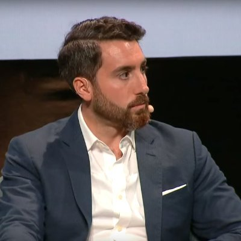

# 元宇宙初探（五）：内容、服务、资产、用户行为与元宇宙| Thought for Today

> 前四期元宇宙特攻队翻译发布的《元宇宙初探》（The Metaverse Primer）的前言、第一部分、第二部分和第三部分介绍了认知元宇宙的框架，硬件、网络传输、计算、虚拟平台、交换工具+标准、支付+区块链和元宇宙的关系，今天介绍内容、服务、资产、用户行为对元宇宙的作用。

**By Mathew Ball**

## 元宇宙中的内容、服务和资产业务

> 这部分重点介绍内容、服务和资产业务在元宇宙中的作用。在这里，内容、服务和资产业务被定义为「数字资产的设计/创造、销售、再销售、存储、安全保护和财务管理，如虚拟商品和货币，与用户数据和身份有关。这包括所有「建立在」元宇宙之上和/或「服务于」元宇宙的业务和服务，这些业务和服务不是由平台所有者垂直整合到虚拟平台的，包括专门为元宇宙建立的内容，并独立于虚拟平台。」

在整个《元宇宙初探》中，我主要谈到了元宇宙需要什么来运作、扩展和繁荣。这涵盖了技术和哲学，其中任何一个领域的进步都将有助于推动元宇宙经济的发展。但是，元宇宙经济本身将运行虚拟消费的内容、虚拟交付或驱动的服务，以及虚拟买卖的资产。

在可预见的未来，CAS 的收入将是相对温和的。以互联网本身为例。从 20 世纪 90 年代到 21 世纪末，行业增长和收入的主要部分是销售以互联网为重点的硬件（如个人电脑和移动电话）和连接（如固话和无线网络）的公司。像 Facebook、Tinder、Netflix、Spotify 和 King Digital 这样以互联网为重点的内容公司花了一些时间才出现并形成规模。

但我们确实对机会有一些感觉。毕竟，Netflix、Spotify 和 Snap 都在财报电话会议上将《堡垒之夜》确定为主要竞争对手，这是一个原因。

### 内容

很明显，拥有最受欢迎的 IP 和品牌的公司将在元宇宙中发挥重要作用，很可能与他们今天的相对喜爱程度成正比。迄今为止，《堡垒之夜》中最大的活动是漫威，其次是星球大战和美国橄榄球联盟（NFL），而 NBA 继续在 NFT 中领先。这类特许经营权之所以经久不衰，专门是因为它们在所有领域都能发挥作用，主宰着我们无尽的想象力和迷恋。像古奇（Gucci）和路易威登（Louis Vuitton）这样的品牌同样有可能茁壮成长；人类不断寻求符号和自我表达的机会。并非所有当今领先的游戏都会参与元宇宙（重申一遍，成为一个游戏并不意味着参与元宇宙）。然而，许多游戏将与之相连，即使只是通过资产权益（在游戏中赚取或购买一件衣服，并将其带到其他地方）。

但至关重要的是，元宇宙也将导致许多新的娱乐特许权和消费者品牌的建立。这是因为新的接入技术不仅改变了消费者获取内容的方式。它们还改变了内容本身。

例如，有线电视不仅提高了广播时代电视剧画面的分辨率，而且使更多的小众化、系列化和昂贵的电视剧成为可能，从而让《权力的游戏》、《霹雳火》和《猎屋人》等系列节目成为可能，并建立了 HBO、AMC 和 HGTV 等品牌。当视频游戏从街机转到游戏机时，一个游戏的保存和单个用户一次玩几个小时成为可行。这就是为什么游戏机时代是由《塞尔达传说》和《最终幻想 7》这样的游戏来定义的，而不仅仅是高保真版本的《吃豆子》和《加拉加》。同时，在线游戏让幻想的世界变得持久和更大规模的多人游戏，因此《魔兽世界》和 EVE Online 风靡一时。

技术对音乐的影响相对较小，但从无线电广播到黑胶唱片，然后是磁带、数字光盘、数字下载，再到流媒体的转变，影响了从一首歌的长度到谁成为我们收听对象的一切。即使是披头士乐队，虽然毫无疑问地注定成功，但也被不断变化的技术所提升。1954 年至 1962 年间，美国共售出 550 万台晶体管收音机。1963 年，这一设备数量几乎翻了一番，达到 1000 万台，其中许多是作为圣诞礼物收到的。这个新的无处不在的设备的首要用例（或「杀手级应用」）？听披头士的「我想握住你的手」，这首歌在 12 月 26 日巧合地在电台播放发布。一个月内，这首歌成为披头士乐队的第一首公告牌冠军歌曲，从而让该乐队在 2 月出现在埃德-沙利文秀上，并引发了披头士乐队的狂热。

Travis Scott 的虚拟音乐会也有类似的感觉。近 3000 万人花了 9 分钟完全沉浸在他的音乐中。这包括死忠和随意的粉丝、路人和甚至不知道他存在的人。地球上没有其他体验 —— 包括超级碗的中场表演 —— 能够提供这种程度的影响和关注，不管是不是新冠疫情。Scott 在音乐会上首发的曲目 The Scotts（与 Kid Cudi 合作）一周后在公告牌上首次亮相，排名第一。这是 Cudi 的第一个公告牌第一名，也是 2020 年最大的首次亮相。此外，Scott 从他两年前的 Astroworld 专辑中表演的几首曲目也回到了公告牌榜单。

考虑到这一点，我们需要超越今天的核心元宇宙内容体验。虚拟电影院、电影院、虚拟音乐会、虚拟现实战斗、XR 主题公园 —— 它们都很酷。但它们都是相当渐进的。尽管 Travis Scott 的音乐会是变革性的，但它不是现场动态捕捉，它没有真正卷入观众互动，而且它一次只能传播给 50 人。当这种情况改变时，会发生什么？如果不是让一个泰坦大小的 Travis Scott 坐在外太空的星球上，而是让这个星球变成一个神一样的泰坦，会发生什么？或者如果他是一个动作捕捉版的星球！？

娱乐业需要时间来弄清楚元宇宙里广播节目、电视剧、色情网站或 OnlyFans 是什么样子。而且，正如《堡垒之夜》的情况一样，这大部分将取决于技术的进步。但是，第一批这样做的公司、艺术家和故事将发现自己与美国队长、天行者和泰勒·斯威夫特等人相邻。同样，新的时尚公司和品牌也会在元宇宙时代出现，利用其独特的画布和受众，加上缺乏边际成本，来实现差异化，并迅速建立心智份额。我正在帮助 Off-White 的创始人兼 CEO Virgil Abloh 创建这种品牌。他的目标很明确，但范围也很广，「我想让虚拟的衣服描绘出实体衣服无法描绘的画面，让购买者进入他们个人风格的新维度 —— 无论他们是谁，住在哪里，以及他们热爱的虚拟世界。」

### 服务

相对而言，设想许多数字服务业务的未来要容易得多，比如健身和心智类的企业。Zwift 实际上是 Peloton，但在虚拟世界中，而 Mirror 感觉像是 Equinox 的前元宇宙版本。像 Calm 和 Headspace 这样的应用将需要过渡到虚拟空间和现场沉浸式课程。

State Space 的 Aim Lab 是一个虚拟的、由人工智能驱动的训练场，用于竞技游戏和技能开发。至关重要的是，该游戏连接到 Valorant 等游戏，以获得玩家和游戏数据（即玩家的射击历史和控制设置，以及枪支的重新装载速度和后坐力）。State Space 计划将其产品（包括类似 Roblox 的创作平台）扩展到认知和理疗等领域。

随着我们更多的生活、社交和成就转移到虚拟空间，我们的社交服务和网络将不得不进化。毕竟，Snapchat 不仅仅是 AOL 即时通讯的移动版，也不能说它是早期移动信息领导者 BBM 的一个小幅进化版。Medal.TV 可以被视为一种「虚拟世界的 Instagram」，现在有超过 50 万的 日活用户（同比增长 400%），每天发布超过 100 万个片段。值得注意的是，许多最受欢迎的片段是相当普通的，而不是展示令人难以置信的天赋或运动能力。而且很显然，元宇宙将导致我们约会和寻找伴侣的方式发生变化 —— XR 中的「向右滑动」是什么？ —— 不用回答这个问题。

(video-01)

我们还可以考虑创造者经济的扩张。新的市场将出现，以委托和销售独立创建的虚拟商品（Etsy，只是为了皮肤！），并为你的数字空间雇用建筑师和艺术家。这方面大部分内容今天已经通过 Super Rare 和 OpenSea 有效到位。

元宇宙也将彻底改变那些在互联网时代大多数情况下都避免了被破坏的行业。教育就是一个很好的例子。长期以来，技术专家一直争论说，面授的院学校将根本上被远程学习所重新配置和取代。但是，如果说新冠疫情为这一趋势做了什么，它已经证明了基于 Zoom 的学习和数字测验是多么惊人，以及个人存在感和丰富的社交对开发是多么关键。

无论是通过二维 iPad 屏幕观看的三维动画人物，还是 360° 虚拟现实，元宇宙将使学生能够参与更加丰富的教育环境，拥有完全的代理权和自主权，以及丰富的面部和身体动画。这不会取代亲身体验，但它将大大缩小差距，同时也帮助那些患有社交焦虑症的人。它还将让社会能够在其最稀缺和最宝贵的资源之一上获得更大的杠杆作用：优秀的教师。

此外，虚拟沉浸式课程提供了在任何课堂上都不可能实现的学习能力 —— 尤其是资金不足的学校。而这意味着不仅仅是在 VR 中参观罗马，长期以来这被承诺为 XR 的「杀手级应用」，但结果却相当陈旧。相反，元宇宙将让学生能够通过帮助建造罗马水道来了解它们的构造。孩子们将建造 Rube Goldberg 机器（在地球和火星上），并建造建筑物大小的 LED 屏幕，而不是仅仅阅读物理学知识。这些都不需要远程教育，但它肯定会改善教育。更重要的是，学校将通过物理教室来增强这些能力。全新成立的公司来建立虚拟学校和开发课程，并雇用教师和表演者通过动作捕捉进行现场教学。

动作捕捉表演的范围将更加广泛。例如，今天，数以百万计的人在网上赌博，使用基于 Zoom 的赌场，或在基于游戏的赌场中游戏，如《侠盗猎车手》的《幸运：洛斯桑托斯》赌场。在未来，我们中的许多人将会去元宇宙赌场，在那里他们将由现场的、由动作捕捉驱动的发牌员提供服务，同时享受现场的、由动作捕捉驱动的娱乐。我们将能够观看（甚至是委托）现场表演的舞台剧，雇用身临其境的家庭教师和理疗师，等等。

当然，虚拟表演已经存在了十多年了。在游戏内交易经济出现后不久，许多「玩家」—— 通常受雇于一家较大的公司，而且通常在低收入国家 —— 会花一个工作日收集数字资源，在游戏内或游戏外出售。但这种「劳动」通常是琐碎的、重复的，而且只限于少数应用（因此才有了「打金」一词）。随着元宇宙的发展，我们将看到这种工作的多样性和价值的增长。这将导致新的劳动力/雇佣平台（TaskRabbit、Uber、Fivrr 和 Upwork，但都是针对元宇宙的！）以及元宇宙「呼叫中心」，让计时劳动力更先进地外包到国外市场，并让更高技能的受薪美国雇员能够从大城市之外参与「高价值」经济。

这最终将改变我们对现代资源的分配和货币化方式，从住房到交通基础设施。从 Akron 在全球舞台上采取行动的能力，或来自马尼拉的一个卡牌交易员的能力，将改变我们雇用谁，用多少钱，以及我们住在哪里。

消费者对虚拟资产、货币、土地、物品和头像化身的支出增加，也将导致新的服务和工作。例如，大型加密货币所有者已经使用冷存储硬件或服务提供商来保护他们的 NFT、产权和货币。另外，有些人可能会雇用投资顾问或保险商为他们的虚拟商品提供服务，或者根据你对未来的特定设想，经纪人将这些资产出租给第三方，为这些资产提供信贷，或者经营这些资产进行出租。专家们可能被雇用来设计这些资产，例如你的头像化身或虚拟家庭，或管理它们在各种元宇宙市场上的销售。

随着「可互操作的虚拟资产经济的发展」，在 1 对 1 的基础上管理资产权利的互操作性也将变得越来越麻烦。我们不可能把我们的每一个虚拟世界、平台和体验账户互联起来，把一个特定的皮肤或货币拉到另一个世界，特别是在有进口关税和汇率需要管理的情况下。我们还希望有一个地方可以看到我们所拥有的一切，以及我们可以在哪里使用它。

鉴于此，很可能会出现另一种元宇宙服务 —— 元宇宙钱包或存储柜。这可以由现有的平台服务管理，如 Epic 在线服务或 PlayStation 网络，或像 Discord 或 Facebook 这样的社交网络，如 PaySafe 或 Coinbase 或 Rainbow 所提供的独立钱包。当然，如果元宇宙最终在区块链和 NFT 上运行，所有这些都会大大简化。

### 企业资产和相关业务

为了建立元宇宙，企业将需要生产（并因此投资）更多的虚拟资产，以及更复杂的版本，而这是很昂贵的。

在过去的三代游戏机中，制作大型 3A 级游戏的成本已经从较低的个位数增加到几亿。这反过来也是这么多 3A 级游戏在打包收费模式下推出的原因之一（即 60-70 美元的软件销售），尽管他们希望随着时间的推移过渡到更多的免费游戏（从而广泛使用）模式。出版商需要收回他们开发《夜城》、《洛斯桑托斯》或《伦敦城》的前期投资。

考虑一下微软的飞行模拟器，它在《元宇宙初探》第一部分中进行了广泛的讨论，是历史上最逼真和最广泛的消费模拟器。它包括超过 2 万亿棵单独渲染的树木、15 亿座建筑以及全球几乎所有的道路、山脉、城市和机场。总之，它拥有超过 2.5 PB 的数据 —— 或 2,500,000 千兆字节。这个巨大的虚拟世界之所以可能，是因为它是基于真实世界的扫描（其中大部分也是由 Xbox 工作室的姐妹公司必应地图拥有的）。从头开始建立所有这些数据，或者建立一个具有可比细节和多样性的虚构世界，将花费数十亿美元。

一些新的企业和商业模式已经出现，以满足这一需求。而且它们的重要性将在未来几年内不断增加。

2019 年，Epic Games 收购了 Quixel 公司，该公司生产出超现实的 MegaScans，包括一公里大小的真实世界中轴线、峡湾和其他「真实世界」的环境，其细节可精确到小石子。Quixel 的客户，包括电影制片厂、游戏出版商和广告公司，可以授权使用这些扫描，从而避免不必要地设计自己的沙丘、苔藓岩石和瀑布。或者将 Quixel 的扫描件作为更多定制工作的起点。《元宇宙初探》第三部分讨论了 Cesium，它管理并整合了来自不同来源（如开放库、自己的数据库和私人客户云）的大型地理空间数据管道（即环境扫描、点云、摄影测量数据和渲染），然后可以通过 3D 砖片开放标准通过任何专有引擎进行云推流。更广泛地说，我们将看到越来越多的企业专注于生产和维护特定「现实世界」环境的超现实渲染，如曼哈顿，或管理这些环境的虚拟信息数据库。

3Lateral 和 Cubic Motion 等公司，都被 Epic Games 收购，让开发者更容易制作和操作数字人类和化身。在第一次收购的三年后，该公司推出了令人惊叹的 MetaHumans 计划。其他一些公司现在正带头创建机器学习算法，可以程序化地生成连贯而有趣的虚拟环境。

Unity、Unreal 和 Roblox 也运营着在线市场，在那里，开发者可以授权使用各种虚拟资产，如未经切割的钻石、不死的粉色泰迪熊和希腊神庙。这些资产可以有许多不同的来源。例如，有些来自独立艺术家，他们不会直接为游戏、虚拟世界或电影工作。在其他情况下，开发商或动画师可能选择转售他们为游戏、虚拟世界或电影制作的资产。这些市场也可以作为一个发现平台，委托独立艺术家创作（见 Epic 公司 2021 年对 ArtStation 的收购）。

这些市场和商店的影响是深远的。最明显的是，一个虚拟世界或环境可以更快、更容易、以更低的成本制作。此外，为这个虚拟世界创造的东西可以被出售 —— 从而创造出第二个收入来源，可以用来增加前期投资，或者增加回报。最后，开发者可以把精力集中在他们创作的与众不同之处 —— 故事、角色和游戏性。这就是为什么建筑公司不自己砍木头，你的室内设计师不做椅子，迪士尼不为钢铁侠设计新车。

那些拥有这些市场和库的人将在元宇宙时代拥有巨大的优势。考虑到谷歌在 21 世纪初的地图/地理空间的努力。这跨越了并购（Keyhole、Waze）、许可证的收集（如卫星数据、道路）、数千万的劳动力（即驾驶工作车到世界上几乎每一个城市扫描收集数据）、机器学习（信息处理）和手动训练机器学习算法（谷歌在 2009 年收购 reCaptcha，部分原因是谷歌用户可以帮忙）。最终，这些信息是如此有价值，它推出了 Niantic（以前是谷歌的子公司）等公司，并实现了 Pokémon Go 和 Uber 等体验。而当苹果公司在 2012 年发布其苹果地图产品时，几乎没有人选择在此基础上进行开发（大多数消费者都厌恶它）。试图与那些拥有多年领先优势、大型生态系统和开发者锁定的数据平台竞争是非常困难的，而且成本很高。

这种动力解释了为什么大多数扫描/市场/虚拟生成的初创公司在成为后期甚至中期公司之前就被收购了。以及为什么像 Epic 和 Unity 这样的公司选择收购，而不是从零开始开发。在未来几年，我们很可能会看到这一领域的激烈竞争，像英伟达、Autodesk、Facebook、Snap 和 Niantic 都选择建立自己的数据库 —— 就像苹果和 Uber 最终移除谷歌地图平台一样。

## 不断演进的用户+企业行为和元宇宙

> 这部分重点介绍重点介绍不断演进的用户和企业行为在元宇宙中的作用。在这里，它被定义为「消费者和企业行为（包括消费和投资、时间和注意力、决策和能力）中可观察到的变化，这些变化或者与元宇宙直接相关，或者以其他方式让元宇宙成为可能，或者反映元宇宙的原则和理念。这些行为在最初出现时几乎总是像‘趋势’（或更多贬义的‘时髦’），但后来却显示出持久的全球社会意义。」

### 短期的行为变化

过去一年最明显的行为变化是我们在网上和虚拟世界中花费的时间越来越多。但更重要的是对这一行为的去污名化。几十年来，「游戏玩家」一直在制作「假的」化身，在数字世界中度过他们的空闲时间，同时完成各种任务和追求非游戏性的目标，如在第二人生中设计一个房间（而不是在《反恐精英》中杀死一个恐怖分子）。社会上很大一部分人，如果不是大多数人，认为这种努力是古怪的、浪费的或反社会的（如果他们没有直接看不起它）。有些人认为这是成年人在他们的地下室建造一个火车组的现代版故事。

很难想象有什么能比新冠疫情更迅速地改变这种看法。数以百万计的上述怀疑者现在已经参与（并享受）虚拟世界和活动，如《动物森友会》、《堡垒之夜》或 Roblox，因为他们找事做，参加曾经计划在现实世界的活动，或试图在室内与他们的孩子相处。这不仅消除了虚拟生活和元宇宙的污名，而且甚至可能意味着会有额外的一代人参与其中。

这有点像网上杂货店。数以百万计的消费者多年来一直知道这项服务，但拒绝尝试，因为他们认为如果他们不亲自挑选，这些杂货就会变质、损坏或无法接受。对这些顾客来说，即使苹果没有伤痕，它们也是「错误的」。最关键的是，没有任何营销或网络促销员可以克服这个问题。但是，冠状病毒已经迫使其中许多人在几个月前就开始使用食品杂货配送。结果，这些客户发现，事实上，这些食品杂货是好的，整个过程不仅简单而且很好。一些人将恢复现场购买，但不是所有人，也不是所有时间。

更多的用户和参与自然会给开发者带来更多的收入，反过来也会有更多的投资和更好的产品。但在过去的一年里，我们看到了另外两个对「元宇宙收入」的重大注入。第一个是对纯虚拟资产的快速合法化和投资，最明显的是通过加密货币和 NFT。第二是来自主要非游戏品牌和人才的投资，从普拉达、福特、古奇到小内马尔和 Travis Scott。这种投资也有助于虚拟平台进一步多样化，摆脱其历史上专注于「类似游戏」的目标，如胜利、射击、杀戮、击败和得分，转向更广泛的吸引人的活动，如创造、探索、识别、表达、合作和社交。

许多企业也正在转变他们的技术流程、条线和投资，以支持元宇宙。例如，好莱坞正在迅速地将他们的作品转向实时渲染解决方案，如虚幻和 Unity，或开发他们自己的引擎，如迪斯尼与工业光魔的 Helios。这不仅提供了更大的创意灵活性和更有效的拍摄时间表，而且使好莱坞能够制作「虚拟背景」。正如「迪斯尼地块」充满了蜘蛛侠的服装、布鲁克林的街道、无限的石头和储存的布景一样，老鼠之家正在积累数字资产的虚拟档案 —— 从纳瓦罗城到古曼陀罗，丁·贾林的剃刀冠，以及婴儿尤达自己。建筑运营商、建筑公司和汽车公司也在向虚幻或 Unity 这样的工具转变，而像 AutoCAD 这样以前的垂直特定解决方案正在向丰富的模拟领域发展。

这些转变意味着，任何为现实世界设计的东西，如福特 F150，或以前的单一用途，如 Moff Gideon 的轻型巡洋舰，都可以相对容易地以有限的成本过渡到元宇宙，并无限地重复使用和迭代下去。这里的影响是难以低估的。元宇宙需要填充虚拟内容，但这些内容的制作成本很高，而且往往缺乏一个直接的短期商业案例。我们中的许多人可能想在 Zwift 上骑自行车游览恩多星球，但制作这些内容的成本很高。然而，如果迪斯尼已经制作了它，它只需要进行裁剪。此外，迪斯尼利用其虚拟恩多的能力，也将导致对其品质的更大投资。

(video-02)

### 开放资产经济和共享的持续进展

在第四部分中，我回顾了能够在虚拟体验之间转移物品、资产和货币的经济重要性。为此，「经济引力」继续推动娱乐业走向这种开放形式。

理论上，这一趋势始于《堡垒之夜》，这是第一款玩家可以在全球几乎所有计算平台上，通过每个平台专有的在线服务/账户系统，访问、收集和使用他们在游戏中的任何资产（如物品、货币、成就、进度数据），而且玩家也不需要为这种特权付费。

但 Epic 确实如此，至少在概念上和开始时是如此。该公司与苹果公司的诉讼显示，为了在 PlayStation 上推出交叉游戏/购买/进展，Epic 同意向该公司支付某种微交易，用「真金白银」确保互连不会以牺牲玩家消费为代价。

虽然交叉游戏/购买/进展显然对玩家有好处，因此应该导致更多的参与和更多的消费，但它为所有参与平台打开了收入流失的机会（除了较弱的网络效应，如前所述）。大多数平台的商业模式在很大程度上（在《堡垒之夜》等免费游戏的情况下，完全）依赖于游戏内交易的 25-30% 的费用。相应地，索尼似乎担心玩家使用 PlayStation 的次数会超过他们通过 PlayStation 购买的次数。这将意味着玩家最终会对竞争平台进行补偿，购买他们在索尼平台上使用的商品。例如，玩家可能有 75% 的时间使用 PlayStation 4，25% 的时间使用任天堂 Switch，但有 40% 的购买是在后者的平台上进行的，因此相对于花费的时间，PlayStation 的总收入被剥夺了 15%。为了避免这种情况，Epic 对「重叠」的交易支付两次费用。在这种情况下，它将向任天堂和索尼支付这 15% 的费用的 25%。

目前还不清楚这种支付结构是否仍然存在 —— 在索尼为《堡垒之夜》开放交叉游戏/购买/进展接近三年后。然而，《堡垒之夜》仍然在 PlayStation 中跨平台运营，所以至少，Epic 必须发现跨平台功能导致更大的支出，以补偿利润率的压缩。然而，自 2018 年以来，索尼已经为许多其他游戏解锁了这种功能，并且没有出现类似的「真实上升」的报告。这表明，这种结构已经不复存在，因此，索尼或者已经确定，跨平台游戏导致每个玩家支出的增加，大大超过了该收入的任何流失。无论如何，跨平台游戏/购买/升级现在是一种赌注，任何取消这种能力的平台无疑会遭受用户流失。

除了交叉游戏和购买，还有跨 IP 的「互操作」。如上所述，这并不是游戏与游戏之间的资产互操作，而是在理念上是至关重要的。

随着像《堡垒之夜》、《我的世界》和 Roblox 这样的虚拟平台成长为文化驱动的社交空间，它们已经成为消费者营销、品牌建设和多媒体特许经营体验中越来越必要的一部分。在过去的三年里，《堡垒之夜》与美国 NFL 和国际足联、迪斯尼的漫威漫画、星球大战和异形、华纳兄弟的 DC 漫画、传奇公司的约翰·维克、微软的光环、索尼的战神和零地平线的黎明、卡普空的街头霸王、孩之宝的美国大兵、耐克和迈克尔·乔丹、Travis Scott 等合作举行了各种虚拟活动。

但是，为了参与这些活动，品牌所有者必须接受他们在营销合作中几乎从不允许的东西：无限期的许可（游戏中的服装由玩家永远保留），重叠的营销窗口（一些品牌活动相隔几天或完全重叠），以及对编辑内容没有真正的控制。总的来说，这意味着现在有可能在穿着尤达宝宝或乔丹背包、拿着海王的三叉戟、探索斯塔克工业的同时打扮成内马尔。而这些特许经营权的所有者希望这种情况发生。

最后，我们也开始看到 Epic 利用 Epic 在线系列来推动彻底的跨 IP 成就和虚拟商品。在 Epic 收购 Psyonix 后不久，该公司宣布 Psyonix 的火箭联盟将实行免费游戏，并转移到 Epic 的账户系统。几个月后，Epic 宣布了几个 Llama-Rama 活动中的第一个。这些 LTM 让《堡垒之夜》的玩家能够在《火箭联盟》中完成挑战，从而解锁独家服装和成就，可以在任何一款游戏中穿戴。

今年早些时候，Epic 收购了 Tonic 游戏集团，该集团制作了 Fall Guys 和其他几款游戏，作为其「投资建设元宇宙」的一部分。很明显，Epic 将在 Tonic 的游戏中推广其《火箭联盟》的实验，以及那些来自 Epic Games Publishing 的游戏，该公司资助和发行独立工作室的游戏，并通过 Epic Games Store 进行销售。鉴于 Houseparty 现在在 Epic 在线服务上运行，因此能够将你的 Houseparty 音频和视频流到你的 Fortnite 游戏中，不可能相信这种功能不会被用于任何使用 EOS 和 Epic 账户系统的游戏。同样明显的是，Epic 将把 Houseparty 流媒体与它的实时人类渲染能力和用户的化身收藏结合起来。这意味着用户将能够把他们的商品、身份和活生生的肖像传送到 EOS 网络上任何选择支持该功能的游戏中。

最终，我们应该把 Epic 在跨 IP 资产和成就解锁方面的测试视为类似于其在跨平台游戏和 IP 混搭方面的先例。该公司似乎相信，通过减少进入不同游戏的摩擦（通过免费游戏的货币化），让你的朋友和物品更容易跨越这些游戏，并给玩家一个尝试/玩这些游戏的理由，玩家将花费更多的时间，与更多的人，跨越更多的游戏，并有更多的消费。

然而，比这些测试更值得注意的，可能是区块链社区的测试。正如我在《元宇宙初探》第四部分所讨论的，基于区块链的体验继续显示了可转售、真正可拥有和可互操作的商品的经济潜力。如果这种趋势继续下去（我解释了许多可能的原因），收入将是开发者无法抗拒的。

### 长期的行为变化

尽管上述所有的变化都很重要，但都比不上代际变化的影响。

在 iPad 发布后的头两年或更长时间里，经常可以看到媒体报道和 YouTube 视频，婴儿和幼儿会拿起一本杂志或书，试图「刷」一下它不存在的触摸屏。这些视频都有着不同程度的可爱、滑稽和传播学。虽然我们可以很容易地明白所发生的事情，但我们无法真正理解这些认知框架与我们自己的认知框架有什么不同。

今天，那些一岁的孩子已经十到十二岁。2011 年的四岁孩子现在已经顺利进入成人期。这些曾经不理解的媒体消费者现在直接花钱购买内容，有些人已经在自己创造内容。虽然这些孩子现在明白为什么我们发现他们的认知框架如此有趣，但我们仍然努力理解这些框架与我们自己的框架有何不同。随着这些消费者的成熟，各行业也在发生变化。

(video-03)

一个关键的例子是虚拟平台 Roblox。Roblox 于 2006 年推出，大约十年后才有了大量的观众。又过了三年，才有任何非玩家真正注意到这个平台。两年后，它成为历史上最大的媒体体验之一。现在它正在改变世界。

这 15 年的进步部分归功于上述的技术改进，如设备 CPU 和 GPU，以及服务器端技术、网络基础设施和服务，如微软的 PlayFab。但是，Roblox 的核心用户，即 9-12 岁的用户，正是在「iPad 原生」中成长起来的孩子（Roblox 说在这个年龄段的美国儿童中，超过 75% 的人经常使用这个平台），这并不是巧合。

iPad 一代在成长过程中的期望、行为和社交形式与之前的那些人非常不同。那些「iPad 原住民」群体以外的人看 Roblox，看到的东西很少（如果/当它出现时）。Roblox 过去（现在也是）在视觉上并不令人印象深刻。它的叙述相对来说（如果不是客观的）不够有说服力。甚至它的社交功能也不如 Y 一代、X 一代和潮人所熟悉的那些如 Snapchat、Instagram 或 FaceTime，甚至是像《堡垒之夜》这样的高产游戏。一个社交平台怎么会有能力不足的社交工具？

对于娱乐界许多人来说，Roblox 更多的是被理解为玩乐高或看 Nickelodeon —— 一个主要的原始形式促进了教育，我们最终从这些活动中成熟到更「实用」的活动，如室内装饰或汽车维修，或「生产 」的，如 HBO 或《最后的我们》。所有这些都是对时间的伟大利用，不比 Roblox 好或差。但这种逻辑很少发挥作用。

好莱坞长期以来一直认为，千禧一代会成长为线性付费电视捆绑用户，或对 YouTube 失去兴趣。他们从未这样做过。虽然他们现在看 Netflix 和 Disney+，但视频在休闲时间中的份额正在逐代下降。

今天这一代的孩子通过他们可以触摸、改变和合作的虚拟世界来表达自己，经常学习，并不断进行社交。这不会停止。相反，这些虚拟世界的能力将扩大，它们的易用性将提高，它们的重要性将增长。更重要的是，「iPad 原生」一代（或者说是「虚拟世界原生」一代）将继续成熟。大多数人仍然是消费者，少数人是创造者，几乎没有人是商业领袖，他们将是。而他们的认知框架将导致变革。

## 关于作者

Mathew Ball 是 EpyllionCo 的管理合伙人，负责运营早期风险基金和企业和风险咨询部门。此外，他还是是全球最大的游戏风险基金 Makers Fund 的合伙人，也是 Ball Metaverse Research Partners 的联合创始人。2016 至 2018 年，Mathew Ball 担任亚马逊工作室的全球战略主管。在此之前，他是切宁集团下属奥特媒体的董事。在 2000 年代，他是加拿大自然资源部的一名全职森林消防员，并代表加拿大海岸警卫队发放划船许可证。

Mathew Ball 在《纽约时报》、《经济学人》和彭博社拥有专栏，并被这些媒体以及《大西洋》、《华尔街日报》、《纽约客》、《华盛顿邮报》、Vice、The Verge、CNN、CNBC、《金融时报》、BBC、《环球邮报》等报道。

**延伸阅读**

这里是「元宇宙特攻队」，我们下期见。
