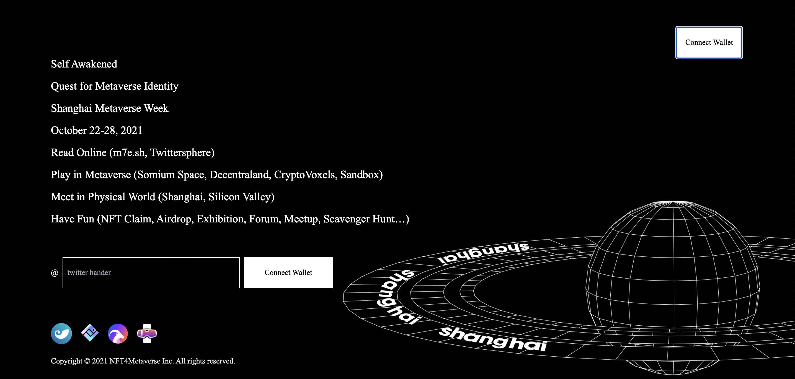
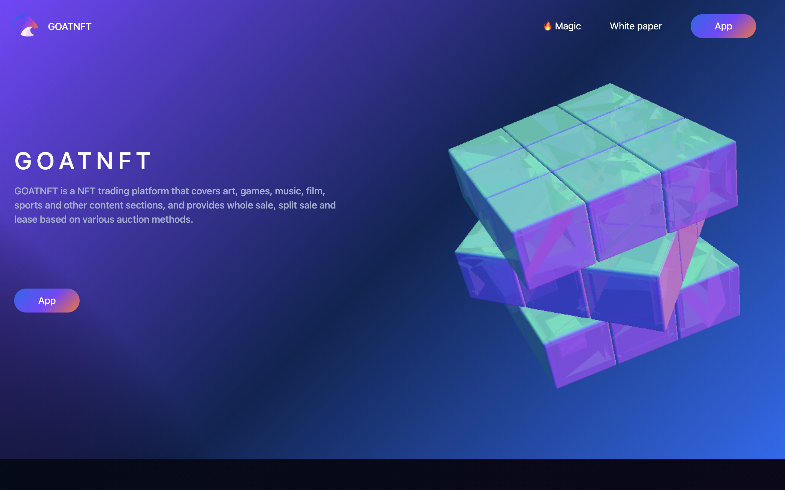
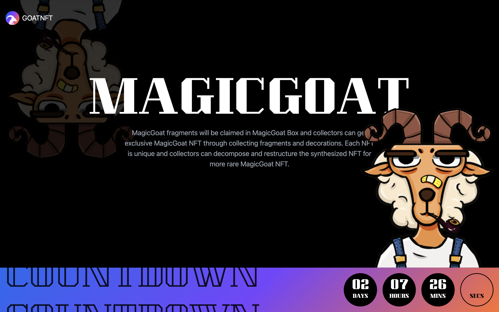
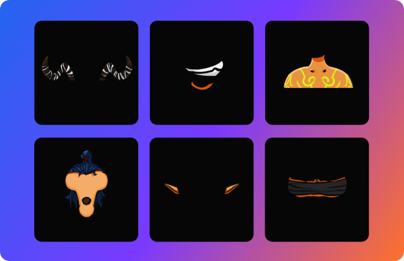
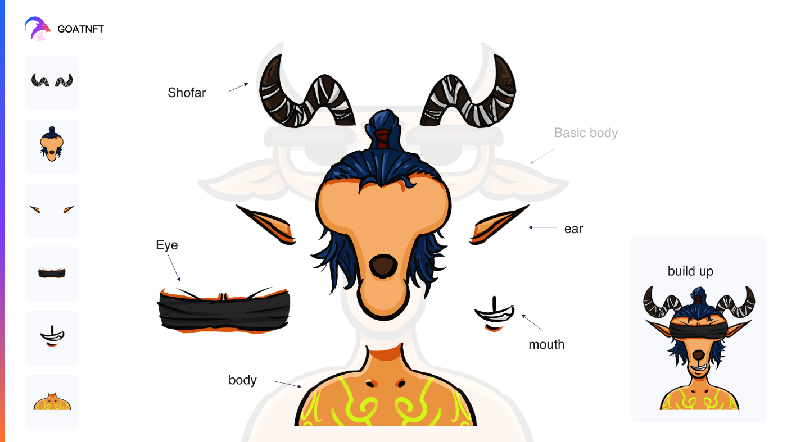

# MagicGoat：像乐高积木一样拼装拆解你的山羊 NFT | 上海元宇宙文化周 NFT 空投 ①

> 7 天前，2021 上海元宇宙文化周开启活动预报名，反响热烈，出乎意料，迄今我们收集了 8063 个以太坊钱包地址。
>
> 今天，我们宣布上海元宇宙文化周第一轮 NFT 空投和申领，将于两天后 9 月 15 日正式开启！
>
> 
> 网址：**https://join.m7e.sh/**

**By Shanghai Metaverse Week**

作为新兴 NFT 平台，GOATNFT（网址：**https://goatnft.io/**）旨在为艺术品、游戏、音乐、影视作品打造最棒最酷的 NFT 组合拆解、交易和租赁的平台，日前在开源软件和社区资助平台 Gitcoin 正在举行的第 11 轮捐助中名列 NFT 项目第二，总共获得 345 名捐助者 2765 美元的捐赠（9 月 12 日数据统计），在 NFT 领域和以太坊社区引发了相当的关注。

9 月 15 日，GOATNFT 开启其创世 NFT「MagicGOAT」的空投和盲盒发售，同时也作为赞助商启动了 **2021 上海元宇宙文化周首轮 NFT 空投和申领。**

作为官方创世 NFT，MagicGOAT 取名于 GOATNFT 平台（GOAT 为 Greatest of All Time 的缩写，同时也意为「山羊」），并赋予了亿万年前维斯特洛大陆羊龙两族相争的 GameFi 世界观，因此在发售的盲盒中将有相当几率获取与故事背景相关的身体部件或饰品，如龙的犄角和万龙甲等 NFT。

活动官网：**https://magic.goatnft.io?referral=nft4metaverse**

## 感恩空投

为感谢通过 Gitcoin、推特和电报群支持 GOATNFT 项目，以及首批报名参与 2021 上海元宇宙文化周的朋友，GOATNFT 将随机抽选 50 位粉丝朋友对他们进行空投，符合资格的朋友可以免费铸造（只需支付以太坊网络 gas）。

空投名单将在 9 月 14 号零点前确认并在 GOATNFT 官方推特 **@goatnftio** 公布。

## 玩法多样

### 玩法 1：盲盒发售

MagicGOAT 将于 9 月 15 日在 GOATNFT 平台正式上线，同时上架 Opensea，总共限量发行 8196 个山羊身体部件和装饰品，玩家可以在活动官网铸造部件和饰品的 NFT，每个盲盒售价 0.05ETH。MagicGOAT 盲盒发售将分 8 轮展开，每轮售出 1024 个盲盒，GOATNFT 会从每轮的买家中随机抽取一位奖励 1ETH，8 轮总共奖励 8 位幸运者 8ETH（当然，需要提前关注 GOATNFT 的官方推特并转推 GOATNFT 的置顶推文哦）。

### 玩法 2：融合

完成盲盒发售之后，GOATNFT 将推出 100 张融合卡以开启融合功能，前 100 名融合完整山羊 NFT 的玩家将免费获得可以将部件和饰品融合成完整的山羊 NFT 的融合卡。拥有完整山羊 NFT 的玩家将在 GOATNFT 平台获得与稀有度匹配的相关权益，没有的玩家可以通过从拥有者手中购买或者租赁获得融合卡来融合完整的山羊。

山羊身体必要部件包括羊角、发型、耳朵、眼睛、眉毛和嘴巴，可选装饰品包括耳环、项链、烟斗、帽子等，如果没有融合卡，可以融合残缺的山羊，但不能融合完整的山羊。在融合过程中，有 1%的几率可能会融合失败，丢失部件和饰品，但会获得一个神秘的 NFT。

### 玩法 3：溶解

玩家如果对自己融合的山羊不满意，也可以购买或者租赁溶解卡，溶解完整的山羊 NFT，溶解过程会销毁山羊 NFT 并重新得到山羊的部件和饰品，玩家可以再加入新的元素融合稀有度更高的山羊。

### 玩法 4：销毁

玩家还可以销毁部件和饰品，以提高部件和饰品 NFT 的稀有度。

### 玩法 5：出售/出租

游戏是 GOATNFT 平台的重点板块，创世 NFT MagicGoat 也融入了游戏玩法，GameFi 与 GOATNFT 平台游戏租赁可以打造一个完美闭环。

玩家不仅可以售卖山羊 NFT，还可以售卖融合卡和溶解卡，如果不想一次性售出，还可以通过 GOATNFT 平台的租赁功能对外限时出租，这样既获取了收益也继续保留对 NFT 的所有权。

## 更多玩法

GOATNFT 在未来还将开启山羊 NFT 稀有度排名榜，玩家可以根据山羊的稀有度获取 GOATNFT 平台不同相关权益，比如 GOATNFT 交易手续费折扣或者不定期空投等。

## 产品动态

近期 GOATNFT 团队正在封装通用租赁协议以及 JavaScript SDK。通过封装通用能力，可以让生态内项目非常低成本的直接接入租赁能力，非常值得期待。

这里是「元宇宙特攻队」，我们下期见。
