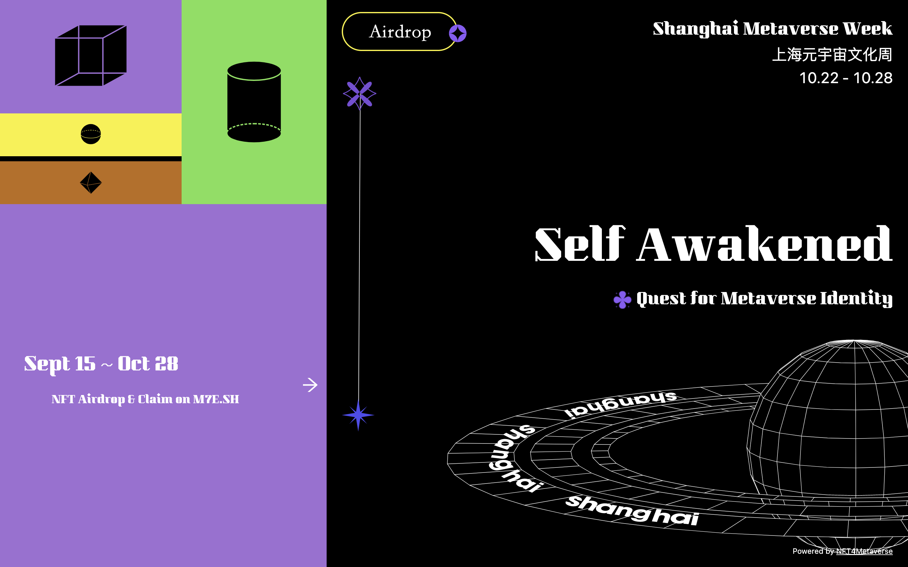
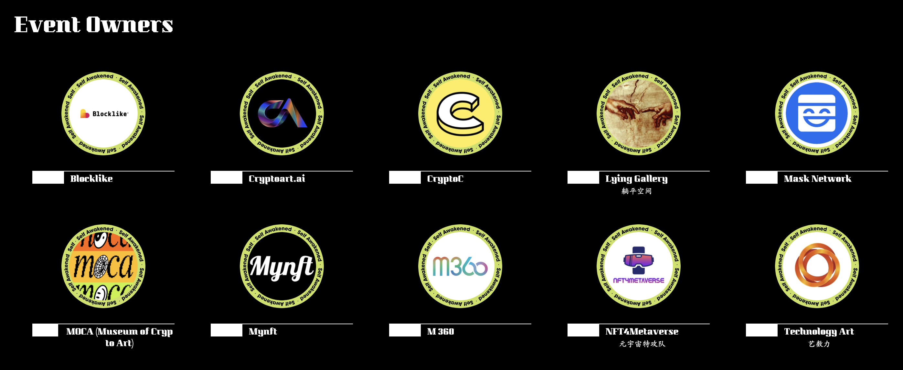
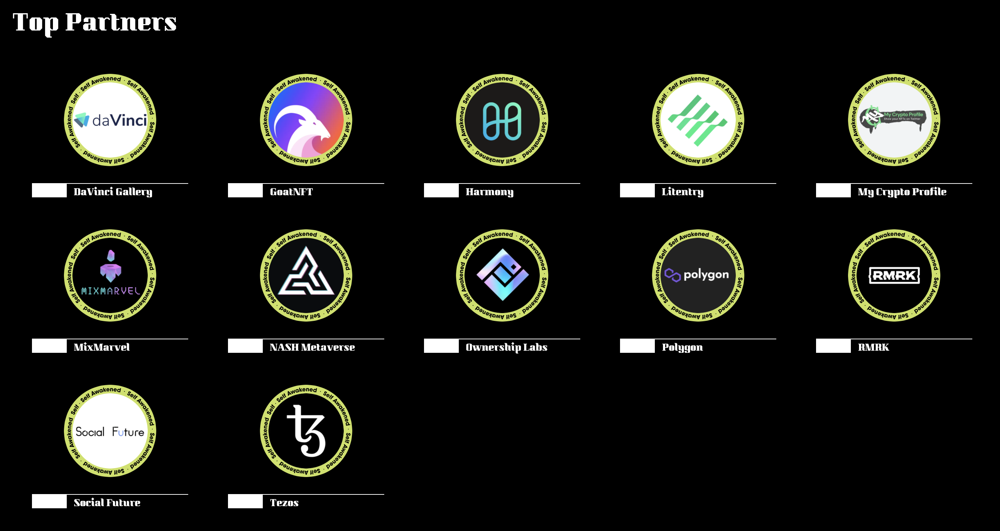
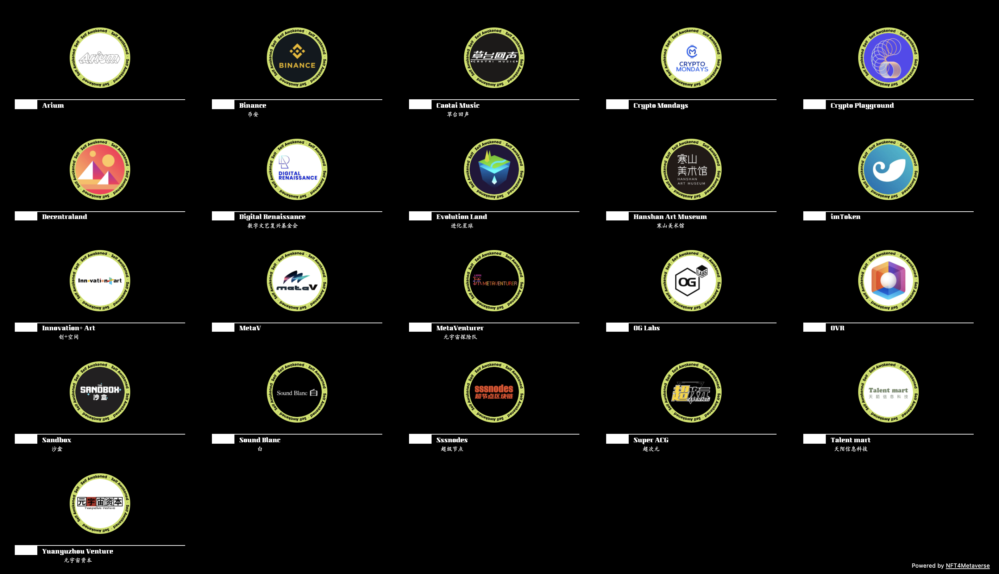
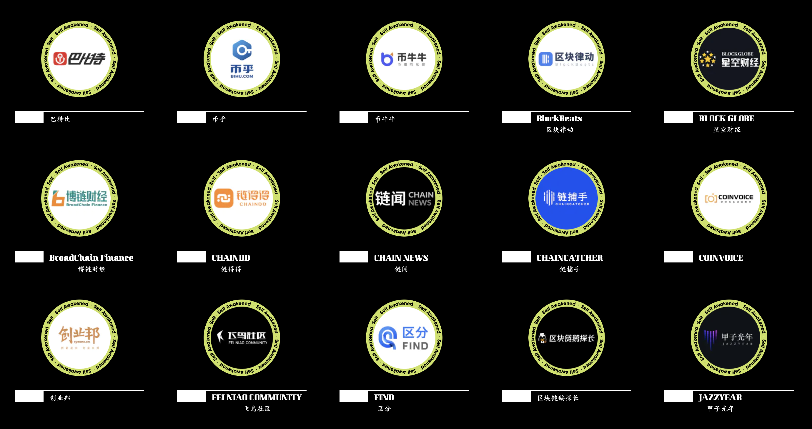
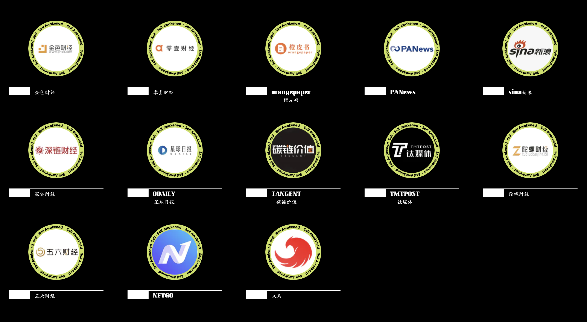
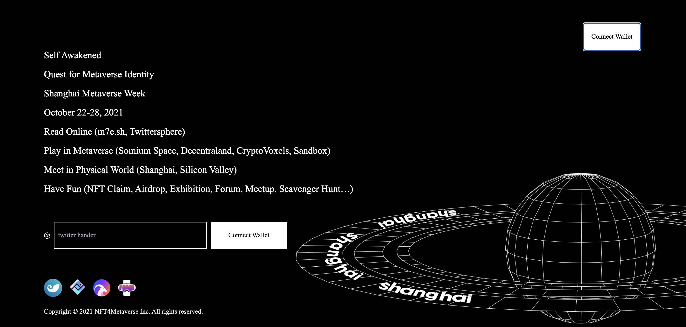

# 2021 上海元宇宙文化周官网上线，大幕开启！

> 今天，2021 上海元宇宙文化周（Shanghai Metaverse Week 2021）官网上线，定于 10 月 22 日开幕的文化周先期拉开线上预热的帷幕……
>
> 
>
> 网址：**https://m7e.sh/**

**By Shanghai Metaverse Week**

如今，元宇宙很热，似乎只要是 3D 的、游戏的、社交的、NFT 的平台、应用和项目，都可以装进这个大筐里……

## 元宇宙到底是什么？

**元宇宙特攻队**认为，它是下一代互联网，一个由用户能真正独立自主掌控自己身份数据和所有权的互联网，是否一定要通过 VR 头盔、AR 眼镜这种沉浸式设备才能访问和体验元宇宙？其实这并不是必要条件。

不过，元宇宙现在还处于早期，对其认知还处于盲人摸象的阶段，我们的观点也只是一家之言。但无论对业内人士还是普罗大众，从去年疫情全球爆发蔓延以来，大家都多多少少感受到我们的工作学习生活娱乐正在加速往数字世界迁移的趋势……

所以，与其争论元宇宙是什么？diss 元宇宙是不是泡沫？不如亲身来体验！

这就是我们和 MOCA、CryptoC 和 Mask Network 等最早一批小伙伴联袂举办 2021 上海元宇宙文化周的缘起。

## 为什么探寻元宇宙身份？

如果将来某一天元宇宙真正建成，在这个须臾不可分离、与现实世界水乳交融的数字世界中，对你、我、他，每一个人最重要的先决条件是什么？

是每个人能够独立拥有、自主掌控的数字身份，而不是如今由互联网平台予取予夺的账号 —— 当你注册同意用户协议的那一刻起，你几乎一切数据和权利均归中心化平台所拥有。

只有独立拥有、自主掌控你的数字身份，人们才能放心大胆地进入元宇宙自由工作生活娱乐，获得拥有并交易自己的数据和权益。

因此，NFT 领域那些天价 JPG、火爆的头像、不明觉厉的 8 行文字 TXT，其实它们代表着码农、艺术家等技术创意工作者，寻觅商机的创业家和投资人，对未来嗅觉灵敏勇于探索的早期用户对元宇宙身份（Metaverse Identity）的认知和探索……

一切才刚刚开始，上海元宇宙文化周鼓励大家用创意、娱乐和体验的方式来探索、交流和表达，期望在此过程中每个人都能获得自我的觉（Self Awakened）……

## 元宇宙文化周为什么在上海举办？

毫无疑问，个人电脑（以及缩小到我们口袋里的智能手机）和互联网，已经深深改变了我们的生活和世界，但推动它们诞生的并不只是我们想当然的技术进步，而是上世纪六七十年代在美国湾区年轻人流行的理念和文化：追求自由、平等、创新、开放、共享……

因此，理念、文化在推动技术、创新和社会转型的作用不可小觑，而这一全新的理念和文化总是在某个地方以社区的形式吸引凝聚某一群人一起蕴育共创壮大并传播开来。

虽然在新兴的元宇宙里，传统的国界不再重要，但集聚并推动人们去拓展数字新边疆的地理据点仍然重要。参照推动个人电脑和互联网诞生的湾区硅谷，今天的上海有种种迹象表明正在成为集聚创意、人才、项目、资金、资源推动元宇宙爆发的奇点。

与此同时，理念、文化和社区的助力不可或缺，上海元宇宙文化周因此而生，一切都那么顺其自然。

在 10 月 22 日至 28 日，2021 上海元宇宙文化周将与同期举行的 2021 上海区块链国际周一起，努力从技术、产业、应用、体验、娱乐、文化等多种角度全方位为全社会各行各业揭示 Web 3.0/下一代互联网/元宇宙的前景和潜力……

## 上海元宇宙文化周，众人拾柴火焰高！

从最初的加密艺术展到现在融展览、论坛、线上互动、线下寻宝为一体的元宇宙文化周，这一活动像树木森林一样自然成长壮大……

经过一个多月的策划筹备和调整，文化周的场地从线上如 Somnium Space、Decentraland、CryptoVoxels 等元宇宙、以今天揭幕的官网 M7E.SH 为主的万维网和推特延展至线下的上海外滩和 M50 文创园区，以及美国硅谷，文化周的举办时间也从原先的 9 月 9 日至 15 日延期至 10 月 22 日至 28 日，合作伙伴从上述的 4 家扩展为：

- 10 位活动负责伙伴

- 12 位赞助商伙伴

- 21 位活动支持伙伴

- 23 位媒体伙伴

首届上海元宇宙文化周能在这么短时间内吸引集结近 70 位小伙伴出钱出力出资源把活动热热闹闹地办起来，我们在此表示诚挚的感谢！

需要强调的是，上海元宇宙文化周是一个开放的活动品牌和平台，欢迎更多有志于元宇宙的各行各业的伙伴加入共创！

_注：图示合作伙伴按字母排序，名单截至 9 月 25 日_

## 首届上海元宇宙文化周，你值得期待！

从 8 月 23 日我们非正式宣布举办上海元宇宙文化周到 9 月 6 日启动文化周活动报名，反响热烈，出乎意料 —— 仅仅通过生成 Loot 头像通行证，我们就获得了八千多个以太坊钱包持有者的报名。

为响应广大参与者的热情，我们从 9 月 15 日起开启文化周的 NFT 空投与申领，保证到 10 月 28 日闭幕之前至少每周有一场 NFT 的空投与申领（**点击官网 Airdrop 页面，可以查看 9 月 15 日举行的第一场空投，并留意今明两天举行的空投申领活动**）。

为帮助大家了解 NFT 和元宇宙，从 9 月 30 日起，我们在币安直播将每周举行一场访谈，介绍参与文化周的创新项目。

与 MOCA（Museum of Crypto Art，加密艺术美术馆）合作的主题展也将先期于 9 月 29 日开幕的苏州寒山美术馆展出，正式于 10 月 22 日至 28 日在元宇宙、官网、推特和上海 M50 展出。

10 月 22 日的开幕论坛、23 日上午与美国硅谷连线的研讨会，以及当天晚上与欧洲连线的沙龙，我们将邀请艺术家、策展人、创业者、投资人、意见领袖围绕 NFT、元宇宙的趋势技术应用等话题进行深度分享交流，并将采用全新的形式进行全网直播。

10 月 23 日和 24 日在上海 M50 创+空间举行的头像狂欢节、4X-Inception 主题展和超次元虚拟化身实时互动体验将为大家带来不一样的线下元宇宙体验；10 月 24 日至 28 日，我们将在上海 10 家酒吧利用 AR 应用开展一场有趣 NFT 线下寻宝活动；10 月 28 日，文化周将通过在 CryptoVoxels 举办的元宇宙狂欢活动宣布收官。

以上只是截至目前策划筹备的活动，还有更多新鲜有趣的线上活动正在来的路上，请密切关注文化周 M7E.SH 官网、元宇宙特攻队公众号和推特（@NFT4Metaverse）的通告！

### 日程概要

- 9 月 15 日至 10 月 28 日：NFT 空投与申领 @文化周官网
- 9 月 29 日至 11 月 21 日：《分身宇宙》展览 @苏州寒山美术馆
- 10 月 22 日至 28 日：《MOCA 展：自我的觉醒》 @元宇宙/官网/推特/上海 M50
- 10 月 22 日全天：开幕论坛《探寻元宇宙身份》@上海外滩创意家俱乐部
- 10 月 23 日上午： Harmony 聚会《当上海在元宇宙与硅谷邂逅》 @上海 M50 创+空间
- 10 月 23 日下午：NFT 头像狂欢节 @上海 M50 创+空间
- 10 月 23 日晚：Polygon 生态元宇宙之夜 @上海 M50 创+空间
- 10 月 23 日全天：NASH Metaverse：4X-Inception 主题展 @上海 M50 创+空间
- 10 月 24 日晚：闭门酒会《与 MyCrptoProfile 和 Dataverse 一起探寻元宇宙身份》 @上海外滩创意家俱乐部
- 10 月 23 日至 24 日：超次元虚拟化身实时互动体验 @上海 M50 创+空间
- 10 月 24 日至 28 日：NFT 线下寻宝 @上海酒吧
- 10 月 28 日晚：闭幕派对 @元宇宙
