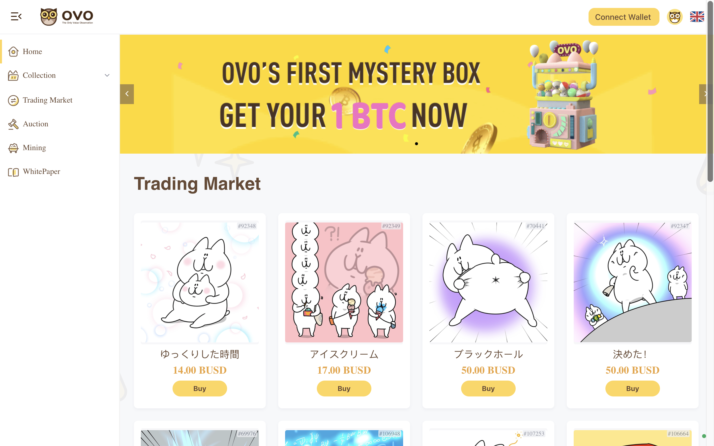
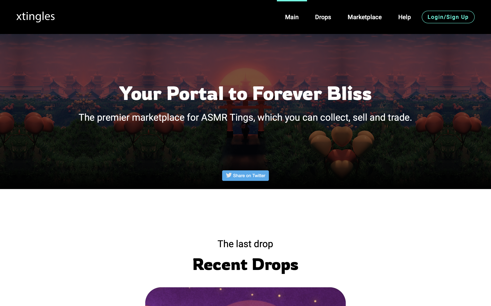
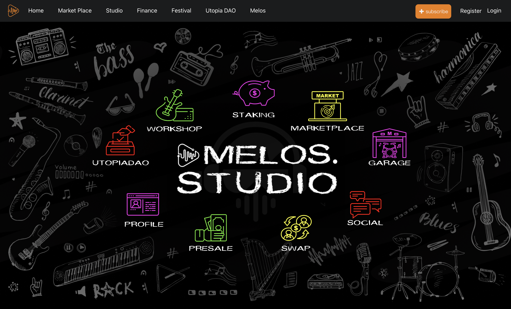

# 「Flow 生态狂欢节」精彩项目抢先看（一）| 2021 上海元宇宙文化周推广

> Flow 由 2017 年和 2020 年分别打造 CryptoKitties 和 NBA Top Shot 两款爆款应用，力推 NFT 出圈的 Dapper Labs 开发，正在打造孵化专注于支持 NFT 的公链生态。
>
> 日前，Flow 与元宇宙特攻队达成合作，双方相互参与、支持并推广各自主办的「Flow Fest 生态狂欢节」和「上海元宇宙文化周」（Shanghai Metaverse Week）活动。
>
> 今天，为大家介绍第一批参与 Flow 生态狂欢节的生态项目。

**By Shanghai Metaverse Week**

为了让全球用户更好地了解基于 Flow 的前沿技术，身临其境地感受数字生活的魅力，从 10 月 15 日起，Flow 官方策划了为期 1 个半月的 Flow Fest 虚拟生态狂欢节，从收藏品到游戏，从音乐到艺术到体育等，以及一系列的福利活动，让全球用户真正地参与到 Flow 生态中来。

## 关于「Flow 生态狂欢节」

「Flow 生态狂欢节」期间，将有 20+ Flow 生态项目陆续发布上线，项目覆盖艺术、游戏、音乐、体育等各文娱产业类型，用户可以在此期间购买自己心仪的数字收藏品，感受来自元宇宙的独特数字魅力。同时，这些项目在神秘礼盒的预热活动中也为大家准备了免费好玩的盲盒礼品空投，全球限量 30000 份，参与方式详见《「Flow 生态狂欢节」上线，免费好玩的数字收藏品等你来拿》。

究竟有哪些项目参与了「Flow 生态狂欢节」？上海元宇宙文化周抢先带大家一探究竟。

## 1. Matrix World（矩阵世界）

**简介：** Matrix World 是一个开放的虚拟世界，让用户能够在多条区块链之上构建 3D 沉浸式应用。Matrix World 是由 NFT 土地组成，NFT 可在以太坊和 Flow 等链上永久保存。Matrix World 土地可通过区块链网络进行交易和转让，所有者可完全掌控其土地上的创作。

> 项目官网：https://matrixworld.org/
>
> 加入社区：https://discord.gg/w5AyHNVsyw
>
> Telegram: https://t.me/joinchat/FsnB5Tt-xo9iMmI1

**小编说：** 在 Matrix World 中，你可以建造 3D 建筑、主持虚拟会议、展示 NFT 数字资产，还有更高级的功能，如利用 Matrix 内置的创作者服务和计算资源开发和托管自己如游戏、交易等三维 DApps。Matrix World 的最终目标是跨链建立下一代三维开放世界 DApps 平台，为元宇宙创造无限可能和机会。近期，Matrix World 也积极参与了 Flow Fest 活动，后续会为 Flow 生态带来更多沉浸式的应用场景。

## 2. Racing Time

**简介：** RacingTime 是建立在 Flow 链上的新一代赛车游戏。除了漂移和加速的即时动作反馈，RacingTime 还提供独特的 UGC 游戏体验，包括配件收集、汽车定制和 NFT 交易。玩家可以通过击败对手赢得奖品和奖杯，并解锁新的小工具，进一步改装增强他们的未来主义超级赛车。复杂的改装机制确保了最高水平的可定制性，10 多个地理条件与不同的气候相结合，要求玩家想出聪明的改装策略，以实现最佳性能。

> 项目官网：https://www.racing-time.com/
>
> 加入社区：https://discord.gg/4Vt5ggzQ2w
>
> Twitter: https://twitter.com/racingtime_now?s=21

**小编说：** RacingTime 由一群来自电艺、腾讯、CodeMasters 和网易的顶级游戏设计师开发，拥有自己的赛车物理引擎操作系统的专利，希望突破目前区块链游戏小打小闹的局面，打造 3A 级区块链赛车游戏。Racing Time 不仅允许玩家收集和交易稀有汽车，还邀请玩家用 50 多个零件和小工具，以及由顶级艺术家和设计师设计的无数汽车皮肤来改装和组装他们的个性化赛车。

## 3. OVO

**简介：** OVO 是 Flow 链上领先的 3D 全立体、AR 可视化的 NFT 交易平台。其推出的卡通《Nyathees》，目前在日本 LINE 商店的下载量已达 400 万次。OVO 平台将在未来推出更多的 IP 作品，如二次元动漫、时尚嫩模、原画师与设计师等。平台包括盲盒、拍卖、NFT 合成、挖矿及与 IP 创作者互动等功能。

目前，OVO 社区有超过 30,000 名活跃会员，其中大部分来自日本。OVO 创始团队在各个领域都获得了丰富的资源，包括与全球 300 多个加密油管博主和 KOL 的长期合作，覆盖了众多动漫爱好者。OVO 将以日本为中心，辐射全球 NFT 市场并完成元宇宙布局。

> 项目官网：https://www.ovo.space
>
> 加入社区：https://discord.gg/AYVkjX5s3d

**小编说：** OVO 是专注于数字版权发行、数字版权交易、数字版权衍生金融、数字艺术品展览等于一体的数字版权全球化服务平台。为用户提供面向全球化数字版权应用一站式管理的解决方案，实现从版权发行、交易、拍卖、流通的全产业供应链布局，帮助传统版权上链，拓展版权应用渠道的潜在红利价值。

## 4. xtingles

**简介：** xtingles 是世界上第一个 ASMR NFT 市场，供艺术家拍卖他们的 ASMR 数字艺术。Xtingles 帮助国际艺术家社区能够将他们的 ASMR 作品作为 NFT 推出，收藏者能够拥有引发愉快体验和记忆的 NFT。其目标是帮助 NFT 收藏者和鉴赏家发现个性化的感官音景，这可能是他们独有的。

> 项目官网：xtingles.com
>
> 加入社区：https://discord.gg/uJWDuvW2AA

**小编说：** ASMR (Autonomous Sensory Meridian Response)意为自发性知觉经络反应。那些经历它的人经常描述为刺激，静态感觉，这种感觉指的是一种放松的，通常是舒缓的感觉，从头皮扩散并向下移动到颈部和上脊柱的后部。这种刺激可能来自任何事情，但在过去几年中，围绕 YouTube 视频及其日益普及的亚文化已经形成。现在，搜索词 ASMR 在美国排名第一，在全球排名第五。它在韩国最受欢迎，其次是美国，加拿大，澳大利亚和欧洲。

## 5. Melos

**简介：** Melos 是为音乐创作者和粉丝提供的在 Web3.0 上创造、发现和收集原创音乐的乌托邦。通过创造或共同创造的证明，在 Musicblocks 的动态音乐 NFT 去发现、创造和获益。Melos 的目标是创造一个充满创意和灵感的音乐生态系统，通过独有板块 DNAtree 平台所有成员可以收集、互动和再创作，反过来有一个独特的 NFT 效用，其功能是：1. 一个多方通过贡献比创造获益的生态系统；2. 可互动、可加工的收藏品；3. 粉丝和艺术家作为合作者之间互动的新媒介。

> 项目官网：https://www.melos.studio/
>
> 加入社区：http://discord.gg/Wg7Quep8zW

**小编说：** Melos 是基于 Web 3.0 的音乐协作社交平台，是目前已知唯一支持音乐在线创作、智能生成、多方协作、NFT 多方同时异地异时协作和交易的平台，被用户称为 Web3.0 音乐的 Github。

## 6. MotoGP Ignition

**简介：** MotoGP Ignition 是 REV Motorsport 区块链游戏平台的第二个项目，利用 NFT 赋予玩家权力。收集你最喜欢的车手、自行车和时刻作为 NFT，然后玩卡牌冠军小游戏，或者在这个管理游戏中担任车队经理并与其他人进行正面交锋。

> 项目官网：https://motogp-ignition.com/
>
> 加入社区：https://discord.gg/9T7Bhf35Py

**小编说：** Animoca Brands 是一家利用游戏化、区块链、AI 技术开发和发布广泛移动产品投资组合的公司。Dorna Sports 成立于 1988 年，是一家世界领先的体育管理、营销和传媒公司。两家合作开发和发布基于国际摩联（FIM）公路赛车世界锦标赛大奖赛（简称 MotoGP）的区块链游戏及其相关的数字收藏品。这款基于 MotoGP 知识产权的管理游戏，将包括一系列直接与核心游戏机制相关的数字收藏品；利用区块链技术和自定义开发的智能合约，使用户能够购买，收集，查看，使用、转让数字收藏品。为粉丝提供一种全新的方式来参与体育赛事，调动粉丝对摩托车赛车大奖赛的热情。

> 想了解更多 Flow Fest 项目讯息，请加入 Flow Fans Discord 中文群：**https://discord.gg/tcwwMsgFA3**

_网址：**https://m7e.sh/**_

### 2021 上海元宇宙文化周日程更新

- 9 月 15 日至 10 月 28 日：NFT 空投与申领 @文化周官网
- 9 月 29 日至 11 月 21 日：《分身宇宙》展览 @苏州寒山美术馆
- 10 月 21 日：MOCA 展开幕虚拟酒会 @Decentraland
- 10 月 22 日至 28 日：《MOCA 展：自我的觉醒》 @元宇宙/官网/推特/上海 M50
- 10 月 22 日：开幕论坛《探寻元宇宙身份》@上海外滩创意家俱乐部
- 10 月 23 日至 24 日：超次元 & Flow 虚拟化身实时互动体验 @上海 M50 创+空间
- 10 月 23 日上午： Harmony 聚会《当上海在元宇宙与硅谷邂逅》 @上海 M50 创+空间
- 10 月 23 日下午： Dataverse 聚会 @上海 M50 创+空间
- 10 月 23 日晚： Polygon 生态元宇宙之夜 @上海 M50 创+空间
- 10 月 24 日上午：UTU.TOP 聚会 @上海 M50 创+空间
- 10 月 24 日下午：MyCryptoProfile 聚会 @上海 M50 创+空间
- 10 月 24 日晚：闭门酒会 @上海外滩创意家俱乐部
- 10 月 26 日：MOCA 聚会 @Somnium Space
- 10 月 27 日：元宇宙化身研讨会 @MAY
- 10 月 28 日：闭幕派对 @CryptoVoxels
