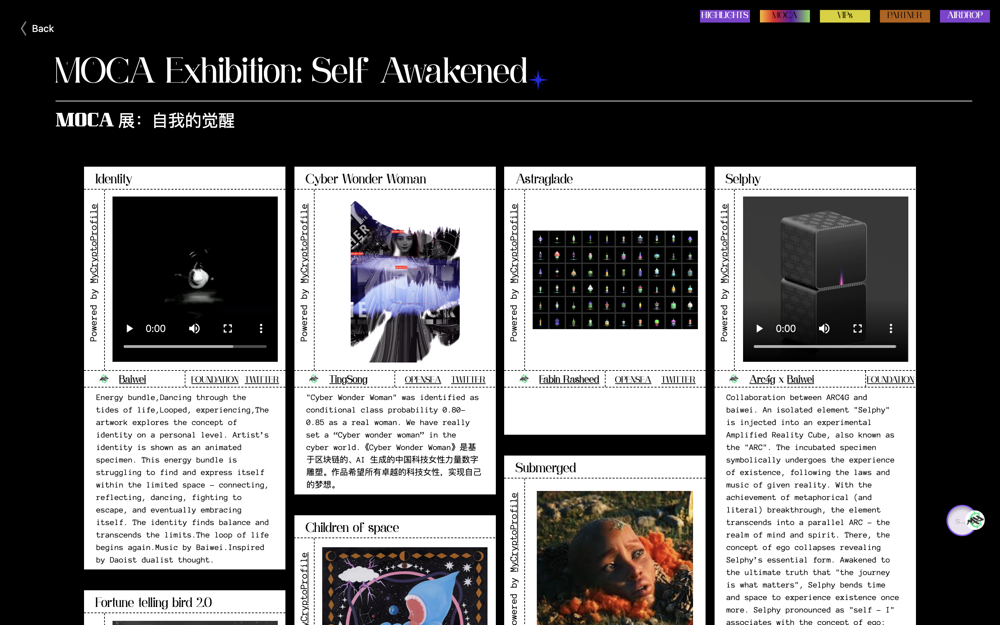

# 2021 上海元宇宙文化周：倒计时 3 天，欢迎 DIY 邀请函现场参与！

> 再过 72 小时，2021 上海元宇宙文化周（Shanghai Metaverse Week 2021）正式开幕！
>
> 定于 10 月 22 日至 28 日举行的文化周到底有哪些重要的活动？如何参与？
>
> 请耐心阅读下文……

**By Shanghai Metaverse Week**

虽然由于疫情防控的需要，首届上海元宇宙文化周跟随 2021 上海区块链国际周的脚步从原定的 9 月初延期至 10 月底举行，让诸多关注元宇宙、NFT 的小伙伴引颈以待，但我们坚持举办线下活动 —— 因为元宇宙并不是 100% 的虚拟世界，还是与现实世界紧密融合的世界，并为大家更好的准备线上线下活动盛宴

## 前菜预热

### ① 活动预报名

(loot video)

9 月 6 日，上海元宇宙文化周启动预报名活动，反响热烈，出乎意料 —— 仅仅通过生成 Loot 头像通行证，组委会就获得了八千多个以太坊钱包持有者的报名。

### ② NFT 空投与申领

9 月 15 日，文化周的 NFT 空投与申领启动。Mirror Wold、Evolution Land、MetaV、DeHero、Flow 和 Tezos，以及文化周主办方都已经或即将举办 NFT 空投与申领，以响应广大 NFT 爱好者的热情。

### ③ 币安直播

9 月 15 日，币安直播上海元宇宙文化周系列访谈开始。除了首期为文化周主题内容进行介绍预热之外，9 月 30 日 MixMarvel、10 月 7 日 Ownership Labs、10 月 12 日 RMRK、10 月 13 日 UTU.ONE、10 月 14 日 Follow.Top、10 月 15 日 Harmony，元宇宙特攻队已连续介绍了 6 个参与文化周的创新项目。

接下来，10 月 19 日的 Social Future、20 日的 Polygon、21 日的 Nash Metaverse，以及 25 日的 Tezos，有更多专注 NFT 和元宇宙的项目上币安直播，与大家交流。

### ④ MOCA 苏州预展

9 月 29 日，由由顾振清策展、苏州寒山美术馆主办、与 MOCA（Museum of Crypto Art，加密艺术美术馆）合作的主题展「分身宇宙」在苏州寒山美术馆开幕，为正式于 10 月 22 日至 28 日在元宇宙、官网和上海 M50 展出的「自我的觉醒」MOCA 主题展进行预热

**延伸阅读：**

### ⑤ 元宇宙电音趴

（video）

10 月 10 日凌晨 1 点至下午 1 点，上海元宇宙文化周合作伙伴 Decentral Games 在 Decentraland 举办的元宇宙电音派对 Amnesia Virtual Launch Party 由海外 25 位获奖 DJ 主持的全球 12 小时电音狂欢 🎵 成功举行！

## 盛宴开席

(video)

### MOCA 展

由 MOCA 和 MyCryptoProfile 主办，艺数力画廊、Cryptoart.ai、元宇宙特攻队协办的「自我的觉醒」（Self Awakened）主题展同时在元宇宙、文化周官网和上海 M50 展出。

- 元宇宙：展览将于 10 月 22 日在 Somnium Space、Decentraland 和 CryptoVoxels 三大主要的元宇宙展出，并分别于 21 日晚在 Somnium Space、25 日晚在 Decentraland 和 28 日晚在 CryptoVoxels 举行开展、聚会和闭幕狂欢活动 —— 如何参与？请关注元宇宙特攻队（@NFT4Metaverse）和 MOCA（@MuseumofCrypto）官方推特消息。

- 官网：扫码即可欣赏以瀑布流方式呈现的 MOCA 展，欢迎使用弹幕评论留言，欢迎分享艺术家作品到推特上，我们将随机送上惊喜！

- 上海 M50：10 月 22 日至 28 日在艺数力画廊举行，欢迎前往上海市莫干山路 50 号 M50 创意园 4B103 参观。

### 开幕论坛

10 月 22 日，上海元宇宙文化周将以一场从早上 9 点开始到傍晚 5 点结束、中午不休息、连续 8 小时脑暴的论坛来开幕。我们邀请了近 50 位艺术家、策展人、创业者、投资人、意见领袖围绕「探寻元宇宙身份」这一主题，深入分享交流关于 NFT、元宇宙的趋势技术应用等，不仅通过币安、B 站直播，并将在 Decentraland 加密谷会议中心进行元宇宙独家直播。

**说明：** 该活动为定向邀请，线下不对公众开放，欢迎收看直播。

### 周末畅玩 M50……

10 月 23、24 日周末双休，包括 MOCA 线下展在内，文化周有 3 场展览体验、4 场线下聚会在上海 M50 创意园举行，欢迎大家参加！

**M50 创+空间**

地址：上海市莫干山路 76 号 2 楼

- 10 月 23 日上午，Harmony 聚会「当上海在元宇宙与硅谷邂逅」。元宇宙特攻队在上海、Harmony Protocol 在硅谷，双方举行一场中美连线，畅聊正在展开的元宇宙发现之旅
- 10 月 23 日晚，Polygon 生态元宇宙之夜。Polygon 主办，与众多亚洲欧洲的生态项目分享 NFT、元宇宙趋势
- 10 月 24 日上午，UTU.ONE 聚会「DAO 可道，非常 DAO」。致力于帮助 DAO 成为奠定 Web 3.0 基石的 DAO 应用，UTU.ONE 将组织一场关于元宇宙的去中心化社区治理的交流讨论
- 10 月 24 日下午，Dataverse 聚会「来赢取你的 NFT …… 贴纸吧!」。Dataverse 开发团队 Ownership Labs 通过 NFT 贴纸游戏组织大家思考 NFT 与数据、与社交网络、知识图谱的有趣联系和未来可能

23 日至 24 日，在创+空间，有两场体验邀请你参与：

- 超次元虚拟化身实时互动体验@艺术空间
- 通往元宇宙 DAO 世界的船票@中庭

**M50 创意园**

地址：上海市莫干山路 50 号

- 10 月 23 日下午：数字交互体验派对「When Message Dreams」 @分号 C 办公室 17-108
- 10 月 22 日至 28 日，M50 线下展 @艺数力画廊 4B103

**如何参与？**

扫码选择你想参与的活动，自助生成活动邀请函，届时莅临现场，出示健康码、测温、佩戴口罩，即可入场。

_网址：\**invite.m7e.sh*_

### 2021 上海元宇宙文化周日程更新

- 9 月 15 日至 10 月 28 日：NFT 空投与申领 @文化周官网
- 9 月 29 日至 11 月 21 日：《分身宇宙》展览 @苏州寒山美术馆
- 10 月 21 日：MOCA 展开幕虚拟酒会 @Somnium Space
- 10 月 22 日至 28 日：MOCA 展「自我的觉醒」 @元宇宙/官网/上海 M50
- 10 月 22 日：开幕论坛「探寻元宇宙身份」@上海外滩创意家俱乐部
- 10 月 23 日至 24 日：超次元虚拟化身实时互动体验 @上海 M50 创+空间
- 10 月 23 日上午： Harmony 聚会「当上海在元宇宙与硅谷邂逅」 @上海 M50 创+空间
- 10 月 23 日下午：数字交互体验派对「When Message Dreams」 @上海 M50 创意园 17-108
- 10 月 23 日晚： Polygon 生态元宇宙之夜 @上海 M50 创+空间
- 10 月 24 日上午：UTU.ONE 聚会「DAO 可道，非常 DAO」 @上海 M50 创+空间
- 10 月 24 日下午：Dataverse 聚会「来赢取你的 NFT …… 贴纸吧!」 @上海 M50 创+空间
- 10 月 26 日：MOCA 聚会 @Decentraland
- 10 月 27 日：元宇宙化身虚拟圆桌 @MAY
- 10 月 28 日：闭幕派对 @CryptoVoxels
