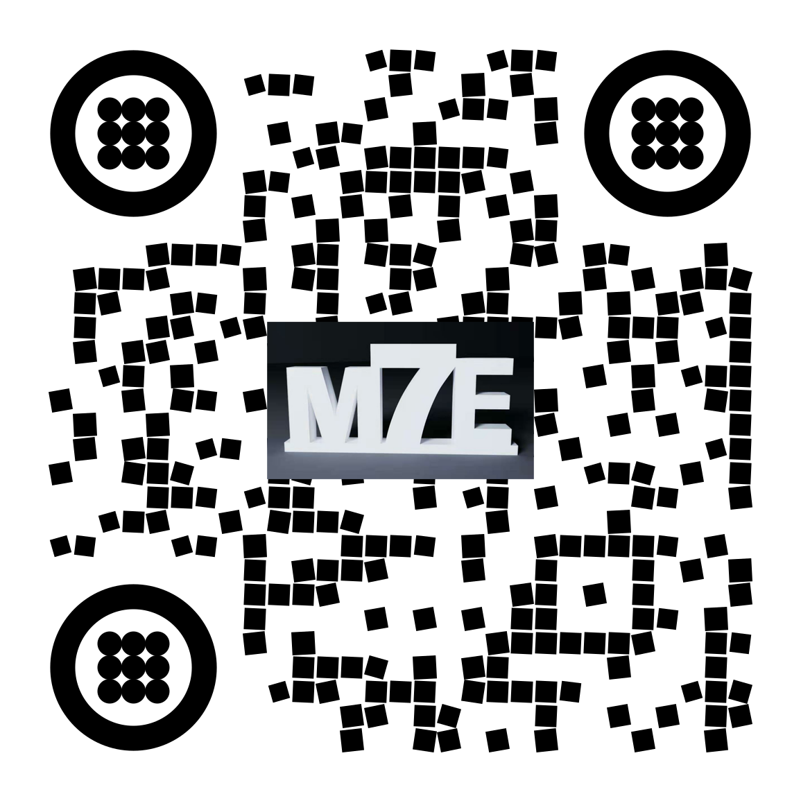
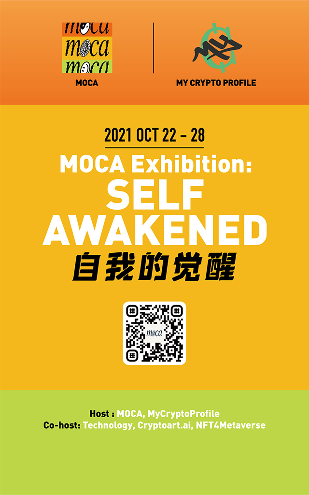
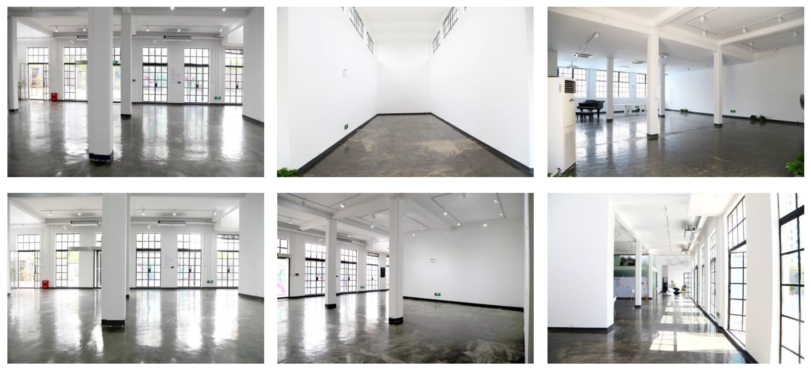

# 2021 上海元宇宙文化周：明天开幕，欢迎观看论坛直播！

> 10 月 22 日上午 9 时，2021 上海元宇宙文化周（Shanghai Metaverse Week 2021）正式开幕！

**By Shanghai Metaverse Week**

## 开幕论坛：一场连续 8 小时的元宇宙脑暴派对

上海元宇宙文化周的开幕式，是一场从早上 9 点开始到傍晚 5 点结束、中午不休息、连续 8 小时思想交锋、脑力激荡的思想盛宴！

开幕论坛分「艺术与文化」、「技术与品牌」、「元宇宙生态投资」、「元宇宙社交」、「元宇宙游戏」五大板块，由 41 位来自海内外、来自艺术、科技、媒体、互联网、区块链等各个领域的艺术家、设计师、策展人、创业者、投资人、意见领袖，围绕「探寻元宇宙身份」这一文化周主题，就 NFT、元宇宙这一今年骤然火爆的趋势技术应用开展深入的分享交流 ——

### 1. 艺术与文化

- 09:30 主题演讲：探寻元宇宙身份 Colborn Bell，加密艺术美术馆创始人
- 09:40 主题演讲：元宇宙是人类身份解放之路 陈序，元宇宙与未来资产研究智库 MetaZ 创始人
- 09:55 主题演讲：元宇宙景观,虚实共生与数字永生 顾振清，独立策展人
- 10:10 圆桌：过去与将来的艺术：加密给艺术带来的范式转变
  主持：唐晗（CryptoC 创始人）
  嘉宾：Emma（风潮艺术总监）、西（加密艺术家、视觉艺术家）、William Pucs（THINGFUND 创始人）、黄河山（加密艺术家、秃力富地产创始人）

### 2. 技术与品牌

- 10:40 主题演讲: Flow，全球最佳品牌及其数十亿粉丝的家园 Amber，Dapper Labs 中国负责人
- 10:55 主题演讲：多链时代的 NFT 陈浩，Harmony.One 研发副总裁
- 11:10 主题演讲：让身份在元宇宙清晰可见 程翰文，Litentry 协议 CEO
- 11:25 主题演讲：元宇宙需要怎样的基础设施 Nicolas Zhu，Rangers Protocol 商务拓展负责人
- 11:40 主题演讲：慢媒介实验 吕海娜，The ea + Partners 联合创始人
- 11:55 圆桌：NFT 在商业和品牌的创意潜力
  主持：Tracy Zhang（Cointelegraph 中文）
  嘉宾：钱峻（M360 创始人）、吕海娜（The ea + Partners 联合创始人）、Jo（Crypto Playground 创始人）

### 3. 元宇宙生态投资

- 12:25 主题演讲：元宇宙创业者寄语 陶荣祺，元宇宙资本 & X-order 创始人
- 12:40 主题演讲：元宇宙：互联网的下一站 宋嘉吉，国盛证券区块链研究院院长
- 12:55 主题演讲：沉浸式体验投资机会分析 Muso, NeXT SCENE 创始人
- 13:10 主题演讲：赋予 Web3.0 人格新形象，看 Mask 如何玩转 NFT 赛道 三水，Mask Network 市场负责人
- 13:25 主题演讲：如何扩展元宇宙和 Web3.0 Charlie Hu, Polygon 东南亚区负责人
- 13:55 圆桌：元宇宙时代的投资机遇
  主持：Chloe（Winkrypto 顾问）
  嘉宾：Alen（元宇宙资本合伙人）、陈悦天（火凤资本创始人）、王岳华（德鼎创新管理合伙人）、王海萌（复星旅游文化集团投资执行总经理）

### 4. 元宇宙社交

- 14:25 主题演讲：如何实现作为元宇宙基石的 DAO? Stephan Zhang，UTU.ONE 首席技术官
- 14:40 主题演讲：一个关于 NFT 的分享 Jessie，Ownership Labs 布道者
- 14:55 主题演讲：Web3.0 社交协议的机会 Carl Huang，Follow 协议创始人
- 15:10 主题演讲：在 VR 世界遇见另一个你 Ethan，Social Future 联合创始人

### 5. 元宇宙游戏

- 15:25 主题演讲：社区治理与加密元宇宙 Kant, NASH Metaverse 创始人
- 15:40 主题演讲：从区块链到元宇宙 吴啸，纯白矩阵创始人
- 15:55 主题演讲：Metaverse 的回归使命 NOVA，Rivermen 项目制作人，国建管理委员会主席
- 16:10 主题演讲：Aavegotchi 元宇宙新开端
- 16:25 主题演讲：从 Decentraland 看元宇宙+，赋能实体产业 Navigator，Decentraland
- 16:40 圆桌：多重元宇宙的未来
  Roundtable：The Future of Multi-Metaverse:
  主持：毕彤彤（PANews 联合创始人主持）
  CK（加密艺术收藏家，CV Analytics 创始人）、张师与（CybertinoLab 合伙人）、姜超（MetaEstate 联合创始人）、斯文（MetaV 中国区负责人）

明早 9 时，扫码可观看：

- B 站直播
- 币安直播
- 元宇宙独家直播：Decentraland 加密谷会议中心

**说明：** 该活动为定向邀请，线下不对公众开放，欢迎收看直播。

### MOCA 展：自我的觉醒

MOCA 展「自我的觉醒」（Self Awakened）是上海元宇宙文化周的重头戏，由 MOCA 和 MyCryptoProfile 主办，艺数力画廊、Cryptoart.ai、元宇宙特攻队协办，同时在上海 M50、文化周官网和元宇宙展出：

- 上海 M50：10 月 22 日至 28 日在艺数力画廊举行，欢迎前往上海市莫干山路 50 号 M50 创意园 4B103 参观。

- 官网：扫码即可欣赏以瀑布流方式呈现的 MOCA 展，欢迎使用弹幕评论留言，欢迎分享艺术家作品到推特上，我们将随机送上惊喜！

- 元宇宙：展览将于 10 月 22 日在 Somnium Space、Decentraland 和 CryptoVoxels 三大主要的元宇宙展出，并分别于 21 日晚在 Somnium Space、25 日晚在 Decentraland 和 28 日晚在 CryptoVoxels 举行开展、聚会和闭幕狂欢活动 —— 如何参与？请关注元宇宙特攻队（@NFT4Metaverse）和 MOCA（@MuseumofCrypto）官方推特消息。

### 4 场聚会、3 场体验，周末畅玩 M50……

10 月 23、24 日周末双休日，包括 MOCA 线下展在内，文化周有 3 场展览体验、4 场线下聚会在上海 M50 创意园举行，欢迎大家参加！

**聚会在 M50 创+空间**

地址：上海市莫干山路 76 号 2 楼

- **10 月 23 日上午，Harmony 聚会「当上海在元宇宙与硅谷邂逅」：** 元宇宙特攻队在上海、Harmony Protocol 在硅谷，双方举行一场中美连线，畅聊正在展开的元宇宙发现之旅
- **10 月 23 日晚，Polygon 生态元宇宙之夜**Polygon 主办，与众多亚洲欧洲的生态项目分享 NFT、元宇宙趋势
- **10 月 24 日上午，UTU.ONE 聚会「DAO 可道，非常 DAO」：**致力于帮助 DAO 成为奠定 Web 3.0 基石的 DAO 应用，UTU.ONE 将组织一场关于元宇宙的去中心化社区治理的交流讨论
- **10 月 24 日下午，Dataverse 聚会「来赢取你的 NFT …… 贴纸吧!」：** Dataverse 开发团队 Ownership Labs 通过 NFT 贴纸游戏组织大家思考 NFT 与数据、与社交网络、知识图谱的有趣联系和未来可能

**体验在 M50 创+空间**

23 日至 24 日，在创+空间，有两场体验邀请你参与：

- 超次元虚拟化身实时互动体验 @ 艺术空间
- 通往元宇宙 DAO 世界的船票 @ 中庭

**M50 创意园**

地址：上海市莫干山路 50 号

- 10 月 23 日下午：数字交互体验派对「When Message Dreams」 @分号 C 办公室 17-108
- 10 月 22 日至 28 日，M50 线下展 @艺数力画廊 4B103

**如何参与？**

网址：**invite.m7e.sh**

扫码选择你想参与的活动，自助生成活动邀请函，届时莅临现场，出示健康码、测温、佩戴口罩，即可入场。

### 2021 上海元宇宙文化周日程更新

- 9 月 15 日至 10 月 28 日：NFT 空投与申领 @文化周官网
- 9 月 29 日至 11 月 21 日：《分身宇宙》展览 @苏州寒山美术馆
- 10 月 21 日：MOCA 展开幕虚拟酒会 @Somnium Space
- 10 月 22 日至 28 日：MOCA 展「自我的觉醒」 @元宇宙/官网/上海 M50
- 10 月 22 日：开幕论坛「探寻元宇宙身份」@上海外滩创意家俱乐部
- 10 月 23 日至 24 日：超次元虚拟化身实时互动体验 @上海 M50 创+空间
- 10 月 23 日上午： Harmony 聚会「当上海在元宇宙与硅谷邂逅」 @上海 M50 创+空间
- 10 月 23 日下午：数字交互体验派对「When Message Dreams」 @上海 M50 创意园 17-108
- 10 月 23 日晚： Polygon 生态元宇宙之夜 @上海 M50 创+空间
- 10 月 24 日上午：UTU.ONE 聚会「DAO 可道，非常 DAO」 @上海 M50 创+空间
- 10 月 24 日下午：Dataverse 聚会「来赢取你的 NFT …… 贴纸吧!」 @上海 M50 创+空间
- 10 月 26 日：MOCA 聚会 @Decentraland
- 10 月 27 日：元宇宙化身虚拟圆桌 @MAY
- 10 月 28 日：闭幕派对 @CryptoVoxels
