# Flow 生态节神秘礼盒内究竟有哪些数字收藏品？| 2021 上海元宇宙文化周推广

> Flow 由 2017 年和 2020 年分别打造 CryptoKitties 和 NBA Top Shot 两款爆款应用，力推 NFT 出圈的 Dapper Labs 开发，正在打造孵化专注于支持 NFT 的公链生态。
>
> 日前，Flow 与元宇宙特攻队达成合作，双方相互参与、支持并推广各自主办的「Flow Fest 生态狂欢节」和「上海元宇宙文化周」（Shanghai Metaverse Week）活动。
>
> 今天，为大家介绍 Flow 生态节神秘礼盒内究竟有哪些数字收藏品？

**By Shanghai Metaverse Week**

## 1. BALLERZ

在神秘礼盒中最多可以找到 1000 个 Ballerz，总供应量为 10,000。

**简介：** BALLERZ 是 Flow 链上、以篮球为灵感的生成性 NFT 项目。

**官网：** www.flowverse.co/applications/ballerz

**推特：** @BALLERZ_NFT

## 2. Chainmonsters

通过收集一些有价值的 Chainmonsters NFT 开始你的 Chainmonsters 冒险，这些 NFT 将在整个游戏中为你提供效用，包括一些超级稀有的水晶 Chainmons 和神秘门票。

**简介：** 跨平台的大型多人游戏 RPG，你可以捕捉、战斗、交易并与数字怪物竞争。

**官网：** chainmonsters.com：Utility NFTs

**推特：** @ChainMonsters

## 3. Crave Critics: Milk Bar x Crave

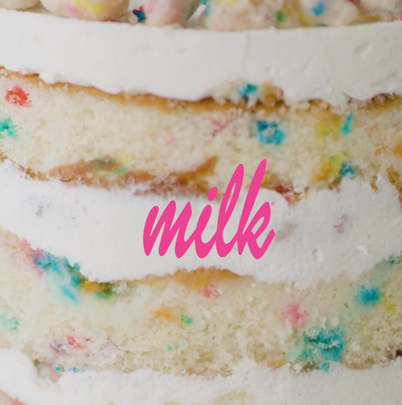

特色是来自如 Milk Bar 标志性品牌的独家内容和权限。这个 NFT 有 6000 个版本。

**简介：**餐饮俱乐部，以标志性食品品牌和人物的收藏品为特色进行重塑。

**官网：** crave.niftory.com

## 4. Eternal: Shards

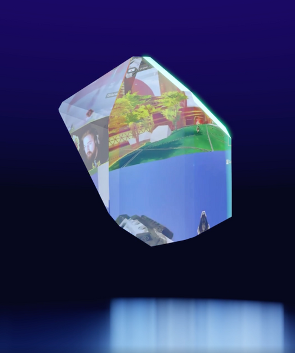

Eternal Shards 是流媒体历史上最佳时刻的碎片。从 10 月 22 日开始，将任何 3 个碎片结合起来形成一个水晶，当你打开一个包时，可以用来升级一个时刻。碎片的匹配度越高，水晶的威力就越大。每当碎片被交易，10%的 收入将归于流媒体人。

**简介：** Eternal 时刻是流媒体人亮点视频剪辑 NFT，每笔交易的一部分会返还给流媒体人。

**官网：** eternal.gg

**推特：** @eternalapp

## 5. Everbloom: Ever Ticket

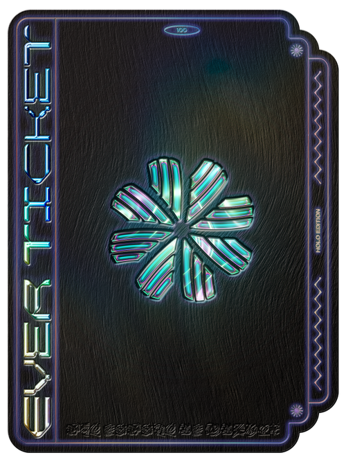

Ever Ticket 是专门为 Flow Fest 2021 参会者铸造和保留的 NFT。门票类型有 3 种：银、白金、Holo。每种类型的票都将给予持有者不同的独家特权和空投，如 $EVER 通证、早期权限、独家 VIP 访问等。收集所有 3 种类型门票的持有者将获得秘密的 VIP 空投。

**简介：**移动优先的一站式商店，用于表达、联系、收集、创造和利用 NFT 获益，专为社交媒体原住民和创意人设计。

**官网：** everbloom.app/nft

**推特：** @helloeverbloom

## 6. First-ever Tical Universe NFT

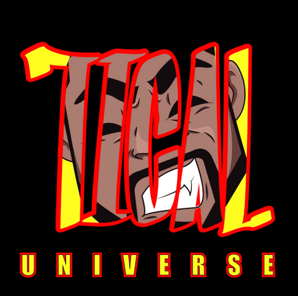

Tical Universe 有史以来的第一个 NFT，介绍了 Method Man 的另一个自我 Hot Nickel 和 Tical Universe 的标志。拥有历史的一部分，未来从这里开始。有 36 个。

**简介：** 连接音乐产业和艺术家的 NFT 市场。

**官网：** www.tunegonft.com

**推特：** @TuneGO

## 7. Fright Club: Horror Exclusive Collectibes

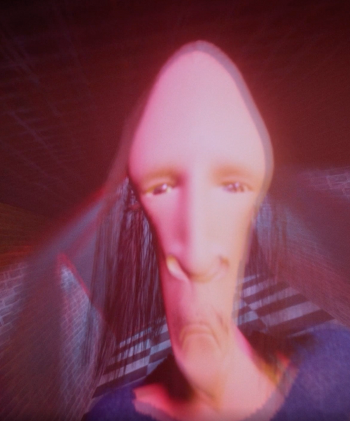

有六个幽灵般的恐怖俱乐部独家收藏品可以在神秘礼盒中获得：Crazy Red, Catch Me If You Can, Will You Be Next?, Bad Bunny, Timber, Hangman。

**简介：** 独家恐怖数字收藏品和体验，包括托尼-莫兰等偶像人物。

**官网：** frightclub.staging.niftory.com

**推特：** @fright_club

## 8. Jambb: Non-Fungible Jokin' - Launch Voucher

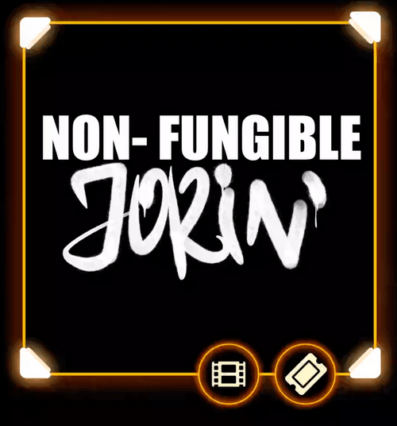

11 月 3 日兑换此券，可获得由有史以来第一部喜剧特辑铸造的收藏品。

**简介：** 一家数字收藏品初创公司，其使命是通过释放新颖内容的价值来为收藏家、粉丝和艺人提供服务。

**官网：** www.jambb.com

**推特：** @JambbApp

## 9. Matrix World: Code Blocks

MatrixWorld 正在发布代码块 NFT，允许持有者使用这些代码块与他们在 Flow 生态节推出的下一代 3D 可编程多链元宇宙的对象进行互动。

**简介：** 3D 可编程多链元宇宙

**官网：** matrixworld.org

**推特：** @MatrixWorld12

## 10. Melos Studio: Music Dino Musicians

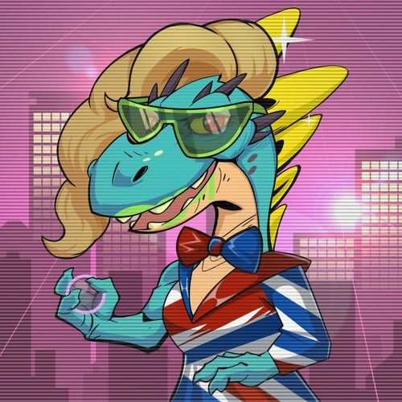

Music Dino Musicians 是 NFT 化身，代表你在 Melos 音乐元宇宙的资料。你可以用它们来参与 Melos 社区和平台的活动。这些 NFT 有指定的音乐，你将能够在 Melos 平台上欣赏它们。

**简介：** 将音乐灵感捕捉进 NFT

**官网：** www.melos.studio

**推特：** @melos_studio

## 11. Mynft

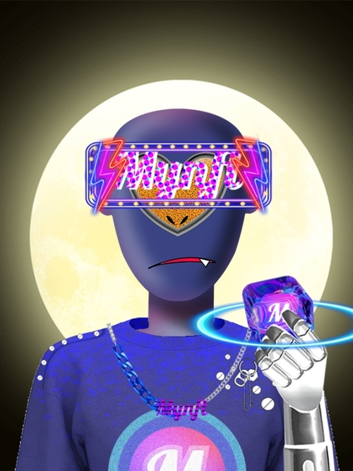

Mynft 正在发布多个 NFT，例如。以赛博猴王为主题的赛博之旅神秘礼盒 NFT 和以中国四大符号为主题的 NFT：天龙、白虎、朱雀、黑龟。

**简介：** 一个基于 Flow 的 NFT 平台，旨在连接西方和东方市场，为用户提供优质的创作、交易和社交体验。

**官网：** mynft.io

**推特：** @Mynft2021

## 12. OVO.space: Nuko

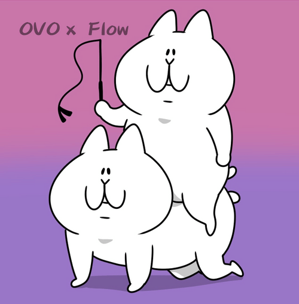

OVO 为神秘礼盒发布了一套可爱的 Nuko NFT，包括组合技术（如图）、湿黄瓜、结实的裤子等。

**简介：** 数字版权发行、交易、衍生金融和数字艺术展览的领先平台

**官网：** www.ovo.space

**推特：** @ovo_official

## 13. RacingTime: RacingTime S level paintings

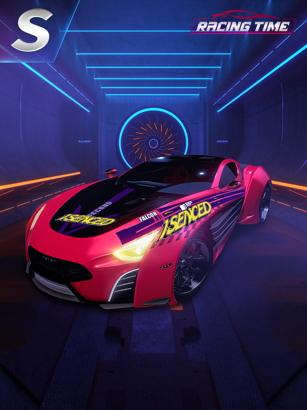

众多的 S 级画作可供赢取! 在 RacingTime 游戏推出后，你就可以将其应用到你的车上。这个绘画系列是专门为 Flow 生态狂欢节神秘礼盒活动设计的，再也不会有其他的副本了。这些 NFT 的所有者将被视为 RacingTime 最早的支持者。

**简介：** 新一代赛车游戏体验

**官网：** www.racing-time.com

**推特：** @RacingTime_now

## 14. RareRooms: Metaverse Keys

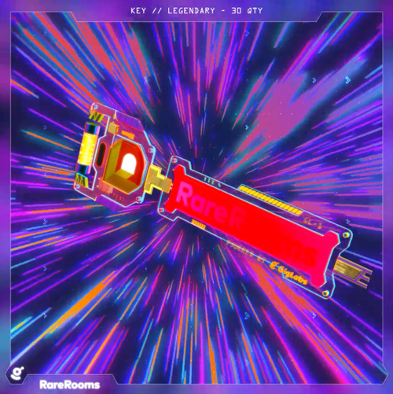

这些是通往 RareRooms 元宇宙的 NFT 钥匙，包括史诗级元宇宙钥匙、传奇级元宇宙钥匙、稀有级元宇宙钥匙等等。RareRooms 将在 Flow 生态狂欢节期间把元宇宙带到一个新的水平。有什么比虚拟 NFT 画廊更好的呢？虚拟 NFT 画廊，带有可播放的 Flow NFT 和内置的 3D 市场。准备好与 RareRooms 一起解锁一些酷玩意吧。

**简介：** 为收藏家、艺术家和崇拜者提供身临其境的虚拟 3D 环境，以体验他们的 NFT 收藏。

**官网：** www.rarerooms.io

**推特：** @rarerooms

## 15. SportsIcon

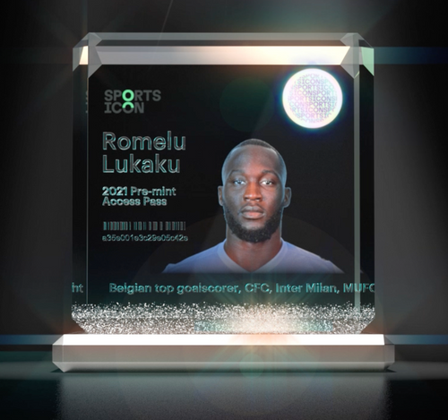

SportsIcon 即将进入 Flow! 有许多令人兴奋的体育 NFT 可供选择，包括令人敬畏的 Místico、Lucha Libre 和 Pumas。官方的 SportsIcon Access 通行证也供领取，包括 Mike Vick 和 Romelu Lukaku。

**简介：** 与精英运动员合作，向他们的粉丝发布视频、艺术和高光时刻 NFT。

**官网：** sportsicon.co

**推特：** @SportsIcon\_

## 16. TuneGo: TuneKitties

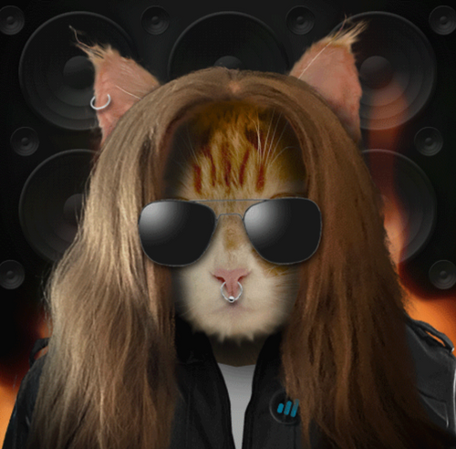

TuneKitties 以完美的声音和风格组合在元宇宙的俱乐部和街道深处徘徊。这些由 TuneGO 推出的限量版 NFT 包括 EDM、Hip Hop、Hippie、爵士、拉丁、R&B TuneKitties。

**简介：** 连接音乐产业和艺术家的 NFT 市场

**官网：** www.tunegonft.com

**推特：** @TuneGO

## 17. Voxel Knight: Voxel Knight stories

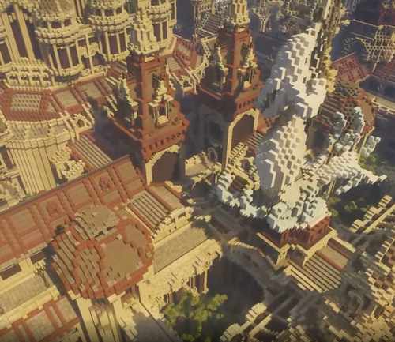

在 500 平方公里的 VoxelKnight 元宇宙中，有无数的故事可以收集。你会不会很幸运，抢到一个传说中的不愉快的遭遇 NFT？还有很多包括 Baal Hadad 的战斗、Leo 的战斗和 Thieves Clausside 也可以在神秘礼盒中找到。

**简介：** 一个具有可扩展的平行世界的体素宇宙，充满了惊人的景观和结构，有成千上万的生动的人物。

**官网：** www.flowverse.co/applications/voxel-knight#

**推特：** @voxel_knight

## 18. xtingles: Bubble Flow

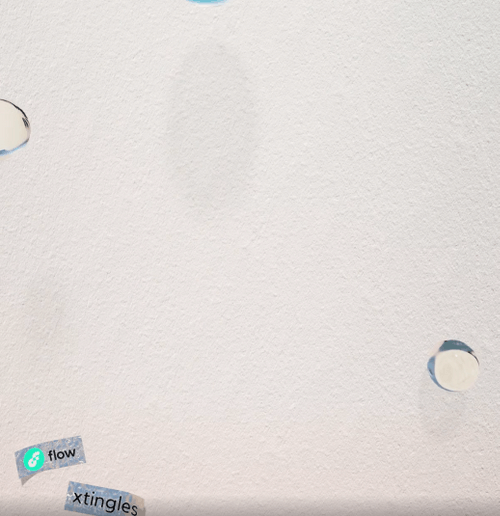

这款来自 xtingles 的 Bubble Flow NFT 让持有者能够听到水泡爆裂的声音。

**简介：** 基于 Flow 链，收藏、销售和交易 ASMR 「Tings 」的 NFT 市场。

**官网：** xtingles.com

**推特：** @xtinglescom

## 关于「Flow 生态狂欢节」

为了让全球用户更好地了解基于 Flow 的前沿技术，身临其境地感受数字生活的魅力，从 10 月 15 日起，Flow 官方策划了为期 1 个半月的 Flow Fest 虚拟生态狂欢节，从收藏品到游戏，从音乐到艺术到体育等，以及一系列的福利活动，让全球用户真正地参与到 Flow 生态中来。

「Flow 生态狂欢节」期间，将有 20+ Flow 生态项目陆续发布上线，项目覆盖艺术、游戏、音乐、体育等各文娱产业类型，用户可以在此期间购买自己心仪的数字收藏品，感受来自元宇宙的独特数字魅力。同时，这些项目在神秘礼盒的预热活动中也为大家准备了免费好玩的盲盒礼品空投，全球限量 30000 份，参与方式详见《「Flow 生态狂欢节」上线，免费好玩的数字收藏品等你来拿》。

_网址：**https://m7e.sh/**_

### 2021 上海元宇宙文化周日程更新

- 9 月 15 日至 10 月 28 日：NFT 空投与申领 @文化周官网
- 9 月 29 日至 11 月 21 日：《分身宇宙》展览 @苏州寒山美术馆
- 10 月 21 日：MOCA 展开幕虚拟酒会 @Decentraland
- 10 月 22 日至 28 日：《MOCA 展：自我的觉醒》 @元宇宙/官网/推特/上海 M50
- 10 月 22 日：开幕论坛《探寻元宇宙身份》@上海外滩创意家俱乐部
- 10 月 23 日至 24 日：超次元 & Flow 虚拟化身实时互动体验 @上海 M50 创+空间
- 10 月 23 日上午：Harmony 聚会《当上海在元宇宙与硅谷邂逅》 @上海 M50 创+空间
- 10 月 23 日下午：MyCryptoProfile 聚会 @上海 M50 创+空间
- 10 月 23 日晚：Polygon 生态元宇宙之夜 @上海 M50 创+空间
- 10 月 24 日上午：UTU.TOP 聚会 @上海 M50 创+空间
- 10 月 24 日下午：Dataverse 聚会 @上海 M50 创+空间
- 10 月 24 日晚：闭门酒会 @上海外滩创意家俱乐部
- 10 月 26 日：MOCA 聚会 @Somnium Space
- 10 月 27 日：元宇宙化身研讨会 @MAY
- 10 月 28 日：闭幕派对 @CryptoVoxels

* 以上活动截至今日，可能有调整变化，请密切关注文化周 M7E.SH 官网、元宇宙特攻队公众号和推特（@NFT4Metaverse）的通告！
