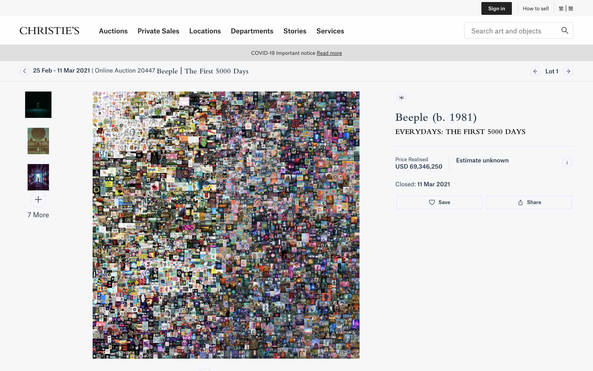
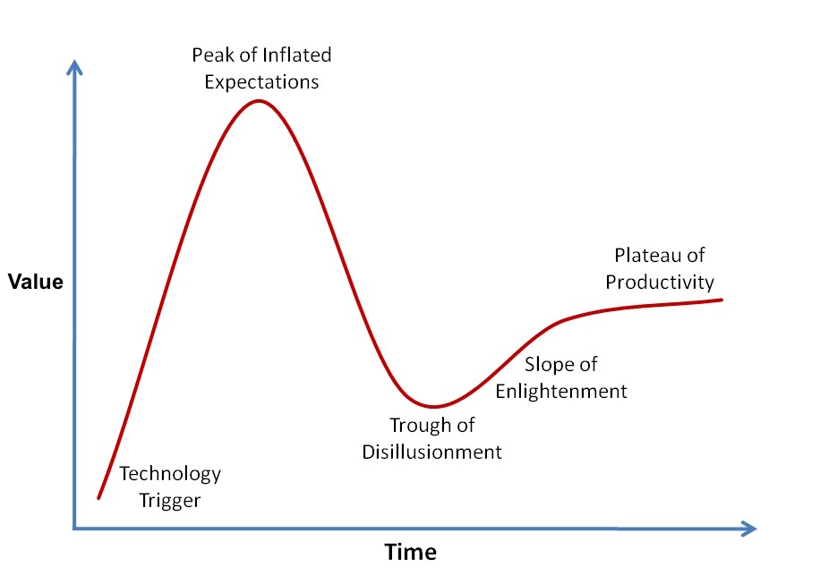
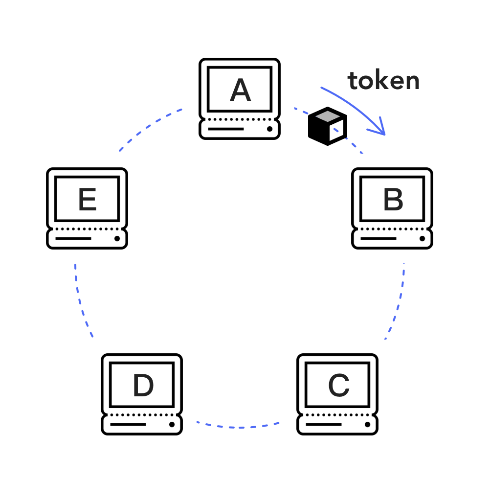
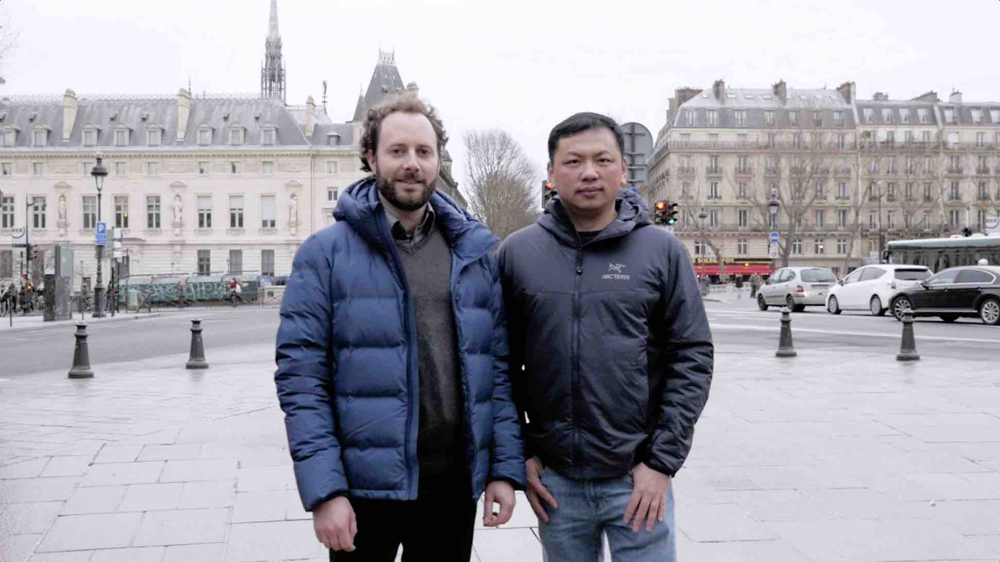
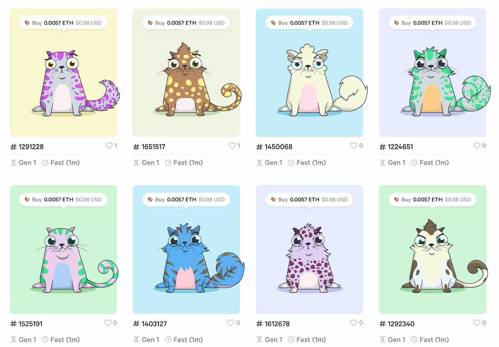
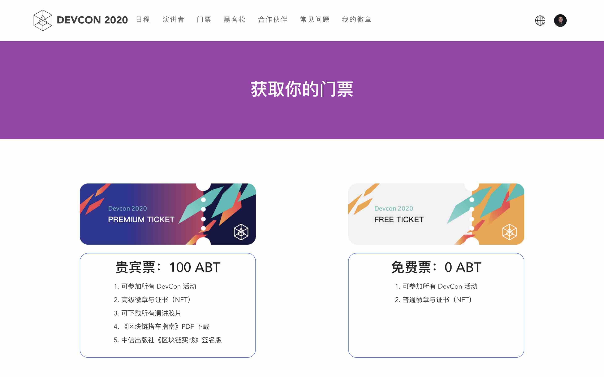
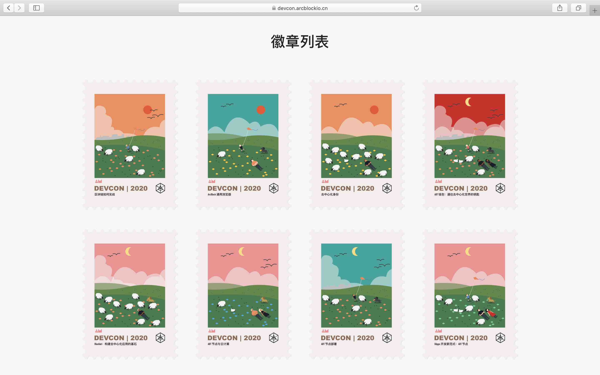
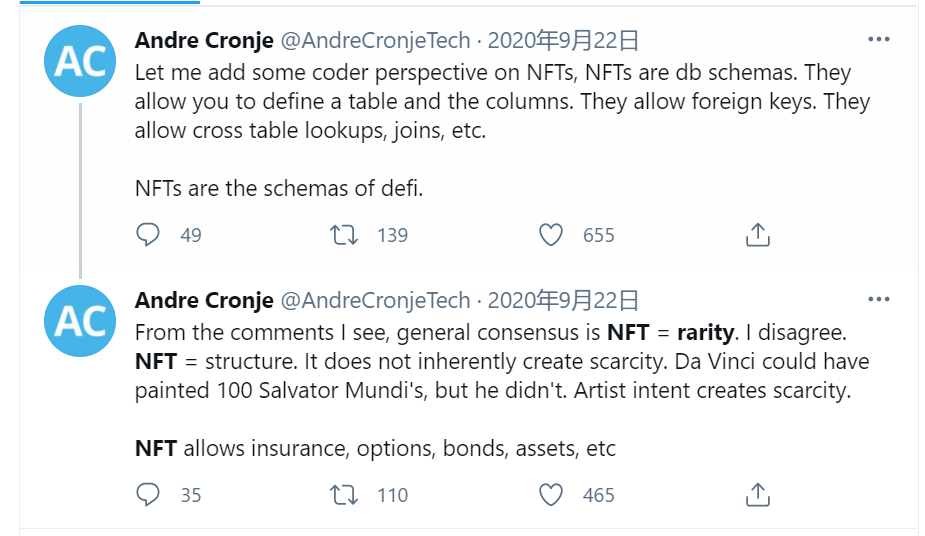
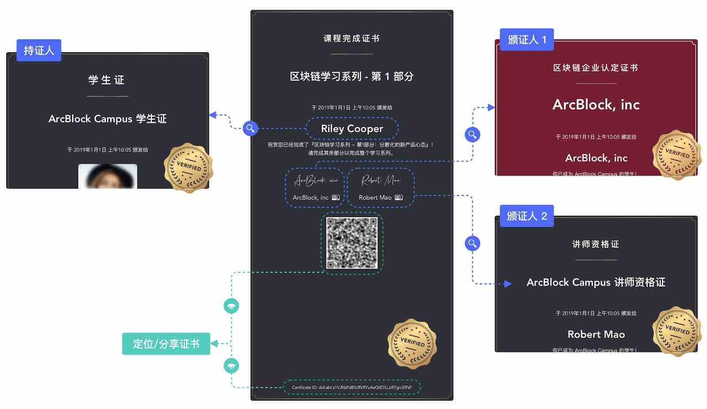

# NFT：数字所有权的伟大试验才刚刚开始

**作者：** 陈俊、冒志鸿

NFT，是当下区块链行业/加密货币市场最为火爆的新热点：一件名为 Everyday’s - The First 5000 Days 的数字艺术品在佳士得拍卖行拍出 6934 万美元的高价，让作者 Beeple 成为目前在世身价第三高的艺术家；推特创始人 Jack Dorsey 首条推文的 NFT 拍出 290 万美元高价；用短视频记录勒布朗·詹姆斯等 NBA 球星球员比赛“高光时刻”的 NFT 项目 NBA Top Shot 创下超过 4 亿美元的销售记录；更多艺术家、球员、明星、名人和体育运动联盟、漫画公司、媒体纷纷入场，制作销售 NFT；谷歌趋势数据显示，3 月 7 日至 13 日当周，NFT 一词搜索热度创下历史新高，达到 100 最高值……

在充满质疑精神的财经记者和分析师看来，此番“出圈”的 NFT，不过是继比特币年底年初备受美国金融机构及上市公司追捧、价格连创新高、市值突破 1 万亿美元之后又一个金融泡沫。然而，如果承认金钱具有 24 小时永不停歇地寻找下一个糅合技术创新、范式迁移和伟大叙事为一体的投资标的以实现利益最大化的运动属性的话，NFT 很有可能就是这样一个新生事物，它吸引眼球、充满误解和争议，尤其是眼下基本正处在加特纳技术成熟曲线所揭示的炒作高峰期之中。

## 什么是 NFT？

NFT 是英文 Non-Fungible Token 的缩写简称，中文翻译为非同质通证或不可互换通证。通证（Token），在计算机时代之前，大多为价值、权力的象征物，如贝壳等最早的货币、古代君王授予将军调兵的虎符；在计算机/通讯领域，Token 本来泛指用于特定用途的一小片段数据，如早期网络架构 Token Ring 里的 Token，以及现在计算机技术文章里听到的诸如 Session Token、Security Token、Access Token、JSON Web Token、CSRF Token 等（这个 Token 和区块链领域的 Token 千万不要混淆）；区块链技术诞生之后，比特币、以太坊等加密数字货币就是如今大家耳熟能详的数字通证，借助数据难以篡改可验证可追溯的区块链技术的支持，在数字世界实现了金钱、权益等价值转移的唯一性和不可篡改性，以及无须第三方信任中介担保的开放性——就像现实世界的现金交易那样，一手交钱、一手交货。

理解 NFT 之前先解释一下 FT（Fungible Token，同质通证或可互换通证）。就像你口袋里的一块钱硬币和我钱包里的一元纸钞价值等同、可以互换一样，如今在 437 家加密货币交易所交易的 6498 种数字货币基本都是 FT，而 NFT 则是独一无二、彼此价值属性不同、不可互换的区块链数字资产。拿现实世界举例，NFT 就非常好理解：你每天用的手机、笔记本电脑、坐的椅子、住的房子、开的车，以及任何挂在闲鱼上销售的二手商品都是非同质的资产，因为它们每件都是独一无二的。

想进一步了解通证，由我们合作撰写、中信出版集团 2020 年出版的[《区块链实战：从技术创新到商业模式》](https://books.arcblock.io/)专辟一章深入浅出地介绍了相关基本知识，感兴趣的读者可以从中找到更详细的内容。

## NFT 关乎“数字所有权”

沿着这一逻辑推演，NFT 的本质似乎可以一窥。一言以蔽之，NFT 关乎“数字所有权”，即资产在数字世界实现了其在现实世界的唯一性、稀缺性和可交易性。

在比特币诞生之前，我们就在互联网平台拥有例如腾讯 Q 币、支付宝积分、游戏道具皮肤等这些同质可互换的数字货币或非同质不可互换的数字资产，但这些用金钱、时间和精力交换获得的资产并不真正归用户所有，不仅交易流通受限，而且平台随时能够生杀予夺、不容置喙——当年以太坊创始人 Vitalik Buterin 正是因为暴雪公司一次游戏更新取消了他满级的心爱角色“术士”的一项必杀技能激发他后来创建以太坊这一目前绝大多数 NFT 创建运行的区块链平台。

比特币诞生十二年来的成功实践，让个人在数字世界第一次得以无需许可地自主掌控资产，以太坊为代表的区块链平台近五年发展普及，让个人能够通过 DeFi、NFT 实现“数字所有权”的确权交易和流通。

得益于区块链技术的支持，NFT 拥有物理资产和中心化数字资产所不具备的不变性、可验证的稀缺性、标准化、互通性、可交易性、流动性和可编程性等属性，不仅克服了现实世界资产的保存鉴证流通交易普遍存在高成本、低效率、易篡改伪造等缺点弊病——以目前 NFT 最为火爆的门类艺术品为例，传统艺术品交易中艺术品的伪造和欺诈现象屡见不鲜，据统计艺术品的伪造和欺诈市场一度高达整体交易额的 10%，更重要的是，资产在数字世界蕴育产生的种类样式、交易流通的速度和范围将远远超过现实世界。

在互联网时代，音乐版权的保护与流通始终是令人头疼的问题。如果采用 NFT 技术来进行音乐的授权， 那么你只需要购买一个音乐的 NFT，就可以在各种不同的音乐服务提供商那里合法地欣赏使用自己拥有的音乐，而不像今天你可能被迫要在例如 Apple Music、Spotify、网易云音乐、QQ 音乐等每个不同的服务提供商那里分别购买。同样，如果你想把自己拥有的音乐用在自己的网站上作为内容的配乐，或者放在自己的 Podcast 或视频里，今天要合法做到这点是非常麻烦和困难的，而将来使用带有智能合约的 NFT 授权机制可以抛弃繁琐的中间人机制，让各种使用授权和收益分配变得非常便捷灵活。这只是拿音乐来举例，同样的机制可以应用于视频、照片、图片设计和文章内容等，其应用场景非常之丰富。

## NFT 发展简史

> **染色币技术开拓者、ArcBlock 首席科学家弗拉维昂·夏尔隆（左）与创始人冒志鸿（右）2018 年元旦在巴黎合影**
>
> _冒志鸿与弗拉维昂·夏尔隆曾是微软欧洲研发中心的同事和工作搭档。弗拉维昂·夏尔隆参与了最早期区块链技术开拓和创新，推动了染色币技术，是染色币实现中最有影响力的 CoinPrism 创始人。他回忆说，“我是在 2013 年比特币会议上首次听说染色币，马上考虑把它用在有趣的用途上。当时染色币只是一个概念。尽管社区围绕它进行了讨论，但没有具体可行的实施方案，然后我决定制定染色币的标准‘开放资产协议’的时候到了，然后我们构建了 Coinprism 项目和 Openchain 项目，让个人和企业都能对比特币进行染色。”_

罗马不是一天建成的，NFT 也不是。NFT 最早起源于 2013 年的“染色币”（Colored Coin）设想和尝试，它允许人们对小额比特币“染色”，就是把比特币空余的字段定义成数据的格式，用以代表除比特币以外例如优惠券、数字收藏品、资产凭证等各种资产，但囿于比特币区块链架构局限和比特币核心开发团队的反对，染色币的试验最终归于失败，但染色币的诞生使许多人认识到在区块链上发行资产的巨大潜力，为 NFT 的进一步实验打开了大门并奠定了基础。

2017 年底在以太坊滑铁卢黑客马拉松亮相的加密猫（CryptoKitties）第一次让 NFT 进入主流。加密猫是一款基于区块链的虚拟游戏，允许玩家收养、繁殖和交易虚拟猫。开发团队用以太坊智能合约在游戏中建立一种链式繁殖算法来确定猫的遗传密码，通过完善的激励机制确保“繁殖”的随机性和预见性，并推出了荷兰式拍卖合约，激励人们购买交易猫咪牟利。加密猫的横空出世与 2017 年上一轮加密货币牛市不谋而合，正可谓是烈火烹油。当时，人们疯狂地购买、繁殖和交易加密猫，导致以太坊网络第一次遭遇大规模拥堵。加密猫的爆红，还确立了 ERC721 作为以太坊平台 NFT 技术标准的地位——ERC721 可以跟踪区块中每个通证的所有权和转移，从而让区块链能够识别 NFT。不过，加密猫开发团队却对以太坊平台吞吐缓慢、Gas 费昂贵的局限深有体会，其成立公司 Dapper Labs，从 a16z、USV 等顶级机构筹集风险投资后，潜心开发专注于 NFT 应用的 Flow 公链，终于在去年底今年初市场转牛之际推出了 NBA Top Shot 这一在业内获得最高用户数和交易额的 NFT 爆款。

除了数字艺术品、数字收藏品，NFT 已经应用在一些更广泛的用途。我们 ArcBlock 在 2020 年 6 月举行的[首届开发者大会](https://devcon.arcblock.io/)发行的 NFT 门票和参会者签到领取的 NFT 徽章，不仅将 NFT 的应用场景从游戏、艺术品、收藏品拓展至会议活动、教育培训，而且将 [DID（Decentralized Identity，去中心化身份）](https://github.com/ArcBlock/abt-did-spec)和 Verifiable Credentials（可验证证书）技术引入了 NFT 实现标准，弥补了 ERC721、ERC1155 等 NFT 标准过于简单、功能不足的短板，受到了用户的欢迎和业界的关注。

## 欢迎进入 NFT 美丽新世界

NFT 在 2021 年这一轮牛市的崛起出圈，究其原因，是区块链技术发展成熟，为 NFT 的开发标准、基础设施和市场交易培育了丰厚的土壤，让 NFT 的应用越过了一个临界点，在艺术品、收藏品、游戏、域名、虚拟世界等门类得以率先爆发，这说明了最易于数字化的内容娱乐产业适合首先通过 NFT 开展所有权数字化的试验，并以普通大众最易理解的方式来推广普及——这一过程可参考当年互联网兴起率先渗透颠覆传统媒体内容产业的历史。

实务操作上，NFT 比 FT 更加容易规避法律的约束，尤其是加密货币因为和证券相比有非常多的相似性，导致其发展多年来被欧美国家严格缓慢的立法监管所严重制约，而 NFT 有更灵活的合规空间。但今天 NFT 的火爆到了业内有人形容的“狂暴”程度，不得不归功于疫情全球大流行造成世界各国货币超发、资金泛滥，工作生活的远程化虚拟化转型陡然加速，以及越来越多因疫情封锁宅在家中闲暇无聊的欧美年轻人加入投资阵营，这些都是比特币、狗狗币、NFT 这类数字资产备受青睐追捧、不可小觑的强劲推动力。

不过，NFT 不仅限于如今天价频出、抓人眼球的加密艺术品、明星卡牌这些媒介内容，我们现实世界各种资产权益都可以通过 NFT 进行映射和通证化，数字世界里还将诞生更多全新的资产也以 NFT 的面目出现，也就是说，万物皆可 NFT。

当全世界加速虚拟化、数字化的时候，从程序员的视野来观察 NFT，也许更接近本质。正如 DeFi 创新者、YFI 创始人 Andre Cronje 所言，NFT 其实是数据库模式，它允许你定义表和列、输入外部的键值、跨表查找和联接；NFT 不天然创造稀缺性，而是定义稀缺性，也能定义 DeFi 的各种架构，因此保险、期权、债券、固定资产这些传统金融产品都是 NFT。

而且，NFT 和 FT 可以互相结合，比如用 FT 来无限分割 NFT 的权益，或通过 NFT 来包裹一定量的 FT 形成例如期权、价值凭证等更复杂的数字资产，并可以多层次嵌套。例如，在去中心化交易所龙头 Uniswap 最新发布的 V3 产品设计中，为提高资本效率，流动性提供者（Liquidity Provider）可以为不同价格区间的资金池提供流动性，因此获得的凭证（LP Token）从 ERC20 通证变成了 NFT，因为仓位不同，每个仓位就是一个 NFT。

NFT 尚未形成大家一致公认的通用标准，目前绝大多数 NFT 应用采用的是以太坊 ERC721 和 ERC1155，这些标准只是在定义如何查看资产归谁所有、链上如何流转，对 NFT 链下各种数据如何读取存储验证并没有定义设计，因此许多如加密艺术品 NFT，其多媒体文件存储在中心化的服务器上，没有加密，无法验证，很容易被人下载复制，上传到其他地方生成另外的 NFT，从而产生所有权谁属的争议。

从 2018 年以来，ArcBlock 就在 NFT 的应用领域进行了深入的探索和尝试。在 ArcBlock 的 NFT 方案设计中，NFT 不仅仅可以包含资源还能包含智能合约类似的逻辑。ArcBlock 更把 DID （去中心身份）和 VC（可验证证书）技术和 NFT 的设计实现有机结合起来，解决上述链下数据可验证问题，能够将例如门票、证书、徽章、服务计算资源等任何资源用 NFT 来建模设计，把各种复杂的资源分配、转移、交易全部简化为链上的资产转移和交易，大幅度简化了设计，并加以标准化。辅之以可实现去中心化部署的 [ABT 节点](https://docs.arcblock.io/abtnode/zh/introduction)和可无限组合扩展的 [Blocklet](https://docs.arcblock.io/abtnode/zh/blocklet)，[ArcBlock 平台](https://www.arcblock.io/zh/platform)开发的 NFT 能够支持极其广阔的应用场景。通过对以太坊的 Optimistic Rollup 的支持，采用 ArcBlock 技术实现的 NFT 可以完全兼容 ERC721 规范，同时具备以太坊不可比拟的性能和成本优势。

NFT 在加密艺术、数字收藏品爆红出圈，还只是这场数字所有权伟大试验的小小开端。某种角度而言，由于以太坊的性能和 Gas 费的问题，目前在以太坊上还很难实现运行具有实用价值的 NFT，而比较适合数字收藏品这种使用频率低、交互少、应用逻辑简单的 NFT。而要充分发展 NFT 的优势，需要性能更优的系统和成熟的 Layer 2 技术，到那时 NFT 将可以淋漓尽致地展现区块链技术的诸多优势，也能把区块链从仅仅作为数字货币和金融的应用场景中延展开来，我们将迎来一个数字所有权如喷泉般涌现流动的美丽新世界，而区块链和 NFT 将是这一美丽新世界里的基石。
