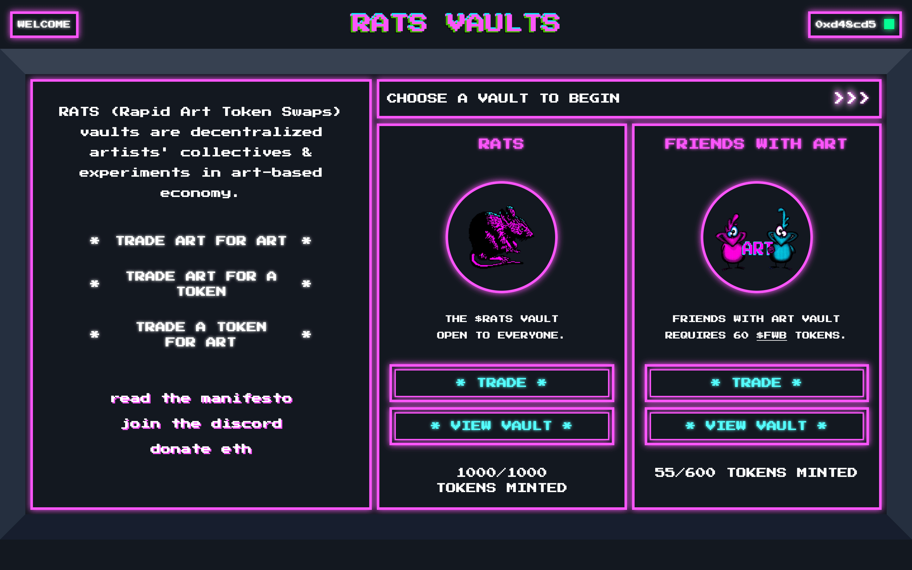

# There are still Rats 🐭 and Gorilla 🦍" who are seriously Doing their Jobs while the Frenzy of Zootopia is about to End | Today's Pick

_Photo by <a href="https://unsplash.com/@moniz437?utm_source=unsplash&utm_medium=referral&utm_content=creditCopyText">Chauhan Moniz</a> on <a href="https://unsplash.com/s/photos/zootopia?utm_source=unsplash&utm_medium=referral&utm_content=creditCopyText">Unsplash</a>_

> I haven't watched [Zootopia](https://youtu.be/JMA4UIPzHww), but the real world is indeed crazier than the movie in these days. As Vitalik smashed the 50 trillion SHIB donated by the project team and other animal coins such as AKITA (of course, donating is much more beautiful than just eating in your own pocket), the frenzy of Zootopia may come to an end...
>
> However, don't think that all animals are crazy hype. Today, our NFT4Metaverse will introduce you to 2 animals who are doing their jobs seriously!

## Rapid Art Token Swap 🐭

- Compared to those elegant crypt0 art galleries, auction houses or trading platforms, the art trading pool built by Rapid Art Token Swap (abbreviated RATS 😄) is really close to the ordinary people: you can put your own art NFT minted by yourself into the Vault to exchange a RATS Token (now all 1000 RATS Tokens has been claimed, only wait for someone to use the RATS Token to exchange the artwork he want in the vault by burning the Token), or exchange the artwork in the vault directly.

- 1000 RATS Tokens have been exchanged quickly since RATS launched on February 25th and the token price has risen to more than 1,000 USDT although the project has reiterated that the Token has no financial value at all. There are always 1000 works in the pool whose quality is uneven, but there is a chance to find a gem like POB. If you join the Discord of RATS and don't mute the channel, you can hear the notification of the successful exchange of NFTs every day, just like the squeaking of a little mouse who steals oil.

- RATS open a new vault with Friends with Arts on April 28th and you can exchange Token or NFTs as long as you hold 60 FWB Tokens.

- **Website:** https://rats.art/

## FEGTOKEN 🦍

- FEGTOKEN has Godzilla avatar and an online shop to sell clothes to raise money to rescue and feed the gorillas in the African jungle 🦍. The DeFi project is doing cross-chain swap, bridging all CEX/DEX, and seamlessly connecting across the network. Their official website is very serious in our eyes, but what I only care is whether FEGTOKEN saves the gorilla literally!

- **Website:** https://fegtoken.com/

These projects above are presented by NFT4Metaverse and see you next time!

_**Hunted by ABMTF_crypto**_

_**Wrote by JESSCATE93 & cryptoroaming**_

> 
>
> If you really wanna raise a goat🐑 , have a real one;
>
> If you really wanna protect the gorilla🦍 , can have a try;
>
> If you wanna dump your ass into something you don’t understand, don‘t go crazy as..okay feel free to.
>
> We record our daily craziness, be careful when follow us.
