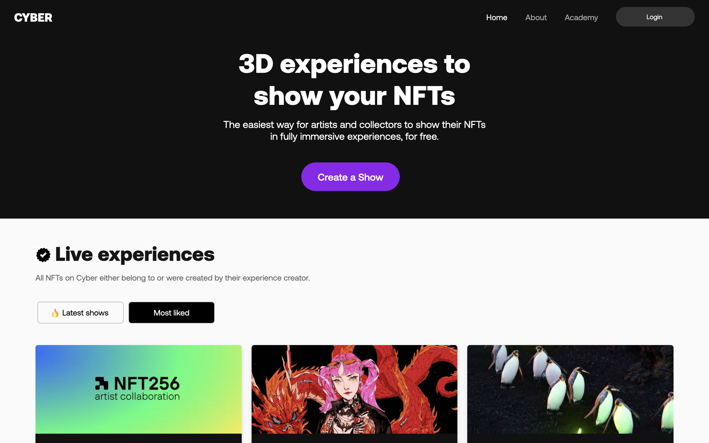
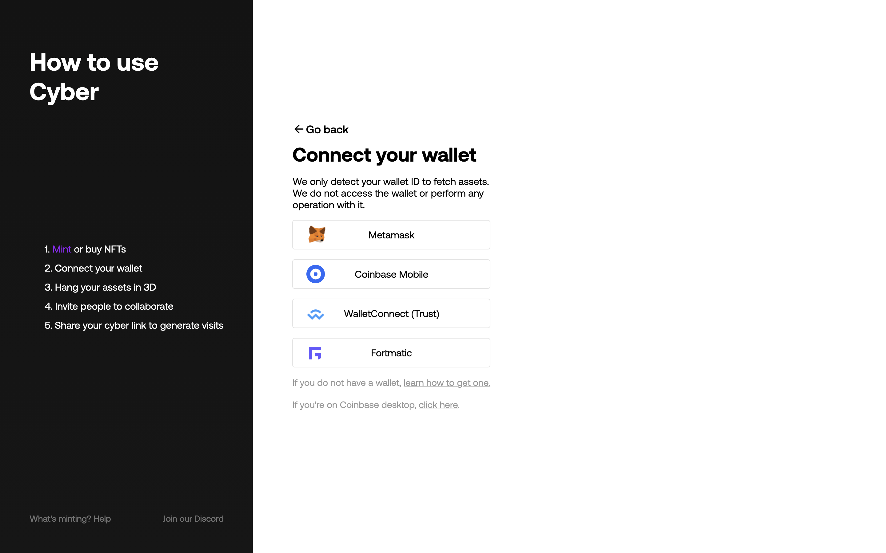
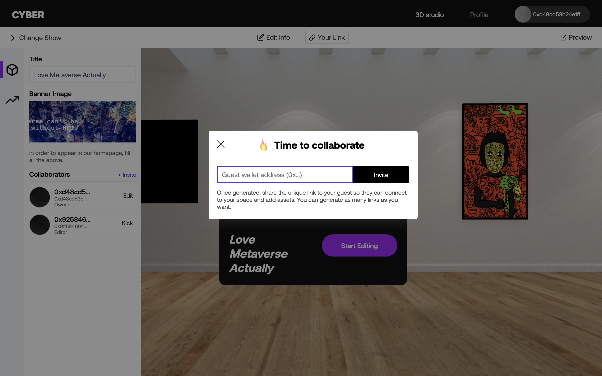

# ONCYBER：一键免费创建你的 3D 虚拟画廊 | Today's Pick

> 今天，「元宇宙特攻队」为你推荐展示加密艺术 NFT 的元宇宙画廊：[ONCYBER](https://oncyber.io/)✨✨✨✨

随着越来越多人创作、交易、收藏加密艺术品，这些图案漂亮或让人侧目，甚至带声音动效的多媒体 NFT 如何展示（其实就是炫耀——人类永恒的本能之一），就成为用户刚需。目前，能展示查看这些 NFT 的途径大致有以下 3 种：

- 钱包：现在 MetaMask、imToken 等主流钱包都支持展示浏览 NFT，但体验就很 just so so 了；
- 交易平台：只要连接以太坊钱包，[Opensea](https://opensea.io/)、[Rarible](https://rarible.com/)等 NFT 交易平台目前是主要浏览展示方式。虽说 Opensea 现在是全球最大的 NFT 交易市场，但它近乎淘宝般贫瘠的用户界面，对那些独特高价的加密艺术品来说，显得实在没有什么逼格，只能把它当行业数据库来使用；
- 元宇宙：[Cryptovoxel](https://www.cryptovoxels.com/)、[Decentraland](https://decentraland.org/)、[Sandbox](https://www.sandbox.game/cn/)这些 3D 建模的虚拟世界是展示加密艺术品最生动的方式，人们可以在一间间 24 小时永不闭馆的画廊、展览馆参观欣赏这些 NFT，但藏家想建馆布展门槛不低——你得花钱买下虚拟土地、造房子并装修，没有一定资金实力和专业技能，一时半会还建不起来。

Bingo！ONCYBER 就是这样一个让你一键免费搭建 3D 画廊的 NFT 展示平台。

看图，只需 5 步，你即可拥有一间美轮美奂的 3D 虚拟画廊：

1. 你得先有 NFT——如果你是艺术家，就铸造一个；如果是收藏家，就去买买买吧！
2. 连接你的钱包——右边是支持连接的 4 种以太坊钱包
   3，选择 ONCYBER 提供的画廊模板，直接点选你的 NFT，愉快的布展吧~~
3. 邀请朋友一块策展布展
4. 分享你的链接，让朋友来观赏 😄

这样一间画廊展馆酷不酷，在 ONCYBER 首页，你能看到很多新建的或最受喜欢的画廊。

这是我们「元宇宙特攻队」猎手 ABMTF_crypto 的画廊：https://oncyber.io/abmtf 。ONCYBER 上线没多久，ABMTF_crypto 第一时间尝鲜体验产品，并和创始团队密切沟通，提出了很多产品改进建议，比如支持展示带有声音动效的 NFT 等。

不得不说 ONCYBER 团队行动力很强，ABMTF_crypto 上述建议一提出，团队一个小时内就迭代更新，增加了对多媒体 NFT 展示的支持。

5 月 13 日，就在昨天，ONCYBER 宣布了一个新功能：邀请策展。如果觉得你自己开设的画廊作品还不够丰富，可以加入艺术家或收藏家朋友的钱包地址，邀请他来你的画廊挂上他的 NFT🆒

**推荐理由**

- 发现相似品味的收藏家 👽
- 横跨各个 NFT 平台的作品聚合展出
- 非常逼真，宽敞明亮的室内展览空间

这里是「元宇宙特攻队」，我们下期见。

_**Hunted by ABMTF_crypto**_ | _**Written by JESSCATE93**_ | _**Edited by cryptoroaming**_
