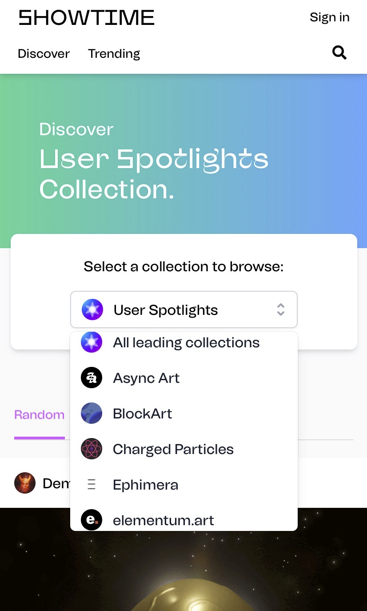

# SHOWTIME: Build your NFT Social Network | Today's Pick

> Today, NFT4Metaverse recommends the world's first NFT social network for you: [SHOWTIME](https://tryshowtime.com)✨✨✨✨

**By JESSCATE93**

Showing off beautiful and proud things is said to be the eternal instinct of human beings when we recommended ONCYBER last time. Naturally, social networking is another more powerful and lasting instinct of human beings. After all, the purpose of showing off is to attract more fans and friends to discover and share more new things.

SHOWTIME’s positioning is very clear: to create a social network or Instagram of/by/for NFTs. Alex Masmej, one of pioneers in social token, launched the project.

SHOWTIME was officially launched on March 17, 2021 and supports 15 NFT platforms including Async Art, SuperRare, Foundation, Zora, and Mintable. Artists and collectors can make social interaction by displaying their artworks/collectibles on SHOWTIME e.g. like, message andforward.

**Website:** https://tryshowtime.com

### About The Founder

Alex Masmej has spent the past two years of exploration in the crypto space to prove the value of his personal token $ALEX, that is, an individual is a growing BUSINESS with unknown but immeasurable potential. His startup project SHOWTIME this time will also feed back the value of $ALEX.

- **Twitter:** [@AlexMasmej](https://twitter.com/AlexMasmej)
- **Further Reading** For details, please refer to the author’s previous [interview](https://mp.weixin.qq.com/s/enynWX4IlwR0woftV9B2hg) with Alex.

### Artist Representatives 👨‍🎤

- [@AndrewSteinwold](https://twitter.com/AndrewSteinwold)
- [@whatdotcd](https://twitter.com/whatdotcd)

### Investment Progress

- The angel round was completed on February 2021. Dragonfly Capital led the investment as well as Robot Ventures, Bollinger Investment Group and others
- The seed round of USD 7.6 million was completed on May 2021. Investors include Paradigm (founded by Coinbase co-founder Fred Ehrsam and former Sequoia partner Matt Huang), Dragonfly Capital, DJ, 3LAU (cryptocurrency enthusiast and NFT pioneer, the first to represent the entire album on Ethereum) and institutions and individuals such as currencyized artists), Robinhood engineer Jaren Glover.

This project above is presented by NFT4Metaverse and see you next time!
