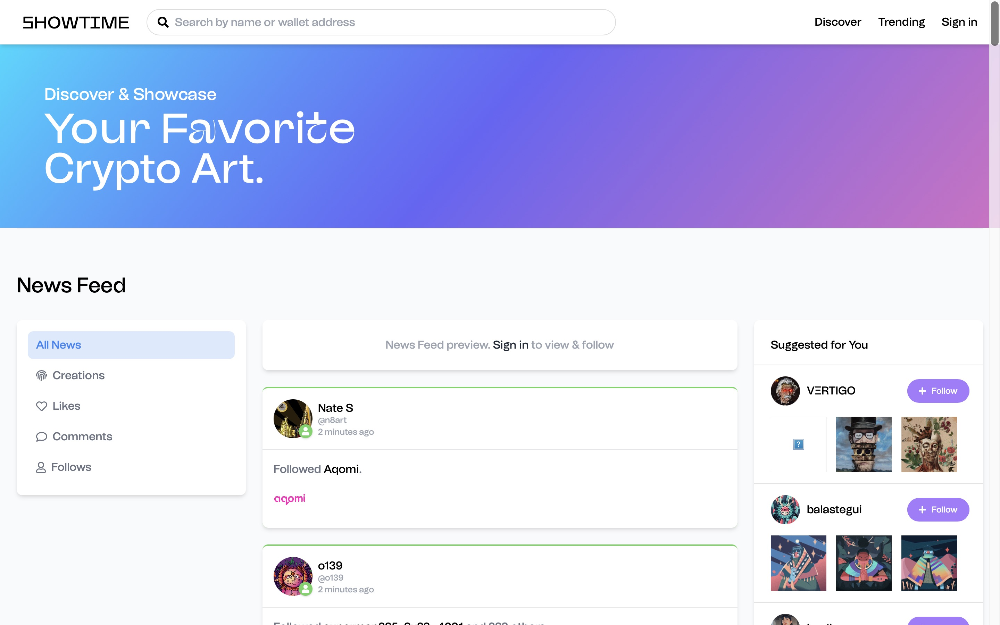
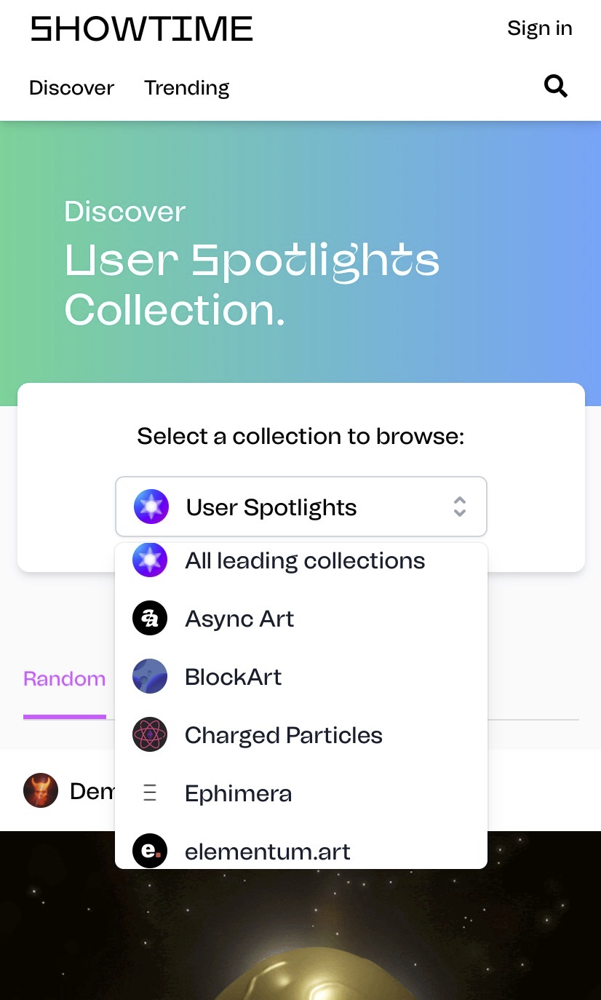
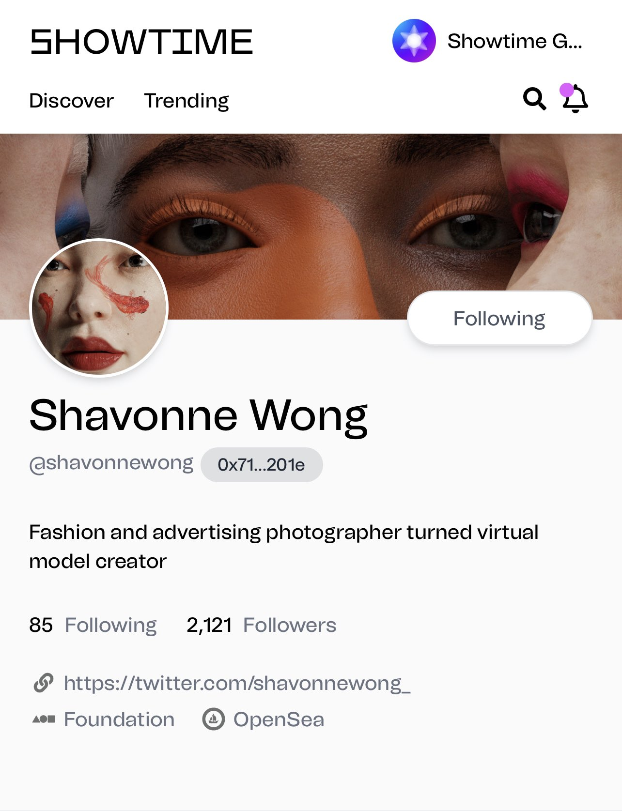

# SHOWTIME：打造你的 NFT 社交网络 | Today's Pick

> 今天，「元宇宙特攻队」为你推荐全球首个 NFT 社交网络：[SHOWTIME](https://tryshowtime.com) ✨✨✨✨

**By JESSCATE93**

上期推荐 ONCYBER 时说过，展示炫耀漂亮和值得骄傲的东西是人类永恒的本能。自然，社交是人类另一个更强大持久的本能，毕竟展示炫耀的目的是吸引结交更多的粉丝和朋友来发现分享更多新东西。

SHOWTIME 的定位很清楚：打造 NFT 社交网络、NFT 界的朋友圈和 Instgram。由前个人社交代币先行者 Alex Masmej 创立。

SHOWTIME 今年 3 月 17 日正式上线，支持包括 Async Art、SuperRare、Foundation、Zora、Mintable 在内的 15 个 NFT 平台，艺术家和藏家可以在上面展示自己的艺术品/收藏品，并进行社交（点赞、留言、转发）。

**网址：** https://tryshowtime.com

### 关于创始人

Alex Masmej 用近两年在加密货币领域的探索证明了自己个人代币 $ALEX 的价值，即个人就是一个不断成长的「business」，拥有未知却无可估量的潜力。他此次的创业项目 SHOWTIME 也会反哺 $ALEX 的价值。

- **推特账号：** [@AlexMasmej](https://twitter.com/AlexMasmej)
- **延伸阅读：** 详情可参考笔者之前对 Alex 的[采访](https://mp.weixin.qq.com/s/enynWX4IlwR0woftV9B2hg)

### 艺术家代表 👨‍🎤

- [@AndrewSteinwold](https://twitter.com/AndrewSteinwold)
- [@whatdotcd](https://twitter.com/whatdotcd)

### 投融资进展

- 2021 年 2 月，完成天使轮融资。Dragonfly Capital 领投，Robot Ventures、Bollinger Investment Group 等参投
- 2021 年 5 月，完成 760 万美元种子轮融资。投资方包括 Paradigm（由 Coinbase 联合创始人 Fred Ehrsam 和红杉前合伙人 Matt Huang 创立)、Dragonfly Capital、DJ、3LAU（加密货币爱好者和 NFT 先锋，第一位在以太坊上将整张专辑代币化的艺术家)、Robinhood 工程师 Jaren Glover 等机构和个人。

这里是「元宇宙特攻队」，我们下期见。
