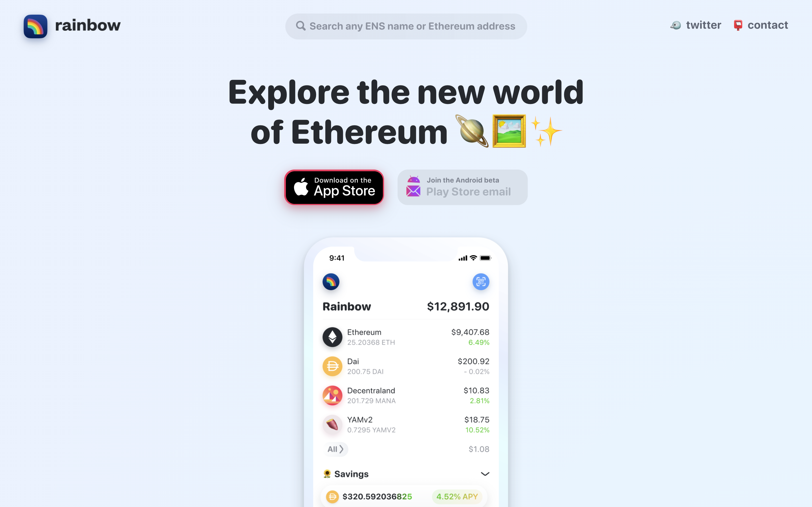
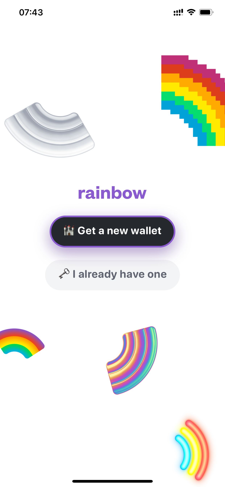
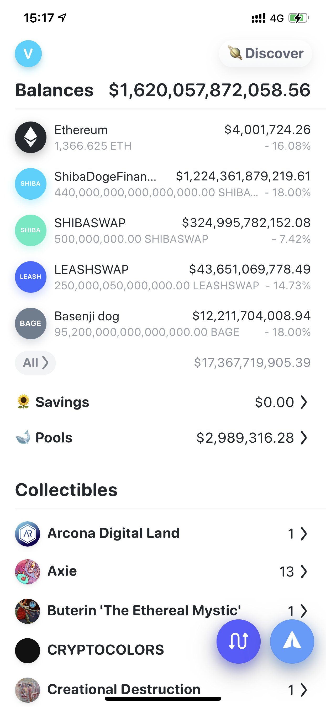
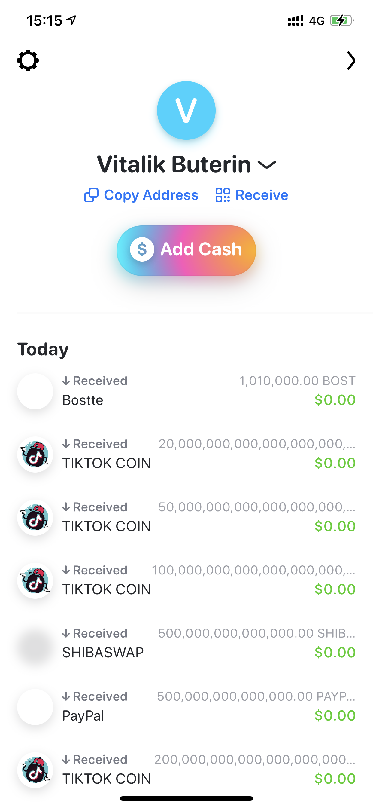
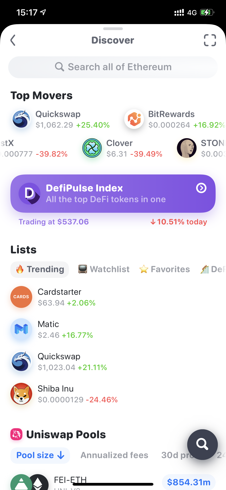
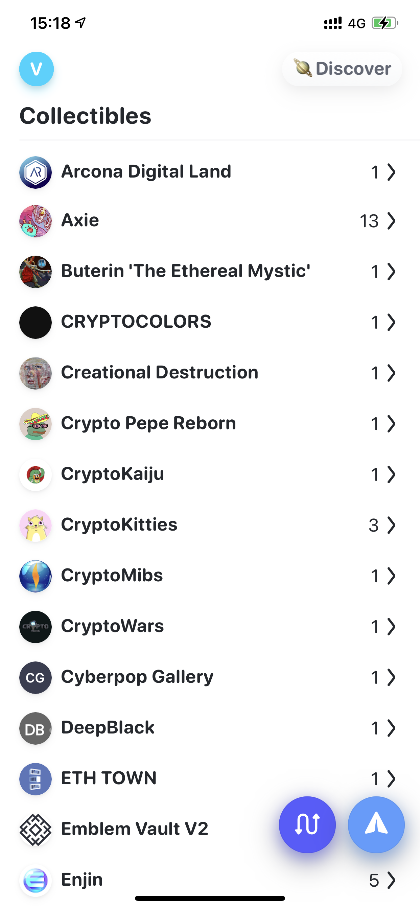
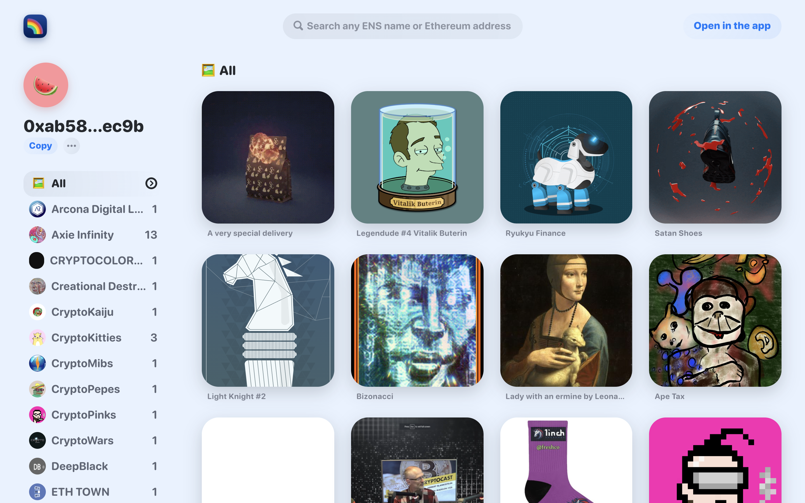

# RAINBOW WALLET：the Most Beautiful Ethereum Wallet to Showcase NFTs | Today's Pick

> Today, NFT4Metaverse recommends the most beautiful Ethereum wallet: [RAINBOW WALLET](https://www.rainbow.me/) ✨✨✨✨✨

**By ABMTF_crypto**

**Wallet** is the most important way to collect and display NFTs, but most wallets currently lack support for NFTs. Therefore, when NFT4Meataverse discovered RAINBOW WALLET, the most friendly Ethereum wallet with NFT support and the most beautiful UI by far, our excitement can be imagined!

Now, we will use Vitalik’s public wallet address to take you a complete journey of the beautiful 🌈👛 ✌️

> Vitalik Buterin's Public Ethereum Address: _0xab5801a7d398351b8be11c439e05c5b3259aec9b_

For iPhone users, please search for "rainbow wallet" in the Apple App Store to download the application. For Android phone users, please go to the website **rainbow.me** to leave an email address and wait patiently for the beta test invitation.

Open the application homepage, you can create a new wallet or import an existing wallet (support mnemonic, public key address and ENS address)

After the wallet is created, you can see Balances, Savings, Pools and Collectibles on the homepage, click on any token in Balances, you can send or swap —— OMG, whose balance has a huge sum of US$1.6 trillion? !

Swipe right to enter the left page of the application: it turned out to be Vitalik’s wallet! Below is the transaction history, you can see this wallet is receiving tokens every day!

Swipe left to enter the right page of the application Discover: Top Movers, DefiPulse index, Uniswap and the liquidity pool with leading TVL will show up in a vivid style...

Okay, go back to the homepage and focus on how Rainbow Wallet supports the display of NFT. Click the right button of each item to expand the NFT of that item.

There are a lot of NFTs in Vitalik's Wallet. After a rough count, there are a total of 41 kinds of 92 NFTs, some of which are collectibles of well-known projects such as CryptoKitties, Axie Infinity, and Enji.

We selected several NFTs and made a Showcase selection for Vitalik 😄

Rainbow Wallet's display of NFT is very lively and beautiful, and it can also display multimedia NFT, which other wallets have not been able to do so far.

The team announced on Twitter yesterday that the web profile and search functions will be launched this week. The above picture is a bunch of NFTs displayed by searching Vitalik's address. We speculate that Rainbow Wallet will strengthen the social function based on NFT, which may be compete with [SHOWTIME](https://mp.weixin.qq.com/s/n9jtLs7iaxpQOC1e7zLcHQ) we recommended before.

### About The Team

- RAINBOW WALLET is a low-key start-up company located in New York, USA. The team has 4 to 5 people so far. In April 2019, it is converted from a personal financial application [Balance](https://www.balance.io/), hoping to go all out to bring the decentralized Web to the general public on the Ethereum platform through the portal of wallet in future.

- Co-founder and CEO Christian Baroni is a designer who can write a little code. He used to work for Microsoft and Stripe. Co-founder and CTO Jin Chung is a female programmer who used to work at eBay and UBS.

### Investment Progress

- RAINBOW WALLET has only completed the seed round of investment by Collab+Currency, Digital Currency Group and FinTech Collective.

**Website:** www.rainbow.me

**Twitter:** twitter.com/rainbowdotme

This project above is presented by NFT4Metaverse and see you next time!
