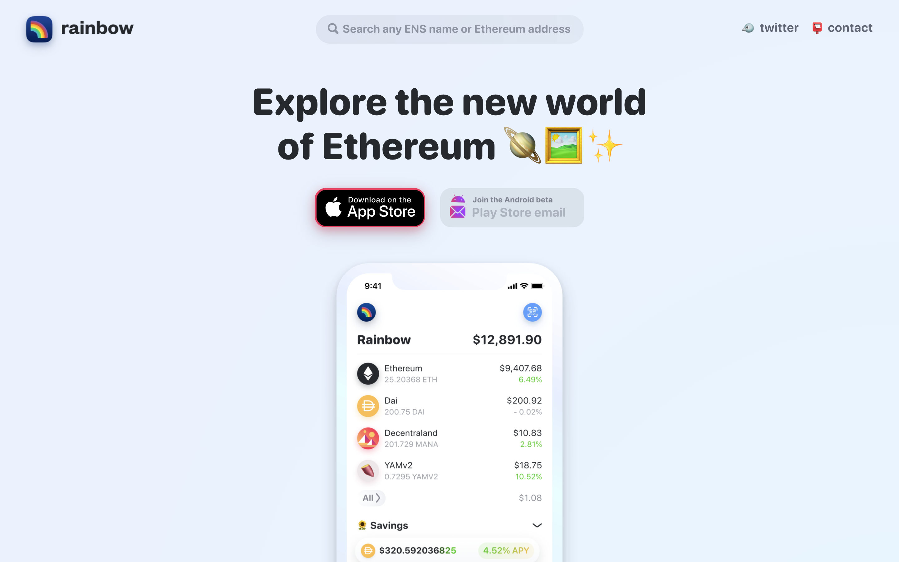

# RAINBOW WALLET：NFT 展示最漂亮的以太坊钱包 | Today's Pick

> 今天，「元宇宙特攻队」为你推荐迄今最漂亮的以太坊钱包：[RAINBOW WALLET](https://www.rainbow.me/) ✨✨✨✨✨

**By ABMTF_crypto**

之前推荐 [ONCYBER](https://mp.weixin.qq.com/s/8iEY4o7bG3o3IcMKnrVeEg) 时分析过**钱包**是收藏展示 NFT 最主要的方式，可是目前绝大多数钱包对 NFT 的支持乏善可陈。因此，当「元宇宙特攻队」发现 RAINBOW WALLET（彩虹钱包）这款迄今对 NFT 支持最友好、用户交互最漂亮的以太坊钱包，激动的心情，可想而知！

现在，我们就用 V 神一个公开的钱包地址带你完整体验一遍美丽的 🌈👛 ✌️

> Vitalik Buterin's Public Ethereum Address: _0xab5801a7d398351b8be11c439e05c5b3259aec9b_

iPhone 用户请在苹果应用商店搜索「rainbow wallet」下载 App，安卓手机用户请到官网 **rainbow.me** 留下邮箱，耐心等待测试版体验通知。

打开应用首页，你可以新创钱包或导入已有钱包（支持助记词、公钥地址和 ENS 地址）

钱包生成后，进入应用首页，可以看到 Balances（余额）、Savings（存款）、Pools（资金池）和 Colletibles（收藏品），点开 Balances 里的币，可以发送（Send）或换币（Swap）—— OMG，谁的账户余额有 1.6 万亿美元巨款？！

手指右滑，进入应用左页：原来是 V 神的钱包！下面是交易历史，可以看到这个钱包天天在收币！

手指左滑，进入应用右页 Discover：涨跌幅领先的币、DeFi 指数、Uniswap 锁仓量领先的流动性池以鲜艳活泼的样式为你展现……

好，回到应用主页，重点看看彩虹钱包是如何支持 NFT 的展示，点击每个项目的右键，即可展开该项目的 NFT。

V 神钱包里的 NFT 实在很多，粗粗数了一下，总共有 41 种 92 个 NFT，不乏加密猫、Axie Infinity、Enji 等知名项目的作品。

我们挑选了若干个 NFT，为 V 神做了个 Showcase 精选 😄

彩虹钱包对 NFT 的展示非常活泼漂亮，还能展示多媒体 NFT——这是其他钱包迄今还做不到的。

团队昨天在推特宣布 Web 端个人资料和搜索功能将于本周上线。上图就是搜索 V 神地址展现的一堆 NFT，我们推测彩虹钱包要加强基于 NFT 的社交功能，这有就可能与上期推荐的 [SHOWTIME](https://mp.weixin.qq.com/s/n9jtLs7iaxpQOC1e7zLcHQ) 正面竞争……

### 创始团队

- RAINBOW WALLET 是家位于美国纽约的低调初创企业，团队迄今 4 到 5 人，2019 年 4 月从 2016 年起打造个人财务应用 [Balance](https://www.balance.io/) 公司转型而来，希望通过钱包这一入口全力以赴在以太坊平台将去中心化万维网带给普罗大众。

- 联合创始人兼 CEO Christian Baroni 是会写一点代码的设计师，曾经在微软、Stripe 供职，联合创始人兼 CTO Jin Chung 是位女程序员，曾经在 eBay 和 UBS 瑞银工作过。

### 融资进展

- RAINBOW WALLET 目前只完成了种子轮融资，Collab+Currency、Digital Currency Group 和 FinTech Collective 3 家机构投资。

**官网：** www.rainbow.me

**官推：** twitter.com/rainbowdotme

这里是「元宇宙特攻队」，我们下期见。
