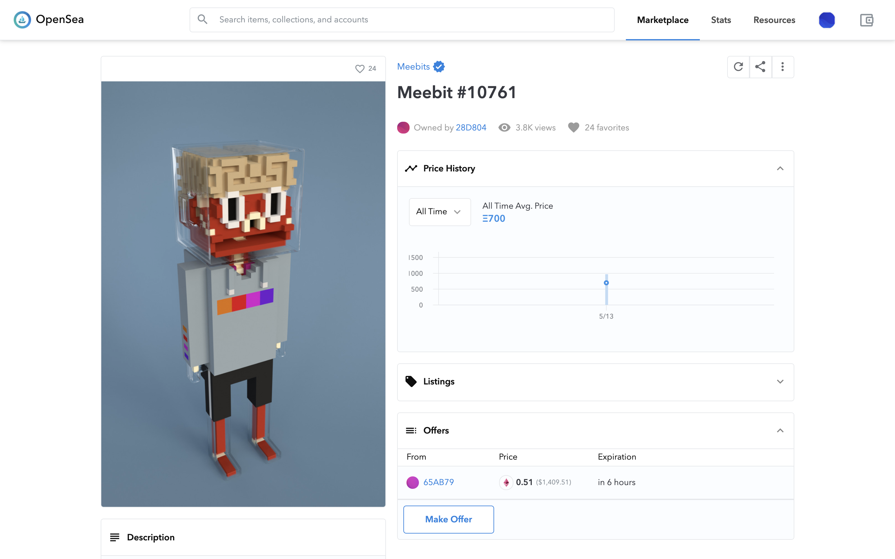
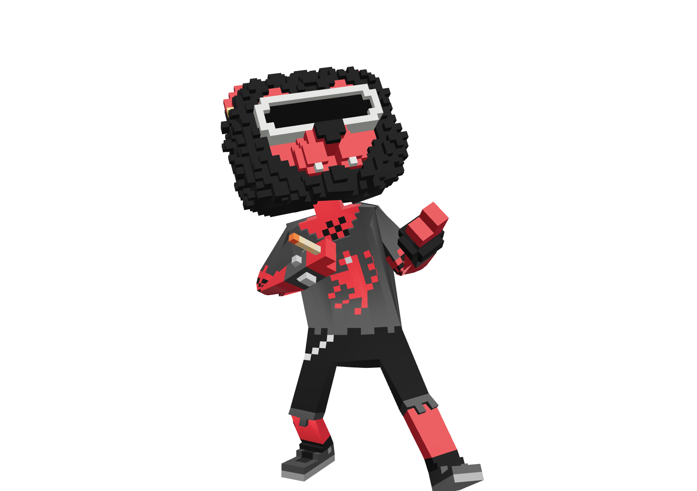
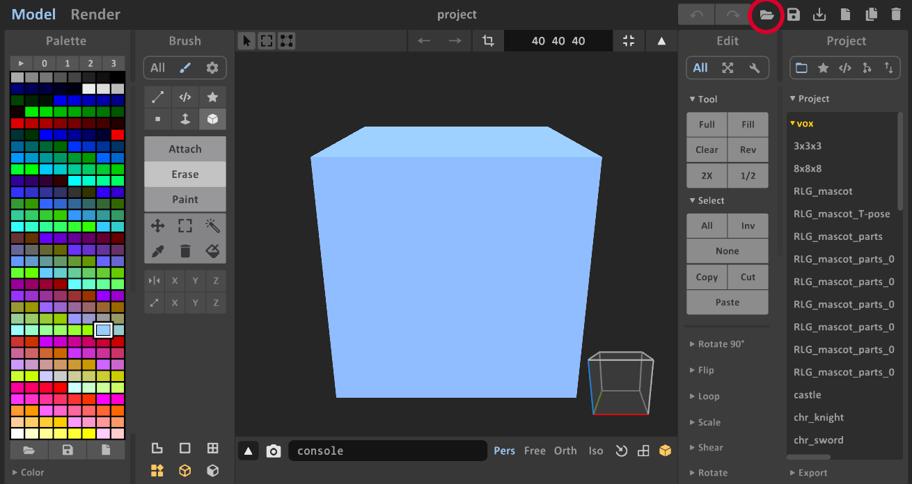
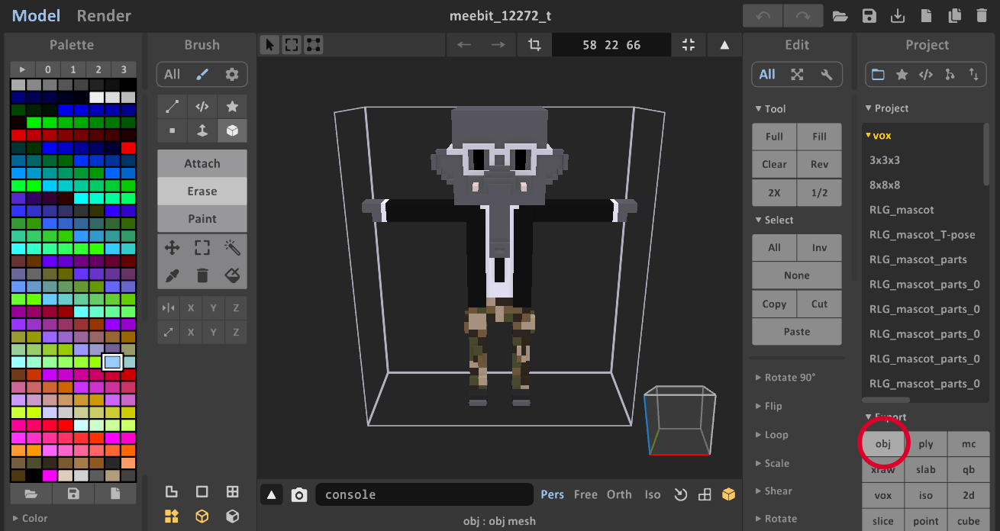
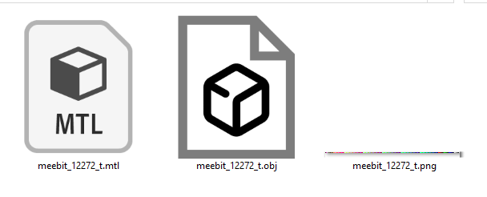
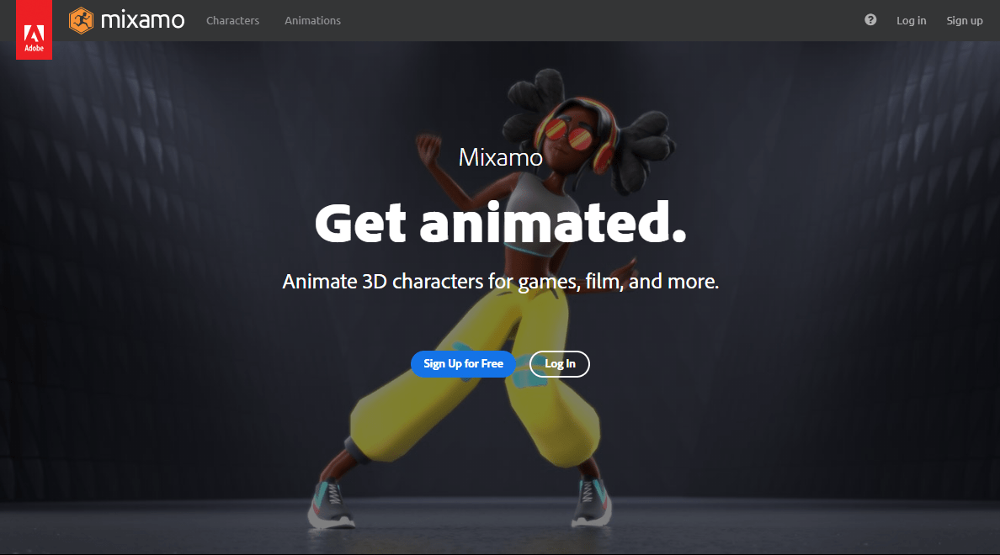
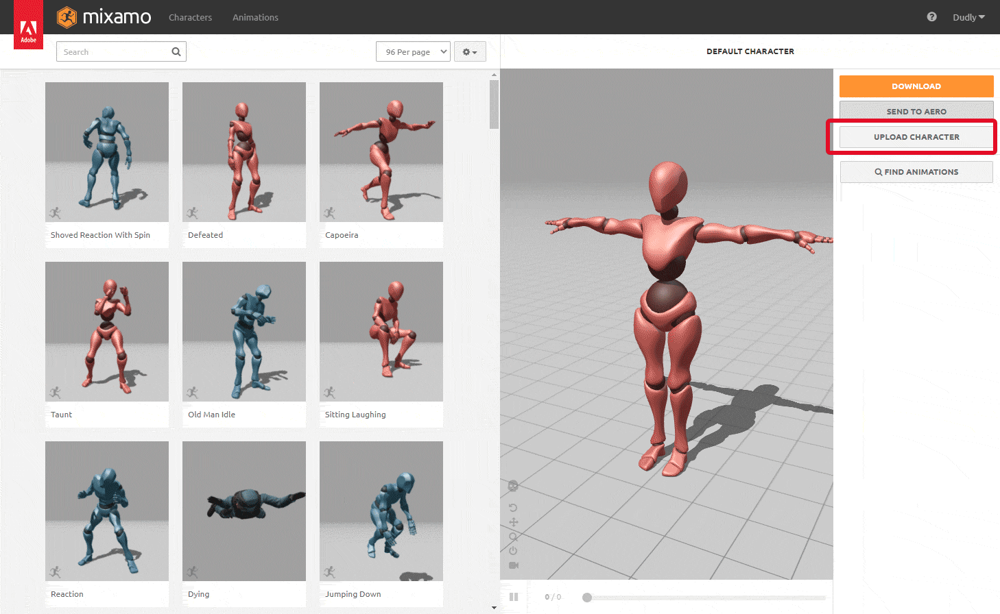
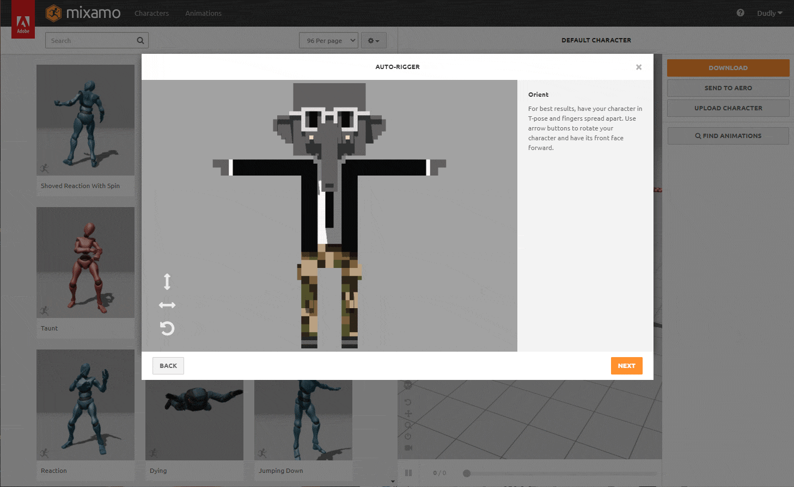
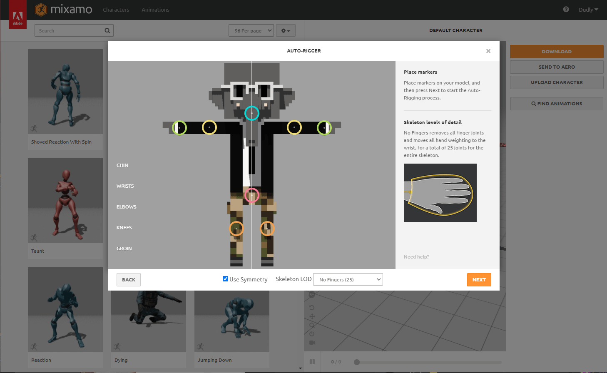

# 6 Steps to Make Your Meebit Dance | Today's Play

> Today, NFT4Metaverse recommends the way to make your static Meebit dance. ✨✨✨✨✨

**By ABMTF_crypto**

Meebits is the 3rd NFT project launched by Larva Labs, the development team of the most popular pixel avatar game Cryptopunks, in early May and it was snapped up as soon as it was launched. According to the introduction, Meebits are ERC-721 compliant 3D voxel characters generated according to a specific algorithm and registered on Ethereum, totaling 20,000, and Cryptopunks and Autoglyphs holders can claim Meebits for free.

_The highest priced Meebit currently sold for 700 ETH_.

At the moment Meebits are still a half-baked product. Next, Meebit owners will have access to a package with a complete 3D model, and will be free to render and animate the Meebit, allowing it to be used in any game engine, 3D studio, or as an avatar in the metaverse. Cryptopunks are collectibles and possibly cultural symbols, but Meebits can be used by developers.

Larva Labs hopes that Meebits will become the future 3D avatars of virtual worlds, games and VR. Today, we show you how to make your Meebits dance, and the process doesn't require complex programming, it's basically a one-click process.

### Step 1: Download the 3D Voxel Model File (T-Pose)

First, you need to unlock the download section by signing with your MetaMask wallet. Then you can proceed and download the T-Pose version .vox file of your Meebit.

### Step 2: Install MagicaVoxel

Download free voxel graphic editor [MagicaVoxel here](https://ephtracy.github.io/). Extract the downloaded package on your drive and run the app.

### Step 3: Open your .vox file in MagicaVoxel and export it to .obj

You need to expand the export menu in the bottom right corner of the app. Click on OBJ and save.

### Step 4: Package the exported files into .zip archive

In your export folder, you will find 3 files. (.obj, .mtl, .png). Create new .zip file using your file archiver software.

### Step 5: Create your account on Mixano.com

Head over to mixano.com and create a new account if you already don't have one.

Log in to Mixano and you will see just a default character.

### Step 6: Upload your Meebit to Mixano.com

Click the 'UPLOAD CHARACTER' button in the right bar and drag your .zip package zou made into the upload box.

After uploading you will see your Meebit model. No need for adjusting anything just proceed with 'NEXT' button.

OK. Now you have to to drag the markers on your model and switch the Skeleton LOD to 'No Fingers (25)'.

When you are done with marker placement and you have the right Skeleton LOD selected continue with 'NEXT'.

You will see your Meebit in a preview animation and if there is no fatal glitch you can confirm with 'NEXT' button. Otherwise take a step back and try to realign the markers.

**Note:** The arms and legs may not be bending correctly, depends on your Meebit model.

Once your model is rigged you can choose from countless animations to make your Meebit move. You can download the animated model as FBX or Collada file format and use it in other 3D software or Metaverse.

This project above is presented by NFT4Metaverse and see you next time!
