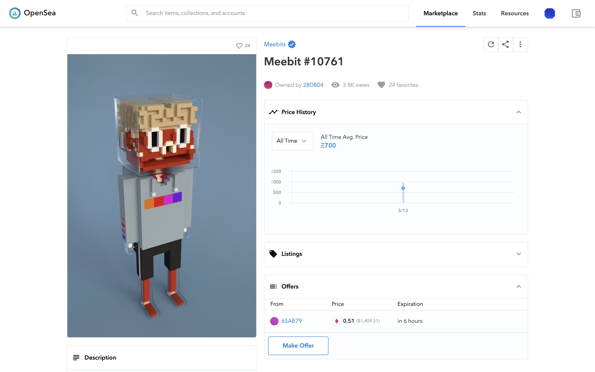
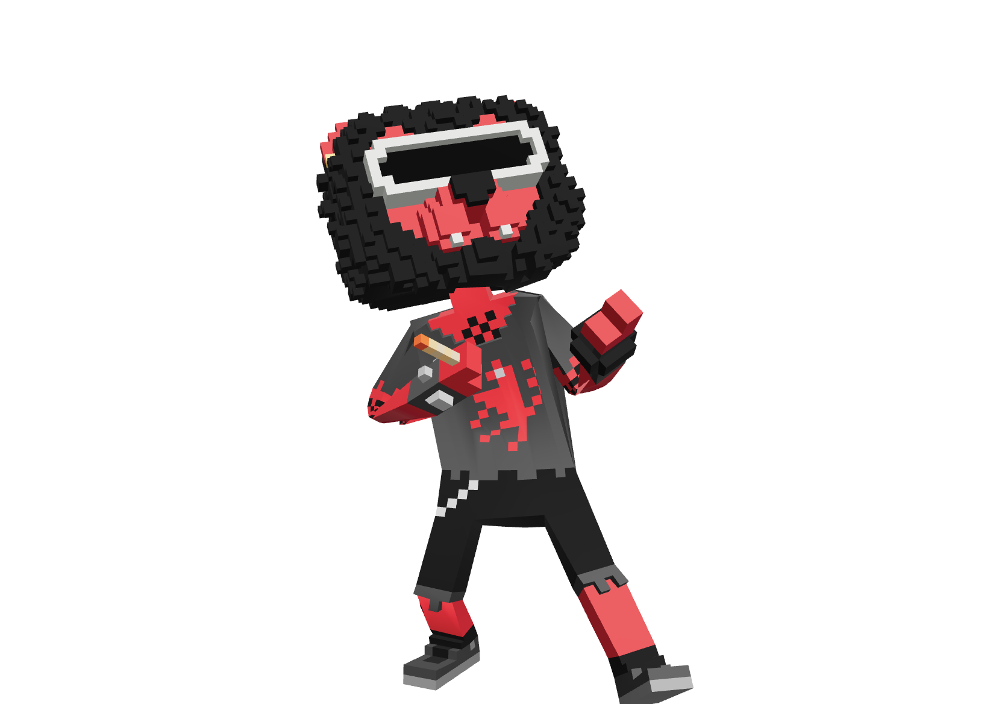
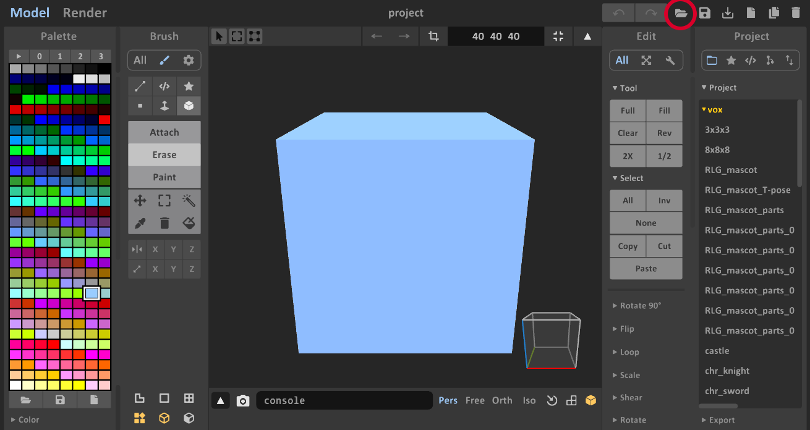
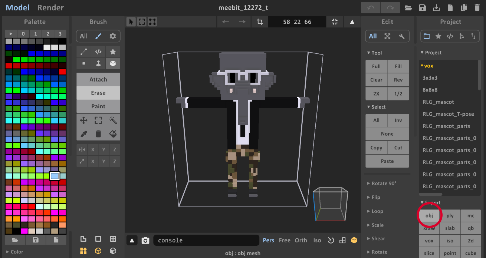
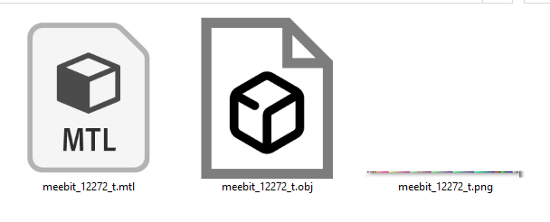
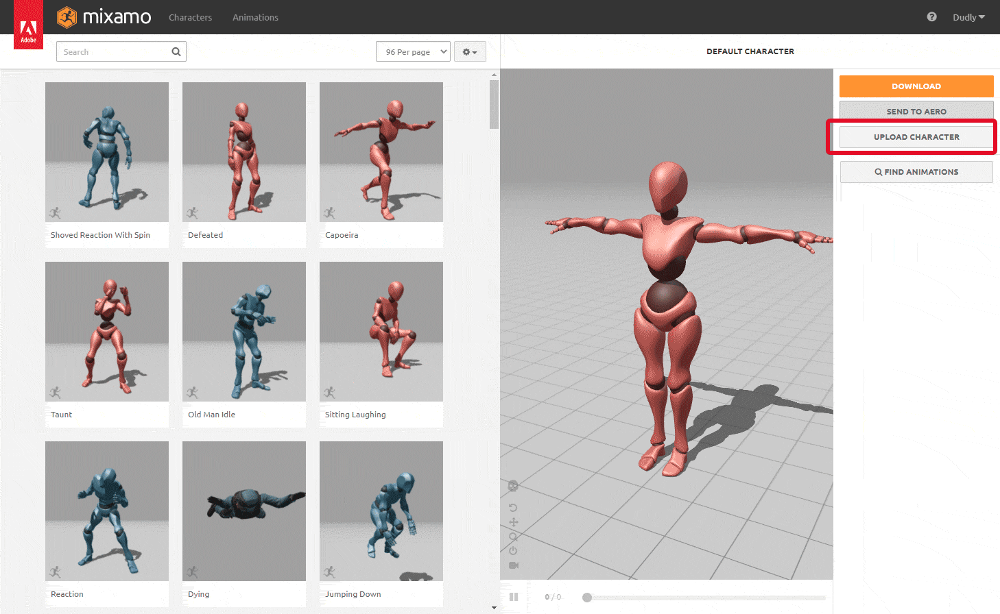
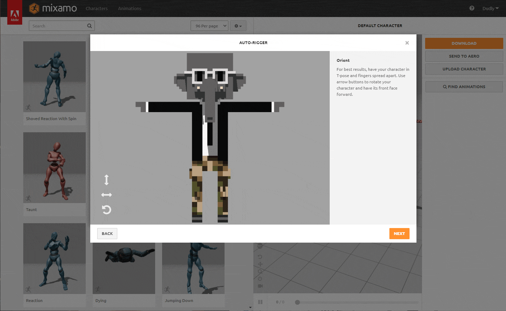
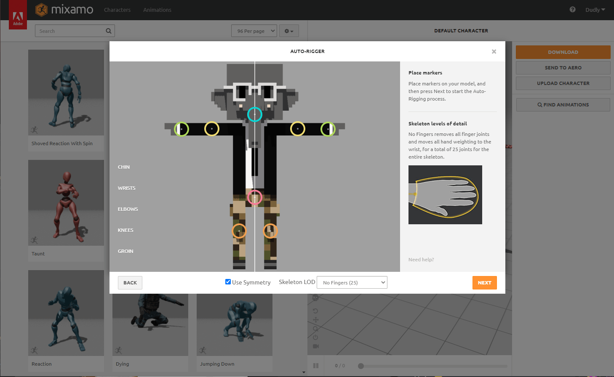
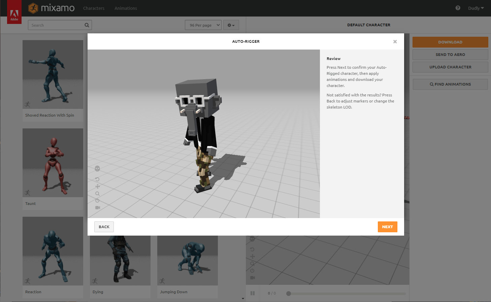
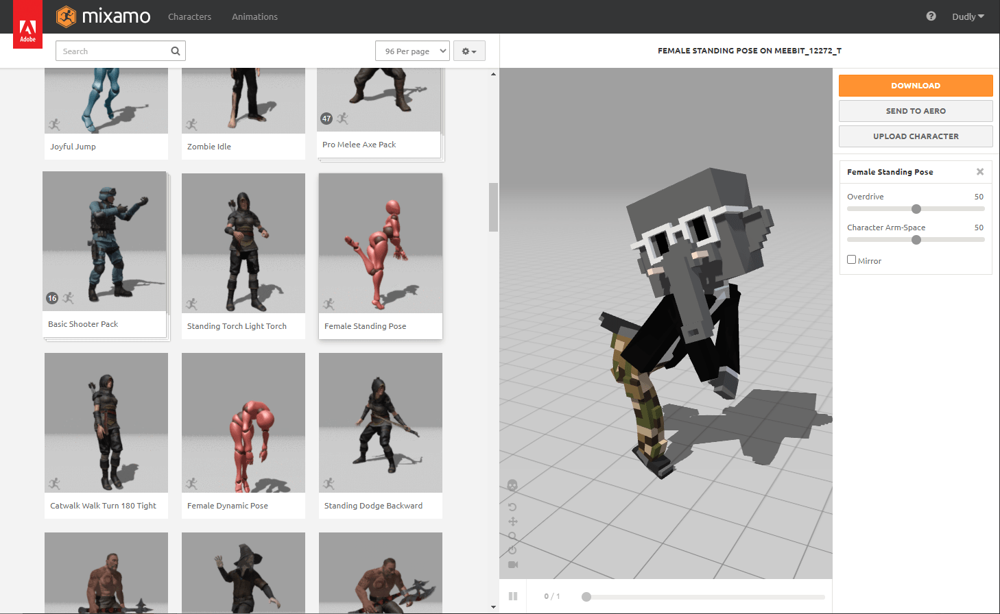

# 6 步让你的 Meebit 舞动起来 | Today's Play

> 今天，「元宇宙特攻队」为你介绍如何让 3D 化身 Meebit 翩翩起舞 ✨✨✨✨✨

**By ABMTF_crypto**

Meebits 是最受欢迎的像素肖像游戏 Cryptopunks 开发团队 Larva Labs 在 5 月初推出的第 3 个 NFT 项目，一推出即被抢空。据介绍，Meebits 是符合 ERC-721 标准，根据特定算法生成并在以太坊上注册的 3D 体素字符，总数 2 万个，Cryptopunks 和 Autoglyphs 持有者可以免费领取 Meebits。

_目前成交价最高的 Meebit，售价 700 ETH_

目前 Meebits 还是个半成品。接下来，Meebit 持有者可以获得包含完整 3D 模型的资料包，可以自由渲染 Meebit 并为其设置动画，让它可以被用在任何游戏引擎、3D 工作室或用作元宇宙中的化身。这才是 Meebits 的关键。Cryptopunks 是藏品，可能也是文化符号，但 Meebits 可以被开发者所使用。

Larva Labs 希望 Meebits 将成为未来虚拟世界、游戏和 VR 的 3D 化身。今天，我们为你介绍如何让你的 Meebits 会跳舞，而这个过程不需要复杂编程，基本是一键搞定。

### 第 1 步：下载 3D Voxel 模型文件

首先，需要通过使用 MetaMask 钱包签名来解锁下载部分。然后继续并下载 Meebit 的 T-Pose 版本.vox 文件。

### 第 2 步：安装 MagicaVoxel

下载免费的体素图形编辑器 [MagicaVoxel](https://ephtracy.github.io/)，将下载的程序包解压缩到驱动器上并运行该应用程序。

### 第 3 步：在 MagicaVoxel 中打开.vox 文件并将其导出到.obj

需要在应用程序的右下角展开导出菜单。单击 OBJ 并保存。

### 第 4 步：将导出的文件打包到.zip 存档中

在导出文件夹中，将找到 3 个文件（.obj，.mtl，.png）。使用文件归档软件创建新的.zip 文件。

### 第 5 步：在 Mixano.com 上创建您的帐户

如果你还没有帐户，请转到 mixano.com 并创建一个新帐户。

### 第 6 步：把你的 Meebit 上传到 Mixano.com

单击右侧栏中的「上传字符」按钮，然后将您的.zip 包 zou 拖到上传框中。

上传后能看到 Meebit 模型。无需调整任何内容，只需按「下一步」按钮即可。

好，现在必须拖动模型上的标记，并将「Skeleton LOD」切换为「无手指」。

当完成标记位置并选择了正确的 Skeleton LOD 后，继续按「下一步」。

你将在预览动画中看到 Meebit，如果没有致命故障，可以按「下一步」确认。

**注意：** 取决于你的 Meebit 型号，手臂和腿部可能无法正确弯曲。

装配好模型后，就可以从无数动画中进行选择，让 Meebit 舞动起来。你可以将动画模型下载为 FBX 或 Collada 文件格式，并在其他 3D 软件或元宇宙中使用它。

这里是「元宇宙特攻队」，我们下期见。
