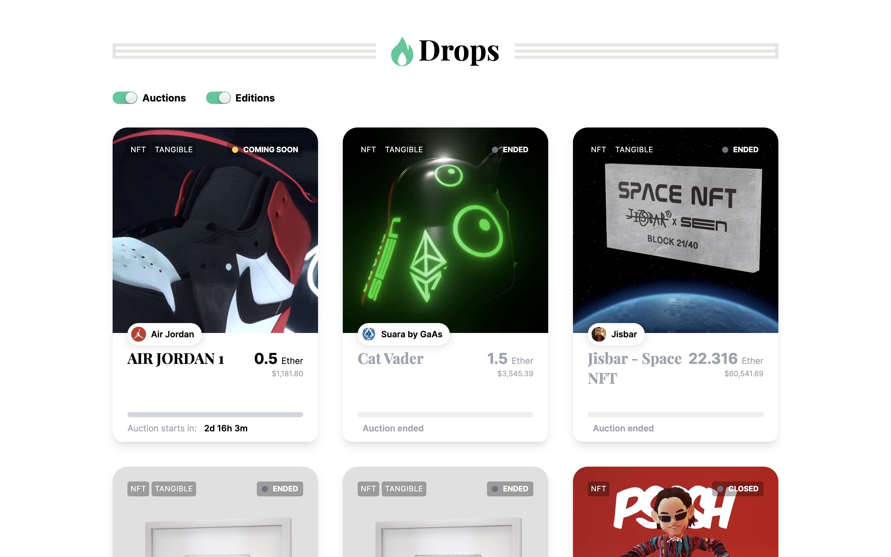
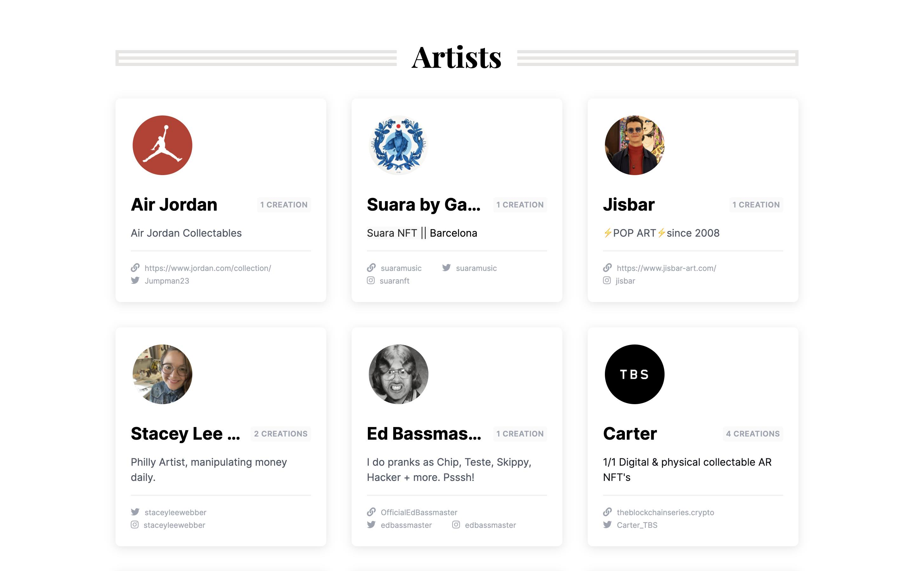
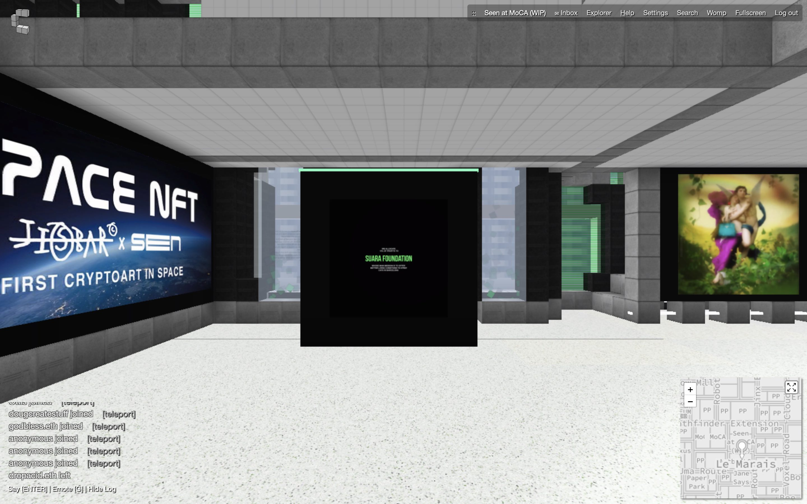
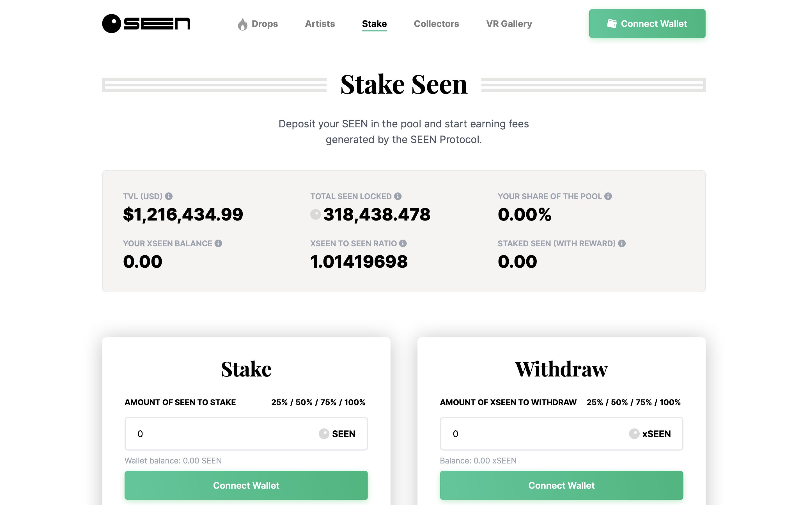

# Seen Haus: A digital Sotheby's that blends NFT with physical artwork | Today's Pick

> Today, NFT4Metaverse recommends [Seen Haus](https://seen.haus/) that hopes to be Sotheby's in the digital world. ✨✨✨✨✨

**By ABMTF_crypto**

As art/collectibles burst onto the scene as the first application of NFT, more and more art NFT platforms are introducing and increasing curation elements to attract artists and collectors with their own characteristics. Among the many curated art platforms, Seen Haus is the first to merge digital and physical artworks through NFT and physical product auctions, and aspires to be the Sotheby's auction house of the digital world.

When visiting its website, you can see the upcoming auction of the Air Jordan 1 physical Nike shoe plus NFT in 2 days, starting at 0.5 ETH. The Air Jordan 1 being auctioned by Seen Haus is one of only 28 pairs available in a limited edition with a black toe and engraved with Michael Jordan's signature. The only way to get this shoe is if you attended the 2008 Rookie Boot Camp event hosted by Jordan Brand. Currently, Jay-Z is one of the few collectors to own this limited edition sneaker. The winner of the Seen Haus auction will not only receive the physical sneaker, but also the sneaker NFT artwork with animation effects.

Seen Haus has completed 55 art auctions or airdrops by far, the vast majority of which are NFT+ physical, fused digital and physical artworks, achieving sales of 347.8 ETH and secondary market sales of $852,110.

Seen Haus invited 24 artists to collaborate with them, such as tim-gatenby, buddyart00, carter, 1penemy, modestep, and 2ragon, all of whom are well-known crypto artists in the industry.

On May 1st, Seen Haus announced that Ferdinando Verderi, creative director of Vogue Italia, joined the creative consulting team. Ferdinando has been developing creative, strategy and advertising for brands such as Prada, Versace, Adidas Originals, etc. This move brings Seen Haus more possibilities of the luxury brands putting their NFTs on its platform.

Here is the list of Seen Haus top collectors, the number one [Gibbet!](https://seen.haus/profile/0x8a83716acd66D9e1fb18c9b79540B72E04f80aC0) has spent 27.26 ETH on the platform.

Seen Haus has also created its own 3D gallery in Cryptovoxels, allowing users to visualize the high quality of the platform's work.

**VR Gallery:** https://www.cryptovoxels.com/play?coords=NW@105W,121N

Seen Haus aims to become a digital Sotheby's governed by a DAO (Decentralized Autonomous Organization) and issued SEEN, a total of 1 million governance tokens, at the end of October last year. Token holders have a say in all aspects of Seen Haus collaboration, curation, and auction methods, and can guide the future development of the project. For each transaction at Seen Haus auctions, the platform takes 15% of the revenue in ETH and the remaining 85% goes to the artist.

When each auction is completed, 15% of the revenue collected by the platform goes directly into the Smart Treasury, a dedicated pool established at Balancer (with a one-to-one liquidity match between SEEN and ETH), which means that 50% of the deposited funds will be used to purchase SEEN from the Smart Treasury through the marketplace, which will help secure the network and maintain demand for SEEN, preventing people from hoarding too much SEEN for malicious purposes.

Seen Haus went live in April of this year with the stake feature that allows stake holders to share 10% of auction revenue. Currently 39% of the SEEN in circulation are staked in the pool.

### Founding Team

Seen Haus was launched in mid-October last year, renamed from the previous OFF BLUE project. The core team includes: creative lead @buddyart00, lead developer @cryptosamurai, Solidity lead developer @EyeOfSauronSeen, front-end designer @jigglybuff69 and Communication Operations @Jigsaw.

This project above is presented by NFT4Metaverse and see you next time!
